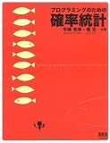
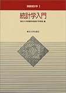
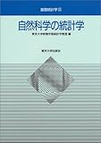

---
title: "確率統計の学習"
date: "2018-07-23T10:25:40+09:00"
draft: false
url: "/entry/2018/07/23/102540/"
categories: []
hatena_author: "nagakagachi"
hatena_original_url: "https://nagakagachi.hatenablog.com/entry/2018/07/23/102540"
hatena_basename: "2018/07/23/102540"
math: false
---

とてつもなく優しい表現で確率統計を説明しているのでプログラミングのためじゃなくても買ってよいかもしれない

<a href="http://www.amazon.co.jp/exec/obidos/ASIN/4274067750/hatena-blog-22/">プログラミングのための確率統計</a>

<ul>
<li>作者: 平岡和幸,堀玄</li>
<li>出版社/メーカー: <a class="keyword" href="http://d.hatena.ne.jp/keyword/%A5%AA%A1%BC%A5%E0%BC%D2">オーム社</a></li>
<li>発売日: 2009/10/20</li>
<li>メディア: 単行本（ソフトカバー）</li>
<li>購入: 10人 クリック: 133回</li>
<li><a href="http://d.hatena.ne.jp/asin/4274067750/hatena-blog-22" target="_blank">この商品を含むブログ (31件) を見る</a></li>
</ul>

 

この辺は基本を押さえるためということで

<a href="http://www.amazon.co.jp/exec/obidos/ASIN/4130420658/hatena-blog-22/">統計学入門 (基礎統計学?)</a>

<ul>
<li>作者: <a class="keyword" href="http://d.hatena.ne.jp/keyword/%C5%EC%B5%FE%C2%E7%B3%D8">東京大学</a><a class="keyword" href="http://d.hatena.ne.jp/keyword/%B6%B5%CD%DC%B3%D8%C9%F4">教養学部</a><a class="keyword" href="http://d.hatena.ne.jp/keyword/%C5%FD%B7%D7%B3%D8">統計学</a>教室</li>
<li>出版社/メーカー: <a class="keyword" href="http://d.hatena.ne.jp/keyword/%C5%EC%B5%FE%C2%E7%B3%D8%BD%D0%C8%C7%B2%F1">東京大学出版会</a></li>
<li>発売日: 1991/07/09</li>
<li>メディア: 単行本</li>
<li>購入: 158人 クリック: 3,604回</li>
<li><a href="http://d.hatena.ne.jp/asin/4130420658/hatena-blog-22" target="_blank">この商品を含むブログ (79件) を見る</a></li>
</ul>

 

<a href="http://www.amazon.co.jp/exec/obidos/ASIN/4130420674/hatena-blog-22/">自然科学の統計学 (基礎統計学)</a>

<ul>
<li>作者: <a class="keyword" href="http://d.hatena.ne.jp/keyword/%C5%EC%B5%FE%C2%E7%B3%D8">東京大学</a><a class="keyword" href="http://d.hatena.ne.jp/keyword/%B6%B5%CD%DC%B3%D8%C9%F4">教養学部</a><a class="keyword" href="http://d.hatena.ne.jp/keyword/%C5%FD%B7%D7%B3%D8">統計学</a>教室</li>
<li>出版社/メーカー: <a class="keyword" href="http://d.hatena.ne.jp/keyword/%C5%EC%B5%FE%C2%E7%B3%D8%BD%D0%C8%C7%B2%F1">東京大学出版会</a></li>
<li>発売日: 1992/08/01</li>
<li>メディア: 単行本</li>
<li>購入: 26人 クリック: 308回</li>
<li><a href="http://d.hatena.ne.jp/asin/4130420674/hatena-blog-22" target="_blank">この商品を含むブログ (22件) を見る</a></li>
</ul>

 

あと最適化関連で「これならわかる最適化数学」の次に読むものとして以下も購入

<a href="http://www.amazon.co.jp/exec/obidos/ASIN/4621088548/hatena-blog-22/">基礎系 数学 最適化と変分法 (東京大学工学教程)</a>

<ul>
<li>作者: 寒野善博,土谷隆,<a class="keyword" href="http://d.hatena.ne.jp/keyword/%C5%EC%B5%FE%C2%E7%B3%D8">東京大学</a>工学教程編纂委員会</li>
<li>出版社/メーカー: <a class="keyword" href="http://d.hatena.ne.jp/keyword/%B4%DD%C1%B1%BD%D0%C8%C7">丸善出版</a></li>
<li>発売日: 2014/10/22</li>
<li>メディア: 単行本（ソフトカバー）</li>
<li><a href="http://d.hatena.ne.jp/asin/4621088548/hatena-blog-22" target="_blank">この商品を含むブログを見る</a></li>
</ul>

 

---

[元のはてなブログ記事](https://nagakagachi.hatenablog.com/entry/2018/07/23/102540)
