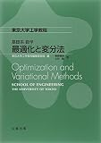

---
title: "最適化 Newton法メモ"
date: "2018-07-28T00:24:57+09:00"
draft: false
url: "/entry/2018/07/28/002457/"
categories: ["数学", "最適化"]
hatena_author: "nagakagachi"
hatena_original_url: "https://nagakagachi.hatenablog.com/entry/2018/07/28/002457"
hatena_basename: "2018/07/28/002457"
math: true
hatena_original_image: "https://chart.apis.google.com/chart?cht=tx&chl=f%28%5Cvec%7Bx%7D%20%2B%20%5Cvec%7Bh%7D%29%20%3D%20f%28%5Cvec%7Bx%7D%29%20%2B%20dot%28%5Cvec%7Bh%5ET%7D%2C%5Cnabla%20f%28%5Cvec%7Bx%7D%29%29%20%2B%20%5Cfrac%7B1%7D%7B2%7D%20dot%28%5Cvec%7Bh%5ET%7D%2C%20%5CDelta%20f%28%5Cvec%7Bx%7D%29%5Cvec%7Bh%7D%29"
---

自分の言葉で書いて覚えるため（誤りがあればご指摘ください）

 

 関数 \(f(\vec{x})\)  の2次までのTaylor展開

\(f(\vec{x} + \vec{h}) = f(\vec{x}) + dot(\nabla f(\vec{x}), \vec{h}) + \frac{1}{2} dot(\vec{h^T}, \nabla^2 f(\vec{x})\vec{h})\)

ここで \(\nabla^2 f(\vec{x})\) はHesse行列

右辺を最小化にするような\(\vec{h}\)によって\(\vec{x}_{next} = \vec{x} + \vec{h}\)と更新することで 
\(f(\vec{x})\)をより小さくする\(\vec{x}\)が得られる。 
そのために\(\vec{h}\)で<a class="keyword" href="http://d.hatena.ne.jp/keyword/%C8%F9%CA%AC">微分</a>して\(=0\)となるような\(\vec{h}\)を求める

\(\frac{\mathrm{d}  f(\vec{x}+\vec{h})}{\mathrm{d} \vec{h}} = \frac{\mathrm{d}  f(\vec{x})}{\mathrm{d} \vec{h}} + \frac{\mathrm{d} dot(\nabla f(\vec{x}), \vec{h})}{\mathrm{d}\vec{h}} + \frac{1}{2} \frac{\mathrm{d} dot(\vec{h^T}, \nabla^2 f(\vec{x})\vec{h})}{\mathrm{d} \vec{h}} = 0\) 
  
右辺第一項は変数\(\vec{h}\)が無いので\(0\)

右辺第二項は<a class="keyword" href="http://d.hatena.ne.jp/keyword/%C6%E2%C0%D1">内積</a>をベクトル\(\vec{h}\)で<a class="keyword" href="http://d.hatena.ne.jp/keyword/%C8%F9%CA%AC">微分</a>するので\(\nabla f(\vec{x})\)

右辺第三項は二次の同次<a class="keyword" href="http://d.hatena.ne.jp/keyword/%C2%BF%B9%E0%BC%B0">多項式</a>の二次形式\(dot(\vec{x^T}, A\vec{x})\)の<a class="keyword" href="http://d.hatena.ne.jp/keyword/%C8%F9%CA%AC">微分</a>なので、

\(\frac{1}{2} \frac{\mathrm{d} dot(\vec{h^T}, \nabla^2 f(\vec{x})\vec{h})}{\mathrm{d} \vec{h}} = \frac{1}{2} (\nabla^2 f(\vec{x}) + \nabla^2 f(\vec{x})^T)\vec{h}\)

ここで\(f(x)\)が二階<a class="keyword" href="http://d.hatena.ne.jp/keyword/%C8%F9%CA%AC">微分</a>可能な場合にはHesse行列\(\nabla^2 f(x)\)は対称行列となるため、

\(\frac{1}{2} (\nabla^2 f(\vec{x}) + \nabla^2 f(\vec{x})^T)\vec{h} = \frac{1}{2} (\nabla^2 f(\vec{x}) + \nabla^2 f(\vec{x}))\vec{h} = \frac{1}{2} (2 \nabla^2 f(\vec{x}) \vec{h}) = \nabla^2 f(\vec{x}) \vec{h}\)

まとめると

\(\frac{\mathrm{d} f(\vec{x}+\vec{h})}{\mathrm{d} \vec{h}} = 0 + \nabla f(\vec{x}) + \nabla^2 f(\vec{x}) \vec{h} =  \nabla f(\vec{x}) + \nabla^2 f(\vec{x}) \vec{h} = 0\)

変形して 
\(\nabla^2 f(\vec{x}) \vec{h} = -\nabla f(\vec{x})\)

両辺の左からHesse行列\(\nabla^2 f(\vec{x})\)の<a class="keyword" href="http://d.hatena.ne.jp/keyword/%B5%D5%B9%D4%CE%F3">逆行列</a>\(\nabla^2 f(\vec{x})^{-1}\)をかけると

\(\vec{h} = -\nabla^2 f(\vec{x})^{-1} \nabla f(\vec{x})\) 
  
このように求めたベクトル\(\vec{h}\)をNewton方向とよび、ステップ幅\(\alpha ( 0 &lt; \alpha \leq 1)\)を用いて

\(\vec{x}_{next} = \vec{x} + \alpha \vec{h} = \vec{x} - \alpha \nabla^2 f(\vec{x})^{-1} \nabla f(\vec{x})\)

で\(\vec{x}\)を更新していく<a class="keyword" href="http://d.hatena.ne.jp/keyword/%A5%A2%A5%EB%A5%B4%A5%EA%A5%BA%A5%E0">アルゴリズム</a>をNewton法というらしい 
(\(\alpha\) は大抵1らしい. そういう\(\vec{h}\)を計算したんだから)

実際には高次元の場合に \(\nabla^2 f(\vec{x})\) の<a class="keyword" href="http://d.hatena.ne.jp/keyword/%B5%D5%B9%D4%CE%F3">逆行列</a>の計算コストが増大するため、 
<a class="keyword" href="http://d.hatena.ne.jp/keyword/%B5%D5%B9%D4%CE%F3">逆行列</a>を近似して計算するらしい→準Newton法 
あとそもそもHesse行列が正則じゃないと<a class="keyword" href="http://d.hatena.ne.jp/keyword/%B5%D5%B9%D4%CE%F3">逆行列</a>が求められないし、 
Hesse行列が正定値でない場合に得られるNewton方向は 
関数値が増える方向だったりするのでいろいろ欠点もある
 

最後の式 \(\vec{x}_{next} = \vec{x} - \alpha \nabla^2 f(\vec{x})^{-1} \nabla f(\vec{x})\) は1変数関数\(f(x)\)についてのNewton法である

\(x_{next} = x - \frac{f'(x)}{f''(x)}\)

を多変数関数に拡張したものといえる( 逆数 \(\frac{1}{f''(x)}\) が <a class="keyword" href="http://d.hatena.ne.jp/keyword/%B5%D5%B9%D4%CE%F3">逆行列</a> \(\nabla^2 f(\vec{x})^{-1}\)に対応)
 

求根<a class="keyword" href="http://d.hatena.ne.jp/keyword/%A5%A2%A5%EB%A5%B4%A5%EA%A5%BA%A5%E0">アルゴリズム</a>であるNewton法(Newton-Raphson法)は 
関数\(f(x) = 0\)となるような\(x\)を求めるために

\(x_{next} = x - \frac{f(x)}{f'(x)}\)

で更新するが、Newton法で<a class="keyword" href="http://d.hatena.ne.jp/keyword/%B6%CB%C3%CD">極値</a>を求める場合には \(f(x)\) の<a class="keyword" href="http://d.hatena.ne.jp/keyword/%B6%CB%C3%CD">極値</a>( \(f'(x) = 0\)の点 )を求めるために

\(x_{next} = x - \frac{f'(x)}{f''(x)}\)

として更新をするということらしい

 
 

参考とさせていただいた書籍およびサイト

<a href="http://www.amazon.co.jp/exec/obidos/ASIN/4621088548/nagakagachi-22/">基礎系 数学 最適化と変分法 (東京大学工学教程)</a>
<ul><li>作者: 寒野善博,土谷隆,<a class="keyword" href="http://d.hatena.ne.jp/keyword/%C5%EC%B5%FE%C2%E7%B3%D8">東京大学</a>工学教程編纂委員会</li><li>出版社/メーカー: <a class="keyword" href="http://d.hatena.ne.jp/keyword/%B4%DD%C1%B1%BD%D0%C8%C7">丸善出版</a></li><li>発売日: 2014/10/22</li><li>メディア: 単行本（ソフトカバー）</li><li><a href="http://d.hatena.ne.jp/asin/4621088548/nagakagachi-22" target="_blank">この商品を含むブログを見る</a></li></ul>

<a href="http://www.dais.is.tohoku.ac.jp/~shioura/teaching/mp12/mp12-13.pdf">http://www.dais.is.tohoku.ac.jp/~shioura/teaching/mp12/mp12-13.pdf</a> 
<a href="https://mosko.tokyo/post/optimization/#%E3%83%8B%E3%83%A5%E3%83%BC%E3%83%88%E3%83%B3%E6%B3%95">&#x6700;&#x9069;&#x5316;&#x624B;&#x6CD5;&#x306B;&#x3064;&#x3044;&#x3066;&#x30FC;&#x52FE;&#x914D;&#x6CD5;&#xFF0C;&#x30CB;&#x30E5;&#x30FC;&#x30C8;&#x30F3;&#x6CD5;&#xFF0C;&#x6E96;&#x30CB;&#x30E5;&#x30FC;&#x30C8;&#x30F3;&#x6CD5;&#x306A;&#x3069;&#x30FC; | moskomule log</a> 
<iframe src="https://hatenablog-parts.com/embed?url=http%3A%2F%2Fdsl4.eee.u-ryukyu.ac.jp%2FDOCS%2Fnlp%2Fnode5.html" title="Newton法" class="embed-card embed-webcard" scrolling="no" frameborder="0" style="display: block; width: 100%; height: 155px; max-width: 500px; margin: 10px 0px;"></iframe><cite class="hatena-citation"><a href="http://dsl4.eee.u-ryukyu.ac.jp/DOCS/nlp/node5.html">dsl4.eee.u-ryukyu.ac.jp</a></cite>

---

[元のはてなブログ記事](https://nagakagachi.hatenablog.com/entry/2018/07/28/002457)
