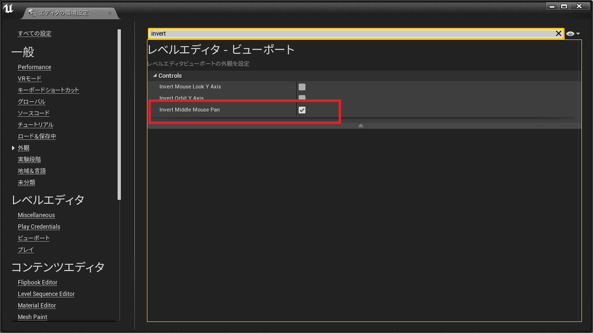

---
title: "UE4 エディタ操作をMaya風にする4.20.2"
date: "2018-09-02T12:45:44+09:00"
draft: false
url: "/entry/2018/09/02/124544/"
categories: ["UE4"]
hatena_author: "nagakagachi"
hatena_original_url: "https://nagakagachi.hatenablog.com/entry/2018/09/02/124544"
hatena_basename: "2018/09/02/124544"
math: false
image: "images/74dae8ea2c3c5adf4d172015b863caab5292142076c8212bc9cb482f27b3c102.png"
---

<a class="keyword" href="http://d.hatena.ne.jp/keyword/UE4">UE4</a>の<a class="keyword" href="http://d.hatena.ne.jp/keyword/%A5%D0%A1%BC">バー</a>ジョンが変わるたびに微妙に設定する場所が変わっていく 
「エディタのMaya風操作設定」

<a class="keyword" href="http://d.hatena.ne.jp/keyword/UE4">UE4</a>.20.2 ではついに（もっと前から？）項目名から Maya という単語が 
消えてしまったのでメモしておく

エディタの環境設定

<ul>
<li>>レベルエディタ</li>
<li>>ビューポート</li>
<li>>Invert Middle Mouse Pan  をON</li>
</ul>

---

[元のはてなブログ記事](https://nagakagachi.hatenablog.com/entry/2018/09/02/124544)
