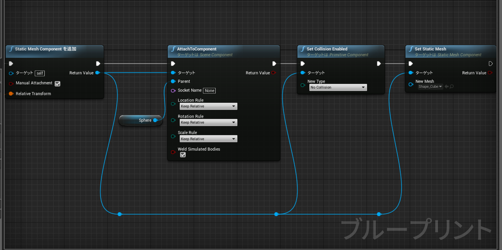
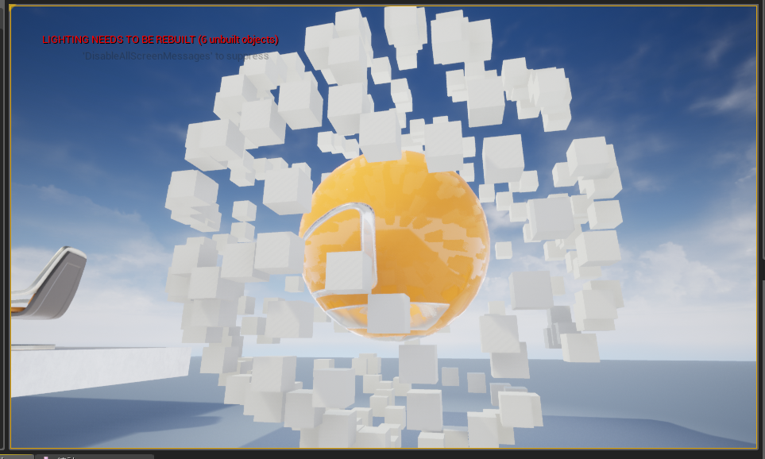

---
title: "UE4 動的にStaticMeshを生成する"
date: "2018-09-02T15:29:27+09:00"
draft: false
url: "/entry/2018/09/02/152927/"
categories: ["UE4"]
hatena_author: "nagakagachi"
hatena_original_url: "https://nagakagachi.hatenablog.com/entry/2018/09/02/152927"
hatena_basename: "2018/09/02/152927"
math: false
---

<a class="keyword" href="http://d.hatena.ne.jp/keyword/UE4">UE4</a>.20.2

Add Static Mesh Component ( Static Mesh Component を追加 ) 
でStaticMesh<a class="keyword" href="http://d.hatena.ne.jp/keyword/%A5%B3%A5%F3%A5%DD%A1%BC%A5%CD%A5%F3%A5%C8">コンポーネント</a>をアクターに新規追加

必要なら AttachToComponent でルート<a class="keyword" href="http://d.hatena.ne.jp/keyword/%A5%B3%A5%F3%A5%DD%A1%BC%A5%CD%A5%F3%A5%C8">コンポーネント</a>に紐づけ 
必要なら Set Collision Enable などで<a class="keyword" href="http://d.hatena.ne.jp/keyword/%A5%B3%A5%EA%A5%B8%A5%E7%A5%F3">コリジョン</a>無効化などを設定

Set Static Mesh 
によってスタティックメッシュアセットをStaticMesh<a class="keyword" href="http://d.hatena.ne.jp/keyword/%A5%B3%A5%F3%A5%DD%A1%BC%A5%CD%A5%F3%A5%C8">コンポーネント</a>に設定

球メッシュ<a class="keyword" href="http://d.hatena.ne.jp/keyword/%A5%B3%A5%F3%A5%DD%A1%BC%A5%CD%A5%F3%A5%C8">コンポーネント</a>をもったアクターの周りにキューブスタティックメッシュを動的に生成してみた図 

通常のStaticMeshだとDrawCallがバンバン増えるので、同一メッシュをたくさん出すなら  
  
InstancedStaticMeshを使ってAddInstanceで配置したほうが良さそう

---

[元のはてなブログ記事](https://nagakagachi.hatenablog.com/entry/2018/09/02/152927)
