---
title: "UE4 内部構造が透けているように見える疑似透過シェーダ(CEDEC2018?)"
date: "2018-09-08T20:37:17+09:00"
draft: false
url: "/entry/2018/09/08/203717/"
categories: ["UE4"]
hatena_author: "nagakagachi"
hatena_original_url: "https://nagakagachi.hatenablog.com/entry/2018/09/08/203717"
hatena_basename: "2018/09/08/203717"
math: false
image: "images/f8eedb14d990b17be3a2393435fda19ea0ea8bb5e94465427a27daf1d2f798f6.png"
---

UE4.20.2

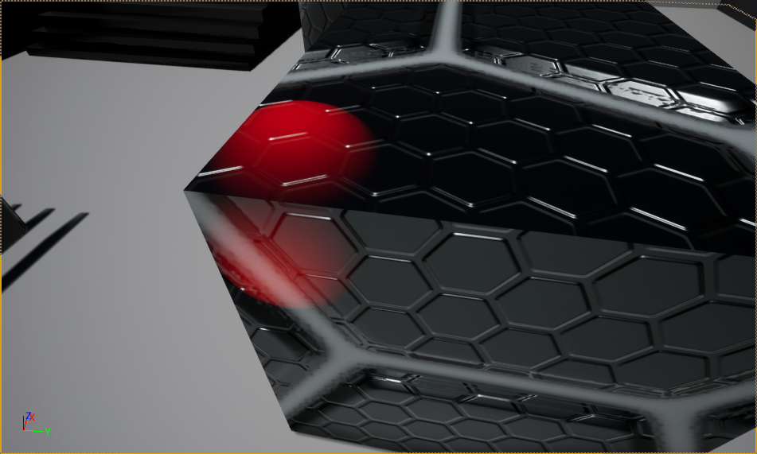

CEDEC2018のモンスターハンター：ワールドのシェーダ関連講演で触れられていた「疑似透過シェーダ」が面白そうだったのでUE4マテリアルでやってみる.  
  
MH:Wのストーリーラストのアイツのように内部が透けて見えるようなことをしたいというもの。

<iframe src="https://hatenablog-parts.com/embed?url=https%3A%2F%2Ftwitter.com%2Fnagakagachi%2Fstatus%2F1037723917933207552" title="X" class="embed-card embed-webcard" scrolling="no" frameborder="0" style="display: block; width: 100%; height: 155px; max-width: 500px; margin: 10px 0px;" loading="lazy"></iframe> 
<blockquote data-conversation="none" class="twitter-tweet" data-lang="ja">
<a href="https://x.com/hashtag/UE4?src=hash&amp;ref_src=twsrc%5Etfw">#UE4</a> <a href="https://x.com/hashtag/UE4Study?src=hash&amp;ref_src=twsrc%5Etfw">#UE4Study</a> 疑似透過シェーダで遊ぶ。後でブログ書いてサンプルプロジェクト貼る。BlenderとUE4を完全に理解してたらグレイマンの骨モデル作ってもっとそれっぽくできそうだけどﾑﾘ <a href="https://t.co/ZfOc05uD2G">pic.twitter.com/ZfOc05uD2G</a>
&mdash; なが (@nagakagachi) <a href="https://x.com/nagakagachi/status/1038247245819260928?ref_src=twsrc%5Etfw">2018年9月8日</a></blockquote>    
「普通の不透明な外側モデル」の内部に「疑似透過シェーダのモデル」を配置すると 
内部のモデルが透けて見えるようになる。
 

3行説明

<ul>
<li>Translucentマテリアルで</li>
<li>深度テスト無効で</li>
<li>SceneDepthよりPixelDepthのほうが大きい場合だけその差に応じて色を決定</li>
</ul>

以上

CEDECの講演については以下の記事の下の方。 
<iframe src="https://hatenablog-parts.com/embed?url=https%3A%2F%2Fwww.famitsu.com%2Fnews%2F201808%2F23162839.html" title="『モンスターハンター：ワールド』開発を支えた“アーティストが作ったシェーダー”とは？【CEDEC 2018】	 - ファミ通.com" class="embed-card embed-webcard" scrolling="no" frameborder="0" style="display: block; width: 100%; height: 155px; max-width: 500px; margin: 10px 0px;" loading="lazy"></iframe><cite class="hatena-citation"><a href="https://www.famitsu.com/news/201808/23162839.html">www.famitsu.com</a></cite>

講演時は内部構造モデルをカメラの方に引き寄せて描画するという説明で、内部構造モデルが手前に飛び出しているような絵で説明されていた。  
  
ただ本当に頂点操作で手前に飛び出させると色々問題がありそうなのであれはあくまでイメージで、きっと深度テストの工夫でやっていたと予想。

<blockquote>
        

追記:実際に頂点操作でやっていたらしいので深度ではないらしい

</blockquote>

 
というわけで以下のように半分埋まった球を透けさせてみる。 
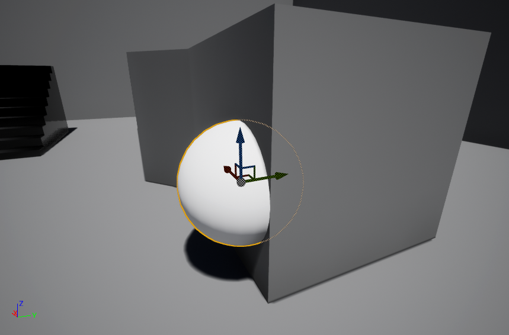 

<ol>
<li>新規マテリアルを作成してメッシュにセットしておく. マテリアル名はとりあえず MAT_PseudoTranslucentTest で.</li>
<li>マテリアルの Blend Mode を Additive に変更. Opaqueだと後述する 深度テスト無効 が使えないので.
<ul>
<li>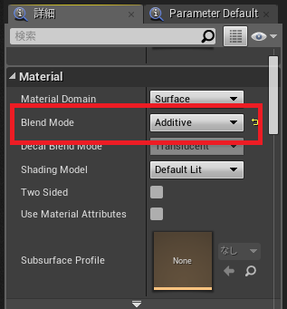</li>
</ul></li>
<li>マテリアルの Disable Depth Test (深度テスト無効) をONにする.
<ul>
<li>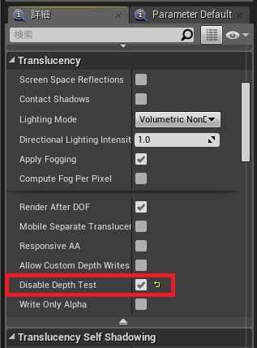</li>
</ul></li>
<li>エミッシブに赤を入力する. 後のために乗算ノードを挟んでおく.
<ul>
<li>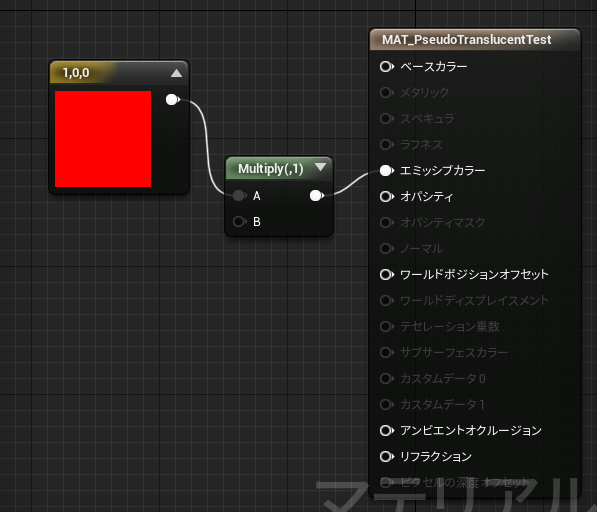</li>
</ul></li>
<li>ここまででこうなる. 深度テスト無効で描いてるのだから当然.
<ul>
<li>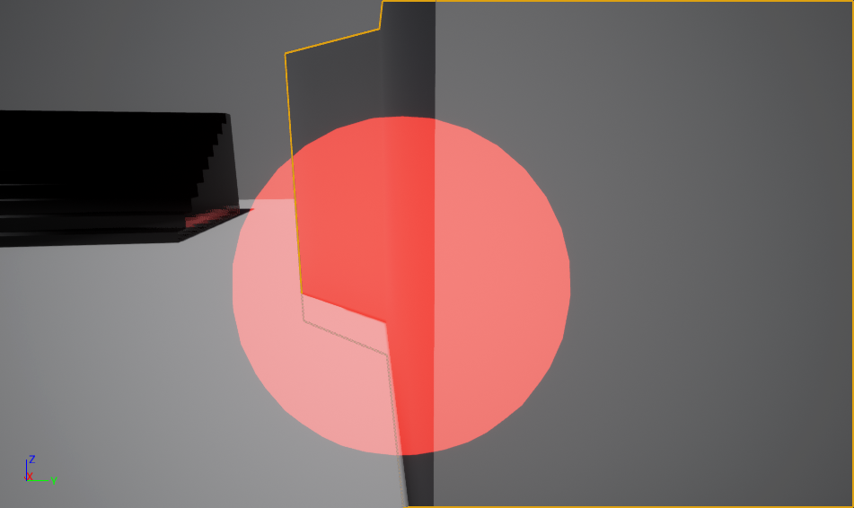</li>
</ul></li>
<li>次は透過の表現のためにPixelDepthとSceneDepthの差を使ってグラデーションを計算する. PixelDepthとSceneDepthの出力はMax2048らしいので0~1の範囲にするために割っている. DepthRangeパラメータは深度差のグラデーション範囲を制御する(値は0.02). Sharpnessパラメータはグラデーションの鋭さを制御する(値は2).
<ul>
<li>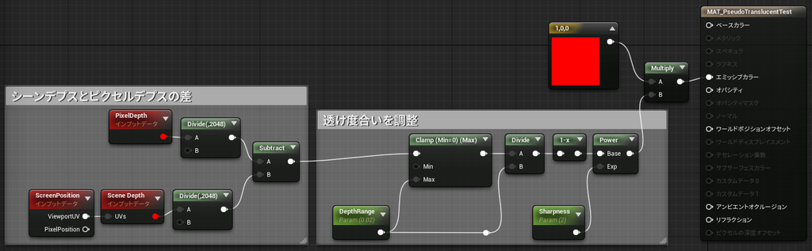</li>
</ul></li>
<li>ここまでで以下のようにメッシュが埋まっている部分が表面に近いほど色が濃いグラデーションになる.
<ul>
<li>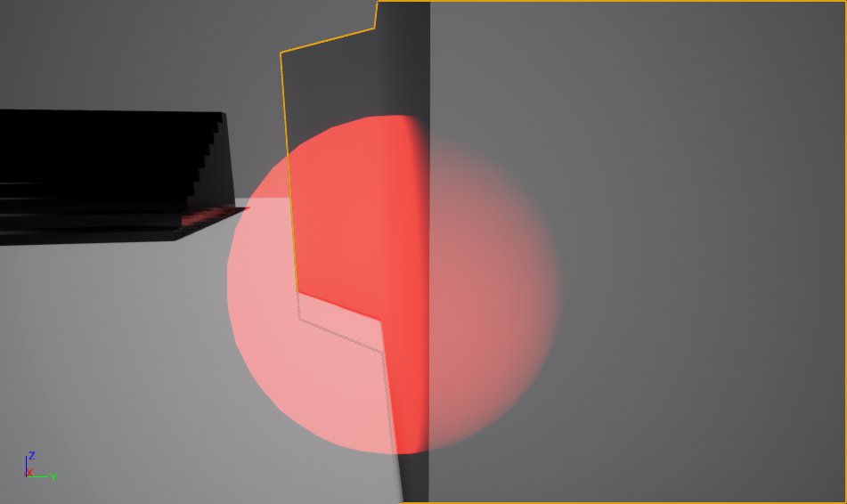</li>
</ul></li>
<li>PixelDepthのほうがSceneDepthのほうが手前の場合は表示しないように条件と乗算を追加.
<ul>
<li>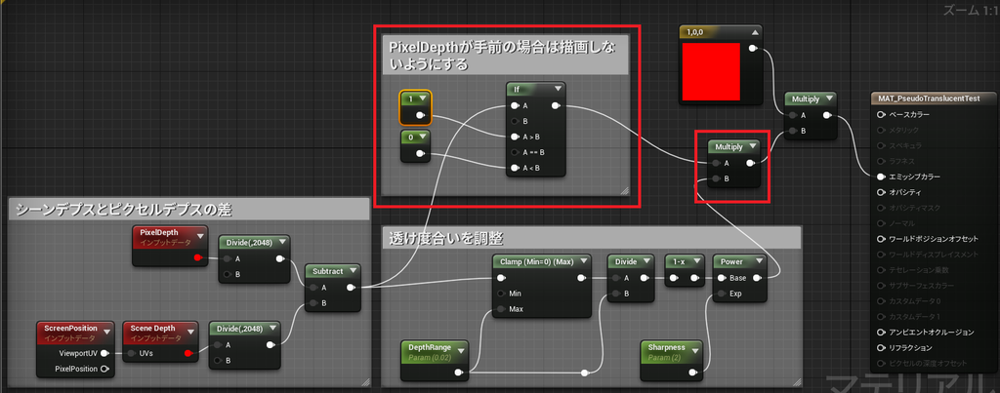</li>
</ul></li>
<li>埋まってる部分だけが表示される.
<ul>
<li>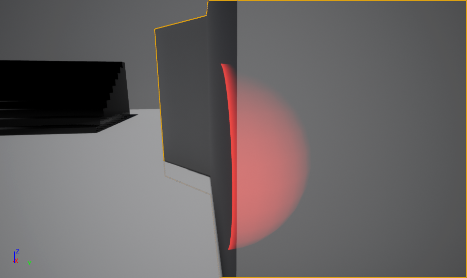</li>
</ul></li>
<li>わかりにくいので壁メッシュのマテリアルをスターターコンテンツの"M_Tech_Hex_Tile"に変えてみたところ.
<ul>
<li>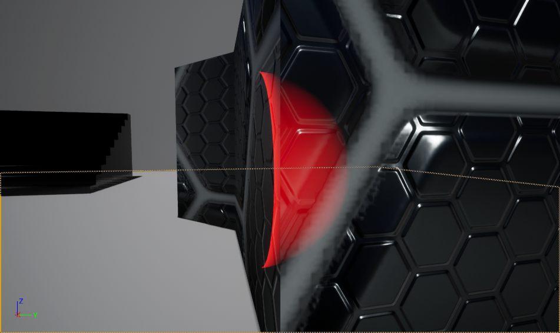</li>
<li>　わかりやすいように位置調整.</li>
</ul></li>
</ol>

なんとなく表面からの距離によって透過度合いが変わって透けているように見えるかな？あくまで外側は普通のOpaqueマテリアルで、内部構造側のマテリアルが透けているように見せている。  
  
サンプルプロジェクトに入っている"MAT\_PseudoTranslucent"はもう少し調整してある。

今回は深度テストを無効にして深度バッファの奥側の部分にだけ色が塗るように計算しているが、通常の深度テストとは逆のGreaterな深度テストで深度バッファの奥側だけ内部構造モデルの描画をするようにしたほうがいいと思う。UE4ではやり方がわからなかった。  
  
また、特定の外側モデルの内部にだけ描画したい場合は外側モデルの描画時にステンシルにマーキングし、内部構造モデルの描画時のステンシルテストでマーキングされたピクセルにだけ描画するといったことが必要かも。

この方法は内部構造モデルを描画する必要があるのでパフォーマンス的な問題があるかもしれないけどいろいろ面白いことができそう。

<ul>
<li>サンプルUE4プロジェクト
<ul>
<li><a href="https://drive.google.com/open?id=1_661EUgT_gz0UZ5xZ-Nbry72wzRNij7p">PseudoTranslucentTest.zip - Google &#x30C9;&#x30E9;&#x30A4;&#x30D6;</a></li>
</ul></li>
</ul>

---

[元のはてなブログ記事](https://nagakagachi.hatenablog.com/entry/2018/09/08/203717)
