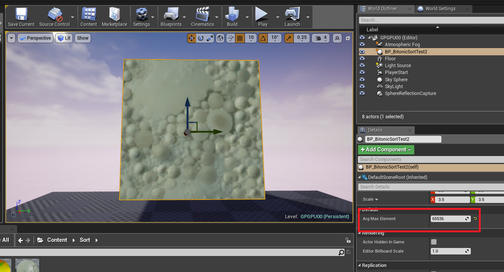
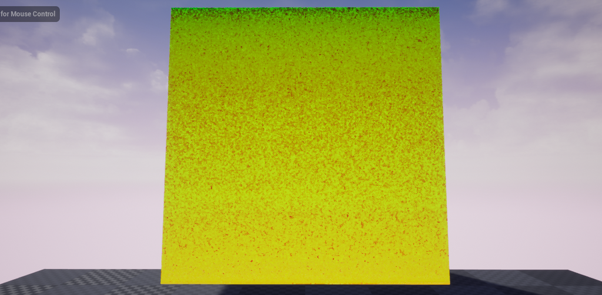

---
title: "UE4 マテリアルブループリントでGPUバイトニックソート"
date: "2018-12-15T08:00:00+09:00"
draft: false
url: "/entry/2018/12/15/080000/"
categories: ["UE4", "マテリアル", "シェーダ"]
hatena_author: "nagakagachi"
hatena_original_url: "https://nagakagachi.hatenablog.com/entry/2018/12/15/080000"
hatena_basename: "2018/12/15/080000"
math: false
image: "images/8b131db9ad42734b5bcb4481121010a9b51908c19f27510c89727d93000bdcf8.png"
---

多分2018年最後の記事。（思ったほど効果がなかったので温めずに公開）

<iframe src="https://hatenablog-parts.com/embed?url=https%3A%2F%2Fgithub.com%2Fnagakagachi%2Fue4%2Fblob%2Fmaster%2Fproject%2Fsample%2FMaterialBitonicSort.zip" title="nagakagachi/ue4" class="embed-card embed-webcard" scrolling="no" frameborder="0" style="display: block; width: 100%; height: 155px; max-width: 500px; margin: 10px 0px;"></iframe><cite class="hatena-citation"><a href="https://github.com/nagakagachi/ue4/blob/master/project/sample/MaterialBitonicSort.zip">github.com</a></cite>

<iframe width="480" height="270" src="https://www.youtube.com/embed/C8mmNhjWrNw?feature=oembed" frameborder="0" allow="accelerometer; autoplay; encrypted-media; gyroscope; picture-in-picture" allowfullscreen></iframe><cite class="hatena-citation"><a href="https://youtu.be/C8mmNhjWrNw">youtu.be</a></cite>
 

<b><a class="keyword" href="http://d.hatena.ne.jp/keyword/UE4">UE4</a>のマテリアルBPでバイトニックソート</b>を作ってみました。 
RG32fテクスチャを「R=キー, G=値」の配列に見立ててテクセルを並べ替えます。 
<a class="keyword" href="http://d.hatena.ne.jp/keyword/GPU">GPU</a>パーティクル等でテクスチャに格納した情報をソートする場合に、 
<a class="keyword" href="http://d.hatena.ne.jp/keyword/GPU">GPU</a>からCPUへデータをフィードバックしてCPUでソート、 
再び<a class="keyword" href="http://d.hatena.ne.jp/keyword/GPU">GPU</a>に戻すよりも全部<a class="keyword" href="http://d.hatena.ne.jp/keyword/GPU">GPU</a>でやったほうが速いだろうということで。

バイトニックソート自体はDirect Computeのサンプルなどがわかりやすいです。 
<a href="https://msdn.microsoft.com/ja-jp/library/ee416561(v=vs.85).aspx">ComputeShaderSort11 &#x30B5;&#x30F3;&#x30D7;&#x30EB;</a>

今回のマテリアルBPを利用した方法はほぼ<a class="keyword" href="http://d.hatena.ne.jp/keyword/%A5%D4%A5%AF%A5%BB%A5%EB">ピクセル</a>シェーダ実装なのでt-pot様も参考になると思います。 
<a href="https://t-pot.com/program/90_BitonicSort/index.html">t-pot&#x300E;Bitonic sort&#x300F;</a>
 

バイトニックソートの大まかな流れは

<ul>
<li>ステップ1
<ul>
<li>サブステップ 2要素毎に1個隣と入れ替え</li>
</ul></li>
</ul>
<ul>
<li>ステップ2
<ul>
<li>サブステップ 4要素毎に2個隣と入れ替え</li>
<li>サブステップ 2要素毎に1個隣と入れ替え</li>
</ul></li>
</ul>
<ul>
<li>ステップ3
<ul>
<li>サブステップ 8要素毎に4個隣と入れ替え</li>
<li>サブステップ 4要素毎に2個隣と入れ替え</li>
<li>サブステップ 2要素毎に1個隣と入れ替え</li>
</ul></li>
</ul>
<ul>
<li>ステップi
<ul>
<li>同様に最大要素の半分の要素毎のステップまで続ける</li>
</ul></li>
</ul>
という感じです。要<a class="keyword" href="http://d.hatena.ne.jp/keyword/%C1%C7%BF%F4">素数</a>が 2^n の場合は合計で n*(n+1)/2 のサブステップによってソートが完了します。 
65536=2^16 なら 136サブステップです。 
実際には昇順降順を入れ違いにするので詳細は先に挙げたページを参考にしてください。 
また、バイトニックソートの制限として要<a class="keyword" href="http://d.hatena.ne.jp/keyword/%C1%C7%BF%F4">素数</a>が2のべき乗でないとダメなのでそのあたりはBPで調整してます。

実装詳細はサンプルプロジェクトを見ていただくとして概要は以下のようになります。

<ul>
<li>BP
<ul>
<li>BP_BitonicSortTest
<ul>
<li>ソート用のマテリアルを使ってソートを実行するアクター</li>
<li>必要なテクスチャやマテリアルを保持</li>
<li>初期化マテリアル及びバイトニックソートマテリアルをDrawMaterialToRenderTargetで実行する</li>
<li>初期化マテリアルでRにノイズ、Gに適当な値を書き込み</li>
<li>バイトニックソートマテリアルに適切なパラメータを設定しつつ必要な数だけDrawMaterialToRenderTargetを実行している</li>
<li>Drawで実行する関係でテクスチャを二枚用意し交互に入出力を切り替えている</li>
</ul></li>
<li>M_RandInitRGKeyVal
<ul>
<li>指定されたテクスチャのRにノイズ, Gに適当な値を書き込み</li>
</ul></li>
<li>M_BitonicSortRG32fKeyVal
<ul>
<li>バイトニックソートの1サブステップ分の処理をするマテリアル</li>
<li>テクスチャのテクセル一つを配列の1要素に見立て、Rの値の大小比較で入れ替えをする</li>
<li>ステップ番号とサブステップ番号、1サブステップ前の結果のテクスチャをパラメータに指定してDrawするとターゲットに1サブステップ分の要素入れ替えをした結果を書き込む</li>
</ul></li>
<li>M_TextureDraw
<ul>
<li>ソート結果のテクスチャを可視化するためだけのマテリアル</li>
</ul></li>
</ul></li>
</ul>
 
ソートの結果がこの記事の最初に貼ったノイズのようなテクスチャの色がｳﾈｳﾈしている動画です。 
毎フレームでテクスチャのRの値にノイズ(乱数)を書き込み、Rの値でソートしてメッシュに貼り付けています。 
ソートの結果左上のテクセルが先頭、右下が末尾になるように並び替えられるので、上のほうがRが小さく(緑)、下のほうがRが大きい(赤)ようになっているはずです。 
ちなみにソートマテリアルを実行しない場合は以下のような感じです。 
<iframe width="480" height="270" src="https://www.youtube.com/embed/Sjd8Isb9qa8?feature=oembed" frameborder="0" allow="accelerometer; autoplay; encrypted-media; gyroscope; picture-in-picture" allowfullscreen></iframe><cite class="hatena-citation"><a href="https://youtu.be/Sjd8Isb9qa8">youtu.be</a></cite>

要<a class="keyword" href="http://d.hatena.ne.jp/keyword/%C1%C7%BF%F4">素数</a>はアクターの ArgMaxElement で変更できます。 
実際にはここに設定した数値より大きい最小の2のべき乗数が自動で計算されて利用されます。<figure class="figure-image figure-image-fotolife" title="要素数を指定するパラメータ"><figcaption>要<a class="keyword" href="http://d.hatena.ne.jp/keyword/%C1%C7%BF%F4">素数</a>を指定するパラメータ</figcaption></figure>
 

結果としてはマテリアルBPでソートはできましたが、<b>速度はそんなに速くなりませんでした</b>。遅いです。 
原因はDrawMaterialToRenderTargetの回数が多すぎることによるCPU負荷と思われます。 
サブステップ1回につきDrawMaterialToRenderTargetが1回必要なので、65536要素の場合は136回のDrawMaterialToRenderTargetが実行されてます。

ComputeShaderで実装する場合は共有メモリを利用することで1ステップをDispatch1回で処理できるので相当速くできると思います。いつかやりたい。

以上、マテリアルBPで無理やりバイトニックソートをやってみた、でした。

 

---

[元のはてなブログ記事](https://nagakagachi.hatenablog.com/entry/2018/12/15/080000)
