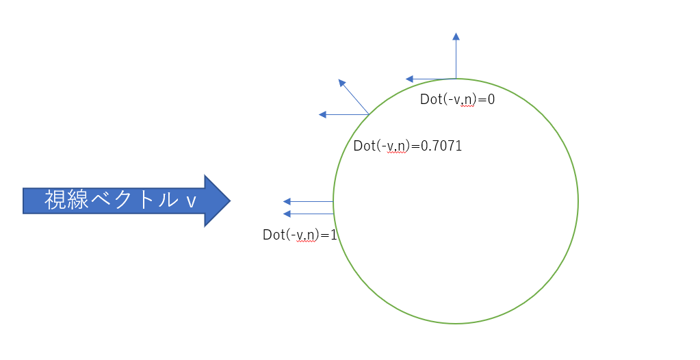
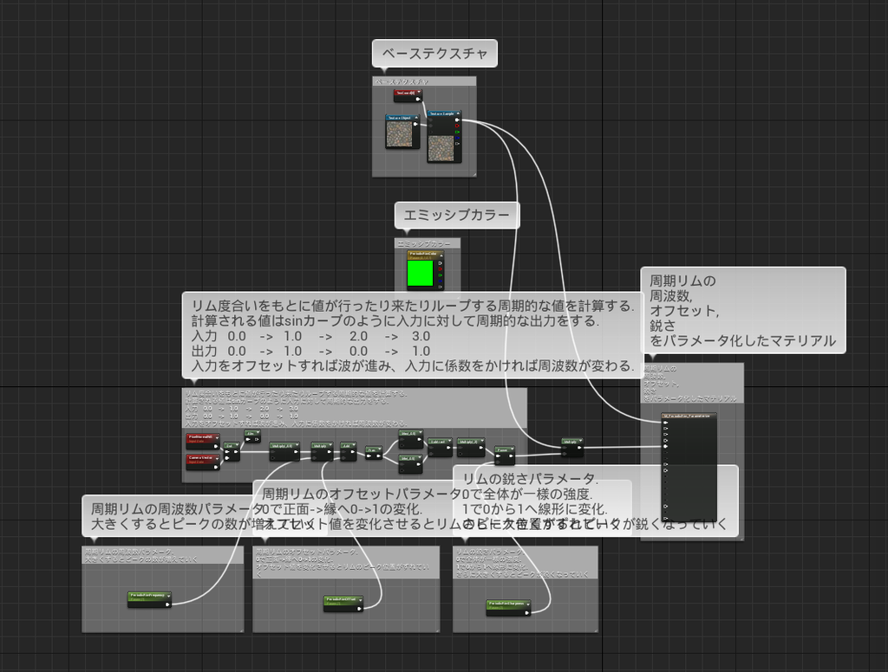
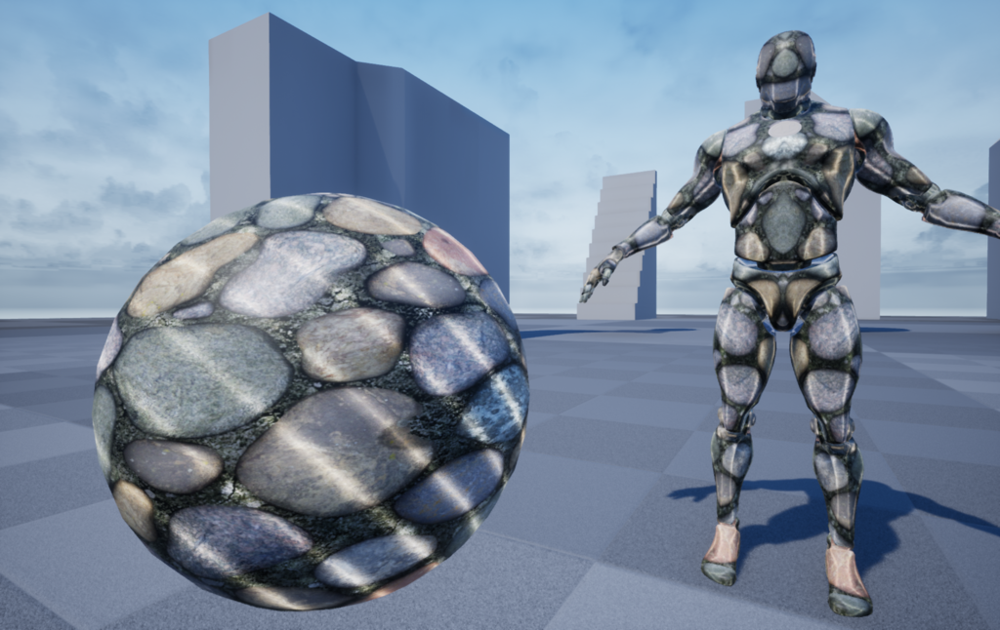

---
title: "UE4 周期的なリムエミッシブ"
date: "2019-01-19T09:00:00+09:00"
draft: false
url: "/entry/2019/01/19/090000/"
categories: ["UE4", "シェーダ", "マテリアル"]
hatena_author: "nagakagachi"
hatena_original_url: "https://nagakagachi.hatenablog.com/entry/2019/01/19/090000"
hatena_basename: "2019/01/19/090000"
math: true
image: "images/bf14264de6daca036c02d6f4eb1f2b2fcf31ecf6c39f0f2670784a373a1ca2a7.png"
---

あけましておめでとうございます

<blockquote data-conversation="none" class="twitter-tweet" data-lang="ja">
周期的リムライトで遊んでみたり。グ<a class="keyword" href="https://d.hatena.ne.jp/keyword/%A5%EC%A5%A4%A5%DE%A5%F3">レイマン</a>さんみたいに凹凸が多いと水面の反射みたいになる。後半の球はリム計算用のベクトルを視線ではなくワールド空間ベクトル(この場合は+Z)にして周期的リムのパラメータを変えたところ。リムってなんだっけ…  <a href="https://twitter.com/hashtag/UE4Study?src=hash&amp;ref_src=twsrc%5Etfw">#UE4Study</a> <a href="https://twitter.com/hashtag/UE4?src=hash&amp;ref_src=twsrc%5Etfw">#UE4</a> <a href="https://t.co/zGuOW6giG1">pic.twitter.com/zGuOW6giG1</a>
&mdash; なが (@nagakagachi) <a href="https://twitter.com/nagakagachi/status/1086286532242137093?ref_src=twsrc%5Etfw">2019年1月18日</a></blockquote>  

視線ベクトルと<a class="keyword" href="https://d.hatena.ne.jp/keyword/%A5%D4%A5%AF%A5%BB%A5%EB">ピクセル</a>法線の<a class="keyword" href="https://d.hatena.ne.jp/keyword/%C6%E2%C0%D1">内積</a>を利用して縁をエミッシブで光らせるリムライト的表現をすることがよくあると思います。今回はこのリムライト的表現で使われる値をそのまま使わずに周期関数へ入力してから使うことで、周波数を変えたり波にオフセットをかけたりできるヘンなリムライト？を作ってみます。

視線ベクトルvの逆向きベクトル-vと法線ベクトルnの<a class="keyword" href="https://d.hatena.ne.jp/keyword/%C6%E2%C0%D1">内積</a>は正面から縁に向かって1から0に変化します。 

 

\(1 - dot(\vec{-v},\vec{n})\) 
とすれば正面が0で縁が1になり、単純にこれをエミッシブに出力すれば縁が光ると思います。

これを周期関数である sin() に入力します。 
\(sin(1 - dot(\vec{-v},\vec{n}))\)

このままだと -1 ~ +1 の値になるので、1を足して0.5を掛けることで 0 ~ 1 の値に変換します。 
\((sin(1 - dot(\vec{-v},\vec{n})) + 1)*0.5\)

さらに周波数を変えるための変数 freq をsin() の中にかけ合わせます。 
\((sin( (1-dot(\vec{-v},\vec{n}) )*freq)+1)*0.5\)

周期のオフセットのための変数 offset をsin() の中に足します。 
\((sin( (1-dot(\vec{-v},\vec{n}) )*freq+offset)+1)*0.5\)

最後に0から1への変化の急峻さをコン<a class="keyword" href="https://d.hatena.ne.jp/keyword/%A5%C8%A5%ED%A1%BC%A5%EB">トロール</a>する変数 sharpness を使ってべき乗します。 
\((power(sin( (1-dot(\vec{-v},\vec{n}) )*freq+offset)+1)*0.5, sharpness)\)

この値を適当なカラーにかけてエミッシブ出力するなどすれば完成。

freqを大きくするとリムライトの波の数が増え、  
  
offsetを増やすと波の位置が移動し、  
  
sharpnessを大きくすると明るい部分が狭く（鋭く）なります。

 

プロジェクトはこちら 
(サンプルプロジェクトではsin()ではなく自前で周期関数モドキ作っていますがsin()などに置き換えても同じような挙動になるはずです) 
<iframe src="https://hatenablog-parts.com/embed?url=https%3A%2F%2Fdrive.google.com%2Fopen%3Fid%3D1JOK3EEDW2qqXo1PYR7uBqqa402GCGuxQ" title="PeriodicRimEmissiveMaterial.zip" class="embed-card embed-webcard" scrolling="no" frameborder="0" style="display: block; width: 100%; height: 155px; max-width: 500px; margin: 10px 0px;" loading="lazy"></iframe><cite class="hatena-citation"><a href="https://drive.google.com/open?id=1JOK3EEDW2qqXo1PYR7uBqqa402GCGuxQ">drive.google.com</a></cite>

それなりにコメントを書いているのでナニカの参考にしていただければ… 

あと法線との<a class="keyword" href="https://d.hatena.ne.jp/keyword/%C6%E2%C0%D1">内積</a>に視線ベクトルではなくワールド空間ベクトルを使ったりすると面白いかも。 
(サンプルプロジェクトのマテリアル M_PeriodicRim_WorldDir でやってます) 

---

[元のはてなブログ記事](https://nagakagachi.hatenablog.com/entry/2019/01/19/090000)
