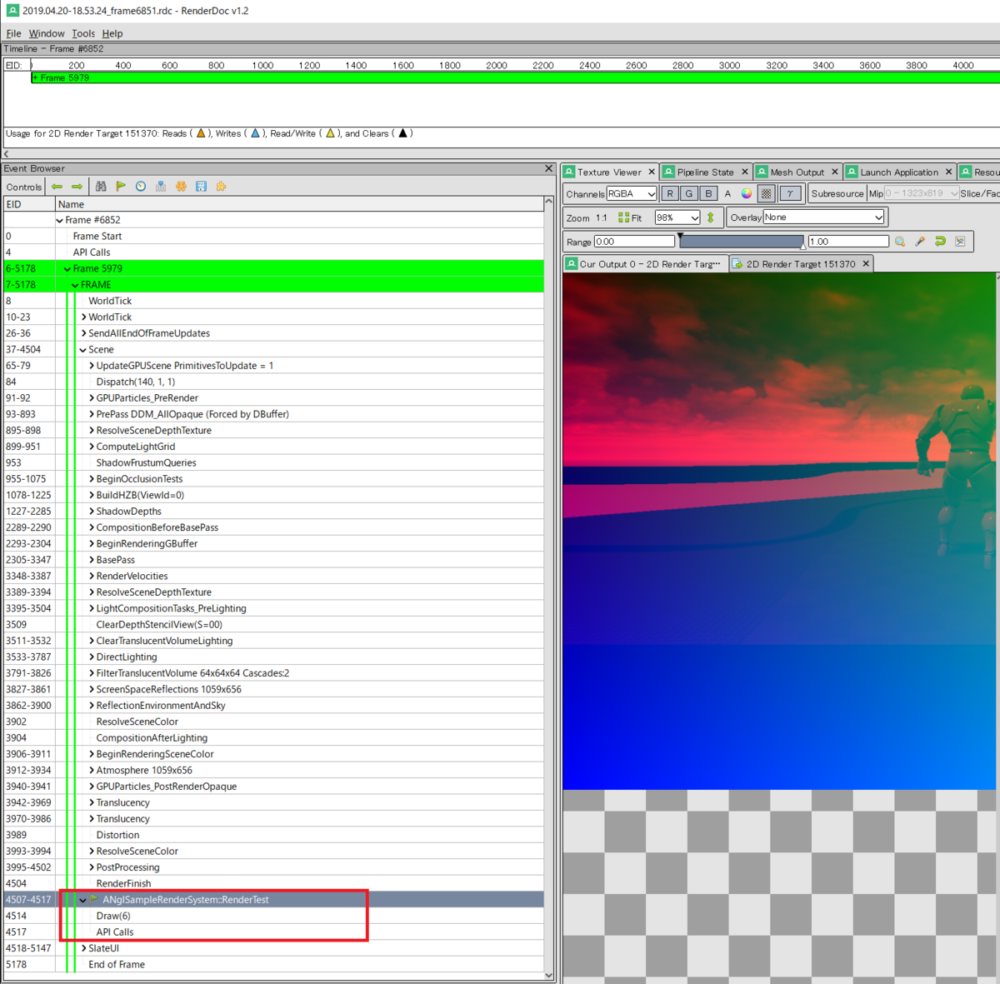

---
title: "UE4 C++プラグインでPostProcess検証"
date: "2019-04-20T22:47:32+09:00"
draft: false
url: "/entry/2019/04/20/224732/"
categories: []
hatena_author: "nagakagachi"
hatena_original_url: "https://nagakagachi.hatenablog.com/entry/2019/04/20/224732"
hatena_basename: "2019/04/20/224732"
math: false
image: "images/2c3a48a97669357bebd69593745c15af8efa29a83965365cda37c775a0eb9dfd.png"
---

エンジン改造をせずに<a class="keyword" href="http://d.hatena.ne.jp/keyword/C%2B%2B">C++</a><a class="keyword" href="http://d.hatena.ne.jp/keyword/%A5%D7%A5%E9%A5%B0%A5%A4%A5%F3">プラグイン</a>とGlobalShaderでPostProcess的なことをできないか調べてみた。  
結論としては

<ul>
<li><a class="keyword" href="http://d.hatena.ne.jp/keyword/UE4">UE4</a>は動的解像度関係で複雑なUV計算などを隠蔽しているのでそのあたりを再現しないと正常に動かない</li>
<li>UI描画と同じフル解像度に対して処理するので動的解像度の恩恵を受けられない</li>
</ul>

まぁ、ダメでしたね。

    

#### 概要

    

基本的にゲームスレッドからの描画命令は ENQUEUE\_RENDER\_COMMANDマクロによってキューに積み込んで描画スレッドが処理する。  
  
描画スレッドはキューに積まれた順番に処理をしていく。  
  
ActorのTickで積み込むとScene描画(ベースパスやPostProcess)の前に積み込まれるので、PostProcessでよく使うSceneColorテクスチャなどがまだ出来上がっていない。  
  
ActorにはUI描画の直前(PostProcess後)のタイミングでコールされる関数を設定できるのでそれを利用すればいい感じのタイミングに描画コマンドを差し込めるのでは？

    

#### 結果

    

というわけでActorのPostRenderFor()を利用して描画コマンドを積んでみたところをRenderDocで確認してみた。

一応いい感じの場所で自前の描画コマンドが実行されていることが確認できる。

ただし以下の実行結果のようにSceneColorの領域とRendetTargetのViewportのマッチング計算がうまくいっていなかったりしていろいろ問題がある。  
  
(ウィンドウサイズを変更すると描画領域が変わっておかしくなる)

<iframe allowfullscreen="" src="//www.youtube.com/embed/9i00cuWclkc" width="560" height="315" frameborder="0"></iframe> <a href="https://youtube.com/watch?v=9i00cuWclkc">UE4 C++プラグインでPostProcess検証</a>

<a class="keyword" href="http://d.hatena.ne.jp/keyword/UE4">UE4</a>側でToneMap後にHookできるようになったり描画領域に応じたUV補正計算の自動化がサポートされないだろうか…

    

#### 関連コード

    

    

##### シェーダ

    <pre class="code lang-cpp" data-lang="cpp" data-unlink>#include &quot;/Engine/Public/Platform.ush&quot;

Texture2D       SceneColor;
SamplerState    SceneColorSampler;

// フルスクリーンVS
void MainVS(
    in uint GlobalVertexId : SV_VertexID,
    out float2 OutUV : TEXCOORD0,
    out float4 OutPosition : SV_POSITION
    )
{
    uint VertexId = GlobalVertexId;
    
    float2 CellVertexUV = float2(0x1 &amp; ((VertexId + 1) / 3), VertexId &amp; 0x1);

    // Output vertex position.
    OutPosition = float4(CellVertexUV * 2 - 1, 0, 1);

    // Output top left originated UV of the vertex.
    OutUV = float2(CellVertexUV.x, 1 - CellVertexUV.y);
}

// フレームバッファ使用PS
void MainPS(
    in noperspective float2 UV : TEXCOORD0,
    in float4 SvPosition : SV_POSITION,
    out float4 OutColor : SV_Target0
    )
{
    float4 c = SceneColor.SampleLevel(SceneColorSampler, UV, 0);

    OutColor = float4(c.x, UV.x, UV.y, 1);
}
</pre>

    

##### Actor(.h)

    <pre class="code lang-cpp" data-lang="cpp" data-unlink>UCLASS()
class ANglSampleRenderSystem : public AActor
{
	GENERATED_BODY()

public:
	void BeginPlay();

	static void RenderPostProcess(FRHICommandList&amp; RHICmdList, ERHIFeatureLevel::Type FeatureLevel, const FRenderTarget* viewRenderTarget);

	void PostRenderFor(class APlayerController* PC, class UCanvas* Canvas, FVector CameraPosition, FVector CameraDir);

private:
};
</pre>

    

##### Acotr(.cpp)

    <pre class="code lang-cpp" data-lang="cpp" data-unlink>
class FSamplePostprocessShader : public FGlobalShader
{
public:
	static bool ShouldCache(EShaderPlatform Platform)
	{
		return IsFeatureLevelSupported(Platform, ERHIFeatureLevel::SM4);
	}

	static void ModifyCompilationEnvironment(const FGlobalShaderPermutationParameters&amp; Parameters, FShaderCompilerEnvironment&amp; OutEnvironment)
	{
		FGlobalShader::ModifyCompilationEnvironment(Parameters, OutEnvironment);
	}

	static bool ShouldCompilePermutation(const FGlobalShaderPermutationParameters&amp; Parameters)
	{
		// Useful when adding a permutation of a particular shader
		return true;
	}

	FSamplePostprocessShader() {}

	// シェーダパラメータと変数をバインド
	FSamplePostprocessShader(const ShaderMetaType::CompiledShaderInitializerType&amp; Initializer)
		:FGlobalShader(Initializer)
	{
		// シェーダパラメータと変数をバインド
		SceneColor_.Bind(Initializer.ParameterMap, TEXT(&quot;SceneColor&quot;));
		SceneColorSampler_.Bind(Initializer.ParameterMap, TEXT(&quot;SceneColorSampler&quot;));
	}
	// シリアライズメソッド
	virtual bool Serialize(FArchive&amp; Ar) override
	{
		// シェーダパラメータ変数のシリアライズ
		bool bShaderHasOutdatedParameters = FGlobalShader::Serialize(Ar);
		Ar &lt;&lt; SceneColor_ &lt;&lt; SceneColorSampler_;
		return bShaderHasOutdatedParameters;
	}

	// シェーダパラメータ設定をする固有メソッド
	template&lt;typename TShaderRHIParamRef&gt;
	void SetParameters(
		FRHICommandList&amp; RHICmdList,
		const TShaderRHIParamRef ShaderRHI,
		FTextureRHIParamRef inTexture
	)
	{
		//SetTextureParameter(RHICmdList, ShaderRHI, SceneColor_, inTexture);
		SetTextureParameter( RHICmdList, ShaderRHI, 
			SceneColor_, SceneColorSampler_, 
			TStaticSamplerState&lt;SF_Bilinear, AM_Clamp, AM_Clamp, AM_Clamp&gt;::GetRHI(), inTexture);
	}
private:
	// シェーダパラメータ変数群
	FShaderResourceParameter SceneColor_;
	FShaderResourceParameter SceneColorSampler_;
};

class FSamplePostprocessShaderVS : public FSamplePostprocessShader
{
	DECLARE_SHADER_TYPE(FSamplePostprocessShaderVS, Global);

public:
	/** Default constructor. */
	FSamplePostprocessShaderVS() {}

	/** Initialization constructor. */
	FSamplePostprocessShaderVS(const ShaderMetaType::CompiledShaderInitializerType&amp; Initializer)
		:FSamplePostprocessShader(Initializer)
	{
	}
};

class FSamplePostprocessShaderPS : public FSamplePostprocessShader
{
	DECLARE_SHADER_TYPE(FSamplePostprocessShaderPS, Global);

public:

	/** Default constructor. */
	FSamplePostprocessShaderPS() {}

	/** Initialization constructor. */
	FSamplePostprocessShaderPS(const ShaderMetaType::CompiledShaderInitializerType&amp; Initializer)
		:FSamplePostprocessShader(Initializer)
	{ }
};

// シェーダコードとGlobalShaderクラスを関連付け
IMPLEMENT_SHADER_TYPE(, FSamplePostprocessShaderVS, TEXT(&quot;/Plugin/ShaderPlugin/Private/sample_postprocess.usf&quot;), TEXT(&quot;MainVS&quot;), SF_Vertex)
IMPLEMENT_SHADER_TYPE(, FSamplePostprocessShaderPS, TEXT(&quot;/Plugin/ShaderPlugin/Private/sample_postprocess.usf&quot;), TEXT(&quot;MainPS&quot;), SF_Pixel)

void ANglSampleRenderSystem::BeginPlay()
{
	Super::BeginPlay();
	
	AGameModeBase* Mode = UGameplayStatics::GetGameMode(this);
	APlayerController*PlayerController = UGameplayStatics::GetPlayerController(this, 0);
	AHUD* HUD = PlayerController-&gt;GetHUD();
	// このActorのPostRenderForをコールバック登録
	HUD-&gt;AddPostRenderedActor(this);
	// HUDオーバーレイを有効化
	HUD-&gt;bShowOverlays = true;
	
}

void ANglSampleRenderSystem::RenderPostProcess(FRHICommandList&amp; RHICmdList, ERHIFeatureLevel::Type FeatureLevel, const FRenderTarget* viewRenderTarget)
{
	SCOPED_DRAW_EVENTF(RHICmdList, SceneCapture, TEXT(&quot;ANglSampleRenderSystem::RenderTest&quot;));
	
	auto finalRenderTarget = viewRenderTarget;
	if (!finalRenderTarget)
		return;

	auto ShaderMap = GetGlobalShaderMap(FeatureLevel);

	TShaderMapRef&lt;FSamplePostprocessShaderVS&gt; vs(ShaderMap);
	TShaderMapRef&lt;FSamplePostprocessShaderPS&gt; ps(ShaderMap);

	// PostProcessシステムからバッファを取得
	FSceneRenderTargets&amp; SceneContext = FSceneRenderTargets::Get(RHICmdList);
	auto sceneColor = SceneContext.GetSceneColorTexture();

	auto finalRenderTargetSize = finalRenderTarget-&gt;GetSizeXY();

	// CanvasのViewFamilyから取得したターゲットへ書き込んでみる
	auto rt_action = ERenderTargetActions::DontLoad_Store;
	FRHIRenderPassInfo passInfo(finalRenderTarget-&gt;GetRenderTargetTexture(), rt_action, nullptr);
	RHICmdList.BeginRenderPass(passInfo, TEXT(&quot;NglSampleRender&quot;));
	FIntPoint viewportSize(finalRenderTargetSize.X, finalRenderTargetSize.Y);
	// ターゲットに対してフルスクリーンビューポート
	RHICmdList.SetViewport(
		0, 0, 0.f,
		viewportSize.X, viewportSize.Y, 1.f);

	// PSO
	FGraphicsPipelineStateInitializer GraphicsPSOInit;
	RHICmdList.ApplyCachedRenderTargets(GraphicsPSOInit);
	GraphicsPSOInit.DepthStencilState = TStaticDepthStencilState&lt;false, CF_Always&gt;::GetRHI();
	GraphicsPSOInit.BlendState = TStaticBlendState&lt;&gt;::GetRHI();
	GraphicsPSOInit.RasterizerState = TStaticRasterizerState&lt;&gt;::GetRHI();
	GraphicsPSOInit.PrimitiveType = PT_TriangleList;
	GraphicsPSOInit.BoundShaderState.VertexDeclarationRHI = GetVertexDeclarationFVector4();
	GraphicsPSOInit.BoundShaderState.VertexShaderRHI = GETSAFERHISHADER_VERTEX(*vs);
	GraphicsPSOInit.BoundShaderState.PixelShaderRHI = GETSAFERHISHADER_PIXEL(*ps);
	SetGraphicsPipelineState(RHICmdList, GraphicsPSOInit);

	// シェーダパラメータ更新
	vs-&gt;SetParameters(RHICmdList, vs-&gt;GetVertexShader(), nullptr);
	ps-&gt;SetParameters(RHICmdList, ps-&gt;GetPixelShader(), sceneColor.GetReference());// SceneColorをシェーダリソース利用

	// 矩形描画
	RHICmdList.DrawPrimitive(0, 2, 1);

	RHICmdList.EndRenderPass();
}

void ANglSampleRenderSystem::PostRenderFor(class APlayerController* PC, class UCanvas* Canvas, FVector CameraPosition, FVector CameraDir)
{
	Super::PostRenderFor(PC, Canvas, CameraPosition, CameraDir);

	ERHIFeatureLevel::Type FeatureLevel = GetWorld()-&gt;Scene-&gt;GetFeatureLevel();

	Canvas-&gt;SizeX;
	Canvas-&gt;SizeY;

	auto viewRenderTarget = Canvas-&gt;SceneView-&gt;Family-&gt;RenderTarget;

	ENQUEUE_RENDER_COMMAND(CaptureCommand)(
		[this, FeatureLevel, viewRenderTarget](FRHICommandListImmediate&amp; RHICmdList)
		{
			RenderPostProcess(RHICmdList, FeatureLevel, viewRenderTarget);
		}
	);
}
</pre>

---

[元のはてなブログ記事](https://nagakagachi.hatenablog.com/entry/2019/04/20/224732)
