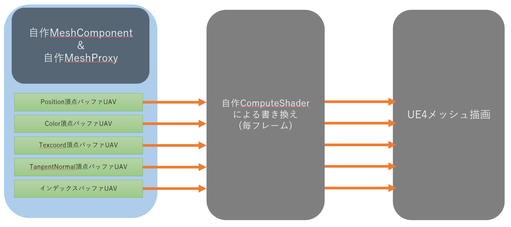
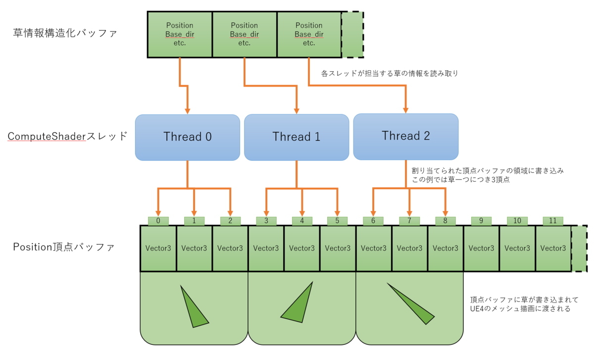

---
title: "UE4 ComputeShaderでMeshの頂点バッファをリアルタイム書き換えする (GPGPU)"
date: "2019-09-22T22:26:04+09:00"
draft: false
url: "/entry/2019/09/22/222604/"
categories: ["UE4", "C++", "UnrealC++", "シェーダ", "ComputeShader", "GPGPU"]
hatena_author: "nagakagachi"
hatena_original_url: "https://nagakagachi.hatenablog.com/entry/2019/09/22/222604"
hatena_basename: "2019/09/22/222604"
math: false
image: "images/a7e0ed1dbb7467ca02ad9f19db3cd9c2f5042317917e76eeb0a6fe5fa284007d.png"
---

エンジンバージョン:4.22, 4.23  
  
諸事情によりサンプルプロジェクト無し

<a class="keyword" href="http://d.hatena.ne.jp/keyword/UE4">UE4</a>のProceduralMeshのようなことをComputeShaderでできたら、大量の頂点をリアルタイムに操作できて面白いのではないかという思い付き。 
今回はたくさんの草をリアルタイムに生成する目的で実装してある程度うまくいったのでメモ。 
この方法を応用すれば頂点カラーとかに<b>InstanceID的なものやそのほか特殊な情報を埋め込んでおいてマテリアルBPで利用</b>するといったこともできる。

この記事は<a class="keyword" href="http://d.hatena.ne.jp/keyword/C%2B%2B">C++</a>とGlobalShaderを利用したもので、且つエンジン改造はしない。 
また、自前で用意した頂点バッファをComputeShaderで書き換えて<a class="keyword" href="http://d.hatena.ne.jp/keyword/UE4">UE4</a>のメッシュ描画に流す方法がメインであるため、実装したComputeShader自体については深く説明しない。

<iframe width="560" height="315" src="https://www.youtube.com/embed/vYK3n3544V4?feature=oembed" frameborder="0" allow="accelerometer; autoplay; clipboard-write; encrypted-media; gyroscope; picture-in-picture" allowfullscreen></iframe><cite class="hatena-citation"><a href="https://www.youtube.com/watch?v=vYK3n3544V4">www.youtube.com</a></cite> 
↑プレイヤーからの影響を草一本一本が受ける例。 
草の位置や基準方向などを構造化バッファで保持しているのでそれらをComputeShaderで更新すればこのようなことも可能。 
<iframe width="560" height="315" src="https://www.youtube.com/embed/KTw7eWUym6k?feature=oembed" frameborder="0" allow="accelerometer; autoplay; clipboard-write; encrypted-media; gyroscope; picture-in-picture" allowfullscreen></iframe><cite class="hatena-citation"><a href="https://www.youtube.com/watch?v=KTw7eWUym6k">www.youtube.com</a></cite> 
↑さらにマテリアルBP側で頂点オフセットによる風揺れをつけた例。 
描画自体は<a class="keyword" href="http://d.hatena.ne.jp/keyword/UE4">UE4</a>のメッシュ描画に乗っかっているのでStaticMesh等と同じようにマテリアルが使えるのが強みの一つ。

    

### 基本の考え

自分で作成した頂点バッファやインデックスバッファを<a class="keyword" href="http://d.hatena.ne.jp/keyword/UE4">UE4</a>のメッシュ描画に流し込む方法は意外と簡単で、FPrimitiveSceneProxy派生クラスでGetDynamicMeshElements()関数をoverrideして適切にバッファ情報を渡せば可能になる。 
そこでこれらのバッファをUnorderedAccess可能な設定で作成しておき、毎フレームComputeShaderで書き換えるようにすることで、形状をリアルタイムに変更しつつマテリアル等を含めた描画部分は<a class="keyword" href="http://d.hatena.ne.jp/keyword/UE4">UE4</a>の仕組みをそのまま利用できると考えた。<figure class="figure-image figure-image-fotolife" title="フローのイメージ"><figcaption>フローのイメージ</figcaption></figure>

    

#### 必要な要素の概要

    
<ul>
<li>自作ComputeShader用GlobalShader
<ul>
<li>自作MeshProxyが生成した頂点バッファUAVやインデックスバッファUAVへ読み書きして草メッシュを作る</li>
<li>草メッシュの位置や向きは別途StructuredBufferで与える</li>
</ul></li>
<li>自作MeshComponentクラス
<ul>
<li>対になる自作MeshProxyを生成してシステムに登録し、ゲーム側からの情報を通知する役割</li>
</ul></li>
<li>自作MeshProxyクラス
<ul>
<li>自作MeshComponentの描画スレッド側における分身のような存在</li>
<li>UnorderedAccess可能な各種頂点バッファとインデックスバッファおよびそれらのUAVを作成する</li>
<li><a class="keyword" href="http://d.hatena.ne.jp/keyword/UE4">UE4</a>メッシュ描画システムのメッシュ情報収集に適切に頂点バッファなどを設定する</li>
<li>ComputeShaderのDispatchコマンド発行もする</li>
</ul></li>
</ul>

    

### 自作ComputeShader用GlobalShader

自作MeshProxyの各バッファのUAVを設定して書き換えるComputeShaderのGlobalShader。 
GlobalShader自体については公式のドキュメントを参考。 
<a href="https://docs.unrealengine.com/ja/Programming/Rendering/ShaderInPlugin/QuickStart/index.html">https://docs.unrealengine.com/ja/Programming/Rendering/ShaderInPlugin/QuickStart/index.html</a> 
ComputeShaderをGlobalShaderとして作成してUAV他パラメータを設定する流れについては以下のブログが参考になる。 
<a href="http://www.sciement.com/tech-blog/c/structured_buffer_compute_shader_ue4_part2/">[UE4][ComputeShader][HLSL][C++]Unreal Engine 4&#x3067;(RW)StructuredBuffer&#x3092;&#x7528;&#x3044;&#x305F;ComputeShader&#x3092;&#x5229;&#x7528;&#x3059;&#x308B;&#xFF08;&#x305D;&#x306E;&#xFF12;&#xFF1A;C++&#x5074;&#x30B7;&#x30A7;&#x30FC;&#x30C0;&#x30AF;&#x30E9;&#x30B9;&#xFF09; &ndash; &#x30B5;&#x30A4;&#x30A2;&#x30E1;&#x30F3;&#x30C8;&#x6280;&#x8853;&#x30E1;&#x30E2;</a>

今回はComputeShaderのスレッド一つが草一本を担当することとし、スレッドIDと草一つに割り当てられた頂点数からスレッドが書き込む頂点バッファ内の位置を決めている。あまり特殊なことはしていないが、接線法線頂点バッファ等がPackedフォーマットになっている場合はUAVから読み取った値をUnpackしたり書き戻す際に再度Packしたりといった処理が必要な点に注意。<figure class="figure-image figure-image-fotolife" title="ComputeShaderの処理イメージ"><figcaption>ComputeShaderの処理イメージ</figcaption></figure>

    

### 自作MeshComponentクラス

UPrimitiveComponentを継承 
<a class="keyword" href="http://d.hatena.ne.jp/keyword/%A5%B3%A5%F3%A5%DD%A1%BC%A5%CD%A5%F3%A5%C8">コンポーネント</a>としてゲームスレッド側の情報を管理する。UProceduralMeshComponentを参考にした。 
<a class="keyword" href="http://d.hatena.ne.jp/keyword/%A5%B3%A5%F3%A5%DD%A1%BC%A5%CD%A5%F3%A5%C8">コンポーネント</a>の描画スレッド側の情報を管理するカスタムMeshProxyクラスを生成して保持し、適切に情報を渡したりするのが主な役目。 
適切なタイミングで自作MeshProxyへComputeShaderのDispatchコマンド生成をリク<a class="keyword" href="http://d.hatena.ne.jp/keyword/%A5%A8%A5%B9">エス</a>トをする。

<pre class="code lang-cpp" data-lang="cpp" data-unlink>virtual void UComputeMeshComponent::TickComponent(float DeltaTime, enum ELevelTick TickType, FActorComponentTickFunction *ThisTickFunction) override
{
    // SendRenderDynamicData_Concurrent の呼び出しをリクエスト
    MarkRenderDynamicDataDirty();
}
virtual void UComputeMeshComponent::SendRenderDynamicData_Concurrent() override
{
    // カスタムMeshProxyにComputeShaderのDispatchコマンド生成を要求
    カスタムMeshProxy-&gt;EnqueueDispatchComputeShader();
}
</pre>

    

### 自作MeshProxyクラス

    

FPrimitiveSceneProxyを継承  
  
今回の主役。FProceduralMeshSceneProxyを参考にした。

    

#### バッファ生成時の設定

    

ComputeShaderで読み書きをするバッファはUnorderedAccessView(UAV)として使用可能な設定で生成する必要がある。  
  
そのため各種頂点バッファおよびインデックスバッファの生成時のusageフラグに BUF\_UnorderedAccess を追加する。

<pre class="code lang-cpp" data-lang="cpp" data-unlink>FRHIResourceCreateInfo CreateInfo;
uint32 usage = BUF_Static | BUF_ShaderResource;
    if (need_uav_)
        usage |= BUF_UnorderedAccess;
VertexBufferRHI = RHICreateVertexBuffer( 頂点要素サイズ * 頂点数, usage, CreateInfo);
</pre>

そのうえで RHICreateUnorderedAccessView() 関数でUAVを生成する。このUAVに対してComputeShaderで読み書きすることで頂点位置などを書き換えることができる。

<pre class="code lang-cpp" data-lang="cpp" data-unlink>if (need_uav_)
    uav_ = RHICreateUnorderedAccessView(VertexBufferRHI, PF_R32_FLOAT);
</pre>
今回の草は<b>1本につき6頂点、4トライアングル</b>で構成されるものとして生成時に最大草数分のサイズを確保している。 
各種頂点バッファの生成とVertexFactoryへのBindは以下の<a class="keyword" href="http://d.hatena.ne.jp/keyword/%A5%BD%A1%BC%A5%B9%A5%B3%A1%BC%A5%C9">ソースコード</a>を参考に。 
Engine/Source/Runtime/Engine/Public/Rendering/PositionVertexBuffer.h 
Engine/Source/Runtime/Engine/Public/Rendering/ColorVertexBuffer.h 
Engine/Source/Runtime/Engine/Public/Rendering/StaticMeshVertexBuffer.h 
インデックスバッファについては以下を参考に。 
Engine/Source/Runtime/Engine/Public/DynamicMeshBuilder.h

今回は頂点バッファのフォーマットとして

<blockquote>
        

Position : Float3  
  
Color : FColor  
  
TangentNormal :PackedNormal ( R8G8B8A8\_SNORMにパックしたフォーマット )  
  
Texcoord : Float2

</blockquote>

を採用した。TangentNormalとTexcoordをHalfFloatとすることもできたが、うまくComputeShaderで読み書きができなかったので要調査。

    

#### 描画メッシュとして登録

上記のように作成した頂点バッファやインデックスバッファを実際にメッシュ描画に登録するために GetDynamicMeshElements() 関数をoverrideする。 
具体的な設定はProceduralMeshComponent等のエンジン側の<a class="keyword" href="http://d.hatena.ne.jp/keyword/%A5%BD%A1%BC%A5%B9%A5%B3%A1%BC%A5%C9">ソースコード</a>が参考になる。

<pre class="code lang-cpp" data-lang="cpp" data-unlink>// 描画メッシュ収集時に呼ばれる関数
virtual void FComputeMeshProxy::GetDynamicMeshElements(const TArray&lt;const FSceneView*&gt;&amp; Views, const FSceneViewFamily&amp; ViewFamily, uint32 VisibilityMap, FMeshElementCollector&amp; Collector) const override
{
    // TODO
    // Collector に描画したい頂点バッファ群を設定したVertexFactoryやインデックスバッファを登録する
    // ProceduralMeshComponent.cpp 等を参考
}
</pre>
最後にComputeShaderをDispatchして頂点バッファを書き換える処理をRHICmdListに積み込む必要がある。RHICmdListへの操作はRenderThread側で実行する必要があるので、ENQUEUE_RENDER_COMMANDマクロを使って描画スレッドで実行されるようにリク<a class="keyword" href="http://d.hatena.ne.jp/keyword/%A5%A8%A5%B9">エス</a>トする。

<pre class="code lang-cpp" data-lang="cpp" data-unlink>void FComputeMeshProxy::EnqueueDispatchComputeShader()
{
    // RenderThreadで実行してほしい処理をマクロで登録
    ERHIFeatureLevel::Type FeatureLevel = component_-&gt;GetWorld()-&gt;Scene-&gt;GetFeatureLevel();
    ENQUEUE_RENDER_COMMAND(CaptureCommand)(
        [this, FeatureLevel](FRHICommandListImmediate&amp; RHICmdList)
    {
        // -- この中がRenderThreadで実行される --
        // ComputeShaderのDispatch処理をRHICmdListに積み込む関数
        DispatchComputeShader_RenderThread(
            RHICmdList,
            this,
            FeatureLevel);
    }
    );
}
</pre>
DispatchComputeShader_RenderThread()ではComputeShaderのGlobalShaderに対して書き込み対象の頂点バッファUAVを設定してDispatchコマンドを発行する。頂点バッファはComputeShaderで読み書きされた後にメッシュ描画で頂点バッファとして利用されるので、TransitionResourceによる<a class="keyword" href="http://d.hatena.ne.jp/keyword/%A5%C8%A5%E9%A5%F3%A5%B8%A5%B7%A5%E7%A5%F3">トランジション</a>コマンドも発行する必要があると思われる。

<pre class="code lang-cpp" data-lang="cpp" data-unlink>
static void DispatchComputeShader_RenderThread(FRHICommandListImmediate&amp; RHICmdList,FNglComputeMeshProxy* proxy,ERHIFeatureLevel::Type FeatureLevel)
{
    // 頂点バッファを書き換える自作ComputeShaderのGlobalShaderを取得
    TShaderMap&lt;FGlobalShaderType&gt;* GlobalShaderMap = GetGlobalShaderMap(FeatureLevel);
    TShaderMapRef&lt;FComputeMeshShaderCS&gt; cs(GlobalShaderMap);
    
    // Position頂点バッファリソースをGfxからComputeへトランジション
    RHICmdList.TransitionResource(EResourceTransitionAccess::ERWBarrier, EResourceTransitionPipeline::EGfxToCompute, Position頂点バッファUAV);
    // TODO ほかのバッファも同様に

    {
        // Position頂点バッファUAVをRWリソースとして設定
        SetUAVParameter(RHICmdList, cs-&gt;GetComputeShader(), cs-&gt;vtx_pos_buffer_, Position頂点バッファUAV);
        // TODO ほかのバッファも同様に

        // ComputeShaderのDispatch
        DispatchComputeShader(RHICmdList, *cs, ディスパッチグループ数, 1, 1);

        // Position頂点バッファUAVをRWリソースから外す
        SetUAVParameter(RHICmdList, cs-&gt;GetComputeShader(), cs-&gt;vtx_pos_buffer_, nullptr);
        // TODO ほかのバッファも同様に
    }

    // Position頂点バッファリソースをComputeからGfxへトランジション
    RHICmdList.TransitionResource(EResourceTransitionAccess::EReadable, EResourceTransitionPipeline::EComputeToGfx, Position頂点バッファUAV);
    // TODO ほかのバッファも同様に
}
</pre>

ここでの注意点としては、RWリソースとして設定したバッファを使用後に外しておかないと、メッシュ描画時のバッファ利用方法と競合して正常に描画されなくなる点。

    

### future work

インデックスバッファに同一インデックスを書き込むことでトライアングルを潰すことができるので、最大限のバッファサイズを確保しておいて必要に応じてトライアングルを増減させてTessellationのようなことができるかもしれない。 
以下はプレイヤーの近く以外の草を単純にスケールで縮退させてみた例.<blockquote data-conversation="none" class="twitter-tweet" data-lang="ja">
<a href="https://twitter.com/hashtag/UE4?src=hash&amp;ref_src=twsrc%5Etfw">#UE4</a> Addaptiveってかんじ <a href="https://t.co/hLbyMFlHKi">pic.twitter.com/hLbyMFlHKi</a>
&mdash; なが (@nagakagachi) <a href="https://twitter.com/nagakagachi/status/1172011056048140288?ref_src=twsrc%5Etfw">2019年9月12日</a></blockquote>   
Shell方式の毛皮表現のように多数のポリゴンを重ねる表現などでも、カメラからの距離時応じて重ねる数を動的に変更したりすることでパフォーマンスを稼ぐことができるかもしれない。 
メッシュを作っているだけなので<a class="keyword" href="http://d.hatena.ne.jp/keyword/GPU">GPU</a>パーティクル的なこともできそう。 
最初にも書いたがカラーやUVなどの独自の情報を埋め込んでマテリアルBPで利用することでもいろいろなことができる気がする。 
そのほかア<a class="keyword" href="http://d.hatena.ne.jp/keyword/%A5%A4%A5%C7%A5%A2">イデア</a>募集中。

---

[元のはてなブログ記事](https://nagakagachi.hatenablog.com/entry/2019/09/22/222604)
