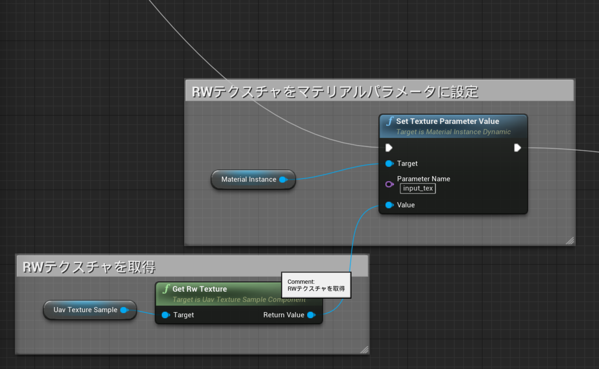
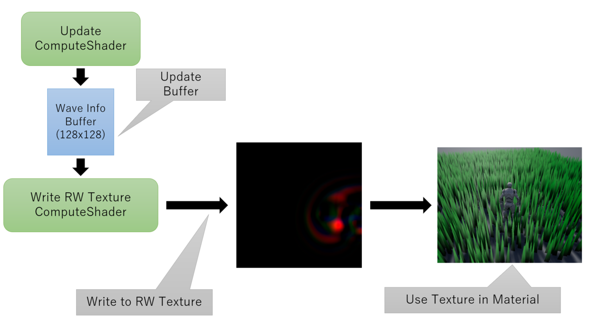

---
title: "UE4 ComputeShader Write, Material Read (GPGPU)"
date: "2020-03-20T06:00:00+09:00"
draft: false
url: "/entry/2020/03/20/060000/"
categories: ["C++", "ComputeShader", "UE4", "UnrealC++", "シェーダ", "マテリアル", "GlobalShader", "Compute Shader", "GPGPU"]
hatena_author: "nagakagachi"
hatena_original_url: "https://nagakagachi.hatenablog.com/entry/2020/03/20/060000"
hatena_basename: "2020/03/20/060000"
math: false
image: "images/5c8a60351bcfe3ae030428d71a6de4334197e4b9e769ba08a822cd496fd85d1e.png"
---

エンジンバージョン:4.24 (4.25がリリースされたら対応予定)

<ul class="table-of-contents">
<li><a href="#はじめに">はじめに</a></li>
<li><a href="#サンプルコード">サンプルコード</a></li>
<li><a href="#説明">説明</a><ul>
<li><a href="#RWテクスチャ定義">RWテクスチャ定義</a></li>
<li><a href="#RWテクスチャのUAV生成">RWテクスチャのUAV生成</a></li>
<li><a href="#ComputeShaderによるRWテクスチャへの書き込み">ComputeShaderによるRWテクスチャへの書き込み</a></li>
<li><a href="#RWテクスチャのマテリアルでの利用">RWテクスチャのマテリアルでの利用</a></li>
</ul>
</li>
<li><a href="#サンプルコードの概要">サンプルコードの概要</a></li>
</ul>
ComputeShaderで計算した結果を、RWテクスチャを利用してダイレクトにマテリアルで利用する。↓はサンプルコードの実行の様子。<blockquote data-conversation="none" class="twitter-tweet" data-lang="ja">
ﾜｻﾜｻﾜｻ  記事用のサンプルはもうこれでいいか（妥協<a href="https://twitter.com/hashtag/UE4Study?src=hash&amp;ref_src=twsrc%5Etfw">#UE4Study</a> <a href="https://t.co/qCDI2oPJHr">pic.twitter.com/qCDI2oPJHr</a>
&mdash; なが (@nagakagachi) <a href="https://twitter.com/nagakagachi/status/1240520264221224960?ref_src=twsrc%5Etfw">2020年3月19日</a></blockquote>  

    

<h3 id="はじめに">はじめに</h3>

<a href="https://nagakagachi.hatenablog.com/entry/2019/09/22/222604">&#x524D;&#x56DE;&#x306E;&#x8A18;&#x4E8B;</a>ではComputeShaderでメッシュ情報を直接生成する方法を紹介した。前回記事の手法では頂点カラー等を利用することでComputeShaderからマテリアルへ追加情報を渡すことができる。しかし頂点データの一部を間借りすることから渡せる情報に制限がある。 
当記事ではComputeShaderが書き込みをしたRWテクスチャをそのままマテリアルで利用することで頂点データ利用に比べてより自由に情報を受け渡す方法を検証してうまくいったので公開。そもそもこんな面倒なことしなくても可能な方法があるかもしれないので注意。 
(GlobalShader利用, エンジン改造無し)

    

<h3 id="サンプルコード">サンプルコード</h3>

uprojectファイルを右クリック→Generate <a class="keyword" href="http://d.hatena.ne.jp/keyword/Visual%20Studio">Visual Studio</a> project files でプロジェクトコード生成. 
<iframe src="https://hatenablog-parts.com/embed?url=https%3A%2F%2Fgithub.com%2Fnagakagachi%2Fue4%2Fblob%2Fmaster%2Fproject%2Fsample%2FUavTextureSample.zip" title="nagakagachi/ue4" class="embed-card embed-webcard" scrolling="no" frameborder="0" style="display: block; width: 100%; height: 155px; max-width: 500px; margin: 10px 0px;"></iframe><cite class="hatena-citation"><a href="https://github.com/nagakagachi/ue4/blob/master/project/sample/UavTextureSample.zip">github.com</a></cite>

    

<h3 id="説明">説明</h3>

    

    

<h4 id="RWテクスチャ定義">RWテクスチャ定義</h4>

マテリアルで利用可能且つComputeShaderで書き込みが可能なUAVリソースとしてのテクスチャが必要であるため、UTextureRenderTarget2Dを継承したRWテクスチャを定義する。 
bCanCreateUAVにtrueを指定することでリソース自体がUAV利用可能な設定で作成される。ただしこの設定だけではUAVが作成されないため(メンバ変数uav_)、RWテクスチャとして利用するComputeShader処理側で必要なときに生成する(後述)。 
また、UAVの破棄はRenderThreadで処理する必要があるのでデスト<a class="keyword" href="http://d.hatena.ne.jp/keyword/%A5%E9%A5%AF">ラク</a>タでRenderThreadのコマンドとして発行している。

<pre class="code lang-cpp" data-lang="cpp" data-unlink>// UavTextureSampleComponent.h
UCLASS(BlueprintType)
class UNglRWTextureRenderTarget2D : public UTextureRenderTarget2D
{
	GENERATED_UCLASS_BODY()

public:
	virtual ~UNglRWTextureRenderTarget2D();

	FUnorderedAccessViewRHIRef uav_;
};
</pre><pre class="code lang-cpp" data-lang="cpp" data-unlink>// UavTextureSampleComponent.cpp
UNglRWTextureRenderTarget2D::UNglRWTextureRenderTarget2D(const FObjectInitializer&amp; ObjectInitializer)
	: Super(ObjectInitializer)
{
	bNeedsTwoCopies = false;
	// リソース生成時にUAV利用可能な設定で作成することを指示
	bCanCreateUAV = true;
}

UNglRWTextureRenderTarget2D::~UNglRWTextureRenderTarget2D()
{
	if (uav_.IsValid())
	{
		// UAVの破棄
		// 破棄は描画スレッドで実行する必要があるのでコマンドをキューに積む.
		auto rhi_resource = uav_;
		ENQUEUE_RENDER_COMMAND(UpdateResourceImmediate)(
			[rhi_resource](FRHICommandListImmediate&amp; RHICmdList)
		{
			rhi_resource-&gt;Release();
		}
		);
	}
}
</pre>

    

<h4 id="RWテクスチャのUAV生成">RWテクスチャのUAV生成</h4>

    

本来ならUTextureRenderTarget2Dの初期化フローの中で生成するのが理想だが、今回はUAV利用する側が生成することにした。

<pre class="code lang-cpp" data-lang="cpp" data-unlink>// UavTextureSampleComponent.cpp 252行目
if (!rw_tex-&gt;uav_.IsValid())
{
	rw_tex-&gt;uav_ = RHICreateUnorderedAccessView(rw_tex-&gt;Resource-&gt;TextureRHI);
}
</pre>

    

<h4 id="ComputeShaderによるRWテクスチャへの書き込み">ComputeShaderによるRWテクスチャへの書き込み</h4>

    

生成したUAVはComputeShaderパラメータに設定することで利用可能。

<pre class="code lang-cpp" data-lang="cpp" data-unlink>// UavTextureSampleComponent.cpp 271行目
SetUAVParameter(RHICmdList, rhi_cs, cs-&gt;rw_tex, rw_tex-&gt;uav_);
</pre>

    

<h4 id="RWテクスチャのマテリアルでの利用">RWテクスチャのマテリアルでの利用</h4>

UNglRWTextureRenderTarget2Dは通常のUTextureオブジェクトと同様にマテリアルパラメータに設定可能。これでComputeShaderで書き込みをしたRWテクスチャをそのままマテリアルで利用できる。 
 

    

<h3 id="サンプルコードの概要">サンプルコードの概要</h3>

サンプルではComputeShaderで簡易な波の計算をして128x128のRWテクスチャに書き込み、マテリアルでその情報を利用して多数配置した<a class="keyword" href="http://d.hatena.ne.jp/keyword/%BB%B0%B3%D1%BF%ED">三角錐</a>メッシュを揺らしている。サンプルではComputeShaderは2つあり、一つは波の計算をして構造化バッファを更新するもの、もう一つは構造化バッファをもとにRWテクスチャへマテリアルで利用する情報を書き込むもの。マテリアルではRWテクスチャの値を読み取って頂点を動かしている。

テクスチャから取得した波の高さの可視化 
<iframe allowfullscreen="" src="//www.youtube.com/embed/oAcQ1q_k4lg" width="560" height="315" frameborder="0"></iframe> <a href="https://youtube.com/watch?v=oAcQ1q_k4lg">ComputeShaderとMaterial連携サンプル動画1</a>

テクスチャから取得した波の高さの勾配ベクトルの可視化 
<iframe allowfullscreen="" src="//www.youtube.com/embed/6Tv_hKbSfIQ" width="560" height="315" frameborder="0"></iframe> <a href="https://youtube.com/watch?v=6Tv_hKbSfIQ">ComputeShaderとMaterial連携サンプル動画2</a>

テクスチャから取得した波の高さと勾配ベクトルを利用して頂点オフセットで揺れ表現をした様子 
<iframe allowfullscreen="" src="//www.youtube.com/embed/OokNP6NVi4s" width="560" height="315" frameborder="0"></iframe> <a href="https://youtube.com/watch?v=OokNP6NVi4s">ComputeShaderとMaterial連携サンプル動画0</a>
 

手記はここで途切れている

---

[元のはてなブログ記事](https://nagakagachi.hatenablog.com/entry/2020/03/20/060000)
