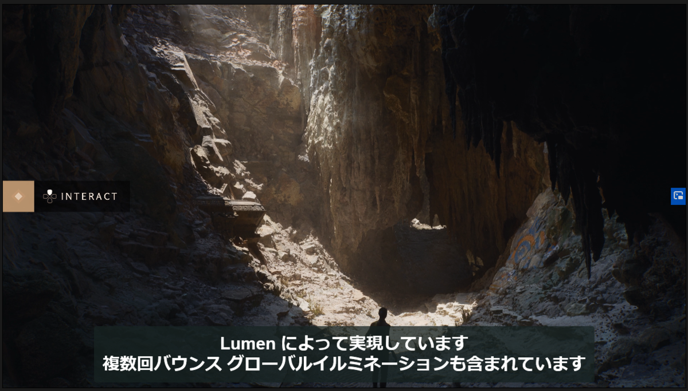
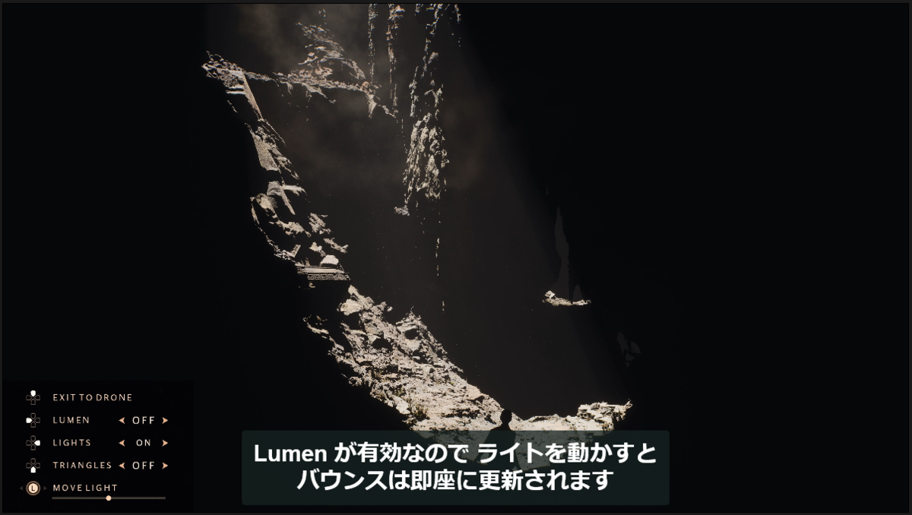
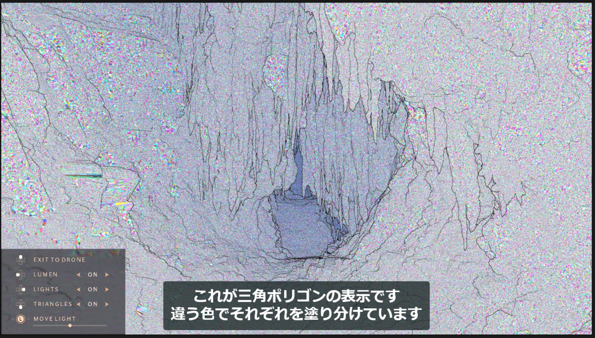
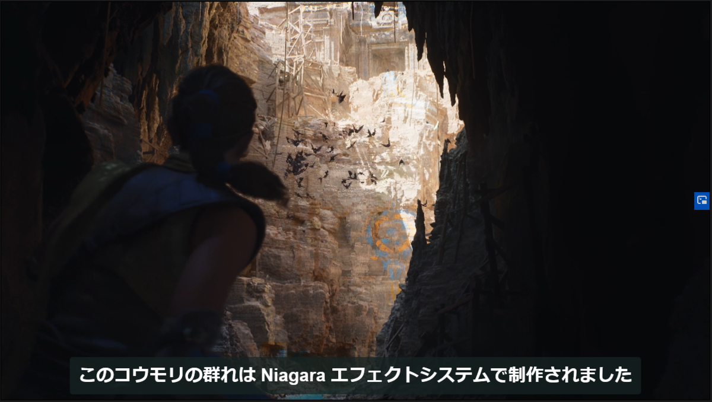
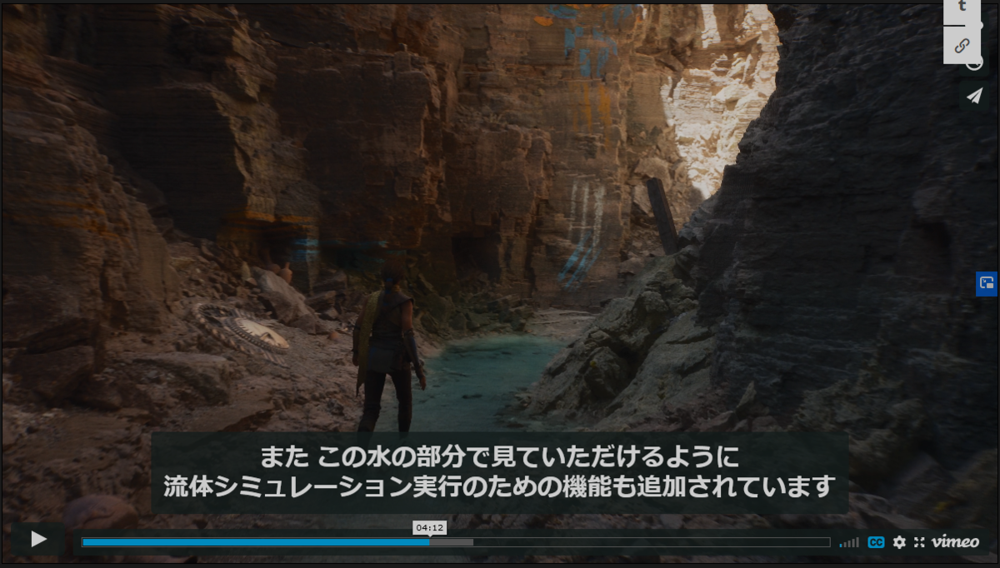
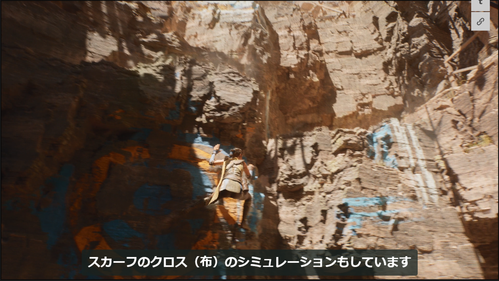
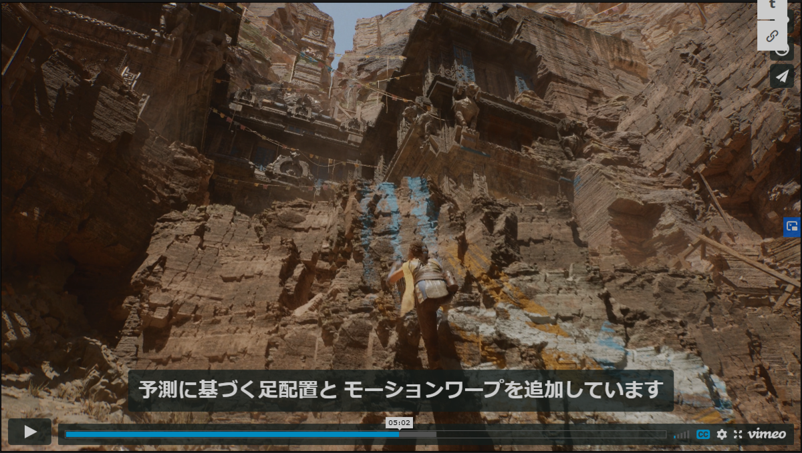
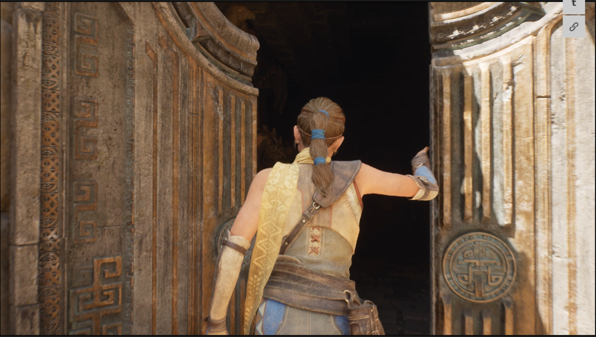
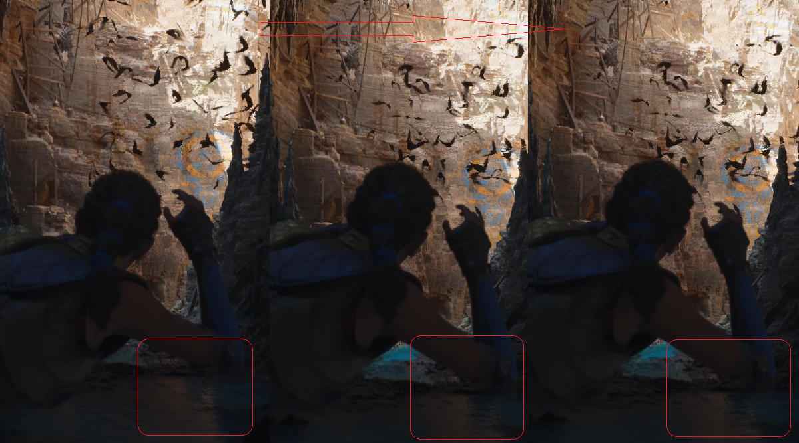
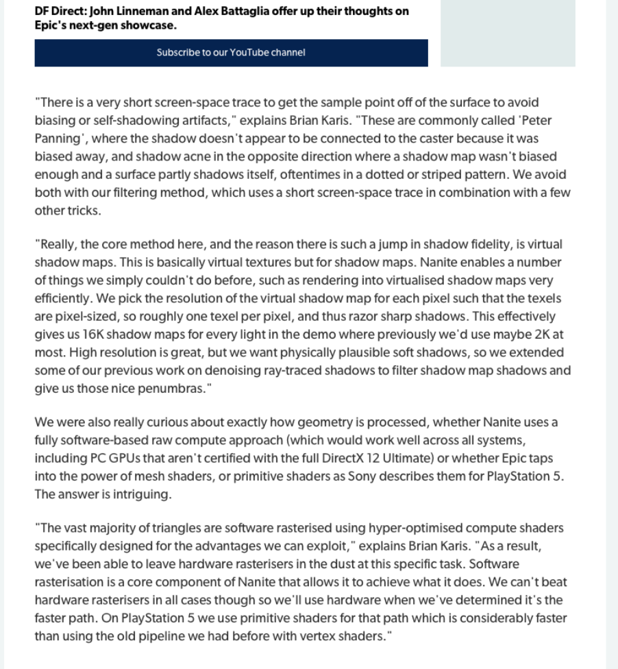

---
title: "UE5の発表についてのメモ"
date: "2020-05-14T12:00:00+09:00"
draft: false
url: "/entry/2020/05/14/120000/"
categories: ["UE5", "Graphics", "UE4"]
hatena_author: "nagakagachi"
hatena_original_url: "https://nagakagachi.hatenablog.com/entry/2020/05/14/120000"
hatena_basename: "2020/05/14/120000"
math: false
image: "images/680ed60850f8b2a6024cd37b26e36b24381350ceb4d4f9c9ee5dab290ed45f5f.png"
---

<s>In-house Engineでこれと戦わなきゃいけないってマジ？</s>

PlayStation5 上で動作している <a class="keyword" href="http://d.hatena.ne.jp/keyword/Unreal%20Engine">Unreal Engine</a> 5 のデモが発表されたので、この時点で感じたことなど覚えておくためにメモ。

目玉は動的GIシステムLumenと微細ジオメトリの<a class="keyword" href="http://d.hatena.ne.jp/keyword/%A5%EC%A5%F3%A5%C0%A5%EA%A5%F3%A5%B0">レンダリング</a>を実現するNanite。 
<iframe src="https://hatenablog-parts.com/embed?url=https%3A%2F%2Fwww.unrealengine.com%2Fja%2Fblog%2Fa-first-look-at-unreal-engine-5%3Flang%3Dja" title="Unreal Engine 5 初公開" class="embed-card embed-webcard" scrolling="no" frameborder="0" style="display: block; width: 100%; height: 155px; max-width: 500px; margin: 10px 0px;"></iframe><cite class="hatena-citation"><a href="https://www.unrealengine.com/ja/blog/a-first-look-at-unreal-engine-5?lang=ja">www.unrealengine.com</a></cite>

<ul class="table-of-contents">
<li><a href="#Lumen-動的GI">Lumen (動的GI)</a></li>
<li><a href="#Nanite-仮想化マイクロポリゴンジオメトリ">Nanite (仮想化マイクロポリゴンジオメトリ)</a></li>
<li><a href="#Niagara">Niagara</a></li>
<li><a href="#流体シミュレーション">流体シミュレーション</a></li>
<li><a href="#Chaos">Chaos</a></li>
<li><a href="#アニメーションシステム">アニメーションシステム</a></li>
<li><a href="#感想">感想</a></li>
</ul>

    

<h3 id="Lumen-動的GI">Lumen (動的GI)</h3>

動的なGlobal IlluminationシステムでDiffuse及びSpecular間接光を<a class="keyword" href="http://d.hatena.ne.jp/keyword/%A5%EC%A5%F3%A5%C0%A5%EA%A5%F3%A5%B0">レンダリング</a>する。 
動的なライトは最近のGIだと半分当然のようなところがあるが、動的なジオメトリはどこまでサポートされるのか気になる。 
レイトレハードウェアは使ってないらしいのでCompute Shaderによるものか、EnlightenのようにCPU側で非同期計算する方式なのか。<figure class="figure-image figure-image-fotolife" title="LumenによるGI有効"><figcaption>LumenによるGI有効</figcaption></figure><figure class="figure-image figure-image-fotolife" title="GI無し"><figcaption>GI無し</figcaption></figure>

    

<h3 id="Nanite-仮想化マイクロポリゴンジオメトリ">Nanite (仮想化マイクロポリゴンジオメトリ)</h3>

Texture-StreamingのようにジオメトリをStreamingし、<a class="keyword" href="http://d.hatena.ne.jp/keyword/%A5%D4%A5%AF%A5%BB%A5%EB">ピクセル</a>レベルのジオメトリ描画を可能にする。 
デモでは10億Triを超えるソースジオメトリを、Naniteが適切にコン<a class="keyword" href="http://d.hatena.ne.jp/keyword/%A5%C8%A5%ED%A1%BC%A5%EB">トロール</a>して2000万Triのジオメトリを描画しているらしい。<figure class="figure-image figure-image-fotolife" title="もはやノイズにしか見えないトライアングル群"><figcaption>もはやノイズにしか見えないトライアングル群</figcaption></figure>DCCツールでの特別な作業は不要で、<a class="keyword" href="http://d.hatena.ne.jp/keyword/ZBRush">ZBRush</a>などで作ったものをそのままインポート可能。 
いままでNormalMapで表現していたディ<a class="keyword" href="http://d.hatena.ne.jp/keyword/%A5%C6%A5%A3%A1%BC">ティー</a>ルをジオメトリによって直接表現する。 
LoDもNaniteがやってくれる。

<h3 id="Niagara"><a class="keyword" href="http://d.hatena.ne.jp/keyword/Niagara">Niagara</a></h3>

エフェクト以外にもコウモリや蟲の群れなどにも<a class="keyword" href="http://d.hatena.ne.jp/keyword/Niagara">Niagara</a>を利用している。 
パーティクル同士の通信や環境の知覚などもできるらしい。 
 

    

<h3 id="流体シミュレーション">流体シミュレーション</h3>

さらっと流されたけど流体シミュレーション。 
 

    

<h3 id="Chaos">Chaos</h3>

スカーフのClothシミュレーションや落石にはChaosを使用。 
 

    

<h3 id="アニメーションシステム">アニメーションシステム</h3>

複雑な環境に適応した動きのために手足の適切な位置を予測して動的に調整している。 

シームレスなコンテキストベースのアニメーションイベント(よくわからない)。 
デモ中の扉に手を添える動きに使われているとのこと。 

 

    

<h3 id="感想">感想</h3>

NormalMapレベルの凹凸をジオメトリで表現してしまえというEpicの解答。Nanite向けのデータを作るためにワークフローが大きく変わりそう。 
現代のリアルタイム<a class="keyword" href="http://d.hatena.ne.jp/keyword/%A5%EC%A5%F3%A5%C0%A5%EA%A5%F3%A5%B0">レンダリング</a>ではジオメトリよりも微細な凹凸を<b>NormalMap</b>、更に細かい法線分布のために<b>RoughnessMap</b>が使われているが、NormalMapが担っていた領域をジオメトリで表現できるようになるとそのあたりの役割も変わってくるのだろうか。 
RoughnessMapよりも更に細かいナノスケール表面構造を表現する<b>StructuralMap</b>が使われるようになって<b>構造色<a class="keyword" href="http://d.hatena.ne.jp/keyword/%A5%EC%A5%F3%A5%C0%A5%EA%A5%F3%A5%B0">レンダリング</a></b>されるようになったり？ 
<iframe src="https://hatenablog-parts.com/embed?url=https%3A%2F%2Fja.wikipedia.org%2Fwiki%2F%25E6%25A7%258B%25E9%2580%25A0%25E8%2589%25B2" title="構造色 - Wikipedia" class="embed-card embed-webcard" scrolling="no" frameborder="0" style="display: block; width: 100%; height: 155px; max-width: 500px; margin: 10px 0px;"></iframe><cite class="hatena-citation"><a href="https://ja.wikipedia.org/wiki/%E6%A7%8B%E9%80%A0%E8%89%B2">ja.wikipedia.org</a></cite>
 

あと大したことでは無いけれど気になったのが、3:50付近で右肘の下あたりの水面に一瞬 Screen Space処理っぽい動きが見えた点。肘の動きに合わせて水面のなにかが動いているように見えるけど、部分的に Screen Space Local Reflection をしていたりするのだろうか？(<b>そもそも気のせいかも</b>)<figure class="figure-image figure-image-fotolife" title="3:50付近"><figcaption>3:50付近</figcaption></figure>
 

こんな恐ろしいものが出てくる時代でこの<a class="keyword" href="http://d.hatena.ne.jp/keyword/%C0%E8%C0%B8%A4%AD%A4%CE%A4%B3%A4%EB">先生きのこる</a>ことができるのか。
 
 

5/15追記 
UE5デモの技術解説 
<iframe src="https://hatenablog-parts.com/embed?url=https%3A%2F%2Fwww.eurogamer.net%2Farticles%2Fdigitalfoundry-2020-unreal-engine-5-playstation-5-tech-demo-analysis" title="Inside Unreal Engine 5: how Epic delivers its generational leap" class="embed-card embed-webcard" scrolling="no" frameborder="0" style="display: block; width: 100%; height: 155px; max-width: 500px; margin: 10px 0px;"></iframe><cite class="hatena-citation"><a href="https://www.eurogamer.net/articles/digitalfoundry-2020-unreal-engine-5-playstation-5-tech-demo-analysis">www.eurogamer.net</a></cite>

一部が削除されたらしいので画像で残しておく 

---

[元のはてなブログ記事](https://nagakagachi.hatenablog.com/entry/2020/05/14/120000)
