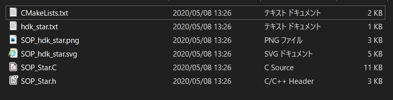
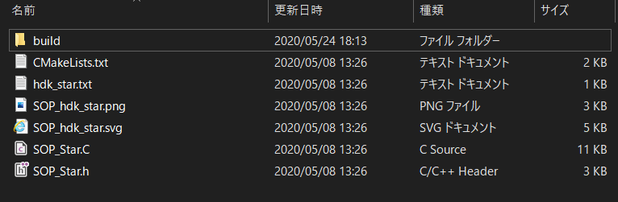
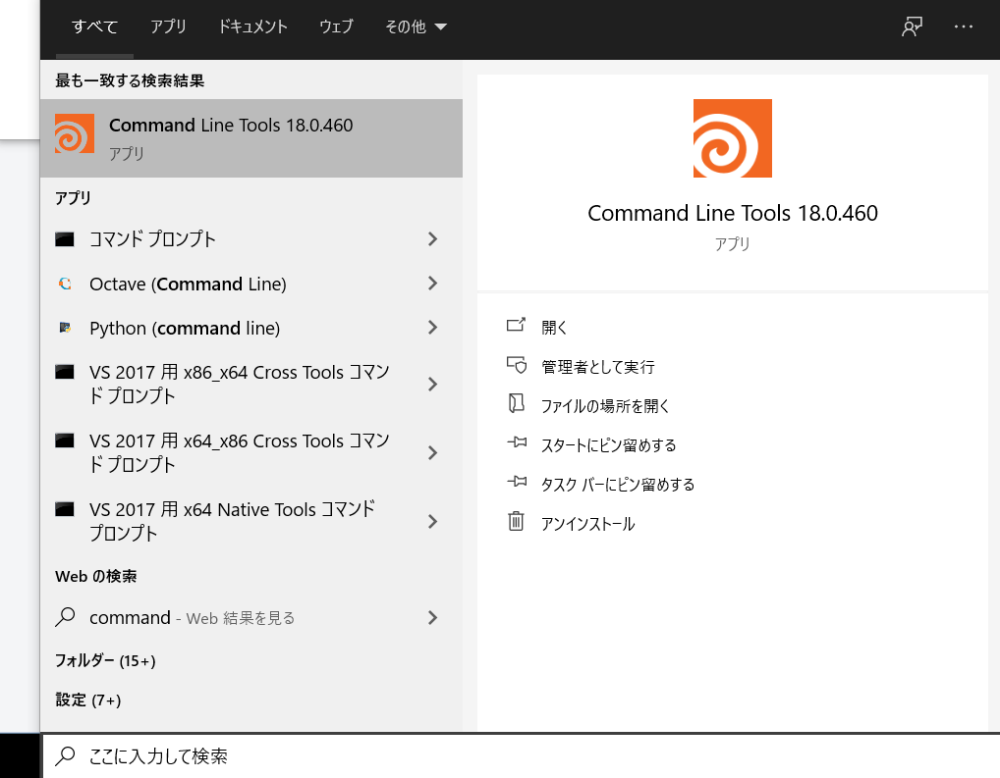
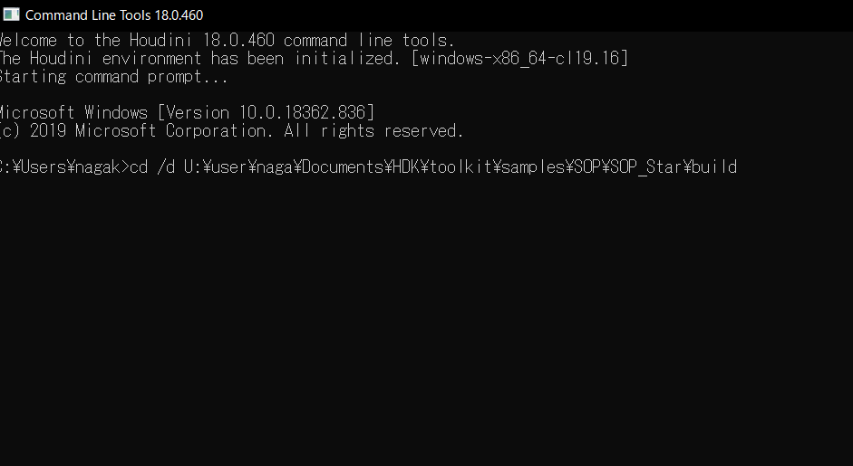
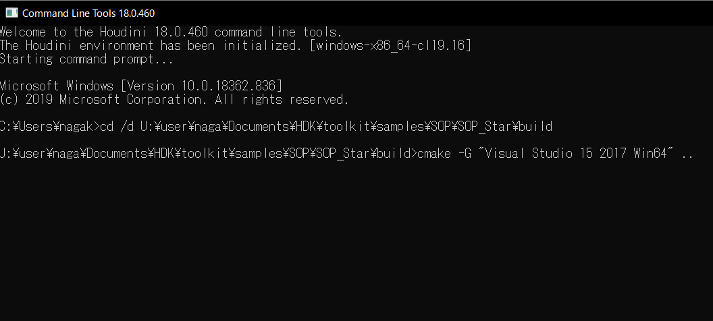
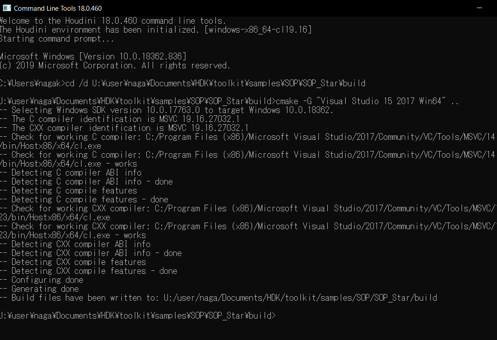
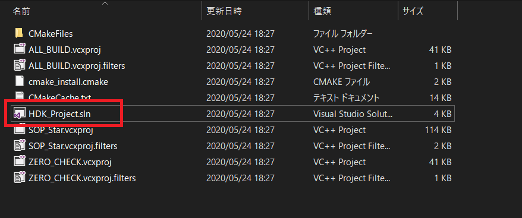
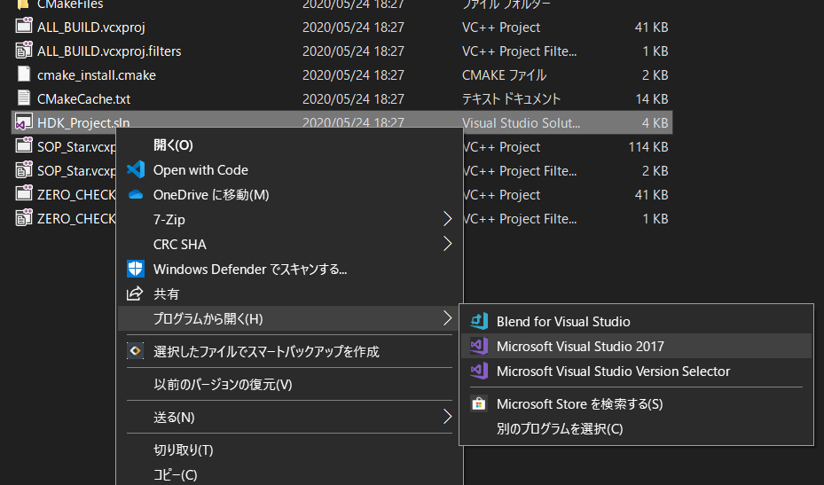

---
title: "Houdini HDK ビルドメモ (18.0.460)"
date: "2020-05-24T19:06:39+09:00"
draft: false
url: "/entry/2020/05/24/190639/"
categories: ["Houdini", "C++", "Visual Studio"]
hatena_author: "nagakagachi"
hatena_original_url: "https://nagakagachi.hatenablog.com/entry/2020/05/24/190639"
hatena_basename: "2020/05/24/190639"
math: false
---

HDK(<a class="keyword" href="http://d.hatena.ne.jp/keyword/C%2B%2B">C++</a>)のサンプルについてcmakeでVisualStudioプロジェクトを作成してビルドする機会があったのでメモ. 
<b>注意:ビルドが成功してdllが作成されるところまでの確認しかしていない(未実行).</b>
 

Houdini 18.0.460  
  
VisualStudio 2017  
  
対象のサンプルは SOP\_Star

    

### 事前準備

    

Houdiniインストール  
  
VisualStudioインストール  
  
cmake インストール

    

### サンプルコードを作業用にコピー

Houdiniインストール<a class="keyword" href="http://d.hatena.ne.jp/keyword/%A5%C7%A5%A3%A5%EC%A5%AF%A5%C8">ディレクト</a>リのtoolkit<a class="keyword" href="http://d.hatena.ne.jp/keyword/%A5%C7%A5%A3%A5%EC%A5%AF%A5%C8">ディレクト</a>リを丸ごと適当な<a class="keyword" href="http://d.hatena.ne.jp/keyword/%A5%C7%A5%A3%A5%EC%A5%AF%A5%C8">ディレクト</a>リにコピー(Documentsなど)

<u>コピー元</u> 
C:/Program Files/Side Effects Software/Houdini 18.0.460/toolkit

<u>コピー先</u> 
Documents等

以降はコピー先<a class="keyword" href="http://d.hatena.ne.jp/keyword/%A5%C7%A5%A3%A5%EC%A5%AF%A5%C8">ディレクト</a>リで作業する

<h3>対象のサンプル<a class="keyword" href="http://d.hatena.ne.jp/keyword/%A5%C7%A5%A3%A5%EC%A5%AF%A5%C8">ディレクト</a>リへ移動</h3>

初期だと以下のような状態のはず 
 

<h3>VisualStudioプロジェクト作成用<a class="keyword" href="http://d.hatena.ne.jp/keyword/%A5%C7%A5%A3%A5%EC%A5%AF%A5%C8">ディレクト</a>リ作成</h3>

cmakeで作成するプロジェクトファイル群を入れる<a class="keyword" href="http://d.hatena.ne.jp/keyword/%A5%C7%A5%A3%A5%EC%A5%AF%A5%C8">ディレクト</a>リを適当な名前で作成(ここではbuildという名前) 
 

    

### Houdini Command Line Tools 起動

Houdiniの<a class="keyword" href="http://d.hatena.ne.jp/keyword/%A5%B3%A5%DE%A5%F3%A5%C9%A5%E9%A5%A4%A5%F3">コマンドライン</a>ツールHoudini Command Line Tools(以降Command Line)を起動<figure class="figure-image figure-image-fotolife" title="Houdini Command Line Tools"><figcaption>Houdini Command Line Tools</figcaption></figure>

<h3>プロジェクト作成<a class="keyword" href="http://d.hatena.ne.jp/keyword/%A5%C7%A5%A3%A5%EC%A5%AF%A5%C8">ディレクト</a>リに移動(Command Line)</h3>

SOP_Star<a class="keyword" href="http://d.hatena.ne.jp/keyword/%A5%C7%A5%A3%A5%EC%A5%AF%A5%C8">ディレクト</a>リに作成したbuild<a class="keyword" href="http://d.hatena.ne.jp/keyword/%A5%C7%A5%A3%A5%EC%A5%AF%A5%C8">ディレクト</a>リに移動

cd /d "作業<a class="keyword" href="http://d.hatena.ne.jp/keyword/%A5%C7%A5%A3%A5%EC%A5%AF%A5%C8">ディレクト</a>リ"/toolkit/samples/SOP/SOP_Star/build 
 

    

### cmakeコマンドでVisualStudioプロジェクト作成(Command Line)

    

cmakeに -G オプションで作成したいVisualStudioプロジェクトのバージョンを指定して実行する  
  
cmake -help でマシンでサポートされているバージョン一覧が表示されるので参考に  
  
今回はVisualStudio2017の64bitビルドプロジェクトを作りたいので以下のように指定

cmake -G "<a class="keyword" href="http://d.hatena.ne.jp/keyword/Visual%20Studio">Visual Studio</a> 15 2017 <a class="keyword" href="http://d.hatena.ne.jp/keyword/Win64">Win64</a>" .. 

実行すると以下のようなログが流れる<figure class="figure-image figure-image-fotolife" title="cmake実行結果"><figcaption>cmake実行結果</figcaption></figure>

成功すると実行した<a class="keyword" href="http://d.hatena.ne.jp/keyword/%A5%C7%A5%A3%A5%EC%A5%AF%A5%C8">ディレクト</a>リ(ここではbuild)に以下のようにVisualStudioソリューションファイルが作成される 
 

    

### VisualStudioで開いてビルド

slnファイル(ここではHDK_Project.sln) をVisualStudio2017 で開いてビルドして完了 

VisualStudioがビルド後イベント等で  
  
/Documents/houdini18.0/dso/  
  
にdllなどをコピーしてくれる

あとはHoudiniを起動してobjタブでビルドしたSOP_Starを検索すれば可能なはず。 
しかし私の環境では出てこなかったので一旦ここまで…(Houdini <a class="keyword" href="http://d.hatena.ne.jp/keyword/Apprentice">Apprentice</a>だからかも)

以上

---

[元のはてなブログ記事](https://nagakagachi.hatenablog.com/entry/2020/05/24/190639)
