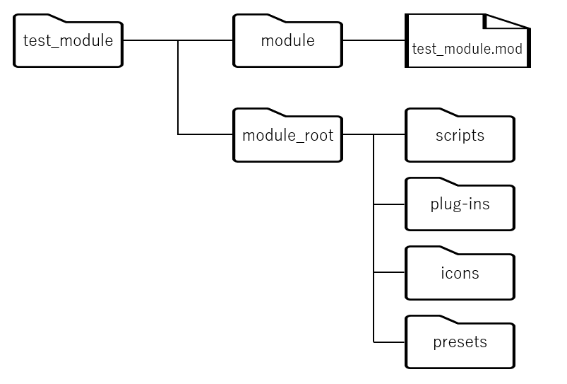

---
title: "Maya Moduleについて"
date: "2020-05-27T20:49:19+09:00"
draft: false
url: "/entry/2020/05/27/204919/"
categories: []
hatena_author: "nagakagachi"
hatena_original_url: "https://nagakagachi.hatenablog.com/entry/2020/05/27/204919"
hatena_basename: "2020/05/27/204919"
math: false
image: "images/77ab87c5ba517de40551b1a34fb757ec8493bc048e43d80ab785ced84c4e8656.png"
---

Mayaにおけるツールの配布形態の一つであるModuleについてのメモ。  
  
ツール群を機能やプロダクトでModuleに分けることで最小構成の切り出しなどをやりやすくしたいというハナシ。


<ul class="table-of-contents">
<li><a href="#Module定義ファイルmod">Module定義ファイル(.mod)</a><ul>
<li><a href="#記法">記法</a></li>
<li><a href="#設定例">設定例</a><ul>
<li><a href="#test_modulemod">test_module.mod</a></li>
<li><a href="#Moduleロード設定">Moduleロード設定</a></li>
</ul>
</li>
</ul>
</li>
<li><a href="#その他">その他</a></li>
</ul>
<div class="section">
    

<h3 id="Module定義ファイルmod">Module定義ファイル(.mod)</h3>


<p>Moduleの名前、バージョン、Moduleルート<a class="keyword" href="http://d.hatena.ne.jp/keyword/%A5%C7%A5%A3%A5%EC%A5%AF%A5%C8">ディレクト</a>リパスを記述する。<br />
Module毎にロードする条件(<a class="keyword" href="http://d.hatena.ne.jp/keyword/win64">win64</a>, <a class="keyword" href="http://d.hatena.ne.jp/keyword/linux">linux</a>等)を指定可能。<br />
上記のほかにその他<a class="keyword" href="http://d.hatena.ne.jp/keyword/%B4%C4%B6%AD%CA%D1%BF%F4">環境変数</a>の設定が可能。<br />
Maya起動時に MAYA_MODULE_PATH<a class="keyword" href="http://d.hatena.ne.jp/keyword/%B4%C4%B6%AD%CA%D1%BF%F4">環境変数</a> の<a class="keyword" href="http://d.hatena.ne.jp/keyword/%A5%C7%A5%A3%A5%EC%A5%AF%A5%C8">ディレクト</a>リが検索され、Moduleがロードされる。</p><p>Module定義ファイルの詳細<br />
<iframe src="https://hatenablog-parts.com/embed?url=https%3A%2F%2Fhelp.autodesk.com%2Fview%2FMAYAUL%2F2017%2FJPN%2F%3Fguid%3D__files_GUID_130A3F57_2A5D_4E56_B066_6B86F68EEA22_htm" title="Help" class="embed-card embed-webcard" scrolling="no" frameborder="0" style="display: block; width: 100%; height: 155px; max-width: 500px; margin: 10px 0px;"></iframe><cite class="hatena-citation"><a href="https://help.autodesk.com/view/MAYAUL/2017/JPN/?guid=__files_GUID_130A3F57_2A5D_4E56_B066_6B86F68EEA22_htm">help.autodesk.com</a></cite></p>


<div class="section">
    

<h4 id="記法">記法</h4>


    <pre class="code c++" data-lang="c++" data-unlink>+ MAYAVERSION:バージョン条件 PLATFORM:プラットフォーム条件 LOCALE:ロケール条件 Module名 バージョン番号 Moduleルートディレクトリパス
環境変数: 値
環境変数: 値
続く...</pre><p>条件は省略できる。<br />
<a class="keyword" href="http://d.hatena.ne.jp/keyword/%B4%C4%B6%AD%CA%D1%BF%F4">環境変数</a>記述は<b>空の行や無効な行があるとそれ以降は無視される模様</b>。<br />
scripts, icons, plug-ins, presets の4つの<a class="keyword" href="http://d.hatena.ne.jp/keyword/%B4%C4%B6%AD%CA%D1%BF%F4">環境変数</a>は、それぞれMAYA_SCRIPT_PATH 等の対応する<a class="keyword" href="http://d.hatena.ne.jp/keyword/%B4%C4%B6%AD%CA%D1%BF%F4">環境変数</a>にAppendされる。<br />
記述しなかった場合はそれぞれ<a class="keyword" href="http://d.hatena.ne.jp/keyword/%C1%EA%C2%D0%A5%D1%A5%B9">相対パス</a>で ./scripts 等がデフォルト設定される。<br />
<a class="keyword" href="http://d.hatena.ne.jp/keyword/%B4%C4%B6%AD%CA%D1%BF%F4">環境変数</a>にパスを設定する際に<br />
[r] scripts: <a class="keyword" href="http://d.hatena.ne.jp/keyword/%A5%C7%A5%A3%A5%EC%A5%AF%A5%C8">ディレクト</a>リパス<br />
のように [r] キーワードをつけるとサブ<a class="keyword" href="http://d.hatena.ne.jp/keyword/%A5%C7%A5%A3%A5%EC%A5%AF%A5%C8">ディレクト</a>リを<a class="keyword" href="http://d.hatena.ne.jp/keyword/%BA%C6%B5%A2">再帰</a>的に走査する。<br />
デフォルトではサブ<a class="keyword" href="http://d.hatena.ne.jp/keyword/%A5%C7%A5%A3%A5%EC%A5%AF%A5%C8">ディレクト</a>リは無視される。</p>

</div>
<div class="section">
    

<h4 id="設定例">設定例</h4>


<p>ロード条件無しで、Moduleのscriptsに関してのみサブ<a class="keyword" href="http://d.hatena.ne.jp/keyword/%A5%C7%A5%A3%A5%EC%A5%AF%A5%C8">ディレクト</a>リを<a class="keyword" href="http://d.hatena.ne.jp/keyword/%BA%C6%B5%A2">再帰</a>的に走査する構成</p>
<figure class="figure-image figure-image-fotolife" title="フォルダ構成"><span itemscope itemtype="http://schema.org/Photograph"></span><figcaption>フォルダ構成</figcaption></figure>
<div class="section">
    

<h5 id="test_modulemod">test_module.mod</h5>


    <pre class="code c++" data-lang="c++" data-unlink>+ test_module1.0.0 ../module_root
icons: ./icons
plug-ins: ./plug-ins
presets: ./presets
[r] scripts: ./scripts</pre>
</div>
<div class="section">
    

<h5 id="Moduleロード設定">Moduleロード設定</h5>


<p>規定のmodules<a class="keyword" href="http://d.hatena.ne.jp/keyword/%A5%C7%A5%A3%A5%EC%A5%AF%A5%C8">ディレクト</a>リにmodファイルを置くことでもロードされるが、Maya.envで上記modファイルのある<a class="keyword" href="http://d.hatena.ne.jp/keyword/%A5%C7%A5%A3%A5%EC%A5%AF%A5%C8">ディレクト</a>リをMAYA_MODULE_PATHに指定しても良い。</p>


```c++
MAYA_MODULE_PATH = test_module.modのディレクトリパス
```


</div>
</div>
</div>
<div class="section">
    

<h3 id="その他">その他</h3>


<p>以下のページでは起動時にModule下のuserSetup.pyをそれぞれ呼んでくれるとのことだが、公式情報がまだ見つからないので手元で検証が必要。<br />
Maya起動時に最初に見つかったuserSetup.pyしか呼ばれない場合は、複数ModuleがuserSetup.pyでそれぞれ個別のセットアップ処理をするということができないので別の方法を考える。<br />
<iframe src="https://hatenablog-parts.com/embed?url=http%3A%2F%2Fhesperas.blog134.fc2.com%2Fblog-entry-248.html" title="スクリプトやプラグインを配布できる環境を作ろう！ - SEN_Aのじゆうちょう" class="embed-card embed-webcard" scrolling="no" frameborder="0" style="display: block; width: 100%; height: 155px; max-width: 500px; margin: 10px 0px;"></iframe><cite class="hatena-citation"><a href="http://hesperas.blog134.fc2.com/blog-entry-248.html">hesperas.blog134.fc2.com</a></cite></p>

</div>

---

[元のはてなブログ記事](https://nagakagachi.hatenablog.com/entry/2020/05/27/204919)
