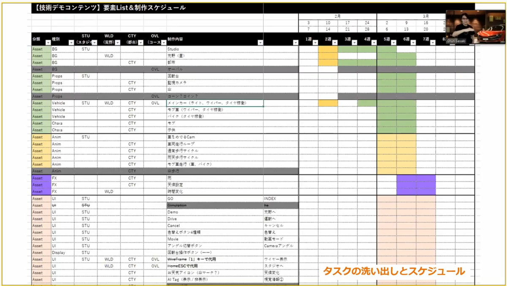
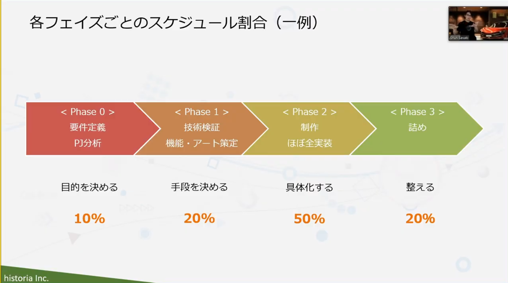
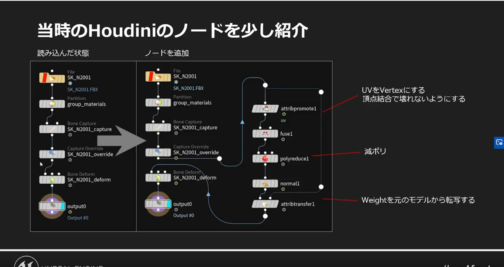

---
title: "UNREAL FEST EXTREME 2020 SUMMERメモ"
date: "2020-07-18T18:09:17+09:00"
draft: false
url: "/entry/2020/07/18/180917/"
categories: []
hatena_author: "nagakagachi"
hatena_original_url: "https://nagakagachi.hatenablog.com/entry/2020/07/18/180917"
hatena_basename: "2020/07/18/180917"
math: false
image: "images/70c75d76db583415243cc788fdd1664c7c1d35a94f9e82195e3fab316f3378be.png"
---

メモです

<ul class="table-of-contents">
<li><a href="#猫でもわかるControl-Rig---UE425版--">猫でもわかるControl Rig - UE4.25版 -</a><ul>
<li><a href="#いままでのアニメーションワークフローでは">いままでのアニメーションワークフローでは</a></li>
<li><a href="#Control-RIgなら">Control RIgなら</a></li>
<li><a href="#AnimationBPとちがうの">AnimationBPとちがうの？</a></li>
<li><a href="#使い方">使い方</a><ul>
<li><a href="#アセット作成">アセット作成</a></li>
</ul>
</li>
</ul>
</li>
<li><a href="#Epic-Online-Services-でできること">Epic Online Services でできること</a></li>
<li><a href="#全部知ってたらTwinmotionマスターTwinmotionのぷちTipsテクニック">全部知ってたらTwinmotionマスター！TwinmotionのぷちTips・テクニック</a><ul>
<li><a href="#Twinmotionとは">Twinmotionとは</a></li>
<li><a href="#user-library">user library</a></li>
<li><a href="#ライト強度の手入力">ライト強度の手入力</a></li>
<li><a href="#Auto-Save">Auto Save</a></li>
<li><a href="#Grass-Fading">Grass Fading</a></li>
<li><a href="#空の追加">空の追加</a></li>
<li><a href="#Reflection-Probes">Reflection Probes</a></li>
<li><a href="#Reflection-Volume-Resolution">Reflection Volume Resolution</a></li>
<li><a href="#Custom-PathとParticle">Custom PathとParticle</a></li>
<li><a href="#Angle-Snap">Angle Snap</a></li>
<li><a href="#viewsのレンダリング">viewsのレンダリング</a></li>
<li><a href="#花の咲く植物">花の咲く植物</a></li>
<li><a href="#見えない壁">見えない壁</a></li>
<li><a href="#Bookmark">Bookmark</a></li>
<li><a href="#オブジェクト出現アニメーション">オブジェクト出現アニメーション</a></li>
<li><a href="#shadowの設定">shadowの設定</a></li>
<li><a href="#viewportで操作">viewportで操作</a></li>
<li><a href="#carガチャリセマラ">carガチャ(リセマラ)</a></li>
<li><a href="#オリジナルデカール">オリジナルデカール</a></li>
<li><a href="#presenter昨日をpadで">presenter昨日をpadで</a></li>
</ul>
</li>
<li><a href="#UE4エンタープライズコンテンツを制作する際のワークフロー-Cutting-Edge-Test-Driveを題材に">UE4エンタープライズコンテンツを制作する際のワークフロー ～Cutting-Edge Test Driveを題材に～</a><ul>
<li><a href="#用語">用語</a></li>
<li><a href="#UE4の利用用途">UE4の利用用途</a></li>
<li><a href="#エンタープライズ案件ざっくり分類">エンタープライズ案件ざっくり分類</a><ul>
<li><a href="#インタラクティブコンテンツ系">インタラクティブコンテンツ系</a></li>
<li><a href="#静的映像系">静的映像系</a></li>
<li><a href="#シミュレーション系">シミュレーション系</a></li>
</ul>
</li>
<li><a href="#案件タイプ">案件タイプ</a></li>
<li><a href="#非ゲーム案件の難しさ">非ゲーム案件の難しさ</a></li>
<li><a href="#制作フロー">制作フロー</a><ul>
<li><a href="#要件定義フェイズ">要件定義フェイズ</a></li>
<li><a href="#技術検証フェイズ">技術検証フェイズ</a></li>
<li><a href="#制作フェイズ">制作フェイズ</a></li>
<li><a href="#詰め">詰め</a></li>
</ul>
</li>
<li><a href="#案件タイプによる特徴">案件タイプによる特徴</a><ul>
<li><a href="#インタラクティブコンテンツ">インタラクティブコンテンツ</a></li>
<li><a href="#映像系">映像系</a></li>
<li><a href="#シミュレーション系-1">シミュレーション系</a></li>
</ul>
</li>
<li><a href="#これからUE4を始める方へ">これからUE4を始める方へ</a></li>
<li><a href="#質疑">質疑</a></li>
</ul>
</li>
<li><a href="#Bloodstainedで世界のバッカーの期待に応えたUE4事例紹介">Bloodstainedで世界のバッカーの期待に応えたUE4事例紹介</a><ul>
<li><a href="#ユーザー参加">ユーザー参加</a></li>
<li><a href="#どんな期待に答えたのか">どんな期待に答えたのか</a></li>
<li><a href="#60fpsのためにしたこと">60fpsのためにしたこと</a><ul>
<li><a href="#規約">規約</a></li>
<li><a href="#本当はやりたかった負荷削減">本当はやりたかった負荷削減</a></li>
</ul>
</li>
<li><a href="#途中経過を報告しつつ1600個の画面を輪繰内品質に">途中経過を報告しつつ1600個の画面を輪繰内品質に</a><ul>
<li><a href="#納得の行く当たり判定低画角にする">納得の行く当たり判定　低画角にする</a></li>
<li><a href="#途中経過を報告する中で改善">途中経過を報告する中で改善</a></li>
</ul>
</li>
</ul>
</li>
<li><a href="#Unreal-Engine-4-で広大な世界を構築する際にひそむ罠">Unreal Engine 4 で広大な世界を構築する際にひそむ罠</a><ul>
<li><a href="#共通アセットを探し出す">共通アセットを探し出す</a></li>
</ul>
</li>
</ul>

<h3 id="猫でもわかるControl-Rig---UE425版--">猫でもわかるControl Rig - <a class="keyword" href="http://d.hatena.ne.jp/keyword/UE4">UE4</a>.25版 -</h3>

<a class="keyword" href="http://d.hatena.ne.jp/keyword/%A5%B9%A5%AF%A5%EA%A5%D7%A5%C8">スクリプト</a>可能なリギングシステム

    

<h4 id="いままでのアニメーションワークフローでは">いままでのアニメーションワークフローでは</h4>

DCCツールでモーション作って　FBX出して　<a class="keyword" href="http://d.hatena.ne.jp/keyword/UE4">UE4</a>で読んで確認 
<a class="keyword" href="http://d.hatena.ne.jp/keyword/%A5%A4%A5%C6%A5%EC%A1%BC%A5%B7%A5%E7%A5%F3">イテレーション</a>に問題がある 
更に外部の<a class="keyword" href="http://d.hatena.ne.jp/keyword/%A5%E2%A1%BC%A5%B7%A5%E7%A5%F3%A5%AD%A5%E3%A5%D7%A5%C1%A5%E3%A1%BC">モーションキャプチャー</a>ツールなどとの連携が増えると更に難しくなる　 
つらみ

    

<h4 id="Control-RIgなら">Control RIgなら</h4>

<a class="keyword" href="http://d.hatena.ne.jp/keyword/UE4">UE4</a>上で編集調整できてしまう 
一から作ることも、微調整も可能 
<a class="keyword" href="http://d.hatena.ne.jp/keyword/C%2B%2B">C++</a>で独自のノードで機能追加もできる

    

<h4 id="AnimationBPとちがうの">AnimationBPとちがうの？</h4>

    

AnimBPに比べてバーチャルマシンがすごく軽いメリットが有る

    

<h4 id="使い方">使い方</h4>

    

Rig Graphでリグとキャラの関連付け  
  
Rig Hierarchy で階層構造  
  
Control RigはSkeltalアセットに依存していない骨の名前と階層が同じなら流用可能

    

<h5 id="アセット作成">アセット作成</h5>

Control Rig<a class="keyword" href="http://d.hatena.ne.jp/keyword/%A5%D7%A5%E9%A5%B0%A5%A4%A5%F3">プラグイン</a>を有効化 
右クリックメニューから新規作成 
ControlとSpaceを積んでいく 
ControlはViewport上で触って動かすモノ 
SpaceはControlの座標系制御のオブジェクト 
動かした結果をノードによってボーンに反映させる 
BeginExecuteでControlの位置などをボーンにセットする

ちょっとだけわかった(Sequencer版)<blockquote data-conversation="none" class="twitter-tweet" data-lang="ja">
<a class="keyword" href="http://d.hatena.ne.jp/keyword/%C5%DA%B6%F6">土偶</a>でもわかるControl Rig - <a class="keyword" href="http://d.hatena.ne.jp/keyword/UE4">UE4</a>.25版 -  ワイはネコ様以下や…  <a href="https://twitter.com/hashtag/ue4fest?src=hash&amp;ref_src=twsrc%5Etfw">#ue4fest</a> <a href="https://t.co/Dw9rocn1VB">pic.twitter.com/Dw9rocn1VB</a>
&mdash; なが (@nagakagachi) <a href="https://twitter.com/nagakagachi/status/1284353917585784832?ref_src=twsrc%5Etfw">2020年7月18日</a></blockquote>   
 
 

    

<h3 id="Epic-Online-Services-でできること">Epic Online Services でできること</h3>

EOSでなにができるのか 
<a class="keyword" href="http://d.hatena.ne.jp/keyword/C%2B%2B">C++</a>、<a class="keyword" href="http://d.hatena.ne.jp/keyword/C%23">C#</a>、<a class="keyword" href="http://d.hatena.ne.jp/keyword/IOS">IOS</a>用<a class="keyword" href="http://d.hatena.ne.jp/keyword/SDK">SDK</a>をサポート 
EOSSDKは現在UEとの特別な連携はなく、ほかのエンジンからの利用と同様に<a class="keyword" href="http://d.hatena.ne.jp/keyword/SDK">SDK</a>を利用する 
 

    

<h3 id="全部知ってたらTwinmotionマスターTwinmotionのぷちTipsテクニック">全部知ってたらTwinmotionマスター！TwinmotionのぷちTips・テクニック</h3>

    

    

<h4 id="Twinmotionとは">Twinmotionとは</h4>

<a class="keyword" href="http://d.hatena.ne.jp/keyword/UE4">UE4</a>ベースにした建築建設都市計画造園のリアルタイムビジュアライゼーションソフト 
いろいろなDCCツールで作られたデータをインポートして少ない工程で利用できる

    

<h4 id="user-library">user library</h4>

    

自分のアセットを登録して様々なプロジェクトで利用しやすくする仕組み

    

<h4 id="ライト強度の手入力">ライト強度の手入力</h4>

    

普通はスライダで調整するところを数値直接入力もできる

    

<h4 id="Auto-Save">Auto Save</h4>

    

一定時間で自動保存等が設定できる

    

<h4 id="Grass-Fading">Grass Fading</h4>

    

芝の表示距離の調整(LOD等)

    

<h4 id="空の追加">空の追加</h4>

    

パノラマ画像で空を設定できる  
  
UV展開されたドームオブジェクトが公式にあるので使うと楽(tmiファイル(user libraryデータ)で公開されている)

    

<h4 id="Reflection-Probes">Reflection Probes</h4>

<a class="keyword" href="http://d.hatena.ne.jp/keyword/SSR">SSR</a>でカバーできない範囲のリフレクションをやりたい場合

    

<h4 id="Reflection-Volume-Resolution">Reflection Volume Resolution</h4>

    

鑑などの反射像の解像度を変更する(デフォルトは64x64くらい)

    

<h4 id="Custom-PathとParticle">Custom PathとParticle</h4>

    

パス上にフォグやパーティクルをおける

    

<h4 id="Angle-Snap">Angle Snap</h4>

    

角度のスナップ単位を設定できる

<h4 id="viewsのレンダリング">viewsの<a class="keyword" href="http://d.hatena.ne.jp/keyword/%A5%EC%A5%F3%A5%C0%A5%EA%A5%F3%A5%B0">レンダリング</a></h4>
    

平行投影viewなど  
  
ExposureやWhiteBallanceなども変更可能

    

<h4 id="花の咲く植物">花の咲く植物</h4>

    

季節ごとのルック切り替えできる

    

<h4 id="見えない壁">見えない壁</h4>

    

BlockingVolume  
  
納品時に作り込んでいない場所をブロックするとか

    

<h4 id="Bookmark">Bookmark</h4>

    

    

<h4 id="オブジェクト出現アニメーション">オブジェクト出現アニメーション</h4>

    

sections volumeでオブジェクトの可視な空間を制御できる(Volume内でにあるときは見えないとか)

    

<h4 id="shadowの設定">shadowの設定</h4>

    

描画距離とか色々

    

<h4 id="viewportで操作">viewportで操作</h4>

    

    

<h4 id="carガチャリセマラ">carガチャ(リセマラ)</h4>

    

ガチャ

<h4 id="オリジナルデカール">オリジナル<a class="keyword" href="http://d.hatena.ne.jp/keyword/%A5%C7%A5%AB%A1%BC%A5%EB">デカール</a></h4>

<a class="keyword" href="http://d.hatena.ne.jp/keyword/png">png</a>で透過付き<a class="keyword" href="http://d.hatena.ne.jp/keyword/%A5%C7%A5%AB%A1%BC%A5%EB">デカール</a>など 
mp4などの動画も使える

    

<h4 id="presenter昨日をpadで">presenter昨日をpadで</h4>

    

Bim motionモードではGamePad操作できる

<h3 id="UE4エンタープライズコンテンツを制作する際のワークフロー-Cutting-Edge-Test-Driveを題材に"><a class="keyword" href="http://d.hatena.ne.jp/keyword/UE4">UE4</a><a class="keyword" href="http://d.hatena.ne.jp/keyword/%A5%A8%A5%F3%A5%BF%A1%BC%A5%D7%A5%E9%A5%A4%A5%BA">エンタープライズ</a>コンテンツを制作する際のワークフロー ～Cutting-Edge <a class="keyword" href="http://d.hatena.ne.jp/keyword/Test%20Drive">Test Drive</a>を題材に～</h3>

<a class="keyword" href="http://d.hatena.ne.jp/keyword/%A5%A8%A5%F3%A5%BF%A1%BC%A5%D7%A5%E9%A5%A4%A5%BA">エンタープライズ</a>案件50件くらい 
これから<a class="keyword" href="http://d.hatena.ne.jp/keyword/UE4">UE4</a>を<a class="keyword" href="http://d.hatena.ne.jp/keyword/%A5%A8%A5%F3%A5%BF%A1%BC%A5%D7%A5%E9%A5%A4%A5%BA">エンタープライズ</a>で使いたい人 
開発とワークフローへの理解を深める 
当たり前のことを定義

    

<h4 id="用語">用語</h4>

<a class="keyword" href="http://d.hatena.ne.jp/keyword/%A5%A8%A5%F3%A5%BF%A1%BC%A5%D7%A5%E9%A5%A4%A5%BA">エンタープライズ</a>:非ゲーム領域 
CETD:<a class="keyword" href="http://d.hatena.ne.jp/keyword/%A5%A4%A5%F3%A5%BF%A5%E9%A5%AF%A5%C6%A5%A3%A5%D6">インタラクティブ</a>デモとして開発した Cutting-Edge <a class="keyword" href="http://d.hatena.ne.jp/keyword/Test%20Drive">Test Drive</a>の略 
アーティスト 
エンジニア 
開発フェイズ;段階

<h4 id="UE4の利用用途"><a class="keyword" href="http://d.hatena.ne.jp/keyword/UE4">UE4</a>の利用用途</h4>

ゲームから建築自動車輸送放送ライブテレビト<a class="keyword" href="http://d.hatena.ne.jp/keyword/%A5%EC%A1%BC%A5%CB%A5%F3">レーニン</a>グ&シミュレーション等

<h4 id="エンタープライズ案件ざっくり分類"><a class="keyword" href="http://d.hatena.ne.jp/keyword/%A5%A8%A5%F3%A5%BF%A1%BC%A5%D7%A5%E9%A5%A4%A5%BA">エンタープライズ</a>案件ざっくり分類</h4>
    

<h5 id="インタラクティブコンテンツ系"><a class="keyword" href="http://d.hatena.ne.jp/keyword/%A5%A4%A5%F3%A5%BF%A5%E9%A5%AF%A5%C6%A5%A3%A5%D6">インタラクティブ</a><a class="keyword" href="http://d.hatena.ne.jp/keyword/%A5%B3%A5%F3%A5%C6%A5%F3%A5%C4%B7%CF">コンテンツ系</a></h5>

バーチャルモデルルームや職業ト<a class="keyword" href="http://d.hatena.ne.jp/keyword/%A5%EC%A1%BC%A5%CB%A5%F3">レーニン</a>グ 
体験ベースのもの

    

<h5 id="静的映像系">静的映像系</h5>

    

建築映像やアニメ等

    

<h5 id="シミュレーション系">シミュレーション系</h5>

都市シミュレーションや自動運転、災害、AI教師データ生成等 
<a class="keyword" href="http://d.hatena.ne.jp/keyword/UE4">UE4</a>に求められているのはビジュアライズ部分

    

<h4 id="案件タイプ">案件タイプ</h4>

エンジニアは<a class="keyword" href="http://d.hatena.ne.jp/keyword/%A5%A4%A5%F3%A5%BF%A5%E9%A5%AF%A5%C6%A5%A3%A5%D6">インタラクティブ</a><a class="keyword" href="http://d.hatena.ne.jp/keyword/%A5%B3%A5%F3%A5%C6%A5%F3%A5%C4%B7%CF">コンテンツ系</a>とシミュレーション系が多い 
開発期間は3~6ヶ月くらいが多い 
開発人数は1~5人くらいが多い

    

<h4 id="非ゲーム案件の難しさ">非ゲーム案件の難しさ</h4>

    

要件定義が難しい　技術レベルと要望のすり合わせ  
  
特殊機材や外部ツール連携が多い  
  
制作側が該当業界への理解が薄い　業務フローや用語常識が違う  
  
発注側が開発の流れへの理解が薄い　UE制作フローにも

    

<h4 id="制作フロー">制作フロー</h4>

    

要件定義　技術検証（機能・アート策定）　制作（ほぼ全実装）　詰め

    

<h5 id="要件定義フェイズ">要件定義フェイズ</h5>

    

プロジェクトの目的共有  
  
物量の精査  
  
技術的懸念点の洗い出し（コレによる振り幅が大きい場合は開発計画を分割することも考える）  
  
アートのおぼろげな方向性を提示  
  
「経験が必要なフェイズ」

CETDの場合  
  
目的は自動車業界を中心にUEの活用例を示す  
  
やりたいことはMegascansを使い倒す  
  
製作期間は2ヶ月  
  
メインスタッフはアーティスト2エンジニア1 + 外部スタッフとしてUIとSE

    

<h5 id="技術検証フェイズ">技術検証フェイズ</h5>

    

機能策定　画面遷移  
  
アート策定　テイスト　クオリティライン  
  
技術検証　外部機器の検証も試しておく　後のリスクを減らす

どういう画面があってどこがどうつながっていてというのをまとめる  
  
カットリストを作る（映像系の考え方）　どういう画面でそれぞれ何をしたいのかどんなアセットが必要か

    

<h5 id="制作フェイズ">制作フェイズ</h5>

とにかく手を止めずに作る 
All-In　全実装を目指す 
処理負荷気にしておこう　3割程度の高速化はできるがそれ以上はつらすぎるので注意 
ストレージサイズも注意　CETDは2.9GBくらい 
スケジュール例 
 

    

<h5 id="詰め">詰め</h5>

    

クオリティブラッシュアップ  
  
最適化　  
  
CETDでは車の質感向上が重要だった  
  
見せるための便利機能の追加等(スキップ機能とか)  
  
粗を潰していく

CETDでは反射物を増やすため直接映らない天井を改良  
  
レイトレやりたかったが4.24の機能では難しかった

<figure class="figure-image figure-image-fotolife" title="各フェイズの割合"><figcaption>各フェイズの割合</figcaption></figure>

    

<h4 id="案件タイプによる特徴">案件タイプによる特徴</h4>

    

<h5 id="インタラクティブコンテンツ"><a class="keyword" href="http://d.hatena.ne.jp/keyword/%A5%A4%A5%F3%A5%BF%A5%E9%A5%AF%A5%C6%A5%A3%A5%D6">インタラクティブ</a>コンテンツ</h5>
    

とにかく早く動くプロトを作る

    

<h5 id="映像系">映像系</h5>

    

映像を作るパイプラインを構築　DCCツール等　詰めの段階に気合が必要

    

<h5 id="シミュレーション系-1">シミュレーション系</h5>

    

一部モジュールとしてのUEを意識する

<h4 id="これからUE4を始める方へ">これから<a class="keyword" href="http://d.hatena.ne.jp/keyword/UE4">UE4</a>を始める方へ</h4>

なれないうちはチーム連携より個人技 <a class="keyword" href="http://d.hatena.ne.jp/keyword/UE4">UE4</a>だいすき人間を一人つっこんでおく 
プロトタイプは強引でも早く作れるのでつくる

    

<h4 id="質疑">質疑</h4>

    

値段の付け方　初めてのお仕事は数百万でここまでやりましょうという契約  
  
業界ちがいによる予想外の問題が出てくる  
  
契約はフェイズ0とフェイズ1の間で確定が多いがフェイズ0で金額感も決めておくのが多い  
  
フェイズ0の技術検証で出てこなかった問題　外部機器などので機器の用意ができない場合なども多い  
  
ファイルサイズ10GBから2.9GBの削減は主にテクスチャを対象に減らしたのが大きかった  
  
CETDは倍の解像度で出してキャプチャしてた  
  
業界違いの話　建築案件では建材の質感や寸法へのこだわりがすごい　ちょっとした草や木の揺れで喜んでくれる　ツボがちがう

<h3 id="Bloodstainedで世界のバッカーの期待に応えたUE4事例紹介">Bloodstainedで世界のバッカーの期待に応えた<a class="keyword" href="http://d.hatena.ne.jp/keyword/UE4">UE4</a>事例紹介</h3>
    

ユーザー参加型のゲーム開発  
  
バッカーという個人支援者の要望も取り入れる

    

<h4 id="ユーザー参加">ユーザー参加</h4>

    

途中経過をバッカーに報告  
  
ユーザー考案の敵やアイテムなどを組み込み  
  
様々なストレッチゴールに対応　バッカー支援額の量によって変化する目標

    

<h4 id="どんな期待に答えたのか">どんな期待に答えたのか</h4>

    

描画は　60fps達成  
  
いろいろ

    

<h4 id="60fpsのためにしたこと">60fpsのためにしたこと</h4>

    

    

<h5 id="規約">規約</h5>

ルールを決めましょう 
画面ポリゴン数は30万　背景15万キャラ15万 
キャラ背景の奥はunlitにする　画面の30~40%はunlit 
規約づくりは実は失敗しながら<a class="keyword" href="http://d.hatena.ne.jp/keyword/%C5%A5%BB%C5%B9%E7">泥仕合</a>

画面の例教会エリア  
  
    背景キャラ合計18万くらい  
  
描画設定  
  
　ForwardRendering  
  
　OcclusionCulling  
  
　Bloom  
  
　FXAA  
  
　影の品質2  
  
計測結果  
  
　実機に近いPCで計測  
  
　実機で計測  
  
　実は半年ほど実機計測してなかった！さらに8倍強いPCで計測してた！

ポリゴン数削減（背景） 
　背景は標準LOD機能　装飾は<a class="keyword" href="http://d.hatena.ne.jp/keyword/%A5%E2%A5%C7%A5%EA%A5%F3%A5%B0">モデリング</a>じゃなくてテクスチャ？　OcclusionCulling大事 
　　LOD設定を Copy LOD でコピペできる！ 
　OcclusionCullingがとても有効だった 
非metalで光沢が出なかった 
　Forwardは<a class="keyword" href="http://d.hatena.ne.jp/keyword/SSR">SSR</a>で無いので反射光沢でにくい 
　StationalyLightがあたって無くてそもそもライトがあたってない 
　リフレクションキャプチャ（High Quality Reflection）をOFFにしてた

ポリゴン数削減（キャラ） 
　当時はUEでスケルタルメッシュリダクションできなかった 
　Houdiniでやる 
　　FBX→Houdiniでリダクション→<a class="keyword" href="http://d.hatena.ne.jp/keyword/UE4">UE4</a>

<figure class="figure-image figure-image-fotolife" title="Houdiniのノード"><figcaption>Houdiniのノード</figcaption></figure>
　　<a class="keyword" href="http://d.hatena.ne.jp/keyword/%A5%A2%A5%C8%A5%EA%A5%D3%A5%E5%A1%BC%A5%C8">アトリビュート</a>ペイントでリダクション具合をペイントできる

マテリアル最適化  
  
　テクスチャ減らす　シンプルに  
  
　HightQualityReflectionOFF  
  
　CustomizedUV利用  
  
　キャラはUnlit  
  
　　巨大なMaskedマテリアルで常時状態異常のための計算をしてて重い  
  
シャドウ  
  
　影用モデルのHoudiniで作成  
  
　DynamicShadow切る　ステージによっては背景全部OFFだったりする

    

<h5 id="本当はやりたかった負荷削減">本当はやりたかった負荷削減</h5>

    

負荷設計したかった　実機が必要  
  
EarlyZはいれましょう

    

<h4 id="途中経過を報告しつつ1600個の画面を輪繰内品質に">途中経過を報告しつつ1600個の画面を輪繰内品質に</h4>

    

    

<h5 id="納得の行く当たり判定低画角にする">納得の行く当たり判定　低画角にする</h5>

    

高画角だと足場がわかりにくいなど問題がある  
  
高画角だと画面の右端と左端でキャラの向きが違ってしまう  
  
低画角にすると背景の立体感がなくなってのっぺりしてしまう  
  
スケールで背景を歪めてしまった  
  
　ジオメトリが歪むのでライティングが壊れる

    

<h5 id="途中経過を報告する中で改善">途中経過を報告する中で改善</h5>

    

大変なことに  
  
手描きテクスチャのアーティスト個性が出すぎて雰囲気がちがいすぎて心配に  
  
手書きのBCテクスチャをやめてProcedual生成にした  
  
基本の建築アセットをHoudiniで作成して品質統一  
  
アセットのプロシージャルアセットを改善し続けて終盤に効果が発揮され始めた  
  
嘘ライトを削除してちゃんとランプとかにライトを置く  
  
Jenkinsさんでライトマップ自動ベイクやBPで大量のライト配置などの効率化

<h3 id="Unreal-Engine-4-で広大な世界を構築する際にひそむ罠"><a class="keyword" href="http://d.hatena.ne.jp/keyword/Unreal%20Engine">Unreal Engine</a> 4 で広大な世界を構築する際にひそむ罠</h3>
    

    

<h4 id="共通アセットを探し出す">共通アセットを探し出す</h4>

    

先読みして共通アセットがないか調査　かなりの量があって1/3のアセットが該当

 
 

\_\_\_\_\_\_\_\_\_\_\_\_ここでメモは途切れている\_\_\_\_\_\_\_\_\_\_\_\_  
  
.  
  
.  
  
.  
  
.

---

[元のはてなブログ記事](https://nagakagachi.hatenablog.com/entry/2020/07/18/180917)
