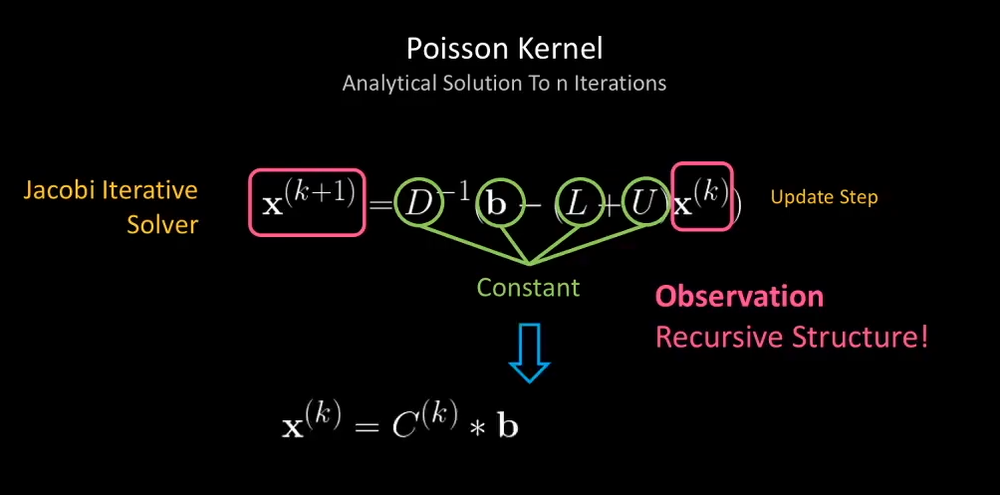
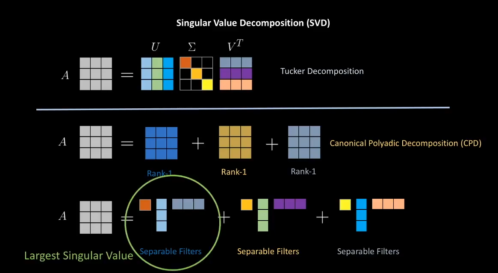
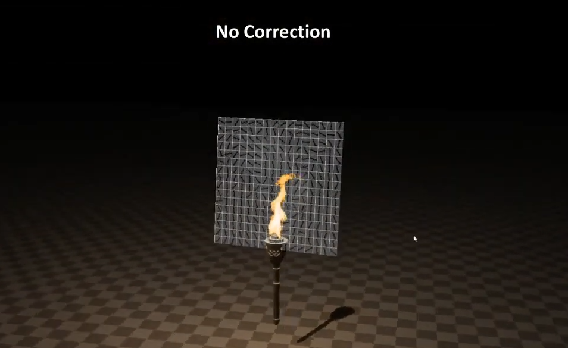
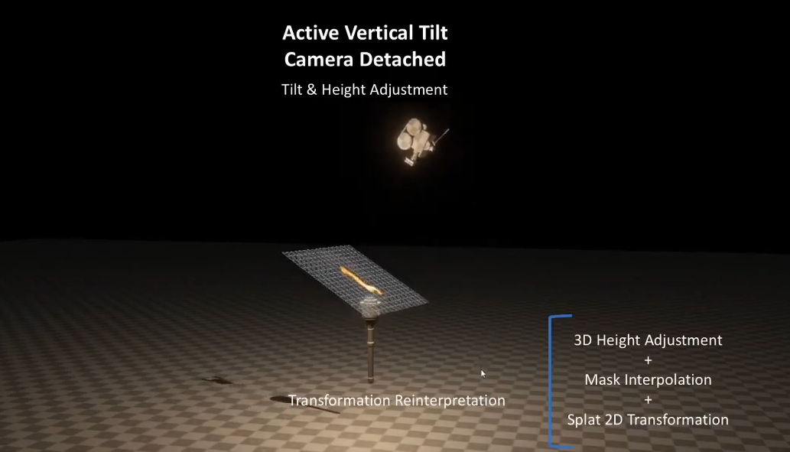
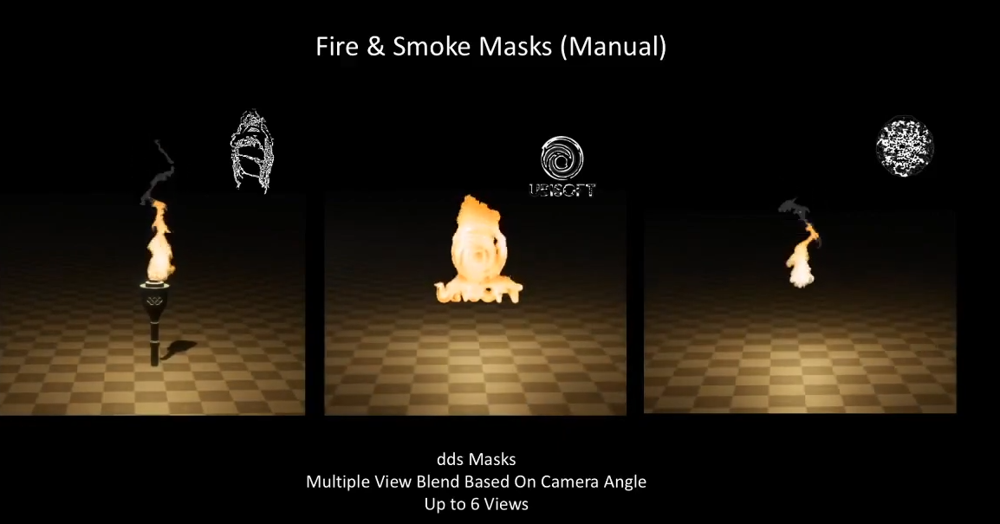

---
title: "論文メモ Fast Eulerian Fluid Simulation In Games Using Poisson Filters (SCA 2020 Showcase)"
date: "2020-12-10T22:29:11+09:00"
draft: false
url: "/entry/2020/12/10/222911/"
categories: ["SIGGRAPH", "Physics", "Fluid"]
hatena_author: "nagakagachi"
hatena_original_url: "https://nagakagachi.hatenablog.com/entry/2020/12/10/222911"
hatena_basename: "2020/12/10/222911"
math: false
image: "images/b782c0befaec31ac9c69e592d0eb8c01c4c9c2a9f2c0a96e90194ce7f72bfd6a.png"
---

<iframe width="480" height="270" src="https://www.youtube.com/embed/_3eyPUyqluc?feature=oembed" frameborder="0" allow="accelerometer; autoplay; clipboard-write; encrypted-media; gyroscope; picture-in-picture" allowfullscreen></iframe><cite class="hatena-citation"><a href="https://www.youtube.com/watch?v=_3eyPUyqluc">www.youtube.com</a></cite>

    

### 概要

2次元Euler流体を用いた<a class="keyword" href="http://d.hatena.ne.jp/keyword/2.5%BC%A1%B8%B5">2.5次元</a><a class="keyword" href="http://d.hatena.ne.jp/keyword/%A5%A4%A5%F3%A5%BF%A5%E9%A5%AF%A5%C6%A5%A3%A5%D6">インタラクティブ</a>流体エフェクトに関するShowcase。 
圧力Poisson方程式のJacobi法ソルバの反復数を大幅に削減し高速化するPoisson (Separable) Filterを提案。

    

### Poisson Filter

圧力Poisson方程式のJacobi反復は、前回の反復での圧力値に対して<a class="keyword" href="http://d.hatena.ne.jp/keyword/%BA%C6%B5%A2">再帰</a>的に定数フィルタ<a class="keyword" href="http://d.hatena.ne.jp/keyword/3x3">3x3</a>をかけ合わせているものとみなせる(3次元なら3x3x3)。 
N回のJacobi反復を1回の畳み込みフィルタに解析的に変換することで反復数を削減することができる。 
事前計算でこの畳込みフィルタを求めておくことでランタイムでの圧力反復計算を大幅に高速化する。

<figure class="figure-image figure-image-fotolife" title="引用1"><figcaption>引用1</figcaption></figure>
<blockquote>
        

近傍の初期値にN回のフィルタを掛けた結果とおなじになるようなフィルタを事前計算して利用するということ。  
  
定数重みを掛けて足し合わせるフィルタをN回掛けた場合の、近傍初期値の足し合わせ重みは地道に手計算することでも確認ができそう。

</blockquote>

    

### Poisson Separable Filter

畳み込みフィルタ化によって反復数を1回にすることができるが、N回分をまとめたことにより広範囲をサンプリングするフィルタとなり、計算量は非常に多くなってしまう。 
<a class="keyword" href="http://d.hatena.ne.jp/keyword/canonical">canonical</a> polyadic decomposition (CPD) でRank1のMatrixの和に変換し、それぞれを<a class="keyword" href="http://d.hatena.ne.jp/keyword/%C6%C3%B0%DB%C3%CD%CA%AC%B2%F2">特異値分解</a>(SVD)で Nx1. 1x1, 1xN の行列積に変換する(1x1は特異値(Scalar)になる)。 
ここで特異値が最大のものだけを選ぶことで、元の行列の性質をある程度残しながらNx1と1xNの縦横に分離された Poisson Separable Filter が得られる。  

<figure class="figure-image figure-image-fotolife" title="引用"><figcaption>引用</figcaption></figure>

このようにして得られた Filter は Total variance explained が83%以下にはならないらしい(これが元の性質をある程度残しているということ？)

このフィルタは中心部から離れた要素の重みが小さいため、それらを切り捨てることでさらにフィルタサイズを小さくすることができる(~80% redundant)。  
  
また、重みが対称的であるため実際に必要とする重みデータは更に圧縮することができる。

反復数が1回になったこととフィルタサイズの削減により、反復数が小さい場合には4.5倍、100反復では30倍程度高速化することができた。

    

### 2.5Dシミュレーション

    

シミュレーションは2D-Gridで実行しているが、カメラの向きに応じて高さや傾きを補正することであたかも3D空間でシミュレーションされているようにみせている。  
  
外力や風は3Dから2Dへ投影することでシミュレーションに取り込まれる。

<figure class="figure-image figure-image-fotolife" title="引用"><figcaption>引用</figcaption></figure><figure class="figure-image figure-image-fotolife" title="引用"><figcaption>引用</figcaption></figure>
3Dオブジェクトとの<a class="keyword" href="http://d.hatena.ne.jp/keyword/%A5%B3%A5%EA%A5%B8%A5%E7%A5%F3">コリジョン</a>は深度バッファベースの手法を利用している。

    

### アーティストワークフロー

マスク画像によって炎や煙の生成部をコン<a class="keyword" href="http://d.hatena.ne.jp/keyword/%A5%C8%A5%ED%A1%BC%A5%EB">トロール</a>する。

<figure class="figure-image figure-image-fotolife" title="引用"><figcaption>引用</figcaption></figure>

    

### What is Next?

Poisson Filterの3次元への拡張 
Multi-Runk + Rank Selector ( 負荷と品質の<a class="keyword" href="http://d.hatena.ne.jp/keyword/%A5%C8%A5%EC%A1%BC%A5%C9%A5%AA%A5%D5">トレードオフ</a>ができるように ) 
粘性拡散項への対応 
 

    

### 感想

Jacobi法の<a class="keyword" href="http://d.hatena.ne.jp/keyword/%BA%C6%B5%A2">再帰</a>的構造に注目して1回の畳み込みフィルタに変換するというのは目からウロコだった。 
他の分野でも使えそう(使われていそう)なので身につけたい。 
フィルタを<a class="keyword" href="http://d.hatena.ne.jp/keyword/%C6%C3%B0%DB%C3%CD%CA%AC%B2%F2">特異値分解</a>して次元削減+Separableにするというのも応用が効きそう。 
実装してみたいがまず解析的に畳み込みフィルタに変換する部分があやふやなので実際に<a class="keyword" href="http://d.hatena.ne.jp/keyword/Python">Python</a>あたりで試してみたい。

---

[元のはてなブログ記事](https://nagakagachi.hatenablog.com/entry/2020/12/10/222911)
