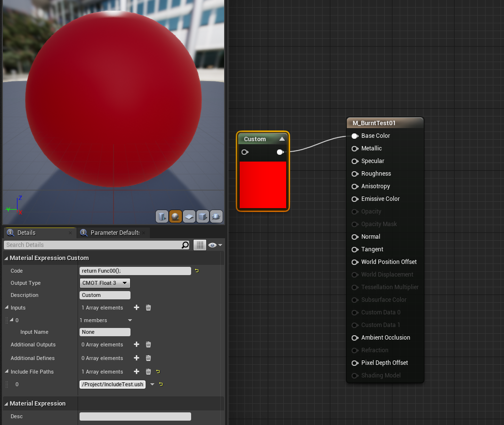
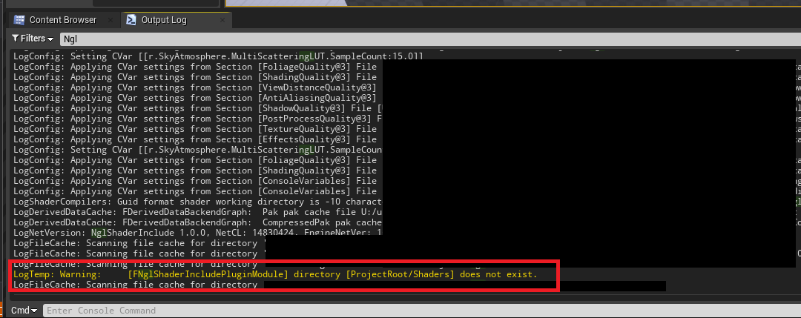

---
title: "ProjectRoot直下のShadersディレクトリをShaderIncludePathに追加するだけのPlugin [UE4]"
date: "2021-08-18T08:30:00+09:00"
draft: false
url: "/entry/2021/08/18/083000/"
categories: ["C++", "HLSL", "Shader", "UE4", "UE5", "UnrealC++", "シェーダ", "マテリアル"]
hatena_author: "nagakagachi"
hatena_original_url: "https://nagakagachi.hatenablog.com/entry/2021/08/18/083000"
hatena_basename: "2021/08/18/083000"
math: false
image: "images/6f671447c4dd4e8b946a6de2ed046a4bd43542906b659231433e4b9ef528501e.png"
---

<ul class="table-of-contents">
<li><a href="#これはなに">これはなに</a></li>
<li><a href="#置き場所">置き場所</a></li>
<li><a href="#使い方">使い方</a></li>
<li><a href="#エラーメッセージ">エラーメッセージ</a></li>
<li><a href="#参考資料">参考資料</a></li>
</ul>

    

<h3 id="これはなに">これはなに</h3>

プロジェクトルート/Shaders をUEのShaderIncludePathに自動追加する<a class="keyword" href="http://d.hatena.ne.jp/keyword/%A5%D7%A5%E9%A5%B0%A5%A4%A5%F3">プラグイン</a>. 
<a class="keyword" href="http://d.hatena.ne.jp/keyword/UE4">UE4</a>.25辺りからマテリアルのCustomノードで Include File Paths を指定して外部シェーダファイルをインクルードして利用できるようになったが,インクルードパスの設定が面倒だったので勉強ついでに自分用自動化<a class="keyword" href="http://d.hatena.ne.jp/keyword/%A5%D7%A5%E9%A5%B0%A5%A4%A5%F3">プラグイン</a>を作成した.

    

<h3 id="置き場所">置き場所</h3>

<iframe src="https://hatenablog-parts.com/embed?url=https%3A%2F%2Fgithub.com%2Fnagakagachi%2Fue4%2Ftree%2Fmaster%2FPlugin%2FNglShaderIncludePlugin" title="ue4/Plugin/NglShaderIncludePlugin at master · nagakagachi/ue4" class="embed-card embed-webcard" scrolling="no" frameborder="0" style="display: block; width: 100%; height: 155px; max-width: 500px; margin: 10px 0px;"></iframe><cite class="hatena-citation"><a href="https://github.com/nagakagachi/ue4/tree/master/Plugin/NglShaderIncludePlugin">github.com</a></cite> 

    

<h3 id="使い方">使い方</h3>

1. <b>zipを解凍してできたNglShaderIncludePluginを ProjectRoot/Plugins にコピー.</b> 
2. <b>ProjectRoot/Shaders <a class="keyword" href="http://d.hatena.ne.jp/keyword/%A5%C7%A5%A3%A5%EC%A5%AF%A5%C8">ディレクト</a>リにCustomノードで使いたい ush を配置.</b>

<pre class="code c++" data-lang="c++" data-unlink>// テストで用意した IncludeTest.ush というファイル
#pragma once
float3 Func00()
{
    return float3(1.0, 0.0, 0.0);
}</pre>
3. <b>マテリアルのCustomノードの Include File Paths に "/Project/filename.ush" を入力.</b>

<figure class="figure-image figure-image-fotolife" title="Customノード例"><figcaption>Customノード例</figcaption></figure>
4. <b>Customノードでインクルードしたushの関数などが利用できるようになる. </b>

    

<h3 id="エラーメッセージ">エラーメッセージ</h3>

UEプロジェクト起動時に Shaders <a class="keyword" href="http://d.hatena.ne.jp/keyword/%A5%C7%A5%A3%A5%EC%A5%AF%A5%C8">ディレクト</a>リが存在しないと以下のような警告がログに出力されるので<a class="keyword" href="http://d.hatena.ne.jp/keyword/%A5%C7%A5%A3%A5%EC%A5%AF%A5%C8">ディレクト</a>リを作成するように.

<blockquote>
        

LogTemp: Warning:     \[FNglShaderIncludePluginModule\] directory \[ProjectRoot/Shaders\] does not exist.

</blockquote>

    

<h3 id="参考資料">参考資料</h3>

<iframe src="https://hatenablog-parts.com/embed?url=https%3A%2F%2Fodederell3d.blog%2F2021%2F03%2F22%2Fue4-loading-shaders-from-within-the-project-folder%2F" title="UE4 – Loading shaders from within the project folder" class="embed-card embed-webcard" scrolling="no" frameborder="0" style="display: block; width: 100%; height: 155px; max-width: 500px; margin: 10px 0px;"></iframe><cite class="hatena-citation"><a href="https://odederell3d.blog/2021/03/22/ue4-loading-shaders-from-within-the-project-folder/">odederell3d.blog</a></cite> 
<iframe src="https://hatenablog-parts.com/embed?url=https%3A%2F%2Fkinnaji.com%2F2020%2F12%2F24%2Fnewmaterialcustomnode%2F%23%25E6%2596%25B0%25E3%2581%2597%25E3%2581%258F%25E3%2581%25AA%25E3%2581%25A3%25E3%2581%259FMaterial%25E3%2581%25AECustom%25E3%2583%258E%25E3%2583%25BC%25E3%2583%2589%25E3%2580%2580%25E3%2583%25AC%25E3%2583%2599%25E3%2583%25AB%25E3%2580%2590%25E2%2598%2585%25E2%2598%2585%25E2%2598%2585%25E3%2580%2591" title="【UE4】新しくなったMaterialのCustomノードの使い方 【★★★】 | キンアジのブログ" class="embed-card embed-webcard" scrolling="no" frameborder="0" style="display: block; width: 100%; height: 155px; max-width: 500px; margin: 10px 0px;"></iframe><cite class="hatena-citation"><a href="https://kinnaji.com/2020/12/24/newmaterialcustomnode/#%E6%96%B0%E3%81%97%E3%81%8F%E3%81%AA%E3%81%A3%E3%81%9FMaterial%E3%81%AECustom%E3%83%8E%E3%83%BC%E3%83%89%E3%80%80%E3%83%AC%E3%83%99%E3%83%AB%E3%80%90%E2%98%85%E2%98%85%E2%98%85%E3%80%91">kinnaji.com</a></cite>

---

[元のはてなブログ記事](https://nagakagachi.hatenablog.com/entry/2021/08/18/083000)
