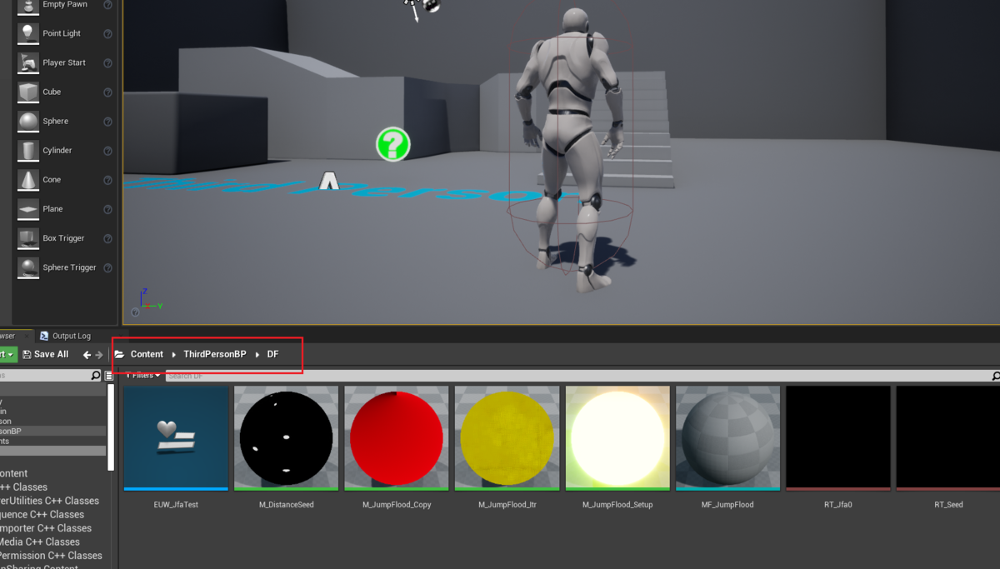
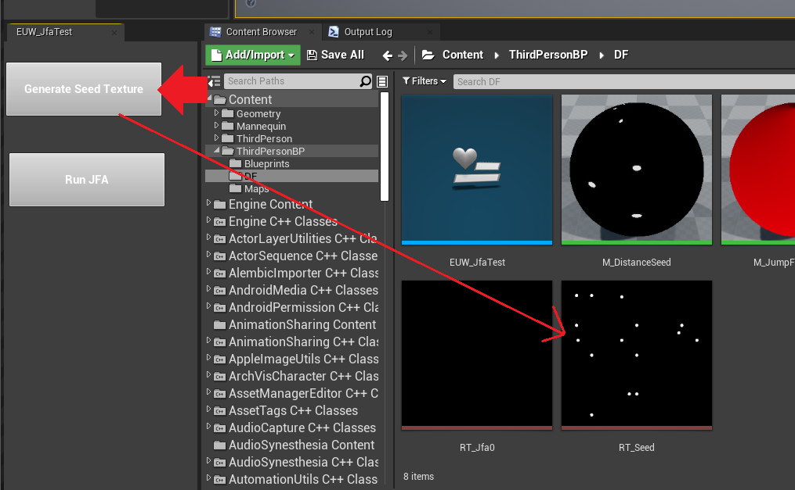
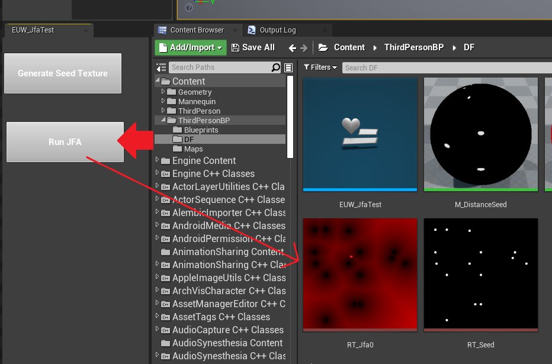

---
title: " UE4マテリアルによるDistanceField生成(Jump Floodingアルゴリズム)"
date: "2021-11-07T23:19:35+09:00"
draft: false
url: "/entry/2021/11/07/231935/"
categories: ["UE4", "GPGPU", "Graphics", "UE4", "UE5", "シェーダ", "マテリアル", "数学", "Material"]
hatena_author: "nagakagachi"
hatena_original_url: "https://nagakagachi.hatenablog.com/entry/2021/11/07/231935"
hatena_basename: "2021/11/07/231935"
math: false
image: "images/01ee4bded480ce2abd6147c04de23b1413901b2a887326cf8354440d16665e4b.png"
---

<blockquote>

2023/12/16更新 
SDF生成ツールをUE5向けに公開しました.<blockquote data-conversation="none" class="twitter-tweet" data-lang="ja">
SDFテクスチャをテクスチャ2Dから生成するUE5上のツール.  別の作業のために生えてきた. Jump Floodingを<a class="keyword" href="https://d.hatena.ne.jp/keyword/GPU">GPU</a>(マテリアル)で実行.  入力テクスチャは黒かそうでないかで外部/内部扱いしたSDF計算. 出力は RチャンネルにUV距離, Gチャンネルに内部フラグ.  MIT License <a href="https://twitter.com/hashtag/UE5?src=hash&amp;ref_src=twsrc%5Etfw">#UE5</a> <a href="https://t.co/6GdbEja9o3">https://t.co/6GdbEja9o3</a> <a href="https://t.co/ogWdxzP5Xm">pic.twitter.com/ogWdxzP5Xm</a>
&mdash; なが (@nagakagachi) <a href="https://twitter.com/nagakagachi/status/1730982828358390040?ref_src=twsrc%5Etfw">2023年12月2日</a></blockquote>   

</blockquote>

サンプルプロジェクト有 (<a class="keyword" href="https://d.hatena.ne.jp/keyword/UE4">UE4</a>.27).

Jump Flooding <a class="keyword" href="https://d.hatena.ne.jp/keyword/%A5%A2%A5%EB%A5%B4%A5%EA%A5%BA%A5%E0">アルゴリズム</a>によるDistanceField生成をUEマテリアルで実装したメモ. 
ついでに Editor Utility <a class="keyword" href="https://d.hatena.ne.jp/keyword/Widget">Widget</a> でSeedテクスチャの生成とDistanceFieldの生成をトリガーするテスト.

Jump Flooding Algorithm (<a class="keyword" href="https://d.hatena.ne.jp/keyword/JFA">JFA</a>)の詳細については各種資料参照. 
<a href="https://www.comp.nus.edu.sg/~tants/jfa/i3d06.pdf">https://www.comp.nus.edu.sg/~tants/jfa/i3d06.pdf</a> 
<a href="https://en.wikipedia.org/wiki/Jump_flooding_algorithm">Jump flooding algorithm - Wikipedia</a> 
<a href="https://observablehq.com/@rreusser/gpu-voronoi-diagrams-using-the-jump-flooding-algorithm">GPU Voronoi Diagrams using the Jump Flooding Algorithm / Ricky Reusser | Observable</a>

<ul class="table-of-contents">
<li><a href="#サンプルプロジェクト">サンプルプロジェクト</a><ul>
<li><a href="#DistanceFieldテクスチャ生成手順">DistanceFieldテクスチャ生成手順</a></li>
<li><a href="#アセット説明">アセット説明</a></li>
</ul>
</li>
<li><a href="#Jump-Flooding-ステップ">Jump Flooding ステップ</a></li>
<li><a href="#その他">その他</a></li>
</ul>

    

<h3 id="サンプルプロジェクト">サンプルプロジェクト</h3>

<a href="https://drive.google.com/file/d/1FEnmbDwYRBIwaszz5AE0AYxZszL3f-ga/view?usp=sharing">DistanceFIeldByJFA00.zip - Google &#x30C9;&#x30E9;&#x30A4;&#x30D6;</a>
 

プロジェクトの\[ThirdPersonBP/DF\]に関連BPやマテリアル等がある.

<figure class="figure-image figure-image-fotolife" title="関連コンテンツフォルダ"><figcaption>関連コンテンツフォルダ</figcaption></figure>

    

<h4 id="DistanceFieldテクスチャ生成手順">DistanceFieldテクスチャ生成手順</h4>

<strong>EUW_JfaTestアセット</strong> を右クリック->Run Editor Utility <a class="keyword" href="https://d.hatena.ne.jp/keyword/Widget">Widget</a> で<a class="keyword" href="https://d.hatena.ne.jp/keyword/Widget">Widget</a>を表示する. 
<strong>Generate Seed Texture ボタン</strong> を押すとマテリアルによってSeedテクスチャが更新される.

<figure class="figure-image figure-image-fotolife" title="Generate SeedTexture"><figcaption>Generate SeedTexture</figcaption></figure>
<strong>Run <a class="keyword" href="https://d.hatena.ne.jp/keyword/JFA">JFA</a> ボタン</strong> を押すとSeedテクスチャを元にDistanceFieldテクスチャが生成される.

<figure class="figure-image figure-image-fotolife" title="DistanceField生成"><figcaption>Generate DistanceField</figcaption></figure>

    

<h4 id="アセット説明">アセット説明</h4>

    
<ul>
<li>RT_Seed
<ul>
<li>DistanceFieldの元になるSeedテクスチャ. 黒テクセルは無効で, それ以外の色のテクセルがSeedとして評価される.</li>
<li>どんなテクスチャでもよいが,今回はマテリアルM_DistanceSeedでその場で生成している.</li>
<li>サイズはデフォルト512x512だが変更可能. ただし動作確認しているのは2の冪のみ.</li>
</ul></li>
<li>RT_Jfa0
<ul>
<li>DistanceFieldの出力先テクスチャ.</li>
</ul></li>
<li>M_DistanceSeed
<ul>
<li>Seedテクスチャの生成用マテリアル. 適当な計算で適当な位置に黒(0,0,0)ではないSeedを書き込む.</li>
</ul></li>
<li>MF_JumpFlood
<ul>
<li><a class="keyword" href="https://d.hatena.ne.jp/keyword/JFA">JFA</a>のメイン処理をCustomNodeで記述したMaterialFunction. M_JumpFlood_SetupとM_JumpFlood_Itrはこれを呼び出す.</li>
</ul></li>
<li>M_JumpFlood_Setup
<ul>
<li><a class="keyword" href="https://d.hatena.ne.jp/keyword/JFA">JFA</a>の初回パス用マテリアル. Seedテクスチャを元に黒(0,0,0)ではないテクセルをSeedとして<a class="keyword" href="https://d.hatena.ne.jp/keyword/JFA">JFA</a>の初回パスを実行する.</li>
</ul></li>
<li>M_JumpFlood_Itr
<ul>
<li><a class="keyword" href="https://d.hatena.ne.jp/keyword/JFA">JFA</a>の反復パス用マテリアル. 基本的には初回パスと同じだが,<a class="keyword" href="https://d.hatena.ne.jp/keyword/JFA">JFA</a>入力が前回の<a class="keyword" href="https://d.hatena.ne.jp/keyword/JFA">JFA</a>パスの結果テクスチャになる.</li>
</ul></li>
<li>M_JumpFlood_Copy
<ul>
<li><a class="keyword" href="https://d.hatena.ne.jp/keyword/JFA">JFA</a>結果テクスチャを元に出力先テクスチャRT_Jfa0 へ出力するマテリアル.</li>
</ul></li>
<li>EUW_JfaTest
<ul>
<li><a class="keyword" href="https://d.hatena.ne.jp/keyword/JFA">JFA</a>処理のMaterialDrawなどをする<a class="keyword" href="https://d.hatena.ne.jp/keyword/Widget">Widget</a>. 今回の<a class="keyword" href="https://d.hatena.ne.jp/keyword/JFA">JFA</a>関連の処理はほぼここに書いてある.</li>
<li><a class="keyword" href="https://d.hatena.ne.jp/keyword/JFA">JFA</a>のワークテクスチャ(PingPong用に2枚)を内部で生成して利用する.</li>
<li><a class="keyword" href="https://d.hatena.ne.jp/keyword/JFA">JFA</a>自体はテクスチャサイズXに対して (log2(X)-1)回のマテリアルDrawで完了する.</li>
</ul></li>
</ul>

    

<h3 id="Jump-Flooding-ステップ">Jump Flooding ステップ</h3>

<a class="keyword" href="https://d.hatena.ne.jp/keyword/JFA">JFA</a>の1ステップの処理は MF_JumpFlood のCustomで行っている. 
初回のSeedテクスチャの処理だけ少し特殊対応しているがそれ以外は素直な実装. 
テクスチャサイズは<strong>2の冪でのみ動作確認</strong>.

<pre class="code lang-cpp" data-lang="cpp" data-unlink>//  MF_JumpFlood
//  入力テクスチャの非ゼロ(0,0,0)テクセルをSeedとして最近接Seedテクセル位置をJFAで計算する.
//
// inTexture : 入力テクスチャ.
//        初回パスは黒(0,0,0)が無効値扱いである任意のテクスチャ.
//        反復パスではRG=(0,0)が無効値であるような最近接Seedテクセル位置テクスチャ.
//        テクセル位置は必ずテクセル中心を指すものとする. 具体的には半テクセルサイズ分のオフセットが付加されたもの.
// texelPosition : ハーフテクセルサイズ込のテクセル中心位置.
// textureSize : テクスチャサイズ.
// stepLength : この反復でのステップのテクセル数.
//        入力サイズ/2 から開始し, 反復的に 1/2 としてサイズが 1 になるまで実行することでJFAが完了する.
// isSetupPass : 初回パスの場合非0.
//
float bestDistance = 65535.0;
float2 bestSeed = float2(0.0, 0.0);
for(int j = -1; j &lt;= 1; ++j)
{
    for(int i = -1; i &lt;= 1; ++i)
    {
        float2 samplePosition = texelPosition + float2(i, j) * stepLength;
        
        const float2 sampleUv = samplePosition / textureSize;
        const float4 col = Texture2DSample(inTexture, inTextureSampler, sampleUv);

        if(any(float2(0.0,0.0) &gt; samplePosition) || any(textureSize &lt;= samplePosition))
            continue;

        float2 seedPosition = samplePosition;
        if(0.0 != isSetupPass.x)
        {
            // 最初のパスは黒テクセルを無視.
            if(all(float3(0.0, 0.0, 0.0) == col.xyz))
                continue;   
        }
        else
        {
            // 有効であればハーフピクセルオフセット付きのテクセル位置が格納されている.
            seedPosition = col.xy;
            // 0,0 は有効なシードを格納していない.
            if(all(float2(0.0, 0.0) == seedPosition))
                continue;
        }

        float curDist = distance(seedPosition, texelPosition);
        if(bestDistance &gt; curDist)
        {
            bestSeed = seedPosition;
            bestDistance = curDist;
        }
    }
}

return float4(bestSeed.x, bestSeed.y, 0.0, 0.0);
</pre>

以下の疑似コードのように反復をすることで最終的に各テクセルの最近接Seedテクセル座標が計算される.  
  
それを元にDistanceFieldテクスチャを生成する.

<pre class="code lang-cpp" data-lang="cpp" data-unlink>// Pseudo Code.
int stepCount = log2(TextureSize) - 1;
for(int i = 0; i &lt; stepCount; ++i)
{
    JumpFlood(stepLength = pow(2, stepCount - i));
}
</pre>

    

<h3 id="その他">その他</h3>

今回の実装ではSeedテクスチャの黒(0,0,0)は無効値として扱う. 
同様に<a class="keyword" href="https://d.hatena.ne.jp/keyword/JFA">JFA</a>ワークテクスチャは最近接Seedテクセル座標float2を格納するが, (0,0)が格納されている場合は無効値扱いとする. 
テクセル座標は必ずテクセル中心位置であり, 必ず半テクセルサイズ分がオフセットされているため (0,0)という値にはなりえないことから.

---

[元のはてなブログ記事](https://nagakagachi.hatenablog.com/entry/2021/11/07/231935)
