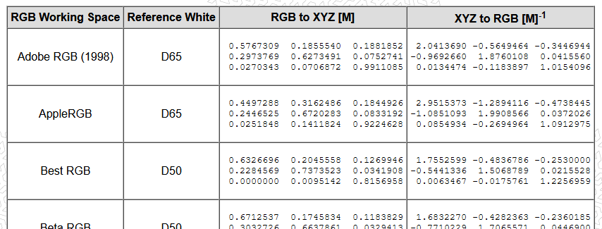

---
title: "RGB信号の輝度について"
date: "2021-12-14T23:42:41+09:00"
draft: false
url: "/entry/2021/12/14/234241/"
categories: ["Graphics", "数学"]
hatena_author: "nagakagachi"
hatena_original_url: "https://nagakagachi.hatenablog.com/entry/2021/12/14/234241"
hatena_basename: "2021/12/14/234241"
math: true
image: "images/3d073a5da154adc22095bc6688eaf4a54a2a82f9d0500666ae0e84a67e7ad2d0.png"
---

そういえば  と思って調べたこと.

RGBの3次元ベクトルから輝度を計算するときに出てくるあの係数.

sRGB色空間の場合 
\(Luminance = 
dot(
\begin{pmatrix}
R_{sRGB}\\G_{sRGB}\\B_{sRGB}\\ 
\end{pmatrix}
, 

\begin{pmatrix}
0.2126\\0.7152\\0.0722\\ 
\end{pmatrix}
)\)
 

\(\begin{pmatrix}
0.2126\\0.7152\\0.0722\\ 
\end{pmatrix}\) 
↑これ
 

これはRGB値をその色空間(↑の場合はsRGB)からXYZ色空間へ変換する変換行列のY座標に関する成分.  
  
XYZ色空間のYは輝度と定義されているため, XYZ色空間のY座標のみ計算しているということなんですね.

 

\(\begin{align}
\begin{pmatrix}
X\\Y\\Z\\ 
\end{pmatrix} &amp;=
\begin{pmatrix}
0.4123908&amp;0.35758434&amp;0.18048079\\
0.21263901&amp;0.71516868&amp;0.07219232\\
0.01933082&amp;0.11919478&amp;0.95053215\\
\end{pmatrix}
\begin{pmatrix}
R_{sRGB}\\G_{sRGB}\\B_{sRGB}\\ 
\end{pmatrix} \\
&amp;=
\begin{pmatrix}
0.4123908R_{sRGB}+0.35758434G_{sRGB}+0.18048079B_{sRGB}\\
0.21263901R_{sRGB}+0.71516868G_{sRGB}+0.07219232B_{sRGB}\\
0.01933082R_{sRGB}+0.11919478G_{sRGB}+0.95053215B_{sRGB}\\
\end{pmatrix}
\end{align}\)
 

↑の式では四捨五入していないので最初の式と少し違うけれど、Yはそういうこと.  
  
別の色空間のRGBなら別の係数になるのも当然. 注意重点.

 

色空間の変換行列がたくさん乗っているページ. 
本当に正しい値かはチェックが必要だけれどとても参考になる. 
<a href="http://www.brucelindbloom.com/index.html?Eqn_RGB_XYZ_Matrix.html">Welcome to Bruce Lindbloom&#39;s Web Site</a>

<figure class="figure-image figure-image-fotolife" title="http://www.brucelindbloom.com/index.html?Eqn_RGB_XYZ_Matrix.html"><figcaption><a href="http://www.brucelindbloom.com/index.html?Eqn_RGB_XYZ_Matrix.html">http://www.brucelindbloom.com/index.html?Eqn_RGB_XYZ_Matrix.html</a></figcaption></figure>

---

[元のはてなブログ記事](https://nagakagachi.hatenablog.com/entry/2021/12/14/234241)
