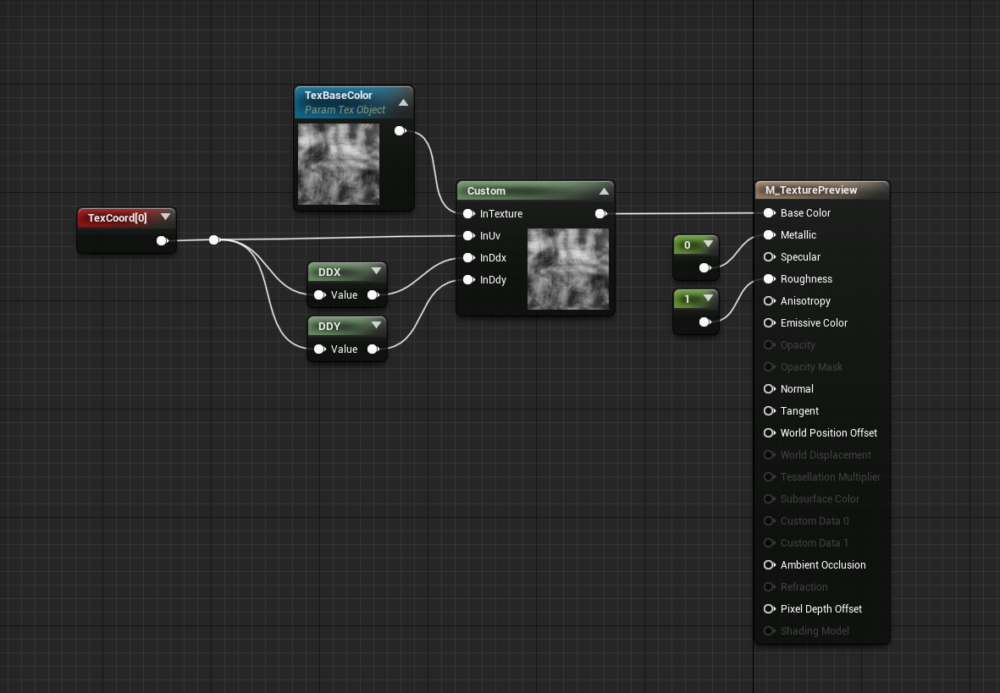
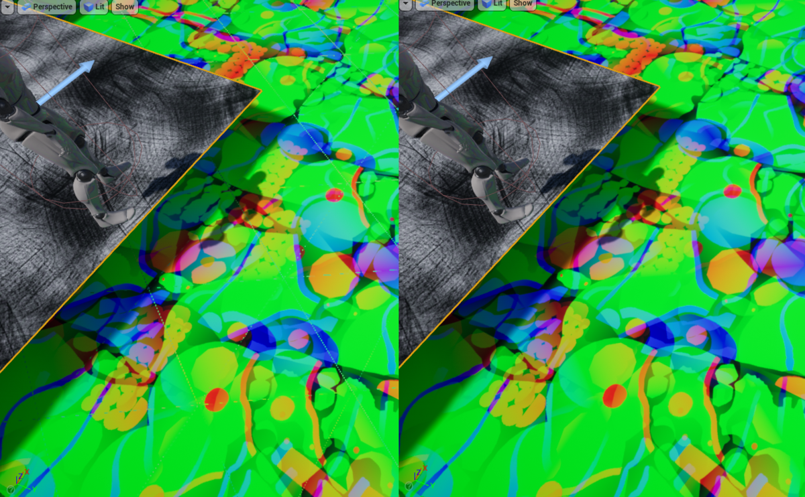

---
title: " TextureSampleGradのCustomNode"
date: "2021-12-31T19:30:43+09:00"
draft: false
url: "/entry/2021/12/31/193043/"
categories: ["UE4", "UE4", "Graphics", "HLSL", "Material", "UE4", "UE5", "シェーダ", "マテリアル"]
hatena_author: "nagakagachi"
hatena_original_url: "https://nagakagachi.hatenablog.com/entry/2021/12/31/193043"
hatena_basename: "2021/12/31/193043"
math: false
image: "images/2e3423d49d6483a9c5d2b66d4970c02ffe9d900ccf2d17fd49f8834aaa349200.png"
---

UEのマテリアルでTextureからSampleGradでサンプリングするメモ.

これが2021年最後の記事. 良いお年を!

<ul class="table-of-contents">
<li><a href="#CustomNodeの内容">CustomNodeの内容</a></li>
<li><a href="#CustomNodeコピペ用">CustomNodeコピペ用</a></li>
<li><a href="#利用例">利用例</a></li>
<li><a href="#何に使うの">何に使うの</a></li>
</ul>

ノードとしてSampleGradが提供されていないようなので、CustomNodeでSampleGrad関数を直接呼ぶこととする.  
  
(提供されているようならこの記事は見なかったことにしてください.)

    

<h3 id="CustomNodeの内容">CustomNodeの内容</h3>

TextureとUV, <a class="keyword" href="http://d.hatena.ne.jp/keyword/ddx">ddx</a>, ddy を引数にとって内部で TextureSampleGrad関数を利用する.

<pre class="code lang-cpp" data-lang="cpp" data-unlink>/*
    Input
            InTexture  ( and InTextureSampler)
            InUv
            InDdx
            InDdy
    
    Output
            float4
*/

float4 tex = Texture2DSampleGrad(InTexture, InTextureSampler, InUv, InDdx, InDdy);
return tex;
</pre>

    

<h3 id="CustomNodeコピペ用">CustomNodeコピペ用</h3>

    

コピペで利用したい場合は以下のテキストをマテリアルエディタに貼り付ければCustomNodeが生成される.

<pre class="code lang-cpp" data-lang="cpp" data-unlink>
Begin Object Class=/Script/UnrealEd.MaterialGraphNode Name=&quot;MaterialGraphNode_21&quot;
   Begin Object Class=/Script/Engine.MaterialExpressionCustom Name=&quot;MaterialExpressionCustom_2&quot;
   End Object
   Begin Object Name=&quot;MaterialExpressionCustom_2&quot;
      Code=&quot;\r\n/*\r\n    Input\r\n            InTexture  ( and InTextureSampler)\r\n            InUv\r\n            InDdx\r\n            InDdy\r\n    \r\n    Output\r\n            float4\r\n*/\r\n\r\nfloat4 tex = Texture2DSampleGrad(InTexture, InTextureSampler, InUv, InDdx, InDdy);\r\nreturn tex;\r\n\r\n&quot;
      OutputType=CMOT_Float4
      Inputs(0)=(InputName=&quot;InTexture&quot;,Input=(Expression=MaterialExpressionTextureObjectParameter'&quot;MaterialExpressionTextureObjectParameter_1&quot;'))
      Inputs(1)=(InputName=&quot;InUv&quot;,Input=(Expression=MaterialExpressionReroute'&quot;MaterialExpressionReroute_0&quot;'))
      Inputs(2)=(InputName=&quot;InDdx&quot;,Input=(Expression=MaterialExpressionDDX'&quot;MaterialExpressionDDX_0&quot;'))
      Inputs(3)=(InputName=&quot;InDdy&quot;,Input=(Expression=MaterialExpressionDDY'&quot;MaterialExpressionDDY_0&quot;'))
      MaterialExpressionEditorX=-352
      MaterialExpressionEditorY=240
      MaterialExpressionGuid=A6C202464ABAD8F6E9734E9B54C6742D
      Material=PreviewMaterial'&quot;/Engine/Transient.M_TexturePreview&quot;'
   End Object
   MaterialExpression=MaterialExpressionCustom'&quot;MaterialExpressionCustom_2&quot;'
   NodePosX=-352
   NodePosY=240
   ErrorType=1
   ErrorMsg=&quot;Custom material Custom missing input 1 (InTexture)&quot;
   NodeGuid=98660A2E479B2DED7843C29DD7E144AB
   CustomProperties Pin (PinId=3FB004F94791B89E090EB9B99B713C0F,PinName=&quot;InTexture&quot;,PinType.PinCategory=&quot;required&quot;,PinType.PinSubCategory=&quot;&quot;,PinType.PinSubCategoryObject=None,PinType.PinSubCategoryMemberReference=(),PinType.PinValueType=(),PinType.ContainerType=None,PinType.bIsReference=False,PinType.bIsConst=False,PinType.bIsWeakPointer=False,PinType.bIsUObjectWrapper=False,LinkedTo=(MaterialGraphNode_83 FF18694A45E6BEAA46EA3F8C083A2CBC,),PersistentGuid=00000000000000000000000000000000,bHidden=False,bNotConnectable=False,bDefaultValueIsReadOnly=False,bDefaultValueIsIgnored=False,bAdvancedView=False,bOrphanedPin=False,)
   CustomProperties Pin (PinId=3E114E314D9BAB61118B329013A0C05A,PinName=&quot;InUv&quot;,PinType.PinCategory=&quot;required&quot;,PinType.PinSubCategory=&quot;&quot;,PinType.PinSubCategoryObject=None,PinType.PinSubCategoryMemberReference=(),PinType.PinValueType=(),PinType.ContainerType=None,PinType.bIsReference=False,PinType.bIsConst=False,PinType.bIsWeakPointer=False,PinType.bIsUObjectWrapper=False,LinkedTo=(MaterialGraphNode_Knot_7 18FE939F4A97C00C67CC16A085BED853,),PersistentGuid=00000000000000000000000000000000,bHidden=False,bNotConnectable=False,bDefaultValueIsReadOnly=False,bDefaultValueIsIgnored=False,bAdvancedView=False,bOrphanedPin=False,)
   CustomProperties Pin (PinId=B5C056784D5BAD800E83398A08AD56B8,PinName=&quot;InDdx&quot;,PinType.PinCategory=&quot;required&quot;,PinType.PinSubCategory=&quot;&quot;,PinType.PinSubCategoryObject=None,PinType.PinSubCategoryMemberReference=(),PinType.PinValueType=(),PinType.ContainerType=None,PinType.bIsReference=False,PinType.bIsConst=False,PinType.bIsWeakPointer=False,PinType.bIsUObjectWrapper=False,LinkedTo=(MaterialGraphNode_85 80EC1CDF4B3A1C9667D72EB37399E8C0,),PersistentGuid=00000000000000000000000000000000,bHidden=False,bNotConnectable=False,bDefaultValueIsReadOnly=False,bDefaultValueIsIgnored=False,bAdvancedView=False,bOrphanedPin=False,)
   CustomProperties Pin (PinId=905889CC49E11D9C88DB2792EF254574,PinName=&quot;InDdy&quot;,PinType.PinCategory=&quot;required&quot;,PinType.PinSubCategory=&quot;&quot;,PinType.PinSubCategoryObject=None,PinType.PinSubCategoryMemberReference=(),PinType.PinValueType=(),PinType.ContainerType=None,PinType.bIsReference=False,PinType.bIsConst=False,PinType.bIsWeakPointer=False,PinType.bIsUObjectWrapper=False,LinkedTo=(MaterialGraphNode_86 BBAD4B0443CF6057D92E17A5A0BB730A,),PersistentGuid=00000000000000000000000000000000,bHidden=False,bNotConnectable=False,bDefaultValueIsReadOnly=False,bDefaultValueIsIgnored=False,bAdvancedView=False,bOrphanedPin=False,)
   CustomProperties Pin (PinId=8EFEA7514110CC30D32E41B0B1689991,PinName=&quot;Output&quot;,PinFriendlyName=NSLOCTEXT(&quot;MaterialGraphNode&quot;, &quot;Space&quot;, &quot; &quot;),Direction=&quot;EGPD_Output&quot;,PinType.PinCategory=&quot;&quot;,PinType.PinSubCategory=&quot;&quot;,PinType.PinSubCategoryObject=None,PinType.PinSubCategoryMemberReference=(),PinType.PinValueType=(),PinType.ContainerType=None,PinType.bIsReference=False,PinType.bIsConst=False,PinType.bIsWeakPointer=False,PinType.bIsUObjectWrapper=False,LinkedTo=(MaterialGraphNode_Root_0 1653EE4D4D08EED8A95A3CA74981CFA2,),PersistentGuid=00000000000000000000000000000000,bHidden=False,bNotConnectable=False,bDefaultValueIsReadOnly=False,bDefaultValueIsIgnored=False,bAdvancedView=False,bOrphanedPin=False,)
End Object
</pre>

    

<h3 id="利用例">利用例</h3>

TextureObjectとUV, <a class="keyword" href="http://d.hatena.ne.jp/keyword/ddx">ddx</a>, ddy をCustomNodeに入力する.

<figure class="figure-image figure-image-fotolife" title="当記事のCustomNodeの利用例"><figcaption>当記事のCustomNodeの利用例</figcaption></figure>

    

<h3 id="何に使うの">何に使うの</h3>

確率的テクスチャブレンディング等ではタイリング境界でUVギャップが大きくなり, 自動的なMipLevel選択では<a class="keyword" href="http://d.hatena.ne.jp/keyword/%A5%A2%A1%BC%A5%C6%A5%A3%A5%D5%A5%A1%A5%AF%A5%C8">アーティファクト</a>が発生してしまう. 
そのため自前で適切な勾配(Grad)を計算して明示的に指定する必要がある.

左画像は通常のTextureSampleノードを使った場合, 右がTextureSampleGradを利用した場合. 
TextureSampleではライン上の<a class="keyword" href="http://d.hatena.ne.jp/keyword/%A5%A2%A1%BC%A5%C6%A5%A3%A5%D5%A5%A1%A5%AF%A5%C8">アーティファクト</a>が発生しているが, TextureSampleGradでは自前で勾配を指定することで改善している.

<figure class="figure-image figure-image-fotolife" title="TextureSampleとTextureSampleGrad"><figcaption>TextureSampleとTextureSampleGrad</figcaption></figure>

---

[元のはてなブログ記事](https://nagakagachi.hatenablog.com/entry/2021/12/31/193043)
