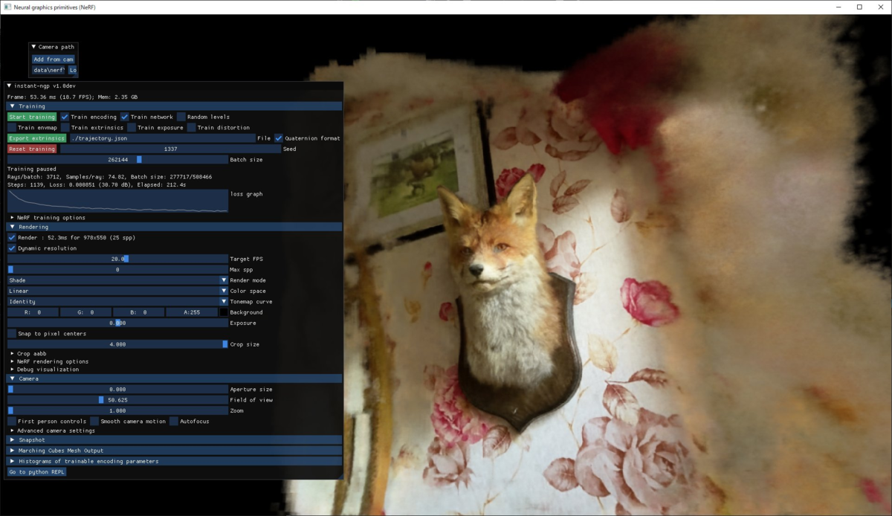
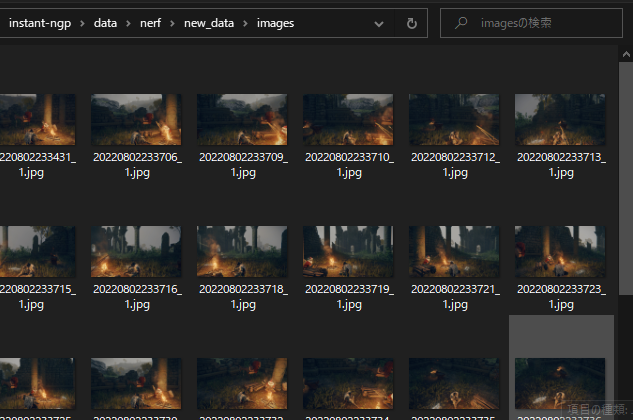
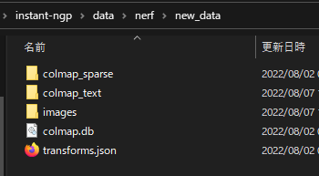

---
title: "InstantNeRFで任意画像から3D再構成をするまでの流れメモ"
date: "2022-08-06T18:43:49+09:00"
draft: false
url: "/entry/2022/08/06/184349/"
categories: ["GPGPU", "Graphics", "Tech", "Voxel", "DeepLearning", "NeRF", "InstantNeRF"]
hatena_author: "nagakagachi"
hatena_original_url: "https://nagakagachi.hatenablog.com/entry/2022/08/06/184349"
hatena_basename: "2022/08/06/184349"
math: false
image: "images/773d37b0daf53daf91c4930ee61f078619865408e2bfb8f4c9514eadf6f46b7e.png"
---

<p><a class="keyword" href="http://d.hatena.ne.jp/keyword/NVIDIA">NVIDIA</a> InstantNeRF (InstantNGP) の環境セットアップと,<br />
自身で用意した画像群を使った3D再構成をするフローのメモ.</p><p>基本的に公式<a class="keyword" href="http://d.hatena.ne.jp/keyword/%A5%EA%A5%DD%A5%B8%A5%C8%A5%EA">リポジトリ</a>のセットアップ手順そのまま.<br />
<iframe src="https://hatenablog-parts.com/embed?url=https%3A%2F%2Fgithub.com%2FNVlabs%2Finstant-ngp" title="GitHub - NVlabs/instant-ngp: Instant neural graphics primitives: lightning fast NeRF and more" class="embed-card embed-webcard" scrolling="no" frameborder="0" style="display: block; width: 100%; height: 155px; max-width: 500px; margin: 10px 0px;" loading="lazy"></iframe><cite class="hatena-citation"><a href="https://github.com/NVlabs/instant-ngp">github.com</a></cite></p>


<ul class="table-of-contents">
<li><a href="#セットアップ">セットアップ</a><ul>
<li><a href="#実行環境">実行環境</a></li>
<li><a href="#Requirementsのセットアップ">Requirementsのセットアップ</a><ul>
<li><a href="#CUDA">CUDA</a></li>
<li><a href="#CMAKE">CMAKE</a></li>
<li><a href="#Python">Python</a></li>
<li><a href="#Python-Modules">Python Modules</a></li>
<li><a href="#OptiX">OptiX</a></li>
</ul>
</li>
<li><a href="#InstantNgpのビルド">InstantNgpのビルド</a><ul>
<li><a href="#リポジトリの取得">リポジトリの取得</a></li>
<li><a href="#ビルド">ビルド</a></li>
<li><a href="#サンプルを実行">サンプルを実行</a></li>
</ul>
</li>
</ul>
</li>
<li><a href="#3D再構成の準備">3D再構成の準備</a><ul>
<li><a href="#COLMAP">COLMAP</a><ul>
<li><a href="#ダウンロード">ダウンロード</a></li>
<li><a href="#環境変数Pathへの追加">環境変数Pathへの追加</a></li>
</ul>
</li>
</ul>
</li>
<li><a href="#3D再構成">3D再構成</a><ul>
<li><a href="#画像ファイルの準備">画像ファイルの準備</a></li>
<li><a href="#COLMAPによる画像群カメラ姿勢推定">COLMAPによる画像群カメラ姿勢推定</a></li>
<li><a href="#InstantNeRFを実行">InstantNeRFを実行</a></li>
</ul>
</li>
</ul>
<div class="section">
    

<h3 id="セットアップ">セットアップ</h3>


    
<div class="section">
    

<h4 id="実行環境">実行環境</h4>


    

WIndows10 64bit  
  
RTX 3070


</div>
<div class="section">
    

<h4 id="Requirementsのセットアップ">Requirementsのセットアップ</h4>


    
<div class="section">
    

<h5 id="CUDA">CUDA</h5>


<p>"v10.2 or higher"<br />
11.7 をインストール.<br />
<iframe src="https://hatenablog-parts.com/embed?url=https%3A%2F%2Fdeveloper.nvidia.com%2Fcuda-toolkit" title="CUDA Toolkit - Free Tools and Training" class="embed-card embed-webcard" scrolling="no" frameborder="0" style="display: block; width: 100%; height: 155px; max-width: 500px; margin: 10px 0px;" loading="lazy"></iframe><cite class="hatena-citation"><a href="https://developer.nvidia.com/cuda-toolkit">developer.nvidia.com</a></cite></p>

</div>
<div class="section">
    

<h5 id="CMAKE">CMAKE</h5>


<p>"v3.21 or higher"<br />
3.24.0-rc5 をインストール.<br />
<a class="keyword" href="http://d.hatena.ne.jp/keyword/%A5%A4%A5%F3%A5%B9%A5%C8%A1%BC%A5%E9">インストーラ</a>による system Path へのCMAKEパス追加 は true とした.<br />
自分で追加する場合は<a class="keyword" href="http://d.hatena.ne.jp/keyword/%B4%C4%B6%AD%CA%D1%BF%F4">環境変数</a>Pathに "C:\Program Files\CMake\bin" あたりを追加する.<br />
<iframe src="https://hatenablog-parts.com/embed?url=https%3A%2F%2Fcmake.org%2Fdownload%2F" title="Download | CMake" class="embed-card embed-webcard" scrolling="no" frameborder="0" style="display: block; width: 100%; height: 155px; max-width: 500px; margin: 10px 0px;" loading="lazy"></iframe><cite class="hatena-citation"><a href="https://cmake.org/download/">cmake.org</a></cite></p>

</div>
<div class="section">
<h5 id="Python"><a class="keyword" href="http://d.hatena.ne.jp/keyword/Python">Python</a></h5>
    

"3.7 or higher"  
  
自身の環境のAnacondaに 3.9 が含まれていたので改めてインストールはせず.


</div>
<div class="section">
<h5 id="Python-Modules"><a class="keyword" href="http://d.hatena.ne.jp/keyword/Python">Python</a> Modules</h5>
<p>公式<a class="keyword" href="http://d.hatena.ne.jp/keyword/%A5%EA%A5%DD%A5%B8%A5%C8%A5%EA">リポジトリ</a>の requirements.txt をローカルにダウンロード.<br />
このtxtに必要なモジュールが記述されているのでpipで<a class="keyword" href="http://d.hatena.ne.jp/keyword/Python">Python</a>環境にインストール.<br />
<a href="https://github.com/NVlabs/instant-ngp/blob/master/requirements.txt">https://github.com/NVlabs/instant-ngp/blob/master/requirements.txt</a></p>


```python
pip install -r requirements.txt
```


</div>
<div class="section">
    

<h5 id="OptiX">OptiX</h5>


<p>"7.3 or higher"<br />
7.5 をインストール.<br />
インストール後に以下の<a class="keyword" href="http://d.hatena.ne.jp/keyword/%B4%C4%B6%AD%CA%D1%BF%F4">環境変数</a>が設定されていなければ手動で追加する.<br />
変数名  "OptiX_INSTALL_DIR"<br />
値         "C:\ProgramData\<a class="keyword" href="http://d.hatena.ne.jp/keyword/NVIDIA">NVIDIA</a> Corporation\OptiX <a class="keyword" href="http://d.hatena.ne.jp/keyword/SDK">SDK</a> バージョン番号"<br />
<iframe src="https://hatenablog-parts.com/embed?url=https%3A%2F%2Fdeveloper.nvidia.com%2Frtx%2Fray-tracing%2Foptix" title="NVIDIA OptiX™ Ray Tracing Engine" class="embed-card embed-webcard" scrolling="no" frameborder="0" style="display: block; width: 100%; height: 155px; max-width: 500px; margin: 10px 0px;" loading="lazy"></iframe><cite class="hatena-citation"><a href="https://developer.nvidia.com/rtx/ray-tracing/optix">developer.nvidia.com</a></cite></p>

</div>
</div>
<div class="section">
    

<h4 id="InstantNgpのビルド">InstantNgpのビルド</h4>


    
<div class="section">
<h5 id="リポジトリの取得"><a class="keyword" href="http://d.hatena.ne.jp/keyword/%A5%EA%A5%DD%A5%B8%A5%C8%A5%EA">リポジトリ</a>の取得</h5>
<p>適当な<a class="keyword" href="http://d.hatena.ne.jp/keyword/%A5%C7%A5%A3%A5%EC%A5%AF%A5%C8">ディレクト</a>リにcloneする.</p>
<pre class="code lang-cpp" data-lang="cpp" data-unlink>git clone --<span class="synConstant">recursive</span> https:<span class="synComment">//github.com/nvlabs/instant-ngp</span>
</pre>
</div>
<div class="section">
    

<h5 id="ビルド">ビルド</h5>


<p>cloneしたinstant-<a class="keyword" href="http://d.hatena.ne.jp/keyword/ngp">ngp</a><a class="keyword" href="http://d.hatena.ne.jp/keyword/%A5%C7%A5%A3%A5%EC%A5%AF%A5%C8">ディレクト</a>リでCMAKEによるビルドを実行.</p>
<pre class="code lang-cpp" data-lang="cpp" data-unlink>cmake . -B build
</pre><pre class="code lang-cpp" data-lang="cpp" data-unlink>cmake --build build --config RelWithDebInfo -j
</pre>
</div>
<div class="section">
    

<h5 id="サンプルを実行">サンプルを実行</h5>


<p>ビルドが成功したらサンプルが実行できるか確認する.<br />
instant-<a class="keyword" href="http://d.hatena.ne.jp/keyword/ngp">ngp</a><a class="keyword" href="http://d.hatena.ne.jp/keyword/%A5%C7%A5%A3%A5%EC%A5%AF%A5%C8">ディレクト</a>リで<a class="keyword" href="http://d.hatena.ne.jp/keyword/%A5%B3%A5%DE%A5%F3%A5%C9%A5%E9%A5%A4%A5%F3">コマンドライン</a>からnerf/foxサンプルを実行.</p>
<pre class="code lang-cpp" data-lang="cpp" data-unlink>.\build\testbed.exe --scene .\data\nerf\fox
</pre><figure class="figure-image figure-image-fotolife" title="NeRF_Fox_Sample"><span itemscope itemtype="http://schema.org/Photograph"></span><figcaption>NeRF_Fox_Sample</figcaption></figure>

狐のNeRFシーンサンプルのリアルタイム学習が確認できる.


</div>
</div>
</div>
<div class="section">
    

<h3 id="3D再構成の準備">3D再構成の準備</h3>


<p>NeRFの学習には画像毎のカメラ姿勢情報が必要.<br />
COLMAPを利用することで画像群からカメラ姿勢を推定することができ, NeRFの学習に利用できるようになる.<br />
InstantNgpでは colmap2nerf.py という<a class="keyword" href="http://d.hatena.ne.jp/keyword/%A5%B9%A5%AF%A5%EA%A5%D7%A5%C8">スクリプト</a>が提供されており, COLMAPで推定したカメラ姿勢情報をNeRF向けに変換できる.<br />
詳細は以下の公式tipsの「Preparing new NeRF datasets」を参考.<br />
<iframe src="https://hatenablog-parts.com/embed?url=https%3A%2F%2Fgithub.com%2FNVlabs%2Finstant-ngp%2Fblob%2Fmaster%2Fdocs%2Fnerf_dataset_tips.md%23preparing-new-nerf-datasets" title="instant-ngp/nerf_dataset_tips.md at master · NVlabs/instant-ngp" class="embed-card embed-webcard" scrolling="no" frameborder="0" style="display: block; width: 100%; height: 155px; max-width: 500px; margin: 10px 0px;" loading="lazy"></iframe><cite class="hatena-citation"><a href="https://github.com/NVlabs/instant-ngp/blob/master/docs/nerf_dataset_tips.md#preparing-new-nerf-datasets">github.com</a></cite></p>

<div class="section">
    

<h4 id="COLMAP">COLMAP</h4>


    
<div class="section">
    

<h5 id="ダウンロード">ダウンロード</h5>


<p>COLMAP公式から pre-build binaries リンクを辿ってビルド済みバイナリを取得.<br />
今回は COLMAP-3.7-<a class="keyword" href="http://d.hatena.ne.jp/keyword/windows">windows</a>-cuda.zip をダウンロードして適当な<a class="keyword" href="http://d.hatena.ne.jp/keyword/%A5%C7%A5%A3%A5%EC%A5%AF%A5%C8">ディレクト</a>リに展開.<br />
<iframe src="https://hatenablog-parts.com/embed?url=https%3A%2F%2Fcolmap.github.io%2F" title="COLMAP — COLMAP 3.8 documentation" class="embed-card embed-webcard" scrolling="no" frameborder="0" style="display: block; width: 100%; height: 155px; max-width: 500px; margin: 10px 0px;" loading="lazy"></iframe><cite class="hatena-citation"><a href="https://colmap.github.io/">colmap.github.io</a></cite></p>

</div>
<div class="section">
<h5 id="環境変数Pathへの追加"><a class="keyword" href="http://d.hatena.ne.jp/keyword/%B4%C4%B6%AD%CA%D1%BF%F4">環境変数</a>Pathへの追加</h5>
<p><a class="keyword" href="http://d.hatena.ne.jp/keyword/%B4%C4%B6%AD%CA%D1%BF%F4">環境変数</a>PathにCOLMAP<a class="keyword" href="http://d.hatena.ne.jp/keyword/%A5%C7%A5%A3%A5%EC%A5%AF%A5%C8">ディレクト</a>リを追加する.<br />
(colmap2nerf.pyでCOLMAP.batを参照するため)</p>

</div>
</div>
</div>
<div class="section">
    

<h3 id="3D再構成">3D再構成</h3>


<p>新規に用意した画像群でInstatnNeRFを学習する.<br />
簡単のために画像データは instant-<a class="keyword" href="http://d.hatena.ne.jp/keyword/ngp">ngp</a> <a class="keyword" href="http://d.hatena.ne.jp/keyword/%A5%C7%A5%A3%A5%EC%A5%AF%A5%C8">ディレクト</a>リの data/nerf 下に新規に<a class="keyword" href="http://d.hatena.ne.jp/keyword/%A5%C7%A5%A3%A5%EC%A5%AF%A5%C8">ディレクト</a>リを作成するものとする.</p>

<div class="section">
    

<h4 id="画像ファイルの準備">画像ファイルの準備</h4>


<p>instant-<a class="keyword" href="http://d.hatena.ne.jp/keyword/ngp">ngp</a>/data/nerf/new_data <a class="keyword" href="http://d.hatena.ne.jp/keyword/%A5%C7%A5%A3%A5%EC%A5%AF%A5%C8">ディレクト</a>リを作成.<br />
instant-<a class="keyword" href="http://d.hatena.ne.jp/keyword/ngp">ngp</a>/data/nerf/new_data/images <a class="keyword" href="http://d.hatena.ne.jp/keyword/%A5%C7%A5%A3%A5%EC%A5%AF%A5%C8">ディレクト</a>リを作成.<br />
instant-<a class="keyword" href="http://d.hatena.ne.jp/keyword/ngp">ngp</a>/data/nerf/new_data/images に画像群をコピー.<br />
<span itemscope itemtype="http://schema.org/Photograph"></span></p>

</div>
<div class="section">
    

<h4 id="COLMAPによる画像群カメラ姿勢推定">COLMAPによる画像群カメラ姿勢推定</h4>


<p>instant-<a class="keyword" href="http://d.hatena.ne.jp/keyword/ngp">ngp</a>/data/nerf/new_data <a class="keyword" href="http://d.hatena.ne.jp/keyword/%A5%C7%A5%A3%A5%EC%A5%AF%A5%C8">ディレクト</a>リで<a class="keyword" href="http://d.hatena.ne.jp/keyword/%A5%B3%A5%DE%A5%F3%A5%C9%A5%E9%A5%A4%A5%F3">コマンドライン</a>からcolmap2nerf.pyを実行してカメラ姿勢情報を生成する.</p>
<pre class="code lang-cpp" data-lang="cpp" data-unlink>python [<span class="synType">path</span>-to-instant-ngp]/scripts/colmap2nerf.py --colmap_matcher exhaustive --run_colmap --aabb_scale <span class="synConstant">16</span>
</pre><p>これで画像毎のカメラ姿勢情報を格納したtransforms.<a class="keyword" href="http://d.hatena.ne.jp/keyword/json">json</a>などが生成される.<br />
<span itemscope itemtype="http://schema.org/Photograph"></span></p>

</div>
<div class="section">
    

<h4 id="InstantNeRFを実行">InstantNeRFを実行</h4>


<p>instant-<a class="keyword" href="http://d.hatena.ne.jp/keyword/ngp">ngp</a><a class="keyword" href="http://d.hatena.ne.jp/keyword/%A5%C7%A5%A3%A5%EC%A5%AF%A5%C8">ディレクト</a>リで<a class="keyword" href="http://d.hatena.ne.jp/keyword/%A5%B3%A5%DE%A5%F3%A5%C9%A5%E9%A5%A4%A5%F3">コマンドライン</a>からnew_dataでNeRFを実行する.</p>
<pre class="code lang-cpp" data-lang="cpp" data-unlink>.\build\testbed.exe --mode nerf --scene .\data\nerf\new_data
</pre><p>以上で新たに用意した画像群からカメラ姿勢推定情報を計算してInstantNeRFで再構成することができる.<br />
現実で手頃な被写体がなかったので、ゲームの<a class="keyword" href="http://d.hatena.ne.jp/keyword/%A5%B9%A5%AF%A5%EA%A1%BC%A5%F3%A5%B7%A5%E7%A5%C3%A5%C8">スクリーンショット</a>画像群で試した例がこちら(ELDEN RING)<br />
<a class="keyword" href="http://d.hatena.ne.jp/keyword/%A5%B9%A5%AF%A5%EA%A1%BC%A5%F3%A5%B7%A5%E7%A5%C3%A5%C8">スクリーンショット</a>からでもカメラ姿勢推定ができるCOLMAPの威力を見た...<blockquote data-conversation="none" class="twitter-tweet" data-lang="ja"><p lang="ja" dir="ltr">🔥<br>3D volume reconstruction from ELDEN RING screenshots using InstantNeRF (55 images).<br><br>Instant NeRF でエルデンリングのシーン3D再構成.<br><br>COLMAPが<a class="keyword" href="http://d.hatena.ne.jp/keyword/%A5%B9%A5%AF%A5%EA%A1%BC%A5%F3%A5%B7%A5%E7%A5%C3%A5%C8">スクリーンショット</a>からでもカメラ姿勢推定できてしまうのがすごい<br><br>ノンフォトリアルなゲームだとどうなるかな<a href="https://twitter.com/hashtag/InstantNeRF?src=hash&amp;ref_src=twsrc%5Etfw">#InstantNeRF</a> <a href="https://twitter.com/hashtag/ELDENRING?src=hash&amp;ref_src=twsrc%5Etfw">#ELDENRING</a> <a href="https://t.co/49eTVPxZKQ">pic.twitter.com/49eTVPxZKQ</a></p>&mdash; なが (@nagakagachi) <a href="https://twitter.com/nagakagachi/status/1554487506200313856?ref_src=twsrc%5Etfw">2022年8月2日</a></blockquote> <script async src="https://platform.twitter.com/widgets.js" charset="utf-8"></script> </p>

</div>
</div>

---

[元のはてなブログ記事](https://nagakagachi.hatenablog.com/entry/2022/08/06/184349)
