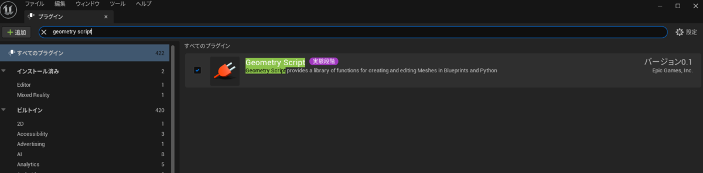
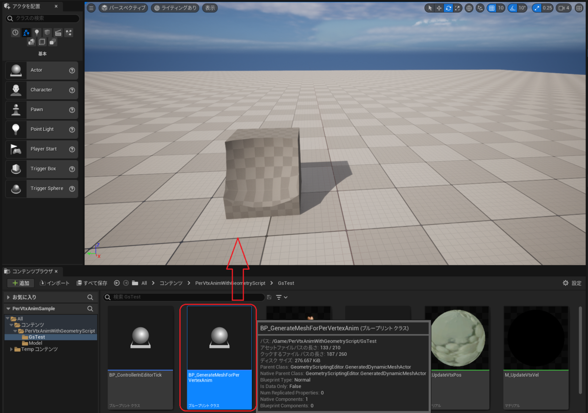
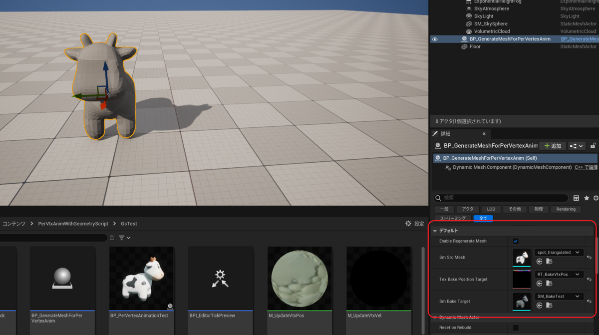
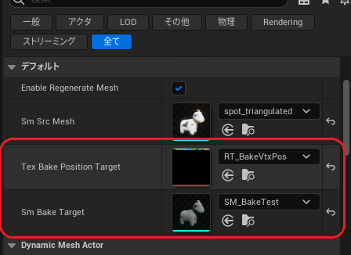
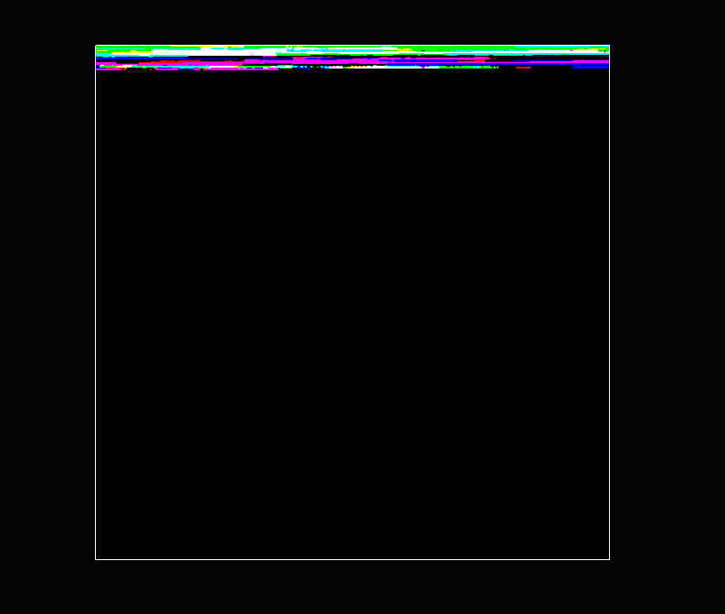
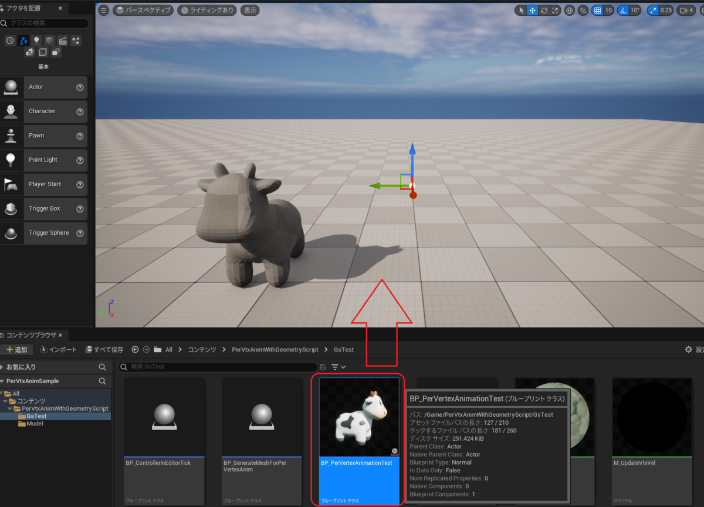
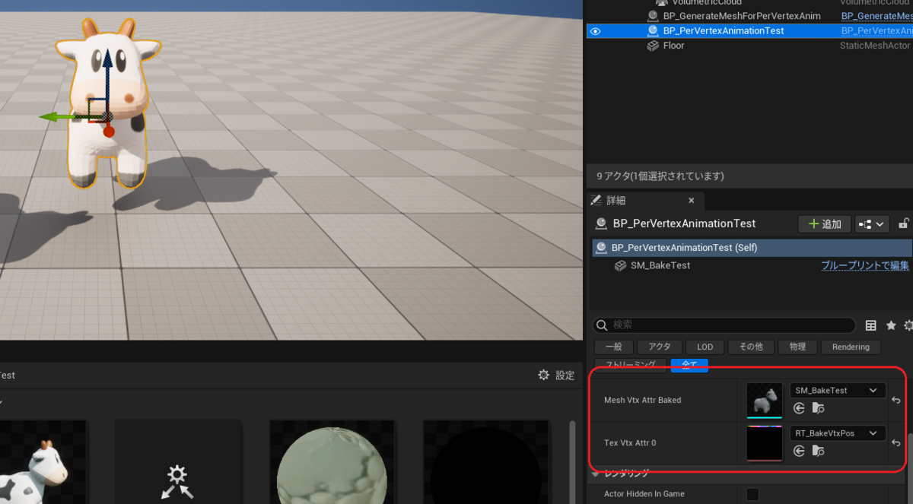

---
title: "UE5 Geometry Script を利用した頂点単位リアルタイムアニメーション"
date: "2022-10-02T19:41:37+09:00"
draft: false
url: "/entry/2022/10/02/194137/"
categories: ["Animation", "GPGPU", "Graphics", "Material", "Physics", "Shader", "Tech", "UE5", "UE4", "シェーダ", "マテリアル"]
hatena_author: "nagakagachi"
hatena_original_url: "https://nagakagachi.hatenablog.com/entry/2022/10/02/194137"
hatena_basename: "2022/10/02/194137"
math: false
image: "images/6180d11068fdae02c349a7e467eed72ac958f509a59859185abd883f9cd767a9.png"
---

Geometry Scriptの利用の一環で

<ul>
<li>入力メッシュの頂点インデックスをUV1に埋め込み、外部テクスチャに頂点座標をベイク</li>
<li>上記で生成したメッシュとテクスチャを利用してマテリアルで頂点単位バネアニメーション</li>
</ul>

というものを試してみました

<blockquote data-conversation="none" class="twitter-tweet" data-lang="ja">
realtime fake secondary motion (WIP. position, rotation, and scale operations in editor mode.  Editorモードでの位置とスケールの操作プレビュー対応まで.  あとプルプルしすぎていたので更に調整.<a href="https://twitter.com/hashtag/UE5?src=hash&amp;ref_src=twsrc%5Etfw">#UE5</a> <a href="https://t.co/xgzYPtIGpw">pic.twitter.com/xgzYPtIGpw</a>
&mdash; なが (@nagakagachi) <a href="https://twitter.com/nagakagachi/status/1561311962805719040?ref_src=twsrc%5Etfw">2022年8月21日</a></blockquote>  

    

<h3 id="サンプル">サンプル</h3>

レベルに配置されている BP_ControllerInEditorTick を動かすとプルプルします. 
Playを実行すると物理で動くモデルがプルプルします. 
<iframe src="https://hatenablog-parts.com/embed?url=https%3A%2F%2Fgithub.com%2Fnagakagachi%2Fue4%2Ftree%2Fmaster%2Fproject%2Fsample%2FPerVtxAnimSample" title="ue4/project/sample/PerVtxAnimSample at master · nagakagachi/ue4" class="embed-card embed-webcard" scrolling="no" frameborder="0" style="display: block; width: 100%; height: 155px; max-width: 500px; margin: 10px 0px;" loading="lazy"></iframe><cite class="hatena-citation"><a href="https://github.com/nagakagachi/ue4/tree/master/project/sample/PerVtxAnimSample">github.com</a></cite>

    

<h3 id="構成">構成</h3>

    
<ul>
<li>BP_GenerateMeshForPerVertexAnim
<ul>
<li>入力StaticMeshアセットから以下のようなアセットを生成する
<ul>
<li>UV1に頂点インデックスを埋め込んだStaticMesh</li>
<li>頂点インデックスに対応したテクセルにローカル頂点座標をベイクしたテクスチャ</li>
</ul></li>
</ul></li>
<li>BP_PerVertexAnimationTest
<ul>
<li>上記で生成したMeshとテクスチャを利用して頂点単位バネシミュレーションをマテリアル(<a class="keyword" href="http://d.hatena.ne.jp/keyword/GPU">GPU</a>)で計算する</li>
</ul></li>
<li>BP_ControllerInEditorTick
<ul>
<li>Editorモードのマニピュレータ操作でバネシミュをプレビューするためのコントローラ</li>
</ul></li>
</ul>

    

<h3 id="導入">導入</h3>

    

<h4 id="プロジェクトで-Geometry-Script-プラグインを有効化">プロジェクトで Geometry Script <a class="keyword" href="http://d.hatena.ne.jp/keyword/%A5%D7%A5%E9%A5%B0%A5%A4%A5%F3">プラグイン</a>を有効化</h4>

編集/<a class="keyword" href="http://d.hatena.ne.jp/keyword/%A5%D7%A5%E9%A5%B0%A5%A4%A5%F3">プラグイン</a>エディタから Geometry Script の<a class="keyword" href="http://d.hatena.ne.jp/keyword/%A5%C1%A5%A7%A5%C3%A5%AF%A5%DC%A5%C3%A5%AF%A5%B9">チェックボックス</a>をONにする 
必要ならEditorの再起動をする 
 

    

<h4 id="PerVtxAnimWithGeometryScriptを取り込み">PerVtxAnimWithGeometryScriptを取り込み</h4>

Window<a class="keyword" href="http://d.hatena.ne.jp/keyword/%A5%A8%A5%AF%A5%B9%A5%D7%A5%ED%A1%BC%A5%E9">エクスプローラ</a>上などからプロジェクトのContentフォルダにサンプルの 
PerVtxAnimWithGeometryScriptフォルダ 
をコピー

    

<h4 id="生成用サンプルアクター-をレベルに配置">生成用サンプルアクター をレベルに配置</h4>

BP_GenerateMeshForPerVertexAnim をレベルに配置 
 

    

<h4 id="生成用サンプルアクターにアセットを設定">生成用サンプルアクターにアセットを設定</h4>

BP_GenerateMeshForPerVertexAnimアクターに変換元Mesh, 出力先Mesh & RenderTargetを設定 
Sm Src Mesh に変換元のStaticMeshを設定, 図は同梱しているウシモデル(Spot)を設定している様子 
<a class="keyword" href="http://d.hatena.ne.jp/keyword/Tex">Tex</a> Bake Position Target にベイク情報を出力するRenderTargetを設定 
Sm Bake Target に変換結果のMeshを出力するStaticMeshを設定 

    

<h4 id="アセット生成">アセット生成</h4>

Geometry Scritpが駆動して Sm Bake Target と <a class="keyword" href="http://d.hatena.ne.jp/keyword/Tex">Tex</a> Bake Position Target のアセットに生成物が保存される 
Geometry Scritpはアクターのパラメータ変更等で駆動するため, 位置の変更や Enable Regenerate Mesh のONOFF等でトリガーされる

Sm Bake Target にはUV1に頂点インデックスを埋め込んだStaticMeshが出力される 
<a class="keyword" href="http://d.hatena.ne.jp/keyword/Tex">Tex</a> Bake Position Target には頂点インデックスに対応するテクセルに頂点座標がベイクされたテクスチャが出力される 
これらのアセットを利用してリアルタイムに頂点単位アニメーションを実現する 
 

    

<h4 id="ランタイムサンプルアクターをレベルに配置">ランタイムサンプルアクターをレベルに配置</h4>

BP_PerVertexAnimationTest は 上記アクターで生成されたメッシュとテクスチャを利用するサンプル 
 

    

<h4 id="ランタイムサンプルアクターにアセットを設定">ランタイムサンプルアクターにアセットを設定</h4>

BP_PerVertexAnimationTest で生成されたメッシュとテクスチャをそれぞれ 
Mesh Vtx Attr Baked と <a class="keyword" href="http://d.hatena.ne.jp/keyword/Tex">Tex</a> Vtx Attr 0 に設定 

    

<h3 id="概要">概要</h3>

頂点単位のバネシミュレーションを<a class="keyword" href="http://d.hatena.ne.jp/keyword/GPU">GPU</a>で実行するためにGeometry Scriptを利用している

Draw Material To RenderTarget で頂点単位計算を<a class="keyword" href="http://d.hatena.ne.jp/keyword/GPU">GPU</a>実行する 
そのためにメッシュのローカル頂点座標をテクスチャにベイク 
(Geometry ScriptでのアクセスとCanvasDrawでのテクスチャ書き込み) 
更にサーフェイスマテリアルで頂点毎の情報を上記テクスチャから取得するために 
Geometry ScriptでUV1に頂点インデックスを埋め込んでいる
 

Draw Material To RenderTarget でローカル頂点座標テクスチャを利用してバネ計算した結果を変位テクスチャに出力

サーフェイスマテリアルでUV1から頂点インデックスをデコードし, そのインデックスからテクセル座標を計算,  
  
テクセル座標で変位テクスチャから変位ベクトルを取得してWorldPositionOffsetで頂点を動かしている

---

[元のはてなブログ記事](https://nagakagachi.hatenablog.com/entry/2022/10/02/194137)
