---
title: "DepthPrepass有効時のCoplanar PolygonによるGPU負荷増大 [UE][Rendering]"
date: "2022-12-31T08:00:00+09:00"
draft: false
url: "/entry/2022/12/31/080000/"
categories: ["Graphics", "Material", "Mesh", "UE5", "UE4"]
hatena_author: "nagakagachi"
hatena_original_url: "https://nagakagachi.hatenablog.com/entry/2022/12/31/080000"
hatena_basename: "2022/12/31/080000"
math: false
image: "images/59936b850442a7a395812d241e30d7fbdf9a56980124ad6698d1b70727d32ba8.png"
---

DepthPrepass<a class="keyword" href="https://d.hatena.ne.jp/keyword/%A5%EC%A5%F3%A5%C0%A5%EA%A5%F3%A5%B0">レンダリング</a>に関連して,  モデルやレベルの作りによって<a class="keyword" href="https://d.hatena.ne.jp/keyword/GPU">GPU</a>負荷が増大してしまう特殊な状況について説明します.

<h3 id="問題">問題</h3>

同一平面で重なり合うポリゴン(<em>Coplanar Polygon</em>)は, 重なりの数だけBasePass PixelShaderが実行される可能性があります. <u>これにより本来DepthPrepass環境で除去される不要なBasePass負荷が追加で発生します.</u>

<blockquote>

同一平面で重なり合うポリゴン を <u>Coplanar Polygon</u> と呼んでいます. Lamina Faces や Z-Fighting状態のポリゴン というような表現もあると思います. もっと良い呼び名があれば教えてください!

</blockquote>

 以下のサンプルシーンは<u>Opaque</u>で適当ワールドノイズマテリアルのCubeをいくつか配置した状態です. よくOverDraw負荷が問題となる半透明が無いシーンなので安心と思いきや, 表示モードを「シェーダ複雑度」へ切り替えてみると.

<figure class="figure-image figure-image-fotolife" title="サンプルシーン">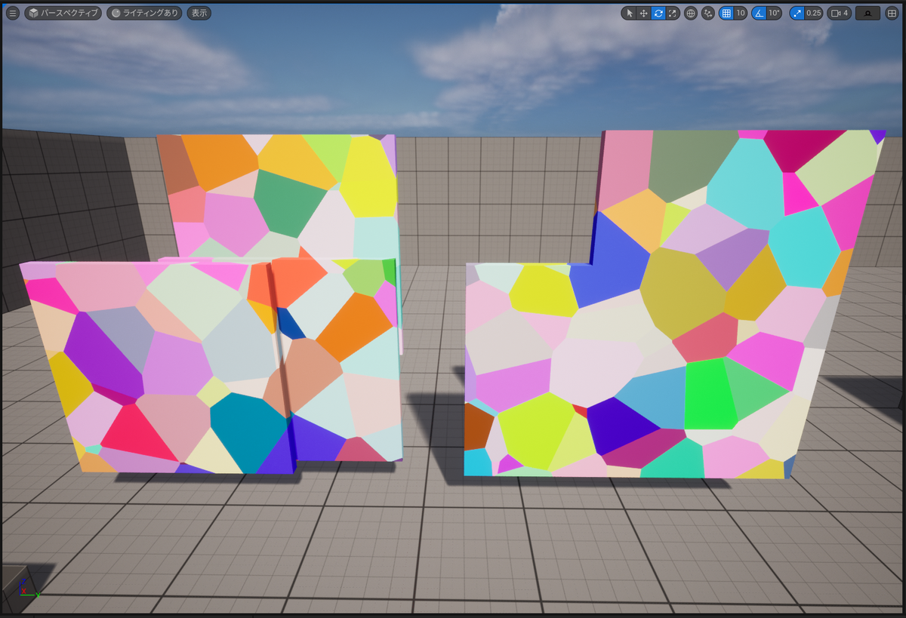 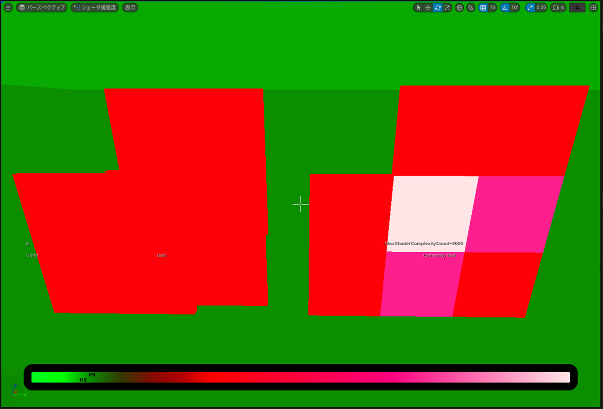
<figcaption>サンプルシーン</figcaption>
</figure>

<u>何故か高負荷を示す真っ白な部分があります</u>.

RenderDocでキャプチャして 「<u>Quad Over Draw (Pass)</u>」でOverDrawを確認します.

<figure class="figure-image figure-image-fotolife" title="RenderDoc Quad Over Draw (Pass)">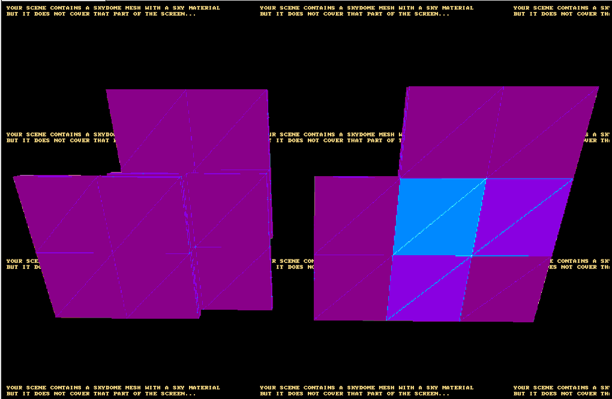
<figcaption>RenderDoc Quad Over Draw (Pass)</figcaption>
</figure>

RenderDoc上でも確かに右側の配置でBasePassのOverDrawが発生しているようです.

BasePassではDeferredの場合はGBuffer書き込み, Forwardであれば複雑なLighting計算が実行されるため,本来実行されないはずのOpaqueでのBasePass OverDrawは<a class="keyword" href="https://d.hatena.ne.jp/keyword/GPU">GPU</a>負荷に大きな影響を与えます.

<h3 id="原因">原因</h3>

この問題の原因は深度が完全に一致するポリゴンが複数重なっている点と, DepthPrepass有りBasePassの仕組みの関係によるものです.

まずシーンの配置ですが, 左側の配置と同じ3つのCubeをポリゴンが重なるように配置しています <a href="#f-9dd25646" id="fn-9dd25646" name="fn-9dd25646" title="1モデル内のポリゴン同士でも, レベルに配置した別モデルのポリゴン同士でも関係なくこの問題は発生します.">*1</a>. 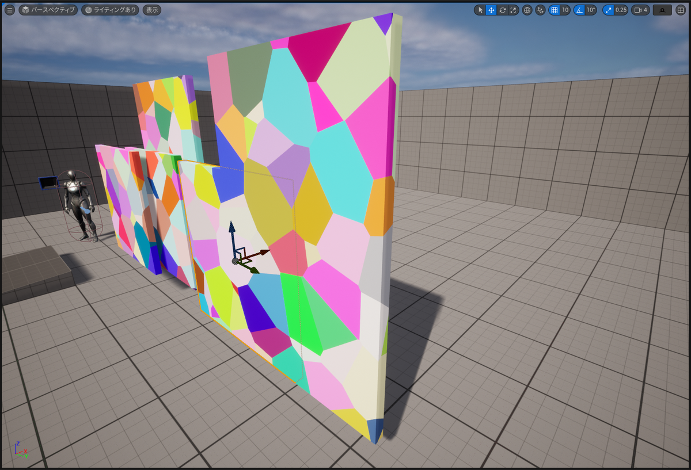 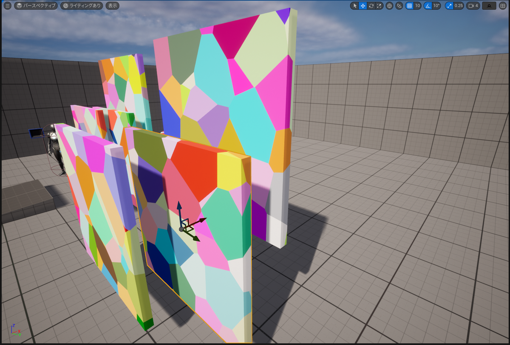

このような状況では, DepthPrepass有効時のBasePassは重なり合ったポリゴンそれぞれについて全て実行されてしまい, 高負荷なBasePassが何度も実行されることにより<a class="keyword" href="https://d.hatena.ne.jp/keyword/GPU">GPU</a>負荷を増大させます.

<h3 id="BasePassが複数回実行される理由">BasePassが複数回実行される理由</h3>

本来のDepthPrepass手法は, DepthPreapssで先に生成したDepthBufferを頼りに, 各Meshの可視<a class="keyword" href="https://d.hatena.ne.jp/keyword/%A5%D4%A5%AF%A5%BB%A5%EB">ピクセル</a>のマテリアルBasePass PixelShaderだけを最小限実行することで高速化するためのものです. 例として背景, 円柱, 板で構成されたシーンのDepthPrepass有りBasePassの挙動を以下に示します. 右側図の緑色部分がDepthTestを通過してBasePassのPixelShaderが実行された<a class="keyword" href="https://d.hatena.ne.jp/keyword/%A5%D4%A5%AF%A5%BB%A5%EB">ピクセル</a>になります.

<ol>
<li>DepthPrepassでDepthBufferが完成
<ul>
<li>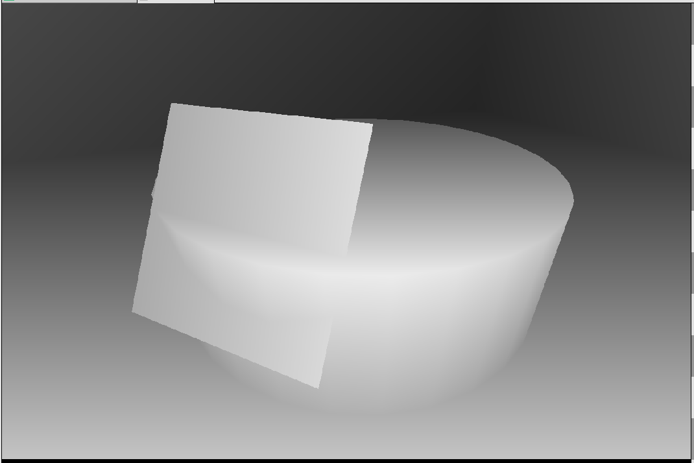</li>
</ul>
</li>
<li>円柱モデルBasePass描画
<ul>
<li>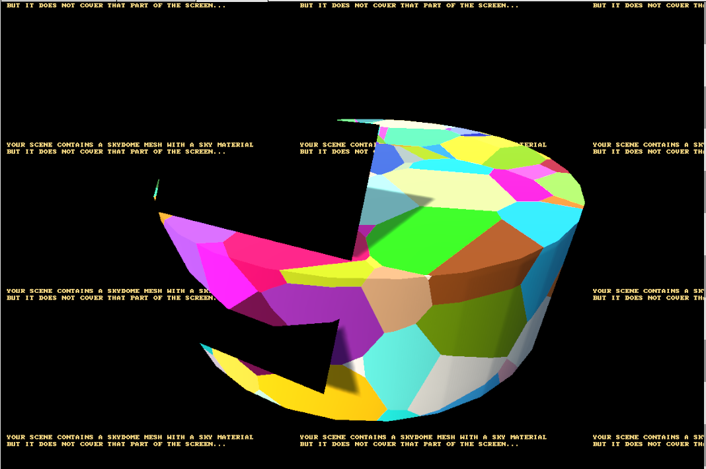 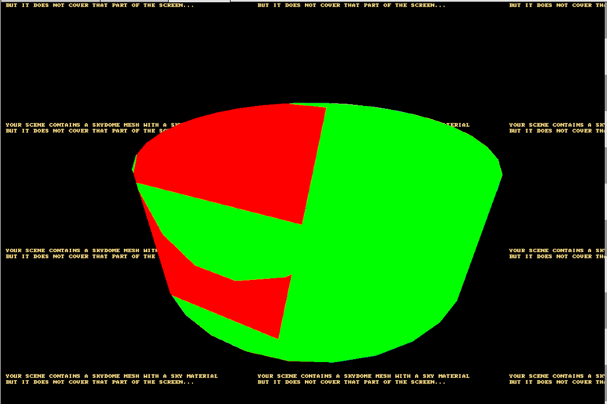</li>
</ul>
</li>
<li>背景モデルBasePass描画
<ul>
<li>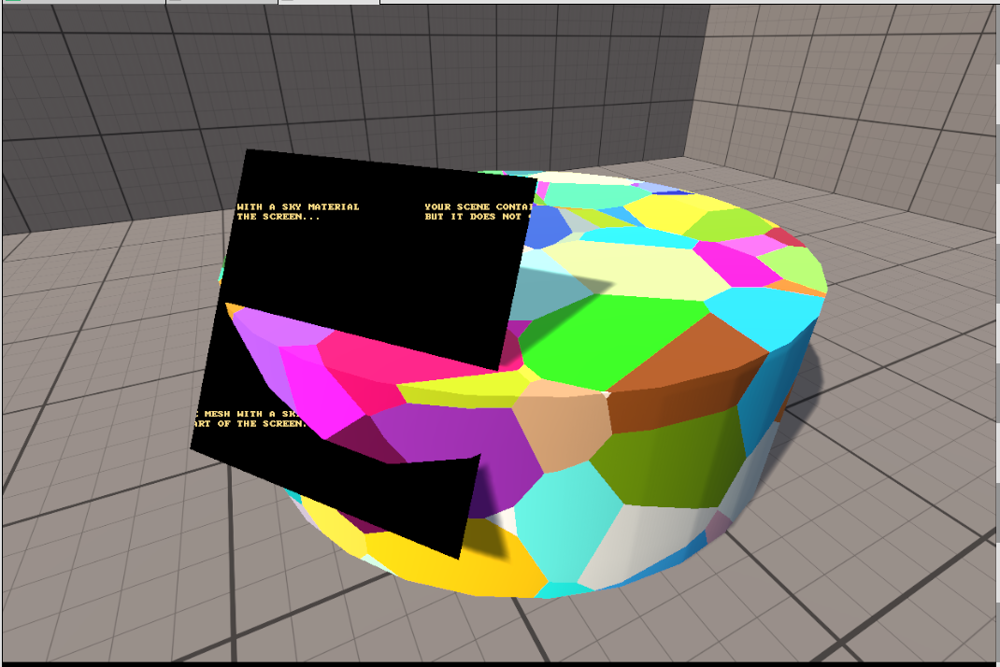 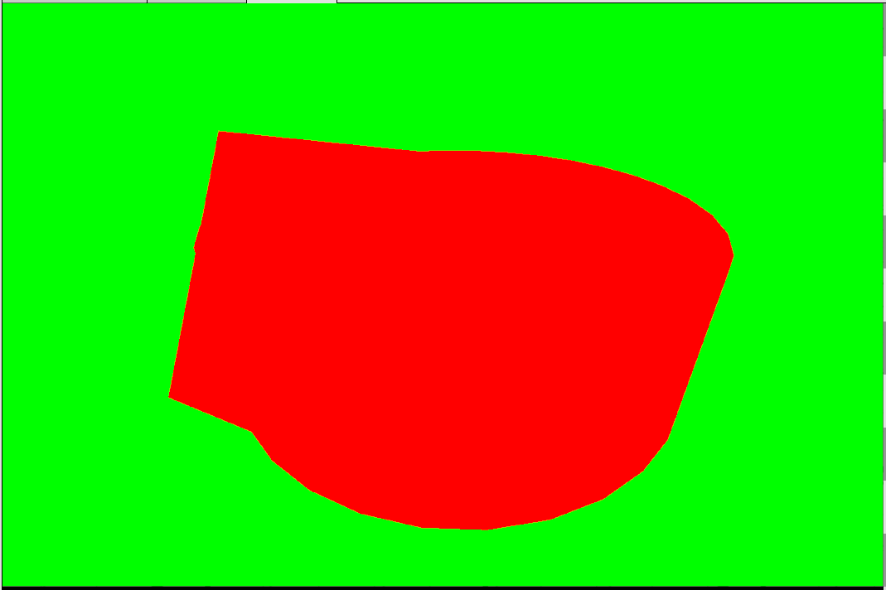</li>
</ul>
</li>
<li>板モデルBasePass描画
<ul>
<li>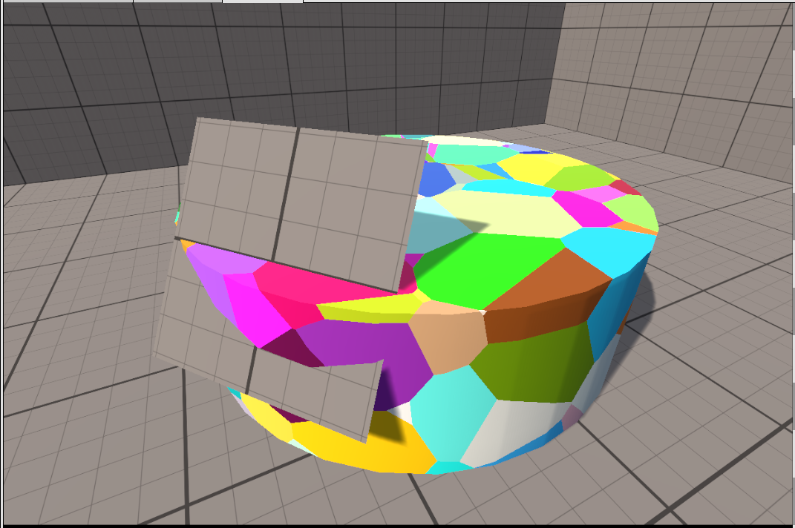 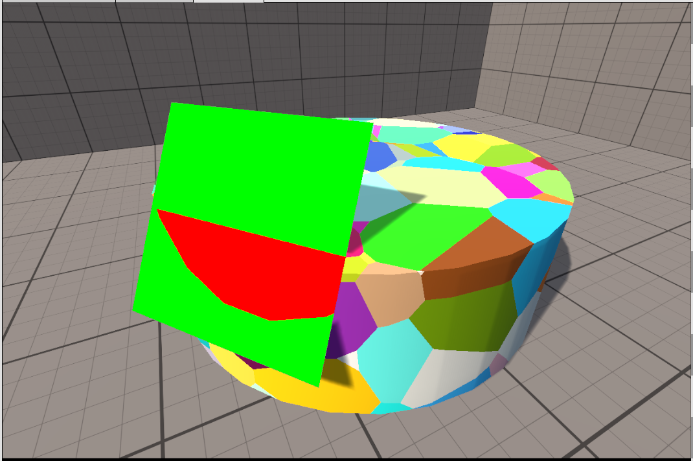</li>
</ul>
</li>
</ol>

各モデルのBasePassが, 最終的に画面に見えている部分でだけ働いているのがわかると思います.  
このようにBasePassが無駄に実行されないようにして高速化するというのがDepthPrepassの目的となります.

これを実現するためにBasePassは

<blockquote>

DepthWrite=OFF 且つ DepthTest=GreaterEqual

</blockquote>

という設定をされます <a href="#f-9b586fdf" id="fn-9b586fdf" name="fn-9b586fdf" title="GreaterEqualなのはReverseZ環境でのことで, StandardZの場合はLessEqualです.">*2</a>.

<blockquote>

指摘がありましたので追記-&gt; Maskedを含めたマテリアルをDepthPrePassを利用してEarlyZ有効で効率的に描画するために Equal なDepthTestで描画する場合があります. 本件のシーンではOpaqueを対象とし且つRenderDocキャプチャ等も確認したところGreaterEqualであったためこのように記述しています(UE5.3).

</blockquote>

この設定によって, 各モデルのBasePass描画では

<blockquote>

DepthPrepassで確定した深度値に対して <u><strong>同じか</strong></u>それより近い場合にのみ描画する

</blockquote>

という挙動をすることになります.

この <u><strong>同じかそれより近い</strong></u> という点と, 深度が完全に一致してしまう Coplanar Polygon の関係によって今回のような問題が起きています.

<h3 id="終わり">終わり</h3>

Opaqueであるにも関わらずOverDrawによってBasePass負荷を増加させるCoplanar Polygonと, 関連したDepthprepassの簡単な説明でした.  
この問題はときに異常な高負荷を発生させ, 更に原因がわかりにくいという厄介さを持っています (UE5ではシェーダ複雑度で確認できますが).   
またMaskedでも同様に問題が起きます.

モデル制作やレベル配置をする際には多少気をつけてもらえると最適化担当の人間に平穏がもたらされます.

この記事が2022最後の記事となります, 良いお年を.

<h4 id="おまけ">おまけ</h4>

 最後に問題のCoplanar Polygon状況でのRenderDocキャプチャを貼っておきます. 問題のない配置とCoplanar Polygon配置. 右図の緑がDepthTest通過<a class="keyword" href="https://d.hatena.ne.jp/keyword/%A5%D4%A5%AF%A5%BB%A5%EB">ピクセル</a>表示. OverDrawが発生している重なり部分でどのDrawでもDepthTest通過してしまっているのがわかります.

<ol>
<li>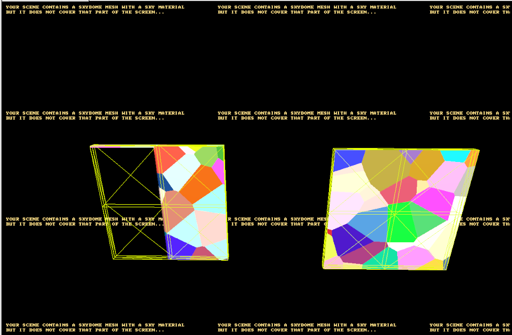 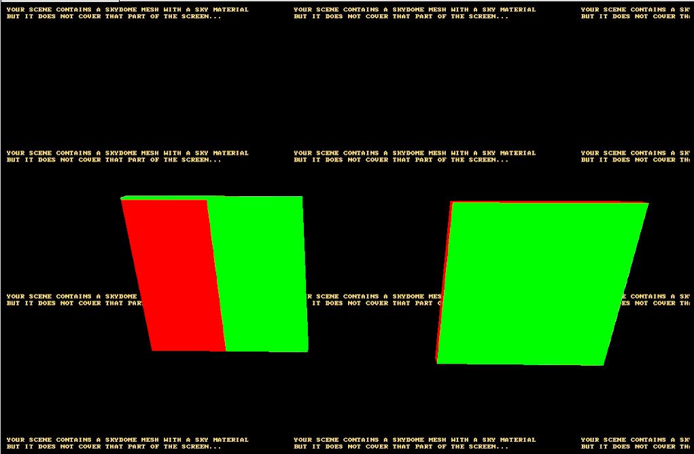</li>
<li>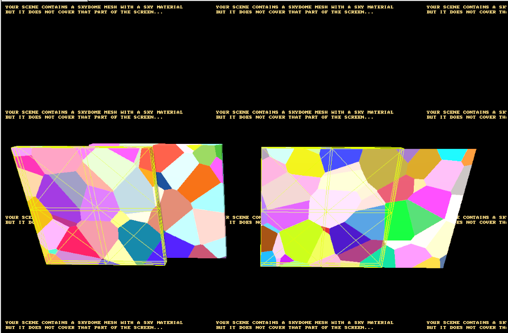 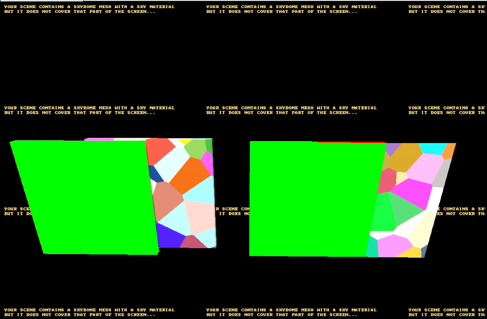</li>
<li>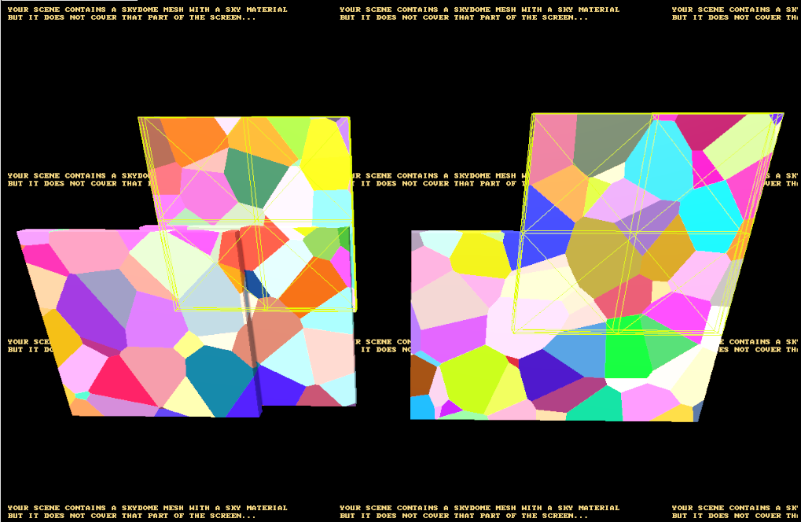 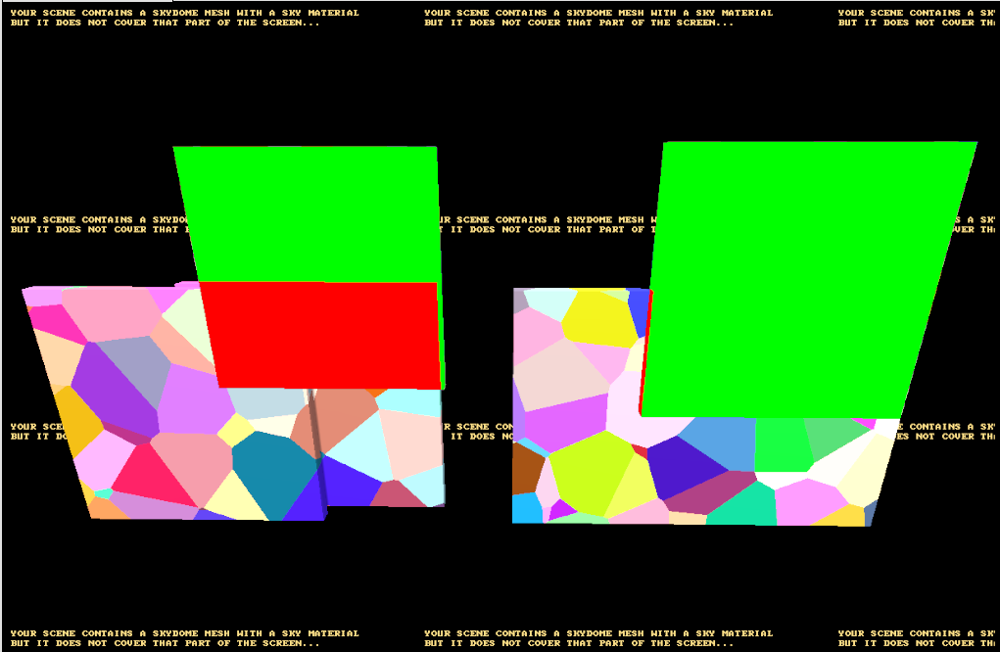</li>
</ol>

<h3 id="参考文献">参考文献</h3>

<ul>
<li>DepthPrepass(Z Prepass) 自体についてはこちらの神資料等がわかりやすいと思います.
<ul>
<li><a href="https://www.docswell.com/s/EpicGamesJapan/KVP8JK-cedec2016-unreal-engine-4#p1">CEDEC2016: Unreal Engine 4 のレンダリングフロー総おさらい | ドクセル</a></li>
</ul>
</li>
<li>当記事とはあまり関係ないですがMaskedのDepthEqual描画等についての神神資料です.
<ul>
<li><a href="https://www.docswell.com/s/EpicGamesJapan/ZJ9R1K-mask-material-only-in-early-zpass#p1">Mask Material only in Early Z-passの効果と仕組み | ドクセル</a></li>
</ul>
</li>
</ul>

<a href="#fn-9dd25646" id="f-9dd25646" name="f-9dd25646" class="footnote-number">*1</a>:1モデル内のポリゴン同士でも, レベルに配置した別モデルのポリゴン同士でも関係なくこの問題は発生します.

<a href="#fn-9b586fdf" id="f-9b586fdf" name="f-9b586fdf" class="footnote-number">*2</a>:GreaterEqualなのはReverseZ環境でのことで, StandardZの場合はLessEqualです.

---

[元のはてなブログ記事](https://nagakagachi.hatenablog.com/entry/2022/12/31/080000)
