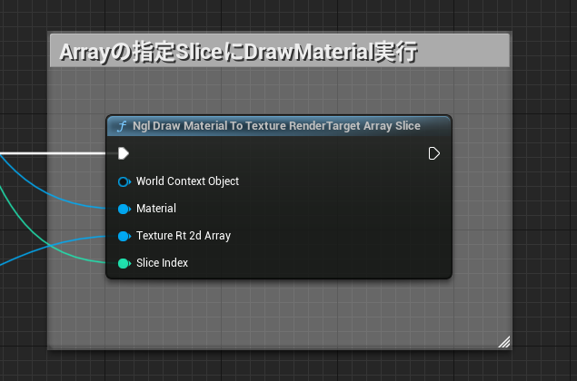
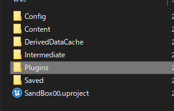
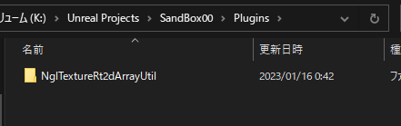
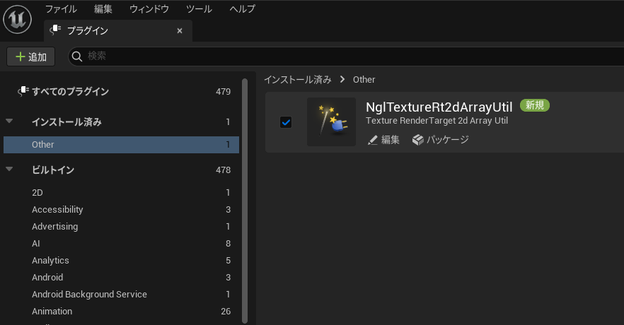
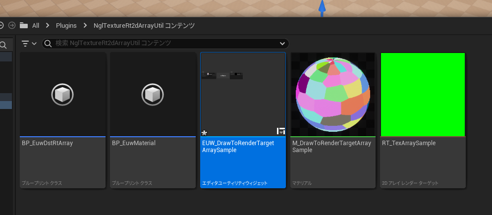
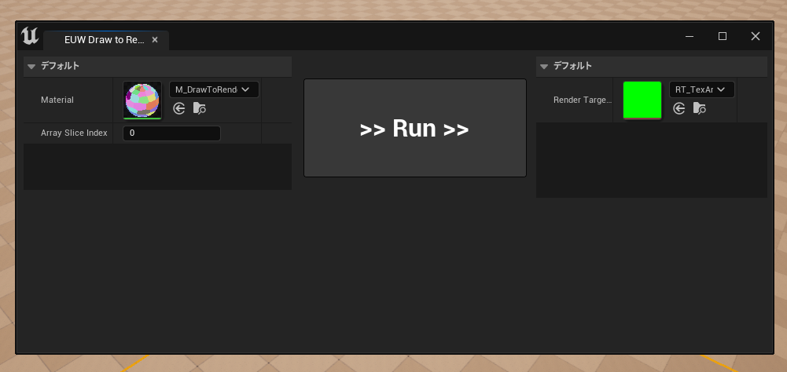
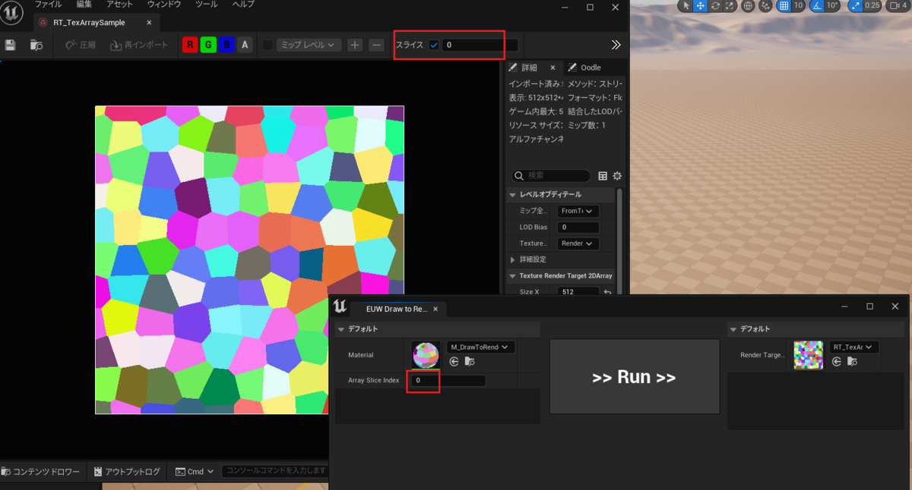

---
title: "TextureArrayに対して実行可能なDrawMaterialToRenderTargetプラグイン[UE][Plugin]"
date: "2023-01-16T08:00:00+09:00"
draft: false
url: "/entry/2023/01/16/080000/"
categories: ["C++", "Graphics", "Material", "UE5", "UnrealC++", "Plugin"]
hatena_author: "nagakagachi"
hatena_original_url: "https://nagakagachi.hatenablog.com/entry/2023/01/16/080000"
hatena_basename: "2023/01/16/080000"
math: false
image: "images/aaba9895685d049e9eb1dd70e574973e2883642033bf736247f8afe0a99a26ea.png"
---

<strong>TextureRenderTarget2DArray</strong> のSlice(配列の要素)を指定して <strong>DrawMaterialToRenderTarget</strong> ができるUE<a class="keyword" href="https://d.hatena.ne.jp/keyword/%A5%D7%A5%E9%A5%B0%A5%A4%A5%F3">プラグイン</a>の公開. 
 

<ul class="table-of-contents">
<li><a href="#これは何">これは何</a></li>
<li><a href="#導入">導入</a><ul>
<li><a href="#リポジトリの-NglTextureRt2dArrayUtil-をコピー">リポジトリの NglTextureRt2dArrayUtil をコピー</a></li>
<li><a href="#プラグインが読み込まれているか確認">プラグインが読み込まれているか確認</a></li>
</ul>
</li>
<li><a href="#サンプル">サンプル</a></li>
<li><a href="#最後">最後</a></li>
</ul>

    

<h3 id="これは何">これは何</h3>

テクスチャ配列アセットの要素に対してマテリアル描画を実行できる<a class="keyword" href="https://d.hatena.ne.jp/keyword/%A5%D7%A5%E9%A5%B0%A5%A4%A5%F3">プラグイン</a>. 
UE標準のDrawMaterialToRenderTargetノードとほぼ同じで, TextureRenderTarget2DArrayとその何番目にDrawするかを指定できる.

<figure class="figure-image figure-image-fotolife" title="NglDrawMaterialToRenderTargetArraySliceノード"><figcaption>NglDrawMaterialToRenderTargetArraySliceノード</figcaption></figure>

内部で一時テクスチャの生成やコピーをする必要があったため, ゲーム中にリアルタイム利用するような用途向きではない点に注意.  
  
エンジン改造無しで実装するためにこうなったが今後修正できるかもしれない(未定),

動作確認 UE5.1 <a class="keyword" href="https://d.hatena.ne.jp/keyword/Win64">Win64</a>

    

<h3 id="導入">導入</h3>

    

<h4 id="リポジトリの-NglTextureRt2dArrayUtil-をコピー"><a class="keyword" href="https://d.hatena.ne.jp/keyword/%A5%EA%A5%DD%A5%B8%A5%C8%A5%EA">リポジトリ</a>の NglTextureRt2dArrayUtil をコピー</h4>

<a href="https://github.com/nagakagachi/ue_plugin/tree/main/distribution/NglTextureRt2dArrayUtil">ue_plugin/distribution/NglTextureRt2dArrayUtil at main &middot; nagakagachi/ue_plugin &middot; GitHub</a>

自身のプロジェクトに Plugins <a class="keyword" href="https://d.hatena.ne.jp/keyword/%A5%C7%A5%A3%A5%EC%A5%AF%A5%C8">ディレクト</a>リを作成し, その中に上記<a class="keyword" href="https://d.hatena.ne.jp/keyword/Github">Github</a>の NglTextureRt2dArrayUtil <a class="keyword" href="https://d.hatena.ne.jp/keyword/%A5%C7%A5%A3%A5%EC%A5%AF%A5%C8">ディレクト</a>リをコピーペーストする. 
 
 

<h4 id="プラグインが読み込まれているか確認"><a class="keyword" href="https://d.hatena.ne.jp/keyword/%A5%D7%A5%E9%A5%B0%A5%A4%A5%F3">プラグイン</a>が読み込まれているか確認</h4>

プロジェクトを開いて 編集/<a class="keyword" href="https://d.hatena.ne.jp/keyword/%A5%D7%A5%E9%A5%B0%A5%A4%A5%F3">プラグイン</a> のウィンドウを開き, NglTextureRt2dArrayUtil<a class="keyword" href="https://d.hatena.ne.jp/keyword/%A5%D7%A5%E9%A5%B0%A5%A4%A5%F3">プラグイン</a>が有効になっていればOK. 
 

    

<h3 id="サンプル">サンプル</h3>

<a class="keyword" href="https://d.hatena.ne.jp/keyword/%A5%D7%A5%E9%A5%B0%A5%A4%A5%F3">プラグイン</a>コンテンツのEditorUtilityWidget <strong>EUW_DrawToRenderTargetArraySample</strong> を右クリック->エディターユーティリティウィジットを実行 で簡易サンプルが起動する 
 
 

<ol>
<li>ウィンドウ左側にマテリアルと描画先Array要素番号(Slice Index)を指定.</li>
<li>ウィンドウ右側に書き込み先のTextureRTArrayアセットを指定。</li>
<li>Runボタン を押すとArray指定要素にマテリアル描画が実行される.</li>
</ol>
下図は<a class="keyword" href="https://d.hatena.ne.jp/keyword/Widget">Widget</a>でSlice 0番に対して実行して, エディタでTextureRTArrayの Slice 0 を表示して結果を確認している様子. 

 

出来上がったTextureRtArrayをテクスチャ配列アセットに変換するなどご自由に.

    

<h3 id="最後">最後</h3>

役にたった場合は<a class="keyword" href="https://d.hatena.ne.jp/keyword/Github">Github</a>のStarや使ったよというメッセージを貰えると嬉しいです!

そもそも作った理由はエディタでマテリアルを使って自由に色々なテクスチャ配列を作りたかったため.  
  
面白い使い方やもっと良い機能案があればご連絡ください.

 

以上...

---

[元のはてなブログ記事](https://nagakagachi.hatenablog.com/entry/2023/01/16/080000)
