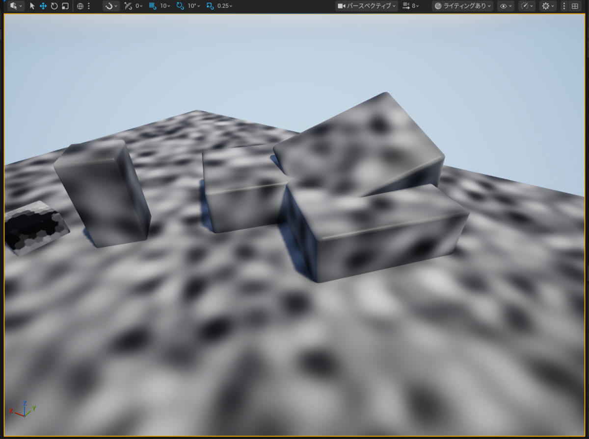
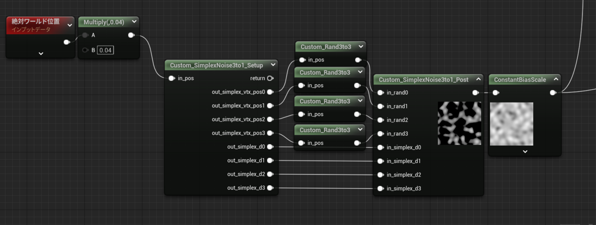
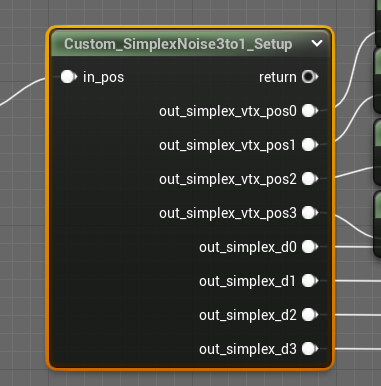
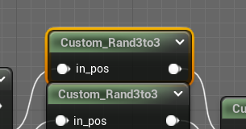
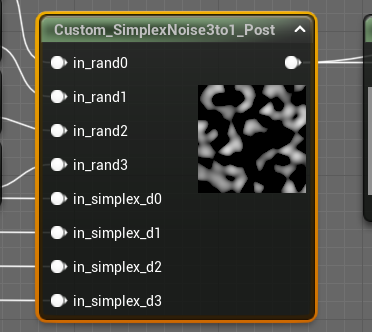

---
title: "Simplex頂点に任意の乱数を利用できるSimplex Noise Custom Node[UE][UE5]"
date: "2023-07-26T13:52:33+09:00"
draft: false
url: "/entry/2023/07/26/135233/"
categories: ["Graphics", "HLSL", "Material", "Shader", "UE4", "UE5", "シェーダ", "マテリアル"]
hatena_author: "nagakagachi"
hatena_original_url: "https://nagakagachi.hatenablog.com/entry/2023/07/26/135233"
hatena_basename: "2023/07/26/135233"
math: false
image: "images/1a45015452350cb2918ce03f7060bd4fc083c8bcfcac3def2bc52f7e6b2fcb22.png"
---

題名の通りです.  
  
個人的な興味により Simplex Noiseの頂点毎の乱数計算 を差し替えられるCustomNodeを作成したので公開.

Simplex Noise には以下のShadertoyを参考にしています. thanks! 
<a href="https://www.shadertoy.com/view/XsX3zB">https://www.shadertoy.com/view/XsX3zB</a> 
(XsX3zB)

 

<ul class="table-of-contents">
<li><a href="#前置き">前置き</a></li>
<li><a href="#コピペ用テキスト">コピペ用テキスト</a><ul>
<li><a href="#前処理CustomNode">前処理CustomNode</a></li>
<li><a href="#乱数CustomNode-3D座標から3D乱数出力ができるものに置き換え可能">乱数CustomNode (3D座標から3D乱数出力ができるものに置き換え可能)</a></li>
<li><a href="#後処理CustomNode">後処理CustomNode</a></li>
</ul>
</li>
<li><a href="#おまけ">おまけ</a><ul>
<li><a href="#マテリアルコピペ用">マテリアルコピペ用</a></li>
</ul>
</li>
</ul>

    

<h3 id="前置き">前置き</h3>

    

CustomNodeは3段階(コア部分は2段階)で,

<ol>
<li>前処理
<ul>
<li>Simplexの頂点情報他を出力</li>
</ul></li>
<li>乱数ノード
<ul>
<li>(ここが任意に差し替え可)</li>
</ul></li>
<li>後処理
<ul>
<li>Simplex頂点の乱数からノイズ出力</li>
</ul></li>
</ol>

という構成です.

使用例としては以下のようになります.

<figure class="figure-image figure-image-fotolife" title="使用例"><figcaption>使用例</figcaption></figure>

    

<h3 id="コピペ用テキスト">コピペ用テキスト</h3>

マテリアルエディタにうまくコピペできない等の問題がありましたら<a class="keyword" href="https://d.hatena.ne.jp/keyword/Twitter">Twitter</a>等でお知らせください.

    

<h4 id="前処理CustomNode">前処理CustomNode</h4>

<pre class="code lang-hlsl" data-lang="hlsl" data-unlink>Begin Object Class=/Script/UnrealEd.MaterialGraphNode Name=&quot;MaterialGraphNode_109&quot;
   Begin Object Class=/Script/Engine.MaterialExpressionCustom Name=&quot;MaterialExpressionCustom_0&quot;
   End Object
   Begin Object Name=&quot;MaterialExpressionCustom_0&quot;
      Code=&quot;\r\n/*\r\n    3D SimplexNoise の前段処理\r\n[Reference materials]\r\nhttps://www.shadertoy.com/view/XsX3zB\r\n\r\n\r\n    input:\r\n            // ノイズ計算座標.\r\n            in_pos\r\n\r\n    output:\r\n            // Simplex(3DではTetrahedron)の頂点座標\r\n            out_simplex_vtx_pos0\r\n            out_simplex_vtx_pos1\r\n            out_simplex_vtx_pos2\r\n            out_simplex_vtx_pos3\r\n            \r\n            // Simplexの頂点へのベクトル. 後段でのGradientNoise計算用.\r\n            out_simplex_d0\r\n            out_simplex_d1\r\n            out_simplex_d2\r\n            out_simplex_d3\r\n\r\n*/\r\n\r\nconst float F3 = 0.33333;\r\nconst float G3 = 0.16667;\r\n// Skew\r\nfloat3 s = floor(in_pos + dot(in_pos, F3));\r\nfloat3 x = in_pos - s + dot(s, G3);\r\n//\r\nfloat3 e = step(0.0, x - x.yzx);\r\nfloat3 i1 = e * (1.0 - e.zxy);\r\nfloat3 i2 = 1.0 - e.zxy*(1.0-e);\r\n\r\n//\r\nfloat3 x1 = x - i1 + G3;\r\nfloat3 x2 = x - i2 + 2.0 * G3;\r\nfloat3 x3 = x - 1.0 + 3.0*G3;\r\n\r\nout_simplex_vtx_pos0 = s;\r\nout_simplex_vtx_pos1 = s + i1;\r\nout_simplex_vtx_pos2 = s + i2;\r\nout_simplex_vtx_pos3 = s + 1;\r\n\r\nout_simplex_d0 = x;\r\nout_simplex_d1 = x1;\r\nout_simplex_d2 = x2;\r\nout_simplex_d3 = x3;\r\n\r\nreturn 1;&quot;
      Description=&quot;Custom_SimplexNoise3to1_Setup&quot;
      Inputs(0)=(InputName=&quot;in_pos&quot;,Input=(Expression=/Script/Engine.MaterialExpressionAdd'&quot;MaterialExpressionAdd_5&quot;'))
      AdditionalOutputs(0)=(OutputName=&quot;out_simplex_vtx_pos0&quot;,OutputType=CMOT_Float3)
      AdditionalOutputs(1)=(OutputName=&quot;out_simplex_vtx_pos1&quot;,OutputType=CMOT_Float3)
      AdditionalOutputs(2)=(OutputName=&quot;out_simplex_vtx_pos2&quot;,OutputType=CMOT_Float3)
      AdditionalOutputs(3)=(OutputName=&quot;out_simplex_vtx_pos3&quot;,OutputType=CMOT_Float3)
      AdditionalOutputs(4)=(OutputName=&quot;out_simplex_d0&quot;,OutputType=CMOT_Float3)
      AdditionalOutputs(5)=(OutputName=&quot;out_simplex_d1&quot;,OutputType=CMOT_Float3)
      AdditionalOutputs(6)=(OutputName=&quot;out_simplex_d2&quot;,OutputType=CMOT_Float3)
      AdditionalOutputs(7)=(OutputName=&quot;out_simplex_d3&quot;,OutputType=CMOT_Float3)
      MaterialExpressionEditorX=-2048
      MaterialExpressionEditorY=2512
      MaterialExpressionGuid=4244B9A4494561E6D73F14B3D48C4E67
      Material=/Script/UnrealEd.PreviewMaterial'&quot;/Engine/Transient.M_InnerLayerPm2&quot;'
      bShowOutputNameOnPin=True
      bCollapsed=True
      Outputs(0)=(OutputName=&quot;return&quot;)
      Outputs(1)=(OutputName=&quot;out_simplex_vtx_pos0&quot;)
      Outputs(2)=(OutputName=&quot;out_simplex_vtx_pos1&quot;)
      Outputs(3)=(OutputName=&quot;out_simplex_vtx_pos2&quot;)
      Outputs(4)=(OutputName=&quot;out_simplex_vtx_pos3&quot;)
      Outputs(5)=(OutputName=&quot;out_simplex_d0&quot;)
      Outputs(6)=(OutputName=&quot;out_simplex_d1&quot;)
      Outputs(7)=(OutputName=&quot;out_simplex_d2&quot;)
      Outputs(8)=(OutputName=&quot;out_simplex_d3&quot;)
   End Object
   MaterialExpression=/Script/Engine.MaterialExpressionCustom'&quot;MaterialExpressionCustom_0&quot;'
   NodePosX=-2048
   NodePosY=2512
   NodeGuid=694DDEB64074FA334F4FD9A71A7FD483
   CustomProperties Pin (PinId=14B3EA4E44D4A873700D33A55F7AE5AD,PinName=&quot;in_pos&quot;,PinType.PinCategory=&quot;required&quot;,PinType.PinSubCategory=&quot;&quot;,PinType.PinSubCategoryObject=None,PinType.PinSubCategoryMemberReference=(),PinType.PinValueType=(),PinType.ContainerType=None,PinType.bIsReference=False,PinType.bIsConst=False,PinType.bIsWeakPointer=False,PinType.bIsUObjectWrapper=False,PinType.bSerializeAsSinglePrecisionFloat=False,LinkedTo=(MaterialGraphNode_103 5246F4EE4F841D0B87A775BDC4A8D155,),PersistentGuid=00000000000000000000000000000000,bHidden=False,bNotConnectable=False,bDefaultValueIsReadOnly=False,bDefaultValueIsIgnored=False,bAdvancedView=False,bOrphanedPin=False,)
   CustomProperties Pin (PinId=B819619E4D1A27419AB524893B6ECD84,PinName=&quot;return&quot;,Direction=&quot;EGPD_Output&quot;,PinType.PinCategory=&quot;&quot;,PinType.PinSubCategory=&quot;&quot;,PinType.PinSubCategoryObject=None,PinType.PinSubCategoryMemberReference=(),PinType.PinValueType=(),PinType.ContainerType=None,PinType.bIsReference=False,PinType.bIsConst=False,PinType.bIsWeakPointer=False,PinType.bIsUObjectWrapper=False,PinType.bSerializeAsSinglePrecisionFloat=False,PersistentGuid=00000000000000000000000000000000,bHidden=False,bNotConnectable=False,bDefaultValueIsReadOnly=False,bDefaultValueIsIgnored=False,bAdvancedView=False,bOrphanedPin=False,)
   CustomProperties Pin (PinId=9EE1744F4571B813B1BBDE890386E4B4,PinName=&quot;out_simplex_vtx_pos0&quot;,Direction=&quot;EGPD_Output&quot;,PinType.PinCategory=&quot;&quot;,PinType.PinSubCategory=&quot;&quot;,PinType.PinSubCategoryObject=None,PinType.PinSubCategoryMemberReference=(),PinType.PinValueType=(),PinType.ContainerType=None,PinType.bIsReference=False,PinType.bIsConst=False,PinType.bIsWeakPointer=False,PinType.bIsUObjectWrapper=False,PinType.bSerializeAsSinglePrecisionFloat=False,LinkedTo=(MaterialGraphNode_111 9D0A05744027353F9E7118A2194B1162,),PersistentGuid=00000000000000000000000000000000,bHidden=False,bNotConnectable=False,bDefaultValueIsReadOnly=False,bDefaultValueIsIgnored=False,bAdvancedView=False,bOrphanedPin=False,)
   CustomProperties Pin (PinId=1E152C9B4E3FDD460C71EBBD7728B4F5,PinName=&quot;out_simplex_vtx_pos1&quot;,Direction=&quot;EGPD_Output&quot;,PinType.PinCategory=&quot;&quot;,PinType.PinSubCategory=&quot;&quot;,PinType.PinSubCategoryObject=None,PinType.PinSubCategoryMemberReference=(),PinType.PinValueType=(),PinType.ContainerType=None,PinType.bIsReference=False,PinType.bIsConst=False,PinType.bIsWeakPointer=False,PinType.bIsUObjectWrapper=False,PinType.bSerializeAsSinglePrecisionFloat=False,LinkedTo=(MaterialGraphNode_113 8126FF97480C0E2317A4F7A582DAD0A3,),PersistentGuid=00000000000000000000000000000000,bHidden=False,bNotConnectable=False,bDefaultValueIsReadOnly=False,bDefaultValueIsIgnored=False,bAdvancedView=False,bOrphanedPin=False,)
   CustomProperties Pin (PinId=EDB6385B40CB4F839646B784E3E9D173,PinName=&quot;out_simplex_vtx_pos2&quot;,Direction=&quot;EGPD_Output&quot;,PinType.PinCategory=&quot;&quot;,PinType.PinSubCategory=&quot;&quot;,PinType.PinSubCategoryObject=None,PinType.PinSubCategoryMemberReference=(),PinType.PinValueType=(),PinType.ContainerType=None,PinType.bIsReference=False,PinType.bIsConst=False,PinType.bIsWeakPointer=False,PinType.bIsUObjectWrapper=False,PinType.bSerializeAsSinglePrecisionFloat=False,LinkedTo=(MaterialGraphNode_112 164ABAAD466D2377D81D0CA5A60C9B3C,),PersistentGuid=00000000000000000000000000000000,bHidden=False,bNotConnectable=False,bDefaultValueIsReadOnly=False,bDefaultValueIsIgnored=False,bAdvancedView=False,bOrphanedPin=False,)
   CustomProperties Pin (PinId=72873D064EE5FD985F001AA3892D9F49,PinName=&quot;out_simplex_vtx_pos3&quot;,Direction=&quot;EGPD_Output&quot;,PinType.PinCategory=&quot;&quot;,PinType.PinSubCategory=&quot;&quot;,PinType.PinSubCategoryObject=None,PinType.PinSubCategoryMemberReference=(),PinType.PinValueType=(),PinType.ContainerType=None,PinType.bIsReference=False,PinType.bIsConst=False,PinType.bIsWeakPointer=False,PinType.bIsUObjectWrapper=False,PinType.bSerializeAsSinglePrecisionFloat=False,LinkedTo=(MaterialGraphNode_114 7D8DCA5C4A5DE0ACA7BD0C82724D301A,),PersistentGuid=00000000000000000000000000000000,bHidden=False,bNotConnectable=False,bDefaultValueIsReadOnly=False,bDefaultValueIsIgnored=False,bAdvancedView=False,bOrphanedPin=False,)
   CustomProperties Pin (PinId=7746174D4FB60AF7C5C5F095B5CA2773,PinName=&quot;out_simplex_d0&quot;,Direction=&quot;EGPD_Output&quot;,PinType.PinCategory=&quot;&quot;,PinType.PinSubCategory=&quot;&quot;,PinType.PinSubCategoryObject=None,PinType.PinSubCategoryMemberReference=(),PinType.PinValueType=(),PinType.ContainerType=None,PinType.bIsReference=False,PinType.bIsConst=False,PinType.bIsWeakPointer=False,PinType.bIsUObjectWrapper=False,PinType.bSerializeAsSinglePrecisionFloat=False,LinkedTo=(MaterialGraphNode_110 DB76CCAB48E57973572CEC889D1AD7A3,),PersistentGuid=00000000000000000000000000000000,bHidden=False,bNotConnectable=False,bDefaultValueIsReadOnly=False,bDefaultValueIsIgnored=False,bAdvancedView=False,bOrphanedPin=False,)
   CustomProperties Pin (PinId=00AD30144201B89E1E00758A88479315,PinName=&quot;out_simplex_d1&quot;,Direction=&quot;EGPD_Output&quot;,PinType.PinCategory=&quot;&quot;,PinType.PinSubCategory=&quot;&quot;,PinType.PinSubCategoryObject=None,PinType.PinSubCategoryMemberReference=(),PinType.PinValueType=(),PinType.ContainerType=None,PinType.bIsReference=False,PinType.bIsConst=False,PinType.bIsWeakPointer=False,PinType.bIsUObjectWrapper=False,PinType.bSerializeAsSinglePrecisionFloat=False,LinkedTo=(MaterialGraphNode_110 62FD7FB84275385A5AE2688318A0242F,),PersistentGuid=00000000000000000000000000000000,bHidden=False,bNotConnectable=False,bDefaultValueIsReadOnly=False,bDefaultValueIsIgnored=False,bAdvancedView=False,bOrphanedPin=False,)
   CustomProperties Pin (PinId=A101A4114BE2E007A7A9DE8B88751614,PinName=&quot;out_simplex_d2&quot;,Direction=&quot;EGPD_Output&quot;,PinType.PinCategory=&quot;&quot;,PinType.PinSubCategory=&quot;&quot;,PinType.PinSubCategoryObject=None,PinType.PinSubCategoryMemberReference=(),PinType.PinValueType=(),PinType.ContainerType=None,PinType.bIsReference=False,PinType.bIsConst=False,PinType.bIsWeakPointer=False,PinType.bIsUObjectWrapper=False,PinType.bSerializeAsSinglePrecisionFloat=False,LinkedTo=(MaterialGraphNode_110 68133C4D4BE01D7D4C180184CC5A24C8,),PersistentGuid=00000000000000000000000000000000,bHidden=False,bNotConnectable=False,bDefaultValueIsReadOnly=False,bDefaultValueIsIgnored=False,bAdvancedView=False,bOrphanedPin=False,)
   CustomProperties Pin (PinId=CF20B6B54351C38C12EB46B59994524D,PinName=&quot;out_simplex_d3&quot;,Direction=&quot;EGPD_Output&quot;,PinType.PinCategory=&quot;&quot;,PinType.PinSubCategory=&quot;&quot;,PinType.PinSubCategoryObject=None,PinType.PinSubCategoryMemberReference=(),PinType.PinValueType=(),PinType.ContainerType=None,PinType.bIsReference=False,PinType.bIsConst=False,PinType.bIsWeakPointer=False,PinType.bIsUObjectWrapper=False,PinType.bSerializeAsSinglePrecisionFloat=False,LinkedTo=(MaterialGraphNode_110 1419241C4116FF68392D659CFBE3035C,),PersistentGuid=00000000000000000000000000000000,bHidden=False,bNotConnectable=False,bDefaultValueIsReadOnly=False,bDefaultValueIsIgnored=False,bAdvancedView=False,bOrphanedPin=False,)
End Object
</pre>

    

<h4 id="乱数CustomNode-3D座標から3D乱数出力ができるものに置き換え可能">乱数CustomNode (3D座標から3D乱数出力ができるものに置き換え可能)</h4>

<pre class="code lang-hlsl" data-lang="hlsl" data-unlink>Begin Object Class=/Script/UnrealEd.MaterialGraphNode Name=&quot;MaterialGraphNode_111&quot;
   Begin Object Class=/Script/Engine.MaterialExpressionCustom Name=&quot;MaterialExpressionCustom_2&quot;
   End Object
   Begin Object Name=&quot;MaterialExpressionCustom_2&quot;
      Code=&quot;float j = 4096.0*sin(dot(in_pos,float3(17.0, 59.4, 15.0)));\r\nfloat3 r;\r\nr.z = frac(512.0*j);\r\nj *= .125;\r\nr.x = frac(512.0*j);\r\nj *= .125;\r\nr.y = frac(512.0*j);\r\nreturn r * 2.0 - 1.0; // [-1.0, +1.0]&quot;
      Description=&quot;Custom_Rand3to3&quot;
      Inputs(0)=(InputName=&quot;in_pos&quot;,Input=(Expression=/Script/Engine.MaterialExpressionCustom'&quot;MaterialExpressionCustom_0&quot;',OutputIndex=1))
      MaterialExpressionEditorX=-1758
      MaterialExpressionEditorY=2471
      MaterialExpressionGuid=8E96CA8240B4E2A0E551B78CCB82D4BB
      Material=/Script/UnrealEd.PreviewMaterial'&quot;/Engine/Transient.M_InnerLayerPm2&quot;'
      bCollapsed=True
   End Object
   MaterialExpression=/Script/Engine.MaterialExpressionCustom'&quot;MaterialExpressionCustom_2&quot;'
   NodePosX=-1758
   NodePosY=2471
   NodeGuid=DFAA6DB9408EE68647E4ED8C95D200B5
   CustomProperties Pin (PinId=9D0A05744027353F9E7118A2194B1162,PinName=&quot;in_pos&quot;,PinType.PinCategory=&quot;required&quot;,PinType.PinSubCategory=&quot;&quot;,PinType.PinSubCategoryObject=None,PinType.PinSubCategoryMemberReference=(),PinType.PinValueType=(),PinType.ContainerType=None,PinType.bIsReference=False,PinType.bIsConst=False,PinType.bIsWeakPointer=False,PinType.bIsUObjectWrapper=False,PinType.bSerializeAsSinglePrecisionFloat=False,LinkedTo=(MaterialGraphNode_109 9EE1744F4571B813B1BBDE890386E4B4,),PersistentGuid=00000000000000000000000000000000,bHidden=False,bNotConnectable=False,bDefaultValueIsReadOnly=False,bDefaultValueIsIgnored=False,bAdvancedView=False,bOrphanedPin=False,)
   CustomProperties Pin (PinId=88D45E3940F121BFE10297B3111BCD2E,PinName=&quot;Output&quot;,PinFriendlyName=NSLOCTEXT(&quot;MaterialGraphNode&quot;, &quot;Space&quot;, &quot; &quot;),Direction=&quot;EGPD_Output&quot;,PinType.PinCategory=&quot;&quot;,PinType.PinSubCategory=&quot;&quot;,PinType.PinSubCategoryObject=None,PinType.PinSubCategoryMemberReference=(),PinType.PinValueType=(),PinType.ContainerType=None,PinType.bIsReference=False,PinType.bIsConst=False,PinType.bIsWeakPointer=False,PinType.bIsUObjectWrapper=False,PinType.bSerializeAsSinglePrecisionFloat=False,LinkedTo=(MaterialGraphNode_110 85C6354E4423C26466A77DBADE314039,),PersistentGuid=00000000000000000000000000000000,bHidden=False,bNotConnectable=False,bDefaultValueIsReadOnly=False,bDefaultValueIsIgnored=False,bAdvancedView=False,bOrphanedPin=False,)
End Object
</pre>

    

<h4 id="後処理CustomNode">後処理CustomNode</h4>

<pre class="code lang-hlsl" data-lang="hlsl" data-unlink>Begin Object Class=/Script/UnrealEd.MaterialGraphNode Name=&quot;MaterialGraphNode_110&quot;
   Begin Object Class=/Script/Engine.MaterialExpressionCustom Name=&quot;MaterialExpressionCustom_1&quot;
   End Object
   Begin Object Name=&quot;MaterialExpressionCustom_1&quot;
      Code=&quot;\r\n/*\r\n    3D SimplexNoise の後段処理\r\n[Reference materials]\r\nhttps://www.shadertoy.com/view/XsX3zB\r\n    \r\n    input:\r\n            // 各頂点の3D乱数 [-1.0, +1.0]\r\n            in_rand0\r\n            in_rand1\r\n            in_rand2\r\n            in_rand3\r\n\r\n            // Simplexの頂点へのベクトル (前段からの出力).\r\n            in_simplex_d0\r\n            in_simplex_d1\r\n            in_simplex_d2\r\n            in_simplex_d3\r\n\r\n    output:\r\n            [-1.0, +1.0]\r\n*/\r\n\r\nfloat4 d;\r\nd.x = dot(in_rand0, in_simplex_d0);\r\nd.y = dot(in_rand1, in_simplex_d1);\r\nd.z = dot(in_rand2, in_simplex_d2);\r\nd.w = dot(in_rand3, in_simplex_d3);\r\n\r\n// 入力が [-1, +1] の場合は幅が1になるように 0.5 を乗算.\r\nd *= 0.5;\r\n\r\nfloat4 w;\r\nw.x = dot(in_simplex_d0, in_simplex_d0);\r\nw.y = dot(in_simplex_d1, in_simplex_d1);\r\nw.z = dot(in_simplex_d2, in_simplex_d2);\r\nw.w = dot(in_simplex_d3, in_simplex_d3);\r\nw = max(0.6 - w, 0.0);\r\n\r\n// w^4\r\nw *= w;\r\nw *= w;\r\n\r\nd *= w;\r\n\r\nreturn dot(d, 52.0);&quot;
      Description=&quot;Custom_SimplexNoise3to1_Post&quot;
      Inputs(0)=(InputName=&quot;in_rand0&quot;,Input=(Expression=/Script/Engine.MaterialExpressionCustom'&quot;MaterialExpressionCustom_2&quot;'))
      Inputs(1)=(InputName=&quot;in_rand1&quot;,Input=(Expression=/Script/Engine.MaterialExpressionCustom'&quot;MaterialExpressionCustom_4&quot;'))
      Inputs(2)=(InputName=&quot;in_rand2&quot;,Input=(Expression=/Script/Engine.MaterialExpressionCustom'&quot;MaterialExpressionCustom_3&quot;'))
      Inputs(3)=(InputName=&quot;in_rand3&quot;,Input=(Expression=/Script/Engine.MaterialExpressionCustom'&quot;MaterialExpressionCustom_5&quot;'))
      Inputs(4)=(InputName=&quot;in_simplex_d0&quot;,Input=(Expression=/Script/Engine.MaterialExpressionCustom'&quot;MaterialExpressionCustom_0&quot;',OutputIndex=5))
      Inputs(5)=(InputName=&quot;in_simplex_d1&quot;,Input=(Expression=/Script/Engine.MaterialExpressionCustom'&quot;MaterialExpressionCustom_0&quot;',OutputIndex=6))
      Inputs(6)=(InputName=&quot;in_simplex_d2&quot;,Input=(Expression=/Script/Engine.MaterialExpressionCustom'&quot;MaterialExpressionCustom_0&quot;',OutputIndex=7))
      Inputs(7)=(InputName=&quot;in_simplex_d3&quot;,Input=(Expression=/Script/Engine.MaterialExpressionCustom'&quot;MaterialExpressionCustom_0&quot;',OutputIndex=8))
      MaterialExpressionEditorX=-1584
      MaterialExpressionEditorY=2544
      MaterialExpressionGuid=4244B9A4494561E6D73F14B3D48C4E67
      Material=/Script/UnrealEd.PreviewMaterial'&quot;/Engine/Transient.M_InnerLayerPm2&quot;'
   End Object
   MaterialExpression=/Script/Engine.MaterialExpressionCustom'&quot;MaterialExpressionCustom_1&quot;'
   NodePosX=-1584
   NodePosY=2544
   NodeGuid=F9EB2DB2403AD4D08D45A2AD2E0586CE
   CustomProperties Pin (PinId=85C6354E4423C26466A77DBADE314039,PinName=&quot;in_rand0&quot;,PinType.PinCategory=&quot;required&quot;,PinType.PinSubCategory=&quot;&quot;,PinType.PinSubCategoryObject=None,PinType.PinSubCategoryMemberReference=(),PinType.PinValueType=(),PinType.ContainerType=None,PinType.bIsReference=False,PinType.bIsConst=False,PinType.bIsWeakPointer=False,PinType.bIsUObjectWrapper=False,PinType.bSerializeAsSinglePrecisionFloat=False,LinkedTo=(MaterialGraphNode_111 88D45E3940F121BFE10297B3111BCD2E,),PersistentGuid=00000000000000000000000000000000,bHidden=False,bNotConnectable=False,bDefaultValueIsReadOnly=False,bDefaultValueIsIgnored=False,bAdvancedView=False,bOrphanedPin=False,)
   CustomProperties Pin (PinId=F335C65B48656877255E93868DD98C1F,PinName=&quot;in_rand1&quot;,PinType.PinCategory=&quot;required&quot;,PinType.PinSubCategory=&quot;&quot;,PinType.PinSubCategoryObject=None,PinType.PinSubCategoryMemberReference=(),PinType.PinValueType=(),PinType.ContainerType=None,PinType.bIsReference=False,PinType.bIsConst=False,PinType.bIsWeakPointer=False,PinType.bIsUObjectWrapper=False,PinType.bSerializeAsSinglePrecisionFloat=False,LinkedTo=(MaterialGraphNode_113 E9C8906544E68AF3921D6D8B25F759C1,),PersistentGuid=00000000000000000000000000000000,bHidden=False,bNotConnectable=False,bDefaultValueIsReadOnly=False,bDefaultValueIsIgnored=False,bAdvancedView=False,bOrphanedPin=False,)
   CustomProperties Pin (PinId=7BC722274BA713B60F780DA43DB00165,PinName=&quot;in_rand2&quot;,PinType.PinCategory=&quot;required&quot;,PinType.PinSubCategory=&quot;&quot;,PinType.PinSubCategoryObject=None,PinType.PinSubCategoryMemberReference=(),PinType.PinValueType=(),PinType.ContainerType=None,PinType.bIsReference=False,PinType.bIsConst=False,PinType.bIsWeakPointer=False,PinType.bIsUObjectWrapper=False,PinType.bSerializeAsSinglePrecisionFloat=False,LinkedTo=(MaterialGraphNode_112 17377D3848EAE93152FBE08DAA4D3BDC,),PersistentGuid=00000000000000000000000000000000,bHidden=False,bNotConnectable=False,bDefaultValueIsReadOnly=False,bDefaultValueIsIgnored=False,bAdvancedView=False,bOrphanedPin=False,)
   CustomProperties Pin (PinId=8F11DF88467900E40B32219130541347,PinName=&quot;in_rand3&quot;,PinType.PinCategory=&quot;required&quot;,PinType.PinSubCategory=&quot;&quot;,PinType.PinSubCategoryObject=None,PinType.PinSubCategoryMemberReference=(),PinType.PinValueType=(),PinType.ContainerType=None,PinType.bIsReference=False,PinType.bIsConst=False,PinType.bIsWeakPointer=False,PinType.bIsUObjectWrapper=False,PinType.bSerializeAsSinglePrecisionFloat=False,LinkedTo=(MaterialGraphNode_114 5B3AE366474C1AA7E6CB5DA8D83F19DB,),PersistentGuid=00000000000000000000000000000000,bHidden=False,bNotConnectable=False,bDefaultValueIsReadOnly=False,bDefaultValueIsIgnored=False,bAdvancedView=False,bOrphanedPin=False,)
   CustomProperties Pin (PinId=DB76CCAB48E57973572CEC889D1AD7A3,PinName=&quot;in_simplex_d0&quot;,PinType.PinCategory=&quot;required&quot;,PinType.PinSubCategory=&quot;&quot;,PinType.PinSubCategoryObject=None,PinType.PinSubCategoryMemberReference=(),PinType.PinValueType=(),PinType.ContainerType=None,PinType.bIsReference=False,PinType.bIsConst=False,PinType.bIsWeakPointer=False,PinType.bIsUObjectWrapper=False,PinType.bSerializeAsSinglePrecisionFloat=False,LinkedTo=(MaterialGraphNode_109 7746174D4FB60AF7C5C5F095B5CA2773,),PersistentGuid=00000000000000000000000000000000,bHidden=False,bNotConnectable=False,bDefaultValueIsReadOnly=False,bDefaultValueIsIgnored=False,bAdvancedView=False,bOrphanedPin=False,)
   CustomProperties Pin (PinId=62FD7FB84275385A5AE2688318A0242F,PinName=&quot;in_simplex_d1&quot;,PinType.PinCategory=&quot;required&quot;,PinType.PinSubCategory=&quot;&quot;,PinType.PinSubCategoryObject=None,PinType.PinSubCategoryMemberReference=(),PinType.PinValueType=(),PinType.ContainerType=None,PinType.bIsReference=False,PinType.bIsConst=False,PinType.bIsWeakPointer=False,PinType.bIsUObjectWrapper=False,PinType.bSerializeAsSinglePrecisionFloat=False,LinkedTo=(MaterialGraphNode_109 00AD30144201B89E1E00758A88479315,),PersistentGuid=00000000000000000000000000000000,bHidden=False,bNotConnectable=False,bDefaultValueIsReadOnly=False,bDefaultValueIsIgnored=False,bAdvancedView=False,bOrphanedPin=False,)
   CustomProperties Pin (PinId=68133C4D4BE01D7D4C180184CC5A24C8,PinName=&quot;in_simplex_d2&quot;,PinType.PinCategory=&quot;required&quot;,PinType.PinSubCategory=&quot;&quot;,PinType.PinSubCategoryObject=None,PinType.PinSubCategoryMemberReference=(),PinType.PinValueType=(),PinType.ContainerType=None,PinType.bIsReference=False,PinType.bIsConst=False,PinType.bIsWeakPointer=False,PinType.bIsUObjectWrapper=False,PinType.bSerializeAsSinglePrecisionFloat=False,LinkedTo=(MaterialGraphNode_109 A101A4114BE2E007A7A9DE8B88751614,),PersistentGuid=00000000000000000000000000000000,bHidden=False,bNotConnectable=False,bDefaultValueIsReadOnly=False,bDefaultValueIsIgnored=False,bAdvancedView=False,bOrphanedPin=False,)
   CustomProperties Pin (PinId=1419241C4116FF68392D659CFBE3035C,PinName=&quot;in_simplex_d3&quot;,PinType.PinCategory=&quot;required&quot;,PinType.PinSubCategory=&quot;&quot;,PinType.PinSubCategoryObject=None,PinType.PinSubCategoryMemberReference=(),PinType.PinValueType=(),PinType.ContainerType=None,PinType.bIsReference=False,PinType.bIsConst=False,PinType.bIsWeakPointer=False,PinType.bIsUObjectWrapper=False,PinType.bSerializeAsSinglePrecisionFloat=False,LinkedTo=(MaterialGraphNode_109 CF20B6B54351C38C12EB46B59994524D,),PersistentGuid=00000000000000000000000000000000,bHidden=False,bNotConnectable=False,bDefaultValueIsReadOnly=False,bDefaultValueIsIgnored=False,bAdvancedView=False,bOrphanedPin=False,)
   CustomProperties Pin (PinId=E8FC28CB48E48C51AF32CFA4F9CF207C,PinName=&quot;Output&quot;,PinFriendlyName=NSLOCTEXT(&quot;MaterialGraphNode&quot;, &quot;Space&quot;, &quot; &quot;),Direction=&quot;EGPD_Output&quot;,PinType.PinCategory=&quot;&quot;,PinType.PinSubCategory=&quot;&quot;,PinType.PinSubCategoryObject=None,PinType.PinSubCategoryMemberReference=(),PinType.PinValueType=(),PinType.ContainerType=None,PinType.bIsReference=False,PinType.bIsConst=False,PinType.bIsWeakPointer=False,PinType.bIsUObjectWrapper=False,PinType.bSerializeAsSinglePrecisionFloat=False,LinkedTo=(MaterialGraphNode_115 40255E7447B0E72C17139B99CFBF22F9,),PersistentGuid=00000000000000000000000000000000,bHidden=False,bNotConnectable=False,bDefaultValueIsReadOnly=False,bDefaultValueIsIgnored=False,bAdvancedView=False,bOrphanedPin=False,)
End Object
</pre>

    

<h3 id="おまけ">おまけ</h3>

前処理ノードの出力である out_simplex_di はSimplex頂点へのベクトルなので 
その長さの反転を重みとして頂点毎の乱数を<a class="keyword" href="https://d.hatena.ne.jp/keyword/%A5%D6%A5%EC%A5%F3%A5%C9">ブレンド</a>すると面白い見た目になったりします. 
( 1.0 - length(out_simplex_di) )^16  のよ<a class="keyword" href="https://d.hatena.ne.jp/keyword/%A4%A6%A4%CA%BD%C5">うな重</a>みで<a class="keyword" href="https://d.hatena.ne.jp/keyword/%A5%D6%A5%EC%A5%F3%A5%C9">ブレンド</a>

<blockquote data-conversation="none" class="twitter-tweet" data-lang="ja">
blend per-vertex noise with reverse distance to 3d-simplex-vertex <a href="https://t.co/SVpZwMEi6r">pic.twitter.com/SVpZwMEi6r</a>
&mdash; なが (@nagakagachi) <a href="https://twitter.com/nagakagachi/status/1684790010707386369?ref_src=twsrc%5Etfw">2023年7月28日</a></blockquote>   

    

<h4 id="マテリアルコピペ用">マテリアルコピペ用</h4>

    <pre class="code lang-hlsl" data-lang="hlsl" data-unlink>Begin Object Class=/Script/UnrealEd.MaterialGraphNode Name=&quot;MaterialGraphNode_70&quot; ExportPath=&quot;/Script/UnrealEd.MaterialGraphNode'/Engine/Transient.M_3dSimplex:MaterialGraph_0.MaterialGraphNode_70'&quot;
   Begin Object Class=/Script/Engine.MaterialExpressionCustom Name=&quot;MaterialExpressionCustom_0&quot; ExportPath=&quot;/Script/Engine.MaterialExpressionCustom'/Engine/Transient.M_3dSimplex:MaterialGraph_0.MaterialGraphNode_70.MaterialExpressionCustom_0'&quot;
   End Object
   Begin Object Name=&quot;MaterialExpressionCustom_0&quot; ExportPath=&quot;/Script/Engine.MaterialExpressionCustom'/Engine/Transient.M_3dSimplex:MaterialGraph_0.MaterialGraphNode_70.MaterialExpressionCustom_0'&quot;
      Code=&quot;\r\n/*\r\n    3D SimplexNoise の前段処理\r\n[Reference materials]\r\nhttps://www.shadertoy.com/view/XsX3zB\r\n\r\n\r\n    input:\r\n            // ノイズ計算座標.\r\n            in_pos\r\n\r\n    output:\r\n            // Simplex(3DではTetrahedron)の頂点座標\r\n            out_simplex_vtx_pos0\r\n            out_simplex_vtx_pos1\r\n            out_simplex_vtx_pos2\r\n            out_simplex_vtx_pos3\r\n            \r\n            // Simplexの頂点へのベクトル. 後段でのGradientNoise計算用.\r\n            out_simplex_d0\r\n            out_simplex_d1\r\n            out_simplex_d2\r\n            out_simplex_d3\r\n\r\n*/\r\n\r\nconst float F3 = 0.33333;\r\nconst float G3 = 0.16667;\r\n// Skew\r\nfloat3 s = floor(in_pos + dot(in_pos, F3));\r\nfloat3 x = in_pos - s + dot(s, G3);\r\n//\r\nfloat3 e = step(0.0, x - x.yzx);\r\nfloat3 i1 = e * (1.0 - e.zxy);\r\nfloat3 i2 = 1.0 - e.zxy*(1.0-e);\r\n\r\n//\r\nfloat3 x1 = x - i1 + G3;\r\nfloat3 x2 = x - i2 + 2.0 * G3;\r\nfloat3 x3 = x - 1.0 + 3.0*G3;\r\n\r\nout_simplex_vtx_pos0 = s;\r\nout_simplex_vtx_pos1 = s + i1;\r\nout_simplex_vtx_pos2 = s + i2;\r\nout_simplex_vtx_pos3 = s + 1;\r\n\r\nout_simplex_d0 = x;\r\nout_simplex_d1 = x1;\r\nout_simplex_d2 = x2;\r\nout_simplex_d3 = x3;\r\n\r\nreturn 1;&quot;
      Description=&quot;Custom_SimplexNoise3to1_Setup&quot;
      Inputs(0)=(InputName=&quot;in_pos&quot;,Input=(Expression=&quot;/Script/Engine.MaterialExpressionMultiply'MaterialGraphNode_72.MaterialExpressionMultiply_0'&quot;))
      AdditionalOutputs(0)=(OutputName=&quot;out_simplex_vtx_pos0&quot;,OutputType=CMOT_Float3)
      AdditionalOutputs(1)=(OutputName=&quot;out_simplex_vtx_pos1&quot;,OutputType=CMOT_Float3)
      AdditionalOutputs(2)=(OutputName=&quot;out_simplex_vtx_pos2&quot;,OutputType=CMOT_Float3)
      AdditionalOutputs(3)=(OutputName=&quot;out_simplex_vtx_pos3&quot;,OutputType=CMOT_Float3)
      AdditionalOutputs(4)=(OutputName=&quot;out_simplex_d0&quot;,OutputType=CMOT_Float3)
      AdditionalOutputs(5)=(OutputName=&quot;out_simplex_d1&quot;,OutputType=CMOT_Float3)
      AdditionalOutputs(6)=(OutputName=&quot;out_simplex_d2&quot;,OutputType=CMOT_Float3)
      AdditionalOutputs(7)=(OutputName=&quot;out_simplex_d3&quot;,OutputType=CMOT_Float3)
      MaterialExpressionEditorX=-1200
      MaterialExpressionEditorY=16
      MaterialExpressionGuid=1825813B4F7090F7206161843469A18D
      Material=&quot;/Script/UnrealEd.PreviewMaterial'/Engine/Transient.M_3dSimplex'&quot;
      bShowOutputNameOnPin=True
      bCollapsed=True
      Outputs(0)=(OutputName=&quot;return&quot;)
      Outputs(1)=(OutputName=&quot;out_simplex_vtx_pos0&quot;)
      Outputs(2)=(OutputName=&quot;out_simplex_vtx_pos1&quot;)
      Outputs(3)=(OutputName=&quot;out_simplex_vtx_pos2&quot;)
      Outputs(4)=(OutputName=&quot;out_simplex_vtx_pos3&quot;)
      Outputs(5)=(OutputName=&quot;out_simplex_d0&quot;)
      Outputs(6)=(OutputName=&quot;out_simplex_d1&quot;)
      Outputs(7)=(OutputName=&quot;out_simplex_d2&quot;)
      Outputs(8)=(OutputName=&quot;out_simplex_d3&quot;)
   End Object
   MaterialExpression=&quot;/Script/Engine.MaterialExpressionCustom'MaterialExpressionCustom_0'&quot;
   NodePosX=-1200
   NodePosY=16
   NodeGuid=B3D9D83345D3BD3FDEBBBC854A6DBBD8
   CustomProperties Pin (PinId=14B3EA4E44D4A873700D33A55F7AE5AD,PinName=&quot;in_pos&quot;,PinType.PinCategory=&quot;required&quot;,PinType.PinSubCategory=&quot;&quot;,PinType.PinSubCategoryObject=None,PinType.PinSubCategoryMemberReference=(),PinType.PinValueType=(),PinType.ContainerType=None,PinType.bIsReference=False,PinType.bIsConst=False,PinType.bIsWeakPointer=False,PinType.bIsUObjectWrapper=False,PinType.bSerializeAsSinglePrecisionFloat=False,LinkedTo=(MaterialGraphNode_72 F849F89B485B332DC93E408C0C8BD867,),PersistentGuid=00000000000000000000000000000000,bHidden=False,bNotConnectable=False,bDefaultValueIsReadOnly=False,bDefaultValueIsIgnored=False,bAdvancedView=False,bOrphanedPin=False,)
   CustomProperties Pin (PinId=B819619E4D1A27419AB524893B6ECD84,PinName=&quot;return&quot;,Direction=&quot;EGPD_Output&quot;,PinType.PinCategory=&quot;&quot;,PinType.PinSubCategory=&quot;&quot;,PinType.PinSubCategoryObject=None,PinType.PinSubCategoryMemberReference=(),PinType.PinValueType=(),PinType.ContainerType=None,PinType.bIsReference=False,PinType.bIsConst=False,PinType.bIsWeakPointer=False,PinType.bIsUObjectWrapper=False,PinType.bSerializeAsSinglePrecisionFloat=False,PersistentGuid=00000000000000000000000000000000,bHidden=False,bNotConnectable=False,bDefaultValueIsReadOnly=False,bDefaultValueIsIgnored=False,bAdvancedView=False,bOrphanedPin=False,)
   CustomProperties Pin (PinId=9EE1744F4571B813B1BBDE890386E4B4,PinName=&quot;out_simplex_vtx_pos0&quot;,Direction=&quot;EGPD_Output&quot;,PinType.PinCategory=&quot;&quot;,PinType.PinSubCategory=&quot;&quot;,PinType.PinSubCategoryObject=None,PinType.PinSubCategoryMemberReference=(),PinType.PinValueType=(),PinType.ContainerType=None,PinType.bIsReference=False,PinType.bIsConst=False,PinType.bIsWeakPointer=False,PinType.bIsUObjectWrapper=False,PinType.bSerializeAsSinglePrecisionFloat=False,LinkedTo=(MaterialGraphNode_99 9D0A05744027353F9E7118A2194B1162,),PersistentGuid=00000000000000000000000000000000,bHidden=False,bNotConnectable=False,bDefaultValueIsReadOnly=False,bDefaultValueIsIgnored=False,bAdvancedView=False,bOrphanedPin=False,)
   CustomProperties Pin (PinId=1E152C9B4E3FDD460C71EBBD7728B4F5,PinName=&quot;out_simplex_vtx_pos1&quot;,Direction=&quot;EGPD_Output&quot;,PinType.PinCategory=&quot;&quot;,PinType.PinSubCategory=&quot;&quot;,PinType.PinSubCategoryObject=None,PinType.PinSubCategoryMemberReference=(),PinType.PinValueType=(),PinType.ContainerType=None,PinType.bIsReference=False,PinType.bIsConst=False,PinType.bIsWeakPointer=False,PinType.bIsUObjectWrapper=False,PinType.bSerializeAsSinglePrecisionFloat=False,LinkedTo=(MaterialGraphNode_100 9D0A05744027353F9E7118A2194B1162,),PersistentGuid=00000000000000000000000000000000,bHidden=False,bNotConnectable=False,bDefaultValueIsReadOnly=False,bDefaultValueIsIgnored=False,bAdvancedView=False,bOrphanedPin=False,)
   CustomProperties Pin (PinId=EDB6385B40CB4F839646B784E3E9D173,PinName=&quot;out_simplex_vtx_pos2&quot;,Direction=&quot;EGPD_Output&quot;,PinType.PinCategory=&quot;&quot;,PinType.PinSubCategory=&quot;&quot;,PinType.PinSubCategoryObject=None,PinType.PinSubCategoryMemberReference=(),PinType.PinValueType=(),PinType.ContainerType=None,PinType.bIsReference=False,PinType.bIsConst=False,PinType.bIsWeakPointer=False,PinType.bIsUObjectWrapper=False,PinType.bSerializeAsSinglePrecisionFloat=False,LinkedTo=(MaterialGraphNode_101 9D0A05744027353F9E7118A2194B1162,),PersistentGuid=00000000000000000000000000000000,bHidden=False,bNotConnectable=False,bDefaultValueIsReadOnly=False,bDefaultValueIsIgnored=False,bAdvancedView=False,bOrphanedPin=False,)
   CustomProperties Pin (PinId=72873D064EE5FD985F001AA3892D9F49,PinName=&quot;out_simplex_vtx_pos3&quot;,Direction=&quot;EGPD_Output&quot;,PinType.PinCategory=&quot;&quot;,PinType.PinSubCategory=&quot;&quot;,PinType.PinSubCategoryObject=None,PinType.PinSubCategoryMemberReference=(),PinType.PinValueType=(),PinType.ContainerType=None,PinType.bIsReference=False,PinType.bIsConst=False,PinType.bIsWeakPointer=False,PinType.bIsUObjectWrapper=False,PinType.bSerializeAsSinglePrecisionFloat=False,LinkedTo=(MaterialGraphNode_102 9D0A05744027353F9E7118A2194B1162,),PersistentGuid=00000000000000000000000000000000,bHidden=False,bNotConnectable=False,bDefaultValueIsReadOnly=False,bDefaultValueIsIgnored=False,bAdvancedView=False,bOrphanedPin=False,)
   CustomProperties Pin (PinId=7746174D4FB60AF7C5C5F095B5CA2773,PinName=&quot;out_simplex_d0&quot;,Direction=&quot;EGPD_Output&quot;,PinType.PinCategory=&quot;&quot;,PinType.PinSubCategory=&quot;&quot;,PinType.PinSubCategoryObject=None,PinType.PinSubCategoryMemberReference=(),PinType.PinValueType=(),PinType.ContainerType=None,PinType.bIsReference=False,PinType.bIsConst=False,PinType.bIsWeakPointer=False,PinType.bIsUObjectWrapper=False,PinType.bSerializeAsSinglePrecisionFloat=False,LinkedTo=(MaterialGraphNode_118 F62E757641CD02BE34545E8ED7CA7BF4,),PersistentGuid=00000000000000000000000000000000,bHidden=False,bNotConnectable=False,bDefaultValueIsReadOnly=False,bDefaultValueIsIgnored=False,bAdvancedView=False,bOrphanedPin=False,)
   CustomProperties Pin (PinId=00AD30144201B89E1E00758A88479315,PinName=&quot;out_simplex_d1&quot;,Direction=&quot;EGPD_Output&quot;,PinType.PinCategory=&quot;&quot;,PinType.PinSubCategory=&quot;&quot;,PinType.PinSubCategoryObject=None,PinType.PinSubCategoryMemberReference=(),PinType.PinValueType=(),PinType.ContainerType=None,PinType.bIsReference=False,PinType.bIsConst=False,PinType.bIsWeakPointer=False,PinType.bIsUObjectWrapper=False,PinType.bSerializeAsSinglePrecisionFloat=False,LinkedTo=(MaterialGraphNode_120 F62E757641CD02BE34545E8ED7CA7BF4,),PersistentGuid=00000000000000000000000000000000,bHidden=False,bNotConnectable=False,bDefaultValueIsReadOnly=False,bDefaultValueIsIgnored=False,bAdvancedView=False,bOrphanedPin=False,)
   CustomProperties Pin (PinId=A101A4114BE2E007A7A9DE8B88751614,PinName=&quot;out_simplex_d2&quot;,Direction=&quot;EGPD_Output&quot;,PinType.PinCategory=&quot;&quot;,PinType.PinSubCategory=&quot;&quot;,PinType.PinSubCategoryObject=None,PinType.PinSubCategoryMemberReference=(),PinType.PinValueType=(),PinType.ContainerType=None,PinType.bIsReference=False,PinType.bIsConst=False,PinType.bIsWeakPointer=False,PinType.bIsUObjectWrapper=False,PinType.bSerializeAsSinglePrecisionFloat=False,LinkedTo=(MaterialGraphNode_121 F62E757641CD02BE34545E8ED7CA7BF4,),PersistentGuid=00000000000000000000000000000000,bHidden=False,bNotConnectable=False,bDefaultValueIsReadOnly=False,bDefaultValueIsIgnored=False,bAdvancedView=False,bOrphanedPin=False,)
   CustomProperties Pin (PinId=CF20B6B54351C38C12EB46B59994524D,PinName=&quot;out_simplex_d3&quot;,Direction=&quot;EGPD_Output&quot;,PinType.PinCategory=&quot;&quot;,PinType.PinSubCategory=&quot;&quot;,PinType.PinSubCategoryObject=None,PinType.PinSubCategoryMemberReference=(),PinType.PinValueType=(),PinType.ContainerType=None,PinType.bIsReference=False,PinType.bIsConst=False,PinType.bIsWeakPointer=False,PinType.bIsUObjectWrapper=False,PinType.bSerializeAsSinglePrecisionFloat=False,LinkedTo=(MaterialGraphNode_122 F62E757641CD02BE34545E8ED7CA7BF4,),PersistentGuid=00000000000000000000000000000000,bHidden=False,bNotConnectable=False,bDefaultValueIsReadOnly=False,bDefaultValueIsIgnored=False,bAdvancedView=False,bOrphanedPin=False,)
End Object
Begin Object Class=/Script/UnrealEd.MaterialGraphNode Name=&quot;MaterialGraphNode_71&quot; ExportPath=&quot;/Script/UnrealEd.MaterialGraphNode'/Engine/Transient.M_3dSimplex:MaterialGraph_0.MaterialGraphNode_71'&quot;
   Begin Object Class=/Script/Engine.MaterialExpressionWorldPosition Name=&quot;MaterialExpressionWorldPosition_0&quot; ExportPath=&quot;/Script/Engine.MaterialExpressionWorldPosition'/Engine/Transient.M_3dSimplex:MaterialGraph_0.MaterialGraphNode_71.MaterialExpressionWorldPosition_0'&quot;
   End Object
   Begin Object Name=&quot;MaterialExpressionWorldPosition_0&quot; ExportPath=&quot;/Script/Engine.MaterialExpressionWorldPosition'/Engine/Transient.M_3dSimplex:MaterialGraph_0.MaterialGraphNode_71.MaterialExpressionWorldPosition_0'&quot;
      MaterialExpressionEditorX=-1568
      MaterialExpressionEditorY=32
      MaterialExpressionGuid=C847F6254AD833444C808EAC6584836A
      Material=&quot;/Script/UnrealEd.PreviewMaterial'/Engine/Transient.M_3dSimplex'&quot;
   End Object
   MaterialExpression=&quot;/Script/Engine.MaterialExpressionWorldPosition'MaterialExpressionWorldPosition_0'&quot;
   NodePosX=-1568
   NodePosY=32
   AdvancedPinDisplay=Hidden
   NodeGuid=5182EF484ED3ECC0355FBD8CBE9351F3
   CustomProperties Pin (PinId=4B48FF3C4672DD437427E9BE72F45B3E,PinName=&quot;Shader Offsets&quot;,PinType.PinCategory=&quot;optional&quot;,PinType.PinSubCategory=&quot;byte&quot;,PinType.PinSubCategoryObject=&quot;/Script/CoreUObject.Enum'/Script/Engine.EWorldPositionIncludedOffsets'&quot;,PinType.PinSubCategoryMemberReference=(),PinType.PinValueType=(),PinType.ContainerType=None,PinType.bIsReference=False,PinType.bIsConst=False,PinType.bIsWeakPointer=False,PinType.bIsUObjectWrapper=False,PinType.bSerializeAsSinglePrecisionFloat=False,DefaultValue=&quot;Absolute World Position (Including Material Shader Offsets)&quot;,PersistentGuid=00000000000000000000000000000000,bHidden=False,bNotConnectable=True,bDefaultValueIsReadOnly=False,bDefaultValueIsIgnored=False,bAdvancedView=True,bOrphanedPin=False,)
   CustomProperties Pin (PinId=C2090DA740DD801D3E8237B88681483F,PinName=&quot;XYZ&quot;,Direction=&quot;EGPD_Output&quot;,PinType.PinCategory=&quot;mask&quot;,PinType.PinSubCategory=&quot;&quot;,PinType.PinSubCategoryObject=None,PinType.PinSubCategoryMemberReference=(),PinType.PinValueType=(),PinType.ContainerType=None,PinType.bIsReference=False,PinType.bIsConst=False,PinType.bIsWeakPointer=False,PinType.bIsUObjectWrapper=False,PinType.bSerializeAsSinglePrecisionFloat=False,LinkedTo=(MaterialGraphNode_72 D891DA2349A52230FE0A03AECF941D5D,),PersistentGuid=00000000000000000000000000000000,bHidden=False,bNotConnectable=False,bDefaultValueIsReadOnly=False,bDefaultValueIsIgnored=False,bAdvancedView=False,bOrphanedPin=False,)
   CustomProperties Pin (PinId=491DCA2F4FC7D7B93D81099E958127CE,PinName=&quot;XY&quot;,Direction=&quot;EGPD_Output&quot;,PinType.PinCategory=&quot;mask&quot;,PinType.PinSubCategory=&quot;&quot;,PinType.PinSubCategoryObject=None,PinType.PinSubCategoryMemberReference=(),PinType.PinValueType=(),PinType.ContainerType=None,PinType.bIsReference=False,PinType.bIsConst=False,PinType.bIsWeakPointer=False,PinType.bIsUObjectWrapper=False,PinType.bSerializeAsSinglePrecisionFloat=False,PersistentGuid=00000000000000000000000000000000,bHidden=False,bNotConnectable=False,bDefaultValueIsReadOnly=False,bDefaultValueIsIgnored=False,bAdvancedView=False,bOrphanedPin=False,)
   CustomProperties Pin (PinId=13B427784D1FC533A3713581B8B77A6C,PinName=&quot;Z&quot;,Direction=&quot;EGPD_Output&quot;,PinType.PinCategory=&quot;mask&quot;,PinType.PinSubCategory=&quot;blue&quot;,PinType.PinSubCategoryObject=None,PinType.PinSubCategoryMemberReference=(),PinType.PinValueType=(),PinType.ContainerType=None,PinType.bIsReference=False,PinType.bIsConst=False,PinType.bIsWeakPointer=False,PinType.bIsUObjectWrapper=False,PinType.bSerializeAsSinglePrecisionFloat=False,PersistentGuid=00000000000000000000000000000000,bHidden=False,bNotConnectable=False,bDefaultValueIsReadOnly=False,bDefaultValueIsIgnored=False,bAdvancedView=False,bOrphanedPin=False,)
End Object
Begin Object Class=/Script/UnrealEd.MaterialGraphNode Name=&quot;MaterialGraphNode_72&quot; ExportPath=&quot;/Script/UnrealEd.MaterialGraphNode'/Engine/Transient.M_3dSimplex:MaterialGraph_0.MaterialGraphNode_72'&quot;
   Begin Object Class=/Script/Engine.MaterialExpressionMultiply Name=&quot;MaterialExpressionMultiply_0&quot; ExportPath=&quot;/Script/Engine.MaterialExpressionMultiply'/Engine/Transient.M_3dSimplex:MaterialGraph_0.MaterialGraphNode_72.MaterialExpressionMultiply_0'&quot;
   End Object
   Begin Object Name=&quot;MaterialExpressionMultiply_0&quot; ExportPath=&quot;/Script/Engine.MaterialExpressionMultiply'/Engine/Transient.M_3dSimplex:MaterialGraph_0.MaterialGraphNode_72.MaterialExpressionMultiply_0'&quot;
      A=(Expression=&quot;/Script/Engine.MaterialExpressionWorldPosition'MaterialGraphNode_71.MaterialExpressionWorldPosition_0'&quot;,Mask=1,MaskR=1,MaskG=1,MaskB=1)
      B=(Expression=&quot;/Script/Engine.MaterialExpressionMultiply'MaterialGraphNode_117.MaterialExpressionMultiply_5'&quot;)
      ConstB=0.001000
      MaterialExpressionEditorX=-1328
      MaterialExpressionEditorY=32
      MaterialExpressionGuid=DE58AAA24466BC5E641B26891716EA18
      Material=&quot;/Script/UnrealEd.PreviewMaterial'/Engine/Transient.M_3dSimplex'&quot;
   End Object
   MaterialExpression=&quot;/Script/Engine.MaterialExpressionMultiply'MaterialExpressionMultiply_0'&quot;
   NodePosX=-1328
   NodePosY=32
   NodeGuid=CBE6CEB74715E41F426E5491DB5B3EA3
   CustomProperties Pin (PinId=D891DA2349A52230FE0A03AECF941D5D,PinName=&quot;A&quot;,PinType.PinCategory=&quot;optional&quot;,PinType.PinSubCategory=&quot;red&quot;,PinType.PinSubCategoryObject=None,PinType.PinSubCategoryMemberReference=(),PinType.PinValueType=(),PinType.ContainerType=None,PinType.bIsReference=False,PinType.bIsConst=False,PinType.bIsWeakPointer=False,PinType.bIsUObjectWrapper=False,PinType.bSerializeAsSinglePrecisionFloat=False,DefaultValue=&quot;0.0&quot;,LinkedTo=(MaterialGraphNode_71 C2090DA740DD801D3E8237B88681483F,),PersistentGuid=00000000000000000000000000000000,bHidden=False,bNotConnectable=False,bDefaultValueIsReadOnly=False,bDefaultValueIsIgnored=False,bAdvancedView=False,bOrphanedPin=False,)
   CustomProperties Pin (PinId=3735A890468BFC76F3302882820C752B,PinName=&quot;B&quot;,PinType.PinCategory=&quot;optional&quot;,PinType.PinSubCategory=&quot;red&quot;,PinType.PinSubCategoryObject=None,PinType.PinSubCategoryMemberReference=(),PinType.PinValueType=(),PinType.ContainerType=None,PinType.bIsReference=False,PinType.bIsConst=False,PinType.bIsWeakPointer=False,PinType.bIsUObjectWrapper=False,PinType.bSerializeAsSinglePrecisionFloat=False,DefaultValue=&quot;0.001&quot;,LinkedTo=(MaterialGraphNode_117 325A786C41BC9EA2468A32BB73A5DF70,),PersistentGuid=00000000000000000000000000000000,bHidden=False,bNotConnectable=False,bDefaultValueIsReadOnly=False,bDefaultValueIsIgnored=False,bAdvancedView=False,bOrphanedPin=False,)
   CustomProperties Pin (PinId=F849F89B485B332DC93E408C0C8BD867,PinName=&quot;Output&quot;,PinFriendlyName=NSLOCTEXT(&quot;MaterialGraphNode&quot;, &quot;Space&quot;, &quot; &quot;),Direction=&quot;EGPD_Output&quot;,PinType.PinCategory=&quot;&quot;,PinType.PinSubCategory=&quot;&quot;,PinType.PinSubCategoryObject=None,PinType.PinSubCategoryMemberReference=(),PinType.PinValueType=(),PinType.ContainerType=None,PinType.bIsReference=False,PinType.bIsConst=False,PinType.bIsWeakPointer=False,PinType.bIsUObjectWrapper=False,PinType.bSerializeAsSinglePrecisionFloat=False,LinkedTo=(MaterialGraphNode_70 14B3EA4E44D4A873700D33A55F7AE5AD,),PersistentGuid=00000000000000000000000000000000,bHidden=False,bNotConnectable=False,bDefaultValueIsReadOnly=False,bDefaultValueIsIgnored=False,bAdvancedView=False,bOrphanedPin=False,)
End Object
Begin Object Class=/Script/UnrealEd.MaterialGraphNode Name=&quot;MaterialGraphNode_84&quot; ExportPath=&quot;/Script/UnrealEd.MaterialGraphNode'/Engine/Transient.M_3dSimplex:MaterialGraph_0.MaterialGraphNode_84'&quot;
   Begin Object Class=/Script/Engine.MaterialExpressionMultiply Name=&quot;MaterialExpressionMultiply_1&quot; ExportPath=&quot;/Script/Engine.MaterialExpressionMultiply'/Engine/Transient.M_3dSimplex:MaterialGraph_0.MaterialGraphNode_84.MaterialExpressionMultiply_1'&quot;
   End Object
   Begin Object Name=&quot;MaterialExpressionMultiply_1&quot; ExportPath=&quot;/Script/Engine.MaterialExpressionMultiply'/Engine/Transient.M_3dSimplex:MaterialGraph_0.MaterialGraphNode_84.MaterialExpressionMultiply_1'&quot;
      A=(Expression=&quot;/Script/Engine.MaterialExpressionConstantBiasScale'MaterialGraphNode_103.MaterialExpressionConstantBiasScale_1'&quot;)
      B=(Expression=&quot;/Script/Engine.MaterialExpressionMaterialFunctionCall'MaterialGraphNode_127.MaterialExpressionMaterialFunctionCall_2'&quot;)
      MaterialExpressionEditorX=-144
      MaterialExpressionEditorY=-112
      MaterialExpressionGuid=DA98027D4C8596170B0E17B9EF7220E3
      Material=&quot;/Script/UnrealEd.PreviewMaterial'/Engine/Transient.M_3dSimplex'&quot;
   End Object
   MaterialExpression=&quot;/Script/Engine.MaterialExpressionMultiply'MaterialExpressionMultiply_1'&quot;
   NodePosX=-144
   NodePosY=-112
   NodeGuid=4F9EBC89401D37B4672109B6E697899D
   CustomProperties Pin (PinId=4B422FB14E6452F4381427996109B01B,PinName=&quot;A&quot;,PinType.PinCategory=&quot;optional&quot;,PinType.PinSubCategory=&quot;red&quot;,PinType.PinSubCategoryObject=None,PinType.PinSubCategoryMemberReference=(),PinType.PinValueType=(),PinType.ContainerType=None,PinType.bIsReference=False,PinType.bIsConst=False,PinType.bIsWeakPointer=False,PinType.bIsUObjectWrapper=False,PinType.bSerializeAsSinglePrecisionFloat=False,DefaultValue=&quot;0.0&quot;,LinkedTo=(MaterialGraphNode_103 4A5EFBEF401F3B9D6D6BA88073753EE5,),PersistentGuid=00000000000000000000000000000000,bHidden=False,bNotConnectable=False,bDefaultValueIsReadOnly=False,bDefaultValueIsIgnored=False,bAdvancedView=False,bOrphanedPin=False,)
   CustomProperties Pin (PinId=D40506D4404029068C5B1596FD1201FD,PinName=&quot;B&quot;,PinType.PinCategory=&quot;optional&quot;,PinType.PinSubCategory=&quot;red&quot;,PinType.PinSubCategoryObject=None,PinType.PinSubCategoryMemberReference=(),PinType.PinValueType=(),PinType.ContainerType=None,PinType.bIsReference=False,PinType.bIsConst=False,PinType.bIsWeakPointer=False,PinType.bIsUObjectWrapper=False,PinType.bSerializeAsSinglePrecisionFloat=False,DefaultValue=&quot;1.0&quot;,LinkedTo=(MaterialGraphNode_127 43240A3449BA672E32DECAB9459E911E,),PersistentGuid=00000000000000000000000000000000,bHidden=False,bNotConnectable=False,bDefaultValueIsReadOnly=False,bDefaultValueIsIgnored=False,bAdvancedView=False,bOrphanedPin=False,)
   CustomProperties Pin (PinId=0A846A6F4D423594504BC88ED8721F9E,PinName=&quot;Output&quot;,PinFriendlyName=NSLOCTEXT(&quot;MaterialGraphNode&quot;, &quot;Space&quot;, &quot; &quot;),Direction=&quot;EGPD_Output&quot;,PinType.PinCategory=&quot;&quot;,PinType.PinSubCategory=&quot;&quot;,PinType.PinSubCategoryObject=None,PinType.PinSubCategoryMemberReference=(),PinType.PinValueType=(),PinType.ContainerType=None,PinType.bIsReference=False,PinType.bIsConst=False,PinType.bIsWeakPointer=False,PinType.bIsUObjectWrapper=False,PinType.bSerializeAsSinglePrecisionFloat=False,LinkedTo=(MaterialGraphNode_88 9F13B9444D5E8BCECF5694AE7E5F3815,),PersistentGuid=00000000000000000000000000000000,bHidden=False,bNotConnectable=False,bDefaultValueIsReadOnly=False,bDefaultValueIsIgnored=False,bAdvancedView=False,bOrphanedPin=False,)
End Object
Begin Object Class=/Script/UnrealEd.MaterialGraphNode Name=&quot;MaterialGraphNode_85&quot; ExportPath=&quot;/Script/UnrealEd.MaterialGraphNode'/Engine/Transient.M_3dSimplex:MaterialGraph_0.MaterialGraphNode_85'&quot;
   Begin Object Class=/Script/Engine.MaterialExpressionMultiply Name=&quot;MaterialExpressionMultiply_2&quot; ExportPath=&quot;/Script/Engine.MaterialExpressionMultiply'/Engine/Transient.M_3dSimplex:MaterialGraph_0.MaterialGraphNode_85.MaterialExpressionMultiply_2'&quot;
   End Object
   Begin Object Name=&quot;MaterialExpressionMultiply_2&quot; ExportPath=&quot;/Script/Engine.MaterialExpressionMultiply'/Engine/Transient.M_3dSimplex:MaterialGraph_0.MaterialGraphNode_85.MaterialExpressionMultiply_2'&quot;
      A=(Expression=&quot;/Script/Engine.MaterialExpressionConstantBiasScale'MaterialGraphNode_104.MaterialExpressionConstantBiasScale_2'&quot;)
      B=(Expression=&quot;/Script/Engine.MaterialExpressionMaterialFunctionCall'MaterialGraphNode_127.MaterialExpressionMaterialFunctionCall_2'&quot;,OutputIndex=1)
      MaterialExpressionEditorX=-144
      MaterialExpressionEditorY=-16
      MaterialExpressionGuid=40F99F814115FB398828A49E0B1A3364
      Material=&quot;/Script/UnrealEd.PreviewMaterial'/Engine/Transient.M_3dSimplex'&quot;
   End Object
   MaterialExpression=&quot;/Script/Engine.MaterialExpressionMultiply'MaterialExpressionMultiply_2'&quot;
   NodePosX=-144
   NodePosY=-16
   NodeGuid=497F36654651BCA76AC642816F91F0E7
   CustomProperties Pin (PinId=4B422FB14E6452F4381427996109B01B,PinName=&quot;A&quot;,PinType.PinCategory=&quot;optional&quot;,PinType.PinSubCategory=&quot;red&quot;,PinType.PinSubCategoryObject=None,PinType.PinSubCategoryMemberReference=(),PinType.PinValueType=(),PinType.ContainerType=None,PinType.bIsReference=False,PinType.bIsConst=False,PinType.bIsWeakPointer=False,PinType.bIsUObjectWrapper=False,PinType.bSerializeAsSinglePrecisionFloat=False,DefaultValue=&quot;0.0&quot;,LinkedTo=(MaterialGraphNode_104 4A5EFBEF401F3B9D6D6BA88073753EE5,),PersistentGuid=00000000000000000000000000000000,bHidden=False,bNotConnectable=False,bDefaultValueIsReadOnly=False,bDefaultValueIsIgnored=False,bAdvancedView=False,bOrphanedPin=False,)
   CustomProperties Pin (PinId=D40506D4404029068C5B1596FD1201FD,PinName=&quot;B&quot;,PinType.PinCategory=&quot;optional&quot;,PinType.PinSubCategory=&quot;red&quot;,PinType.PinSubCategoryObject=None,PinType.PinSubCategoryMemberReference=(),PinType.PinValueType=(),PinType.ContainerType=None,PinType.bIsReference=False,PinType.bIsConst=False,PinType.bIsWeakPointer=False,PinType.bIsUObjectWrapper=False,PinType.bSerializeAsSinglePrecisionFloat=False,DefaultValue=&quot;1.0&quot;,LinkedTo=(MaterialGraphNode_127 9B9EA32E4972587D9137D5BDF8DA73D6,),PersistentGuid=00000000000000000000000000000000,bHidden=False,bNotConnectable=False,bDefaultValueIsReadOnly=False,bDefaultValueIsIgnored=False,bAdvancedView=False,bOrphanedPin=False,)
   CustomProperties Pin (PinId=0A846A6F4D423594504BC88ED8721F9E,PinName=&quot;Output&quot;,PinFriendlyName=NSLOCTEXT(&quot;MaterialGraphNode&quot;, &quot;Space&quot;, &quot; &quot;),Direction=&quot;EGPD_Output&quot;,PinType.PinCategory=&quot;&quot;,PinType.PinSubCategory=&quot;&quot;,PinType.PinSubCategoryObject=None,PinType.PinSubCategoryMemberReference=(),PinType.PinValueType=(),PinType.ContainerType=None,PinType.bIsReference=False,PinType.bIsConst=False,PinType.bIsWeakPointer=False,PinType.bIsUObjectWrapper=False,PinType.bSerializeAsSinglePrecisionFloat=False,LinkedTo=(MaterialGraphNode_88 92EE0B984D786247C29A7AB5BD529F57,),PersistentGuid=00000000000000000000000000000000,bHidden=False,bNotConnectable=False,bDefaultValueIsReadOnly=False,bDefaultValueIsIgnored=False,bAdvancedView=False,bOrphanedPin=False,)
End Object
Begin Object Class=/Script/UnrealEd.MaterialGraphNode Name=&quot;MaterialGraphNode_86&quot; ExportPath=&quot;/Script/UnrealEd.MaterialGraphNode'/Engine/Transient.M_3dSimplex:MaterialGraph_0.MaterialGraphNode_86'&quot;
   Begin Object Class=/Script/Engine.MaterialExpressionMultiply Name=&quot;MaterialExpressionMultiply_3&quot; ExportPath=&quot;/Script/Engine.MaterialExpressionMultiply'/Engine/Transient.M_3dSimplex:MaterialGraph_0.MaterialGraphNode_86.MaterialExpressionMultiply_3'&quot;
   End Object
   Begin Object Name=&quot;MaterialExpressionMultiply_3&quot; ExportPath=&quot;/Script/Engine.MaterialExpressionMultiply'/Engine/Transient.M_3dSimplex:MaterialGraph_0.MaterialGraphNode_86.MaterialExpressionMultiply_3'&quot;
      A=(Expression=&quot;/Script/Engine.MaterialExpressionConstantBiasScale'MaterialGraphNode_105.MaterialExpressionConstantBiasScale_3'&quot;)
      B=(Expression=&quot;/Script/Engine.MaterialExpressionMaterialFunctionCall'MaterialGraphNode_127.MaterialExpressionMaterialFunctionCall_2'&quot;,OutputIndex=2)
      MaterialExpressionEditorX=-144
      MaterialExpressionEditorY=80
      MaterialExpressionGuid=920D87874F8D4842754B499A382F2F6E
      Material=&quot;/Script/UnrealEd.PreviewMaterial'/Engine/Transient.M_3dSimplex'&quot;
   End Object
   MaterialExpression=&quot;/Script/Engine.MaterialExpressionMultiply'MaterialExpressionMultiply_3'&quot;
   NodePosX=-144
   NodePosY=80
   NodeGuid=A67546E642968C5590056C8DBCABF4CE
   CustomProperties Pin (PinId=4B422FB14E6452F4381427996109B01B,PinName=&quot;A&quot;,PinType.PinCategory=&quot;optional&quot;,PinType.PinSubCategory=&quot;red&quot;,PinType.PinSubCategoryObject=None,PinType.PinSubCategoryMemberReference=(),PinType.PinValueType=(),PinType.ContainerType=None,PinType.bIsReference=False,PinType.bIsConst=False,PinType.bIsWeakPointer=False,PinType.bIsUObjectWrapper=False,PinType.bSerializeAsSinglePrecisionFloat=False,DefaultValue=&quot;0.0&quot;,LinkedTo=(MaterialGraphNode_105 4A5EFBEF401F3B9D6D6BA88073753EE5,),PersistentGuid=00000000000000000000000000000000,bHidden=False,bNotConnectable=False,bDefaultValueIsReadOnly=False,bDefaultValueIsIgnored=False,bAdvancedView=False,bOrphanedPin=False,)
   CustomProperties Pin (PinId=D40506D4404029068C5B1596FD1201FD,PinName=&quot;B&quot;,PinType.PinCategory=&quot;optional&quot;,PinType.PinSubCategory=&quot;red&quot;,PinType.PinSubCategoryObject=None,PinType.PinSubCategoryMemberReference=(),PinType.PinValueType=(),PinType.ContainerType=None,PinType.bIsReference=False,PinType.bIsConst=False,PinType.bIsWeakPointer=False,PinType.bIsUObjectWrapper=False,PinType.bSerializeAsSinglePrecisionFloat=False,DefaultValue=&quot;1.0&quot;,LinkedTo=(MaterialGraphNode_127 1AFFEC6F4EB6D3F0863CCE85FD40182F,),PersistentGuid=00000000000000000000000000000000,bHidden=False,bNotConnectable=False,bDefaultValueIsReadOnly=False,bDefaultValueIsIgnored=False,bAdvancedView=False,bOrphanedPin=False,)
   CustomProperties Pin (PinId=0A846A6F4D423594504BC88ED8721F9E,PinName=&quot;Output&quot;,PinFriendlyName=NSLOCTEXT(&quot;MaterialGraphNode&quot;, &quot;Space&quot;, &quot; &quot;),Direction=&quot;EGPD_Output&quot;,PinType.PinCategory=&quot;&quot;,PinType.PinSubCategory=&quot;&quot;,PinType.PinSubCategoryObject=None,PinType.PinSubCategoryMemberReference=(),PinType.PinValueType=(),PinType.ContainerType=None,PinType.bIsReference=False,PinType.bIsConst=False,PinType.bIsWeakPointer=False,PinType.bIsUObjectWrapper=False,PinType.bSerializeAsSinglePrecisionFloat=False,LinkedTo=(MaterialGraphNode_89 9F13B9444D5E8BCECF5694AE7E5F3815,),PersistentGuid=00000000000000000000000000000000,bHidden=False,bNotConnectable=False,bDefaultValueIsReadOnly=False,bDefaultValueIsIgnored=False,bAdvancedView=False,bOrphanedPin=False,)
End Object
Begin Object Class=/Script/UnrealEd.MaterialGraphNode Name=&quot;MaterialGraphNode_87&quot; ExportPath=&quot;/Script/UnrealEd.MaterialGraphNode'/Engine/Transient.M_3dSimplex:MaterialGraph_0.MaterialGraphNode_87'&quot;
   Begin Object Class=/Script/Engine.MaterialExpressionMultiply Name=&quot;MaterialExpressionMultiply_4&quot; ExportPath=&quot;/Script/Engine.MaterialExpressionMultiply'/Engine/Transient.M_3dSimplex:MaterialGraph_0.MaterialGraphNode_87.MaterialExpressionMultiply_4'&quot;
   End Object
   Begin Object Name=&quot;MaterialExpressionMultiply_4&quot; ExportPath=&quot;/Script/Engine.MaterialExpressionMultiply'/Engine/Transient.M_3dSimplex:MaterialGraph_0.MaterialGraphNode_87.MaterialExpressionMultiply_4'&quot;
      A=(Expression=&quot;/Script/Engine.MaterialExpressionConstantBiasScale'MaterialGraphNode_106.MaterialExpressionConstantBiasScale_4'&quot;)
      B=(Expression=&quot;/Script/Engine.MaterialExpressionMaterialFunctionCall'MaterialGraphNode_127.MaterialExpressionMaterialFunctionCall_2'&quot;,OutputIndex=3)
      MaterialExpressionEditorX=-144
      MaterialExpressionEditorY=176
      MaterialExpressionGuid=4AFC3EB34B869854B8E9E4A61A9F520A
      Material=&quot;/Script/UnrealEd.PreviewMaterial'/Engine/Transient.M_3dSimplex'&quot;
   End Object
   MaterialExpression=&quot;/Script/Engine.MaterialExpressionMultiply'MaterialExpressionMultiply_4'&quot;
   NodePosX=-144
   NodePosY=176
   NodeGuid=3C7AE4084C839DEDB5CF83B605D8347D
   CustomProperties Pin (PinId=4B422FB14E6452F4381427996109B01B,PinName=&quot;A&quot;,PinType.PinCategory=&quot;optional&quot;,PinType.PinSubCategory=&quot;red&quot;,PinType.PinSubCategoryObject=None,PinType.PinSubCategoryMemberReference=(),PinType.PinValueType=(),PinType.ContainerType=None,PinType.bIsReference=False,PinType.bIsConst=False,PinType.bIsWeakPointer=False,PinType.bIsUObjectWrapper=False,PinType.bSerializeAsSinglePrecisionFloat=False,DefaultValue=&quot;0.0&quot;,LinkedTo=(MaterialGraphNode_106 4A5EFBEF401F3B9D6D6BA88073753EE5,),PersistentGuid=00000000000000000000000000000000,bHidden=False,bNotConnectable=False,bDefaultValueIsReadOnly=False,bDefaultValueIsIgnored=False,bAdvancedView=False,bOrphanedPin=False,)
   CustomProperties Pin (PinId=D40506D4404029068C5B1596FD1201FD,PinName=&quot;B&quot;,PinType.PinCategory=&quot;optional&quot;,PinType.PinSubCategory=&quot;red&quot;,PinType.PinSubCategoryObject=None,PinType.PinSubCategoryMemberReference=(),PinType.PinValueType=(),PinType.ContainerType=None,PinType.bIsReference=False,PinType.bIsConst=False,PinType.bIsWeakPointer=False,PinType.bIsUObjectWrapper=False,PinType.bSerializeAsSinglePrecisionFloat=False,DefaultValue=&quot;1.0&quot;,LinkedTo=(MaterialGraphNode_127 7C8A13534EED29A59DEEE495291C3DCD,),PersistentGuid=00000000000000000000000000000000,bHidden=False,bNotConnectable=False,bDefaultValueIsReadOnly=False,bDefaultValueIsIgnored=False,bAdvancedView=False,bOrphanedPin=False,)
   CustomProperties Pin (PinId=0A846A6F4D423594504BC88ED8721F9E,PinName=&quot;Output&quot;,PinFriendlyName=NSLOCTEXT(&quot;MaterialGraphNode&quot;, &quot;Space&quot;, &quot; &quot;),Direction=&quot;EGPD_Output&quot;,PinType.PinCategory=&quot;&quot;,PinType.PinSubCategory=&quot;&quot;,PinType.PinSubCategoryObject=None,PinType.PinSubCategoryMemberReference=(),PinType.PinValueType=(),PinType.ContainerType=None,PinType.bIsReference=False,PinType.bIsConst=False,PinType.bIsWeakPointer=False,PinType.bIsUObjectWrapper=False,PinType.bSerializeAsSinglePrecisionFloat=False,LinkedTo=(MaterialGraphNode_89 92EE0B984D786247C29A7AB5BD529F57,),PersistentGuid=00000000000000000000000000000000,bHidden=False,bNotConnectable=False,bDefaultValueIsReadOnly=False,bDefaultValueIsIgnored=False,bAdvancedView=False,bOrphanedPin=False,)
End Object
Begin Object Class=/Script/UnrealEd.MaterialGraphNode Name=&quot;MaterialGraphNode_88&quot; ExportPath=&quot;/Script/UnrealEd.MaterialGraphNode'/Engine/Transient.M_3dSimplex:MaterialGraph_0.MaterialGraphNode_88'&quot;
   Begin Object Class=/Script/Engine.MaterialExpressionAdd Name=&quot;MaterialExpressionAdd_0&quot; ExportPath=&quot;/Script/Engine.MaterialExpressionAdd'/Engine/Transient.M_3dSimplex:MaterialGraph_0.MaterialGraphNode_88.MaterialExpressionAdd_0'&quot;
   End Object
   Begin Object Name=&quot;MaterialExpressionAdd_0&quot; ExportPath=&quot;/Script/Engine.MaterialExpressionAdd'/Engine/Transient.M_3dSimplex:MaterialGraph_0.MaterialGraphNode_88.MaterialExpressionAdd_0'&quot;
      A=(Expression=&quot;/Script/Engine.MaterialExpressionMultiply'MaterialGraphNode_84.MaterialExpressionMultiply_1'&quot;)
      B=(Expression=&quot;/Script/Engine.MaterialExpressionMultiply'MaterialGraphNode_85.MaterialExpressionMultiply_2'&quot;)
      MaterialExpressionEditorY=-64
      MaterialExpressionGuid=C8C20FBD422E8F259C24F58110E0E914
      Material=&quot;/Script/UnrealEd.PreviewMaterial'/Engine/Transient.M_3dSimplex'&quot;
   End Object
   MaterialExpression=&quot;/Script/Engine.MaterialExpressionAdd'MaterialExpressionAdd_0'&quot;
   NodePosY=-64
   NodeGuid=5D08DB5440630959649B76B04F40A4A2
   CustomProperties Pin (PinId=9F13B9444D5E8BCECF5694AE7E5F3815,PinName=&quot;A&quot;,PinType.PinCategory=&quot;optional&quot;,PinType.PinSubCategory=&quot;red&quot;,PinType.PinSubCategoryObject=None,PinType.PinSubCategoryMemberReference=(),PinType.PinValueType=(),PinType.ContainerType=None,PinType.bIsReference=False,PinType.bIsConst=False,PinType.bIsWeakPointer=False,PinType.bIsUObjectWrapper=False,PinType.bSerializeAsSinglePrecisionFloat=False,DefaultValue=&quot;0.0&quot;,LinkedTo=(MaterialGraphNode_84 0A846A6F4D423594504BC88ED8721F9E,),PersistentGuid=00000000000000000000000000000000,bHidden=False,bNotConnectable=False,bDefaultValueIsReadOnly=False,bDefaultValueIsIgnored=False,bAdvancedView=False,bOrphanedPin=False,)
   CustomProperties Pin (PinId=92EE0B984D786247C29A7AB5BD529F57,PinName=&quot;B&quot;,PinType.PinCategory=&quot;optional&quot;,PinType.PinSubCategory=&quot;red&quot;,PinType.PinSubCategoryObject=None,PinType.PinSubCategoryMemberReference=(),PinType.PinValueType=(),PinType.ContainerType=None,PinType.bIsReference=False,PinType.bIsConst=False,PinType.bIsWeakPointer=False,PinType.bIsUObjectWrapper=False,PinType.bSerializeAsSinglePrecisionFloat=False,DefaultValue=&quot;1.0&quot;,LinkedTo=(MaterialGraphNode_85 0A846A6F4D423594504BC88ED8721F9E,),PersistentGuid=00000000000000000000000000000000,bHidden=False,bNotConnectable=False,bDefaultValueIsReadOnly=False,bDefaultValueIsIgnored=False,bAdvancedView=False,bOrphanedPin=False,)
   CustomProperties Pin (PinId=1C5920884B1302967F535898C672C718,PinName=&quot;Output&quot;,PinFriendlyName=NSLOCTEXT(&quot;MaterialGraphNode&quot;, &quot;Space&quot;, &quot; &quot;),Direction=&quot;EGPD_Output&quot;,PinType.PinCategory=&quot;&quot;,PinType.PinSubCategory=&quot;&quot;,PinType.PinSubCategoryObject=None,PinType.PinSubCategoryMemberReference=(),PinType.PinValueType=(),PinType.ContainerType=None,PinType.bIsReference=False,PinType.bIsConst=False,PinType.bIsWeakPointer=False,PinType.bIsUObjectWrapper=False,PinType.bSerializeAsSinglePrecisionFloat=False,LinkedTo=(MaterialGraphNode_90 9F13B9444D5E8BCECF5694AE7E5F3815,),PersistentGuid=00000000000000000000000000000000,bHidden=False,bNotConnectable=False,bDefaultValueIsReadOnly=False,bDefaultValueIsIgnored=False,bAdvancedView=False,bOrphanedPin=False,)
End Object
Begin Object Class=/Script/UnrealEd.MaterialGraphNode Name=&quot;MaterialGraphNode_89&quot; ExportPath=&quot;/Script/UnrealEd.MaterialGraphNode'/Engine/Transient.M_3dSimplex:MaterialGraph_0.MaterialGraphNode_89'&quot;
   Begin Object Class=/Script/Engine.MaterialExpressionAdd Name=&quot;MaterialExpressionAdd_1&quot; ExportPath=&quot;/Script/Engine.MaterialExpressionAdd'/Engine/Transient.M_3dSimplex:MaterialGraph_0.MaterialGraphNode_89.MaterialExpressionAdd_1'&quot;
   End Object
   Begin Object Name=&quot;MaterialExpressionAdd_1&quot; ExportPath=&quot;/Script/Engine.MaterialExpressionAdd'/Engine/Transient.M_3dSimplex:MaterialGraph_0.MaterialGraphNode_89.MaterialExpressionAdd_1'&quot;
      A=(Expression=&quot;/Script/Engine.MaterialExpressionMultiply'MaterialGraphNode_86.MaterialExpressionMultiply_3'&quot;)
      B=(Expression=&quot;/Script/Engine.MaterialExpressionMultiply'MaterialGraphNode_87.MaterialExpressionMultiply_4'&quot;)
      MaterialExpressionEditorY=80
      MaterialExpressionGuid=DA9538264968FFB244AC3FA0855B085E
      Material=&quot;/Script/UnrealEd.PreviewMaterial'/Engine/Transient.M_3dSimplex'&quot;
   End Object
   MaterialExpression=&quot;/Script/Engine.MaterialExpressionAdd'MaterialExpressionAdd_1'&quot;
   NodePosY=80
   NodeGuid=8A4BC29F4BDBD0562FF0CF8C18729E72
   CustomProperties Pin (PinId=9F13B9444D5E8BCECF5694AE7E5F3815,PinName=&quot;A&quot;,PinType.PinCategory=&quot;optional&quot;,PinType.PinSubCategory=&quot;red&quot;,PinType.PinSubCategoryObject=None,PinType.PinSubCategoryMemberReference=(),PinType.PinValueType=(),PinType.ContainerType=None,PinType.bIsReference=False,PinType.bIsConst=False,PinType.bIsWeakPointer=False,PinType.bIsUObjectWrapper=False,PinType.bSerializeAsSinglePrecisionFloat=False,DefaultValue=&quot;0.0&quot;,LinkedTo=(MaterialGraphNode_86 0A846A6F4D423594504BC88ED8721F9E,),PersistentGuid=00000000000000000000000000000000,bHidden=False,bNotConnectable=False,bDefaultValueIsReadOnly=False,bDefaultValueIsIgnored=False,bAdvancedView=False,bOrphanedPin=False,)
   CustomProperties Pin (PinId=92EE0B984D786247C29A7AB5BD529F57,PinName=&quot;B&quot;,PinType.PinCategory=&quot;optional&quot;,PinType.PinSubCategory=&quot;red&quot;,PinType.PinSubCategoryObject=None,PinType.PinSubCategoryMemberReference=(),PinType.PinValueType=(),PinType.ContainerType=None,PinType.bIsReference=False,PinType.bIsConst=False,PinType.bIsWeakPointer=False,PinType.bIsUObjectWrapper=False,PinType.bSerializeAsSinglePrecisionFloat=False,DefaultValue=&quot;1.0&quot;,LinkedTo=(MaterialGraphNode_87 0A846A6F4D423594504BC88ED8721F9E,),PersistentGuid=00000000000000000000000000000000,bHidden=False,bNotConnectable=False,bDefaultValueIsReadOnly=False,bDefaultValueIsIgnored=False,bAdvancedView=False,bOrphanedPin=False,)
   CustomProperties Pin (PinId=1C5920884B1302967F535898C672C718,PinName=&quot;Output&quot;,PinFriendlyName=NSLOCTEXT(&quot;MaterialGraphNode&quot;, &quot;Space&quot;, &quot; &quot;),Direction=&quot;EGPD_Output&quot;,PinType.PinCategory=&quot;&quot;,PinType.PinSubCategory=&quot;&quot;,PinType.PinSubCategoryObject=None,PinType.PinSubCategoryMemberReference=(),PinType.PinValueType=(),PinType.ContainerType=None,PinType.bIsReference=False,PinType.bIsConst=False,PinType.bIsWeakPointer=False,PinType.bIsUObjectWrapper=False,PinType.bSerializeAsSinglePrecisionFloat=False,LinkedTo=(MaterialGraphNode_90 92EE0B984D786247C29A7AB5BD529F57,),PersistentGuid=00000000000000000000000000000000,bHidden=False,bNotConnectable=False,bDefaultValueIsReadOnly=False,bDefaultValueIsIgnored=False,bAdvancedView=False,bOrphanedPin=False,)
End Object
Begin Object Class=/Script/UnrealEd.MaterialGraphNode Name=&quot;MaterialGraphNode_90&quot; ExportPath=&quot;/Script/UnrealEd.MaterialGraphNode'/Engine/Transient.M_3dSimplex:MaterialGraph_0.MaterialGraphNode_90'&quot;
   Begin Object Class=/Script/Engine.MaterialExpressionAdd Name=&quot;MaterialExpressionAdd_2&quot; ExportPath=&quot;/Script/Engine.MaterialExpressionAdd'/Engine/Transient.M_3dSimplex:MaterialGraph_0.MaterialGraphNode_90.MaterialExpressionAdd_2'&quot;
   End Object
   Begin Object Name=&quot;MaterialExpressionAdd_2&quot; ExportPath=&quot;/Script/Engine.MaterialExpressionAdd'/Engine/Transient.M_3dSimplex:MaterialGraph_0.MaterialGraphNode_90.MaterialExpressionAdd_2'&quot;
      A=(Expression=&quot;/Script/Engine.MaterialExpressionAdd'MaterialGraphNode_88.MaterialExpressionAdd_0'&quot;)
      B=(Expression=&quot;/Script/Engine.MaterialExpressionAdd'MaterialGraphNode_89.MaterialExpressionAdd_1'&quot;)
      MaterialExpressionEditorX=112
      MaterialExpressionGuid=73E963FB4AE4545A1041698B5C9C9B02
      Material=&quot;/Script/UnrealEd.PreviewMaterial'/Engine/Transient.M_3dSimplex'&quot;
   End Object
   MaterialExpression=&quot;/Script/Engine.MaterialExpressionAdd'MaterialExpressionAdd_2'&quot;
   NodePosX=112
   NodeGuid=77A93B174843FD6734BDE38B27B6F84D
   CustomProperties Pin (PinId=9F13B9444D5E8BCECF5694AE7E5F3815,PinName=&quot;A&quot;,PinType.PinCategory=&quot;optional&quot;,PinType.PinSubCategory=&quot;red&quot;,PinType.PinSubCategoryObject=None,PinType.PinSubCategoryMemberReference=(),PinType.PinValueType=(),PinType.ContainerType=None,PinType.bIsReference=False,PinType.bIsConst=False,PinType.bIsWeakPointer=False,PinType.bIsUObjectWrapper=False,PinType.bSerializeAsSinglePrecisionFloat=False,DefaultValue=&quot;0.0&quot;,LinkedTo=(MaterialGraphNode_88 1C5920884B1302967F535898C672C718,),PersistentGuid=00000000000000000000000000000000,bHidden=False,bNotConnectable=False,bDefaultValueIsReadOnly=False,bDefaultValueIsIgnored=False,bAdvancedView=False,bOrphanedPin=False,)
   CustomProperties Pin (PinId=92EE0B984D786247C29A7AB5BD529F57,PinName=&quot;B&quot;,PinType.PinCategory=&quot;optional&quot;,PinType.PinSubCategory=&quot;red&quot;,PinType.PinSubCategoryObject=None,PinType.PinSubCategoryMemberReference=(),PinType.PinValueType=(),PinType.ContainerType=None,PinType.bIsReference=False,PinType.bIsConst=False,PinType.bIsWeakPointer=False,PinType.bIsUObjectWrapper=False,PinType.bSerializeAsSinglePrecisionFloat=False,DefaultValue=&quot;1.0&quot;,LinkedTo=(MaterialGraphNode_89 1C5920884B1302967F535898C672C718,),PersistentGuid=00000000000000000000000000000000,bHidden=False,bNotConnectable=False,bDefaultValueIsReadOnly=False,bDefaultValueIsIgnored=False,bAdvancedView=False,bOrphanedPin=False,)
   CustomProperties Pin (PinId=1C5920884B1302967F535898C672C718,PinName=&quot;Output&quot;,PinFriendlyName=NSLOCTEXT(&quot;MaterialGraphNode&quot;, &quot;Space&quot;, &quot; &quot;),Direction=&quot;EGPD_Output&quot;,PinType.PinCategory=&quot;&quot;,PinType.PinSubCategory=&quot;&quot;,PinType.PinSubCategoryObject=None,PinType.PinSubCategoryMemberReference=(),PinType.PinValueType=(),PinType.ContainerType=None,PinType.bIsReference=False,PinType.bIsConst=False,PinType.bIsWeakPointer=False,PinType.bIsUObjectWrapper=False,PinType.bSerializeAsSinglePrecisionFloat=False,LinkedTo=(MaterialGraphNode_94 05C764CD47940CC0270427AD89BAED12,),PersistentGuid=00000000000000000000000000000000,bHidden=False,bNotConnectable=False,bDefaultValueIsReadOnly=False,bDefaultValueIsIgnored=False,bAdvancedView=False,bOrphanedPin=False,)
End Object
Begin Object Class=/Script/UnrealEd.MaterialGraphNode Name=&quot;MaterialGraphNode_94&quot; ExportPath=&quot;/Script/UnrealEd.MaterialGraphNode'/Engine/Transient.M_3dSimplex:MaterialGraph_0.MaterialGraphNode_94'&quot;
   Begin Object Class=/Script/Engine.MaterialExpressionDivide Name=&quot;MaterialExpressionDivide_0&quot; ExportPath=&quot;/Script/Engine.MaterialExpressionDivide'/Engine/Transient.M_3dSimplex:MaterialGraph_0.MaterialGraphNode_94.MaterialExpressionDivide_0'&quot;
   End Object
   Begin Object Name=&quot;MaterialExpressionDivide_0&quot; ExportPath=&quot;/Script/Engine.MaterialExpressionDivide'/Engine/Transient.M_3dSimplex:MaterialGraph_0.MaterialGraphNode_94.MaterialExpressionDivide_0'&quot;
      A=(Expression=&quot;/Script/Engine.MaterialExpressionAdd'MaterialGraphNode_90.MaterialExpressionAdd_2'&quot;)
      B=(Expression=&quot;/Script/Engine.MaterialExpressionDotProduct'MaterialGraphNode_125.MaterialExpressionDotProduct_0'&quot;)
      MaterialExpressionEditorX=368
      MaterialExpressionEditorY=272
      MaterialExpressionGuid=C223FC624D076CD960DD35BF033CAF9F
      Material=&quot;/Script/UnrealEd.PreviewMaterial'/Engine/Transient.M_3dSimplex'&quot;
   End Object
   MaterialExpression=&quot;/Script/Engine.MaterialExpressionDivide'MaterialExpressionDivide_0'&quot;
   NodePosX=368
   NodePosY=272
   NodeGuid=54213C184810CD61B4636799E3519E80
   CustomProperties Pin (PinId=05C764CD47940CC0270427AD89BAED12,PinName=&quot;A&quot;,PinType.PinCategory=&quot;optional&quot;,PinType.PinSubCategory=&quot;red&quot;,PinType.PinSubCategoryObject=None,PinType.PinSubCategoryMemberReference=(),PinType.PinValueType=(),PinType.ContainerType=None,PinType.bIsReference=False,PinType.bIsConst=False,PinType.bIsWeakPointer=False,PinType.bIsUObjectWrapper=False,PinType.bSerializeAsSinglePrecisionFloat=False,DefaultValue=&quot;1.0&quot;,LinkedTo=(MaterialGraphNode_90 1C5920884B1302967F535898C672C718,),PersistentGuid=00000000000000000000000000000000,bHidden=False,bNotConnectable=False,bDefaultValueIsReadOnly=False,bDefaultValueIsIgnored=False,bAdvancedView=False,bOrphanedPin=False,)
   CustomProperties Pin (PinId=E8FB7058489AB8D4EC9B168AF3C94F3D,PinName=&quot;B&quot;,PinType.PinCategory=&quot;optional&quot;,PinType.PinSubCategory=&quot;red&quot;,PinType.PinSubCategoryObject=None,PinType.PinSubCategoryMemberReference=(),PinType.PinValueType=(),PinType.ContainerType=None,PinType.bIsReference=False,PinType.bIsConst=False,PinType.bIsWeakPointer=False,PinType.bIsUObjectWrapper=False,PinType.bSerializeAsSinglePrecisionFloat=False,DefaultValue=&quot;2.0&quot;,LinkedTo=(MaterialGraphNode_125 B9507A34414D77E50AEBA5AF88207772,),PersistentGuid=00000000000000000000000000000000,bHidden=False,bNotConnectable=False,bDefaultValueIsReadOnly=False,bDefaultValueIsIgnored=False,bAdvancedView=False,bOrphanedPin=False,)
   CustomProperties Pin (PinId=987C0DE042AD3FB406ADC3888C2B7094,PinName=&quot;Output&quot;,PinFriendlyName=NSLOCTEXT(&quot;MaterialGraphNode&quot;, &quot;Space&quot;, &quot; &quot;),Direction=&quot;EGPD_Output&quot;,PinType.PinCategory=&quot;&quot;,PinType.PinSubCategory=&quot;&quot;,PinType.PinSubCategoryObject=None,PinType.PinSubCategoryMemberReference=(),PinType.PinValueType=(),PinType.ContainerType=None,PinType.bIsReference=False,PinType.bIsConst=False,PinType.bIsWeakPointer=False,PinType.bIsUObjectWrapper=False,PinType.bSerializeAsSinglePrecisionFloat=False,LinkedTo=(MaterialGraphNode_Root_0 9573E79047792C976E7E0F93AC2AF699,),PersistentGuid=00000000000000000000000000000000,bHidden=False,bNotConnectable=False,bDefaultValueIsReadOnly=False,bDefaultValueIsIgnored=False,bAdvancedView=False,bOrphanedPin=False,)
End Object
Begin Object Class=/Script/UnrealEd.MaterialGraphNode Name=&quot;MaterialGraphNode_99&quot; ExportPath=&quot;/Script/UnrealEd.MaterialGraphNode'/Engine/Transient.M_3dSimplex:MaterialGraph_0.MaterialGraphNode_99'&quot;
   Begin Object Class=/Script/Engine.MaterialExpressionCustom Name=&quot;MaterialExpressionCustom_6&quot; ExportPath=&quot;/Script/Engine.MaterialExpressionCustom'/Engine/Transient.M_3dSimplex:MaterialGraph_0.MaterialGraphNode_99.MaterialExpressionCustom_6'&quot;
   End Object
   Begin Object Name=&quot;MaterialExpressionCustom_6&quot; ExportPath=&quot;/Script/Engine.MaterialExpressionCustom'/Engine/Transient.M_3dSimplex:MaterialGraph_0.MaterialGraphNode_99.MaterialExpressionCustom_6'&quot;
      Code=&quot;float j = 4096.0*sin(dot(in_pos,float3(17.0, 59.4, 15.0)));\r\nfloat3 r;\r\nr.z = frac(512.0*j);\r\nj *= .125;\r\nr.x = frac(512.0*j);\r\nj *= .125;\r\nr.y = frac(512.0*j);\r\nreturn r * 2.0 - 1.0; // [-1.0, +1.0]&quot;
      Description=&quot;Custom_Rand3to3&quot;
      Inputs(0)=(InputName=&quot;in_pos&quot;,Input=(Expression=&quot;/Script/Engine.MaterialExpressionCustom'MaterialGraphNode_70.MaterialExpressionCustom_0'&quot;,OutputIndex=1))
      MaterialExpressionEditorX=-720
      MaterialExpressionEditorY=-32
      MaterialExpressionGuid=3E43DB7047C64852DEDD41908D06EC1F
      Material=&quot;/Script/UnrealEd.PreviewMaterial'/Engine/Transient.M_3dSimplex'&quot;
      bCollapsed=True
   End Object
   MaterialExpression=&quot;/Script/Engine.MaterialExpressionCustom'MaterialExpressionCustom_6'&quot;
   NodePosX=-720
   NodePosY=-32
   NodeGuid=78FC1A174B33C8E9139CAE800C72C3B6
   CustomProperties Pin (PinId=9D0A05744027353F9E7118A2194B1162,PinName=&quot;in_pos&quot;,PinType.PinCategory=&quot;required&quot;,PinType.PinSubCategory=&quot;&quot;,PinType.PinSubCategoryObject=None,PinType.PinSubCategoryMemberReference=(),PinType.PinValueType=(),PinType.ContainerType=None,PinType.bIsReference=False,PinType.bIsConst=False,PinType.bIsWeakPointer=False,PinType.bIsUObjectWrapper=False,PinType.bSerializeAsSinglePrecisionFloat=False,LinkedTo=(MaterialGraphNode_70 9EE1744F4571B813B1BBDE890386E4B4,),PersistentGuid=00000000000000000000000000000000,bHidden=False,bNotConnectable=False,bDefaultValueIsReadOnly=False,bDefaultValueIsIgnored=False,bAdvancedView=False,bOrphanedPin=False,)
   CustomProperties Pin (PinId=88D45E3940F121BFE10297B3111BCD2E,PinName=&quot;Output&quot;,PinFriendlyName=NSLOCTEXT(&quot;MaterialGraphNode&quot;, &quot;Space&quot;, &quot; &quot;),Direction=&quot;EGPD_Output&quot;,PinType.PinCategory=&quot;&quot;,PinType.PinSubCategory=&quot;&quot;,PinType.PinSubCategoryObject=None,PinType.PinSubCategoryMemberReference=(),PinType.PinValueType=(),PinType.ContainerType=None,PinType.bIsReference=False,PinType.bIsConst=False,PinType.bIsWeakPointer=False,PinType.bIsUObjectWrapper=False,PinType.bSerializeAsSinglePrecisionFloat=False,LinkedTo=(MaterialGraphNode_103 64D843D444C942D7CDCD678C1821A3AF,),PersistentGuid=00000000000000000000000000000000,bHidden=False,bNotConnectable=False,bDefaultValueIsReadOnly=False,bDefaultValueIsIgnored=False,bAdvancedView=False,bOrphanedPin=False,)
End Object
Begin Object Class=/Script/UnrealEd.MaterialGraphNode Name=&quot;MaterialGraphNode_100&quot; ExportPath=&quot;/Script/UnrealEd.MaterialGraphNode'/Engine/Transient.M_3dSimplex:MaterialGraph_0.MaterialGraphNode_100'&quot;
   Begin Object Class=/Script/Engine.MaterialExpressionCustom Name=&quot;MaterialExpressionCustom_7&quot; ExportPath=&quot;/Script/Engine.MaterialExpressionCustom'/Engine/Transient.M_3dSimplex:MaterialGraph_0.MaterialGraphNode_100.MaterialExpressionCustom_7'&quot;
   End Object
   Begin Object Name=&quot;MaterialExpressionCustom_7&quot; ExportPath=&quot;/Script/Engine.MaterialExpressionCustom'/Engine/Transient.M_3dSimplex:MaterialGraph_0.MaterialGraphNode_100.MaterialExpressionCustom_7'&quot;
      Code=&quot;float j = 4096.0*sin(dot(in_pos,float3(17.0, 59.4, 15.0)));\r\nfloat3 r;\r\nr.z = frac(512.0*j);\r\nj *= .125;\r\nr.x = frac(512.0*j);\r\nj *= .125;\r\nr.y = frac(512.0*j);\r\nreturn r * 2.0 - 1.0; // [-1.0, +1.0]&quot;
      Description=&quot;Custom_Rand3to3&quot;
      Inputs(0)=(InputName=&quot;in_pos&quot;,Input=(Expression=&quot;/Script/Engine.MaterialExpressionCustom'MaterialGraphNode_70.MaterialExpressionCustom_0'&quot;,OutputIndex=2))
      MaterialExpressionEditorX=-720
      MaterialExpressionEditorY=32
      MaterialExpressionGuid=943CEFBE47E826ECE592A39DBE143E25
      Material=&quot;/Script/UnrealEd.PreviewMaterial'/Engine/Transient.M_3dSimplex'&quot;
      bCollapsed=True
   End Object
   MaterialExpression=&quot;/Script/Engine.MaterialExpressionCustom'MaterialExpressionCustom_7'&quot;
   NodePosX=-720
   NodePosY=32
   NodeGuid=F2C4B17645EFCEE59445DBB005DFCC54
   CustomProperties Pin (PinId=9D0A05744027353F9E7118A2194B1162,PinName=&quot;in_pos&quot;,PinType.PinCategory=&quot;required&quot;,PinType.PinSubCategory=&quot;&quot;,PinType.PinSubCategoryObject=None,PinType.PinSubCategoryMemberReference=(),PinType.PinValueType=(),PinType.ContainerType=None,PinType.bIsReference=False,PinType.bIsConst=False,PinType.bIsWeakPointer=False,PinType.bIsUObjectWrapper=False,PinType.bSerializeAsSinglePrecisionFloat=False,LinkedTo=(MaterialGraphNode_70 1E152C9B4E3FDD460C71EBBD7728B4F5,),PersistentGuid=00000000000000000000000000000000,bHidden=False,bNotConnectable=False,bDefaultValueIsReadOnly=False,bDefaultValueIsIgnored=False,bAdvancedView=False,bOrphanedPin=False,)
   CustomProperties Pin (PinId=88D45E3940F121BFE10297B3111BCD2E,PinName=&quot;Output&quot;,PinFriendlyName=NSLOCTEXT(&quot;MaterialGraphNode&quot;, &quot;Space&quot;, &quot; &quot;),Direction=&quot;EGPD_Output&quot;,PinType.PinCategory=&quot;&quot;,PinType.PinSubCategory=&quot;&quot;,PinType.PinSubCategoryObject=None,PinType.PinSubCategoryMemberReference=(),PinType.PinValueType=(),PinType.ContainerType=None,PinType.bIsReference=False,PinType.bIsConst=False,PinType.bIsWeakPointer=False,PinType.bIsUObjectWrapper=False,PinType.bSerializeAsSinglePrecisionFloat=False,LinkedTo=(MaterialGraphNode_104 64D843D444C942D7CDCD678C1821A3AF,),PersistentGuid=00000000000000000000000000000000,bHidden=False,bNotConnectable=False,bDefaultValueIsReadOnly=False,bDefaultValueIsIgnored=False,bAdvancedView=False,bOrphanedPin=False,)
End Object
Begin Object Class=/Script/UnrealEd.MaterialGraphNode Name=&quot;MaterialGraphNode_101&quot; ExportPath=&quot;/Script/UnrealEd.MaterialGraphNode'/Engine/Transient.M_3dSimplex:MaterialGraph_0.MaterialGraphNode_101'&quot;
   Begin Object Class=/Script/Engine.MaterialExpressionCustom Name=&quot;MaterialExpressionCustom_8&quot; ExportPath=&quot;/Script/Engine.MaterialExpressionCustom'/Engine/Transient.M_3dSimplex:MaterialGraph_0.MaterialGraphNode_101.MaterialExpressionCustom_8'&quot;
   End Object
   Begin Object Name=&quot;MaterialExpressionCustom_8&quot; ExportPath=&quot;/Script/Engine.MaterialExpressionCustom'/Engine/Transient.M_3dSimplex:MaterialGraph_0.MaterialGraphNode_101.MaterialExpressionCustom_8'&quot;
      Code=&quot;float j = 4096.0*sin(dot(in_pos,float3(17.0, 59.4, 15.0)));\r\nfloat3 r;\r\nr.z = frac(512.0*j);\r\nj *= .125;\r\nr.x = frac(512.0*j);\r\nj *= .125;\r\nr.y = frac(512.0*j);\r\nreturn r * 2.0 - 1.0; // [-1.0, +1.0]&quot;
      Description=&quot;Custom_Rand3to3&quot;
      Inputs(0)=(InputName=&quot;in_pos&quot;,Input=(Expression=&quot;/Script/Engine.MaterialExpressionCustom'MaterialGraphNode_70.MaterialExpressionCustom_0'&quot;,OutputIndex=3))
      MaterialExpressionEditorX=-720
      MaterialExpressionEditorY=96
      MaterialExpressionGuid=84D098E34934CA4E2161ACB574E49CF6
      Material=&quot;/Script/UnrealEd.PreviewMaterial'/Engine/Transient.M_3dSimplex'&quot;
      bCollapsed=True
   End Object
   MaterialExpression=&quot;/Script/Engine.MaterialExpressionCustom'MaterialExpressionCustom_8'&quot;
   NodePosX=-720
   NodePosY=96
   NodeGuid=475AB77C451D849CC0C1329C35B915C7
   CustomProperties Pin (PinId=9D0A05744027353F9E7118A2194B1162,PinName=&quot;in_pos&quot;,PinType.PinCategory=&quot;required&quot;,PinType.PinSubCategory=&quot;&quot;,PinType.PinSubCategoryObject=None,PinType.PinSubCategoryMemberReference=(),PinType.PinValueType=(),PinType.ContainerType=None,PinType.bIsReference=False,PinType.bIsConst=False,PinType.bIsWeakPointer=False,PinType.bIsUObjectWrapper=False,PinType.bSerializeAsSinglePrecisionFloat=False,LinkedTo=(MaterialGraphNode_70 EDB6385B40CB4F839646B784E3E9D173,),PersistentGuid=00000000000000000000000000000000,bHidden=False,bNotConnectable=False,bDefaultValueIsReadOnly=False,bDefaultValueIsIgnored=False,bAdvancedView=False,bOrphanedPin=False,)
   CustomProperties Pin (PinId=88D45E3940F121BFE10297B3111BCD2E,PinName=&quot;Output&quot;,PinFriendlyName=NSLOCTEXT(&quot;MaterialGraphNode&quot;, &quot;Space&quot;, &quot; &quot;),Direction=&quot;EGPD_Output&quot;,PinType.PinCategory=&quot;&quot;,PinType.PinSubCategory=&quot;&quot;,PinType.PinSubCategoryObject=None,PinType.PinSubCategoryMemberReference=(),PinType.PinValueType=(),PinType.ContainerType=None,PinType.bIsReference=False,PinType.bIsConst=False,PinType.bIsWeakPointer=False,PinType.bIsUObjectWrapper=False,PinType.bSerializeAsSinglePrecisionFloat=False,LinkedTo=(MaterialGraphNode_105 64D843D444C942D7CDCD678C1821A3AF,),PersistentGuid=00000000000000000000000000000000,bHidden=False,bNotConnectable=False,bDefaultValueIsReadOnly=False,bDefaultValueIsIgnored=False,bAdvancedView=False,bOrphanedPin=False,)
End Object
Begin Object Class=/Script/UnrealEd.MaterialGraphNode Name=&quot;MaterialGraphNode_102&quot; ExportPath=&quot;/Script/UnrealEd.MaterialGraphNode'/Engine/Transient.M_3dSimplex:MaterialGraph_0.MaterialGraphNode_102'&quot;
   Begin Object Class=/Script/Engine.MaterialExpressionCustom Name=&quot;MaterialExpressionCustom_9&quot; ExportPath=&quot;/Script/Engine.MaterialExpressionCustom'/Engine/Transient.M_3dSimplex:MaterialGraph_0.MaterialGraphNode_102.MaterialExpressionCustom_9'&quot;
   End Object
   Begin Object Name=&quot;MaterialExpressionCustom_9&quot; ExportPath=&quot;/Script/Engine.MaterialExpressionCustom'/Engine/Transient.M_3dSimplex:MaterialGraph_0.MaterialGraphNode_102.MaterialExpressionCustom_9'&quot;
      Code=&quot;float j = 4096.0*sin(dot(in_pos,float3(17.0, 59.4, 15.0)));\r\nfloat3 r;\r\nr.z = frac(512.0*j);\r\nj *= .125;\r\nr.x = frac(512.0*j);\r\nj *= .125;\r\nr.y = frac(512.0*j);\r\nreturn r * 2.0 - 1.0; // [-1.0, +1.0]&quot;
      Description=&quot;Custom_Rand3to3&quot;
      Inputs(0)=(InputName=&quot;in_pos&quot;,Input=(Expression=&quot;/Script/Engine.MaterialExpressionCustom'MaterialGraphNode_70.MaterialExpressionCustom_0'&quot;,OutputIndex=4))
      MaterialExpressionEditorX=-720
      MaterialExpressionEditorY=160
      MaterialExpressionGuid=67B43E7147CCFD8AC7AF9886BD18D7E8
      Material=&quot;/Script/UnrealEd.PreviewMaterial'/Engine/Transient.M_3dSimplex'&quot;
      bCollapsed=True
   End Object
   MaterialExpression=&quot;/Script/Engine.MaterialExpressionCustom'MaterialExpressionCustom_9'&quot;
   NodePosX=-720
   NodePosY=160
   NodeGuid=D394D16F455F95ABE01044819FC9EE54
   CustomProperties Pin (PinId=9D0A05744027353F9E7118A2194B1162,PinName=&quot;in_pos&quot;,PinType.PinCategory=&quot;required&quot;,PinType.PinSubCategory=&quot;&quot;,PinType.PinSubCategoryObject=None,PinType.PinSubCategoryMemberReference=(),PinType.PinValueType=(),PinType.ContainerType=None,PinType.bIsReference=False,PinType.bIsConst=False,PinType.bIsWeakPointer=False,PinType.bIsUObjectWrapper=False,PinType.bSerializeAsSinglePrecisionFloat=False,LinkedTo=(MaterialGraphNode_70 72873D064EE5FD985F001AA3892D9F49,),PersistentGuid=00000000000000000000000000000000,bHidden=False,bNotConnectable=False,bDefaultValueIsReadOnly=False,bDefaultValueIsIgnored=False,bAdvancedView=False,bOrphanedPin=False,)
   CustomProperties Pin (PinId=88D45E3940F121BFE10297B3111BCD2E,PinName=&quot;Output&quot;,PinFriendlyName=NSLOCTEXT(&quot;MaterialGraphNode&quot;, &quot;Space&quot;, &quot; &quot;),Direction=&quot;EGPD_Output&quot;,PinType.PinCategory=&quot;&quot;,PinType.PinSubCategory=&quot;&quot;,PinType.PinSubCategoryObject=None,PinType.PinSubCategoryMemberReference=(),PinType.PinValueType=(),PinType.ContainerType=None,PinType.bIsReference=False,PinType.bIsConst=False,PinType.bIsWeakPointer=False,PinType.bIsUObjectWrapper=False,PinType.bSerializeAsSinglePrecisionFloat=False,LinkedTo=(MaterialGraphNode_106 64D843D444C942D7CDCD678C1821A3AF,),PersistentGuid=00000000000000000000000000000000,bHidden=False,bNotConnectable=False,bDefaultValueIsReadOnly=False,bDefaultValueIsIgnored=False,bAdvancedView=False,bOrphanedPin=False,)
End Object
Begin Object Class=/Script/UnrealEd.MaterialGraphNode Name=&quot;MaterialGraphNode_103&quot; ExportPath=&quot;/Script/UnrealEd.MaterialGraphNode'/Engine/Transient.M_3dSimplex:MaterialGraph_0.MaterialGraphNode_103'&quot;
   Begin Object Class=/Script/Engine.MaterialExpressionConstantBiasScale Name=&quot;MaterialExpressionConstantBiasScale_1&quot; ExportPath=&quot;/Script/Engine.MaterialExpressionConstantBiasScale'/Engine/Transient.M_3dSimplex:MaterialGraph_0.MaterialGraphNode_103.MaterialExpressionConstantBiasScale_1'&quot;
   End Object
   Begin Object Name=&quot;MaterialExpressionConstantBiasScale_1&quot; ExportPath=&quot;/Script/Engine.MaterialExpressionConstantBiasScale'/Engine/Transient.M_3dSimplex:MaterialGraph_0.MaterialGraphNode_103.MaterialExpressionConstantBiasScale_1'&quot;
      Input=(Expression=&quot;/Script/Engine.MaterialExpressionCustom'MaterialGraphNode_99.MaterialExpressionCustom_6'&quot;)
      MaterialExpressionEditorX=-464
      MaterialExpressionEditorY=-80
      MaterialExpressionGuid=6A0C7CD546A8B8DA31853CBBAFAF7DE7
      Material=&quot;/Script/UnrealEd.PreviewMaterial'/Engine/Transient.M_3dSimplex'&quot;
   End Object
   MaterialExpression=&quot;/Script/Engine.MaterialExpressionConstantBiasScale'MaterialExpressionConstantBiasScale_1'&quot;
   NodePosX=-464
   NodePosY=-80
   AdvancedPinDisplay=Hidden
   NodeGuid=EC194ED04DC9504180CE4A815597C89B
   CustomProperties Pin (PinId=64D843D444C942D7CDCD678C1821A3AF,PinName=&quot;Input&quot;,PinFriendlyName=NSLOCTEXT(&quot;MaterialGraphNode&quot;, &quot;Space&quot;, &quot; &quot;),PinType.PinCategory=&quot;required&quot;,PinType.PinSubCategory=&quot;&quot;,PinType.PinSubCategoryObject=None,PinType.PinSubCategoryMemberReference=(),PinType.PinValueType=(),PinType.ContainerType=None,PinType.bIsReference=False,PinType.bIsConst=False,PinType.bIsWeakPointer=False,PinType.bIsUObjectWrapper=False,PinType.bSerializeAsSinglePrecisionFloat=False,LinkedTo=(MaterialGraphNode_99 88D45E3940F121BFE10297B3111BCD2E,),PersistentGuid=00000000000000000000000000000000,bHidden=False,bNotConnectable=False,bDefaultValueIsReadOnly=False,bDefaultValueIsIgnored=False,bAdvancedView=False,bOrphanedPin=False,)
   CustomProperties Pin (PinId=9637737D4852628FB4501EA611316422,PinName=&quot;Bias&quot;,PinType.PinCategory=&quot;optional&quot;,PinType.PinSubCategory=&quot;red&quot;,PinType.PinSubCategoryObject=None,PinType.PinSubCategoryMemberReference=(),PinType.PinValueType=(),PinType.ContainerType=None,PinType.bIsReference=False,PinType.bIsConst=False,PinType.bIsWeakPointer=False,PinType.bIsUObjectWrapper=False,PinType.bSerializeAsSinglePrecisionFloat=False,DefaultValue=&quot;1.0&quot;,PersistentGuid=00000000000000000000000000000000,bHidden=False,bNotConnectable=True,bDefaultValueIsReadOnly=False,bDefaultValueIsIgnored=False,bAdvancedView=True,bOrphanedPin=False,)
   CustomProperties Pin (PinId=1655D7AE469B533DF350118D85322A95,PinName=&quot;Scale&quot;,PinType.PinCategory=&quot;optional&quot;,PinType.PinSubCategory=&quot;red&quot;,PinType.PinSubCategoryObject=None,PinType.PinSubCategoryMemberReference=(),PinType.PinValueType=(),PinType.ContainerType=None,PinType.bIsReference=False,PinType.bIsConst=False,PinType.bIsWeakPointer=False,PinType.bIsUObjectWrapper=False,PinType.bSerializeAsSinglePrecisionFloat=False,DefaultValue=&quot;0.5&quot;,PersistentGuid=00000000000000000000000000000000,bHidden=False,bNotConnectable=True,bDefaultValueIsReadOnly=False,bDefaultValueIsIgnored=False,bAdvancedView=True,bOrphanedPin=False,)
   CustomProperties Pin (PinId=4A5EFBEF401F3B9D6D6BA88073753EE5,PinName=&quot;Output&quot;,PinFriendlyName=NSLOCTEXT(&quot;MaterialGraphNode&quot;, &quot;Space&quot;, &quot; &quot;),Direction=&quot;EGPD_Output&quot;,PinType.PinCategory=&quot;&quot;,PinType.PinSubCategory=&quot;&quot;,PinType.PinSubCategoryObject=None,PinType.PinSubCategoryMemberReference=(),PinType.PinValueType=(),PinType.ContainerType=None,PinType.bIsReference=False,PinType.bIsConst=False,PinType.bIsWeakPointer=False,PinType.bIsUObjectWrapper=False,PinType.bSerializeAsSinglePrecisionFloat=False,LinkedTo=(MaterialGraphNode_84 4B422FB14E6452F4381427996109B01B,),PersistentGuid=00000000000000000000000000000000,bHidden=False,bNotConnectable=False,bDefaultValueIsReadOnly=False,bDefaultValueIsIgnored=False,bAdvancedView=False,bOrphanedPin=False,)
End Object
Begin Object Class=/Script/UnrealEd.MaterialGraphNode Name=&quot;MaterialGraphNode_104&quot; ExportPath=&quot;/Script/UnrealEd.MaterialGraphNode'/Engine/Transient.M_3dSimplex:MaterialGraph_0.MaterialGraphNode_104'&quot;
   Begin Object Class=/Script/Engine.MaterialExpressionConstantBiasScale Name=&quot;MaterialExpressionConstantBiasScale_2&quot; ExportPath=&quot;/Script/Engine.MaterialExpressionConstantBiasScale'/Engine/Transient.M_3dSimplex:MaterialGraph_0.MaterialGraphNode_104.MaterialExpressionConstantBiasScale_2'&quot;
   End Object
   Begin Object Name=&quot;MaterialExpressionConstantBiasScale_2&quot; ExportPath=&quot;/Script/Engine.MaterialExpressionConstantBiasScale'/Engine/Transient.M_3dSimplex:MaterialGraph_0.MaterialGraphNode_104.MaterialExpressionConstantBiasScale_2'&quot;
      Input=(Expression=&quot;/Script/Engine.MaterialExpressionCustom'MaterialGraphNode_100.MaterialExpressionCustom_7'&quot;)
      MaterialExpressionEditorX=-464
      MaterialExpressionEditorY=16
      MaterialExpressionGuid=1D1878424E465239C9AB7C8BDF5782D1
      Material=&quot;/Script/UnrealEd.PreviewMaterial'/Engine/Transient.M_3dSimplex'&quot;
   End Object
   MaterialExpression=&quot;/Script/Engine.MaterialExpressionConstantBiasScale'MaterialExpressionConstantBiasScale_2'&quot;
   NodePosX=-464
   NodePosY=16
   AdvancedPinDisplay=Hidden
   NodeGuid=BDCB03AE41A125BFD41BF8A8AEE721BA
   CustomProperties Pin (PinId=64D843D444C942D7CDCD678C1821A3AF,PinName=&quot;Input&quot;,PinFriendlyName=NSLOCTEXT(&quot;MaterialGraphNode&quot;, &quot;Space&quot;, &quot; &quot;),PinType.PinCategory=&quot;required&quot;,PinType.PinSubCategory=&quot;&quot;,PinType.PinSubCategoryObject=None,PinType.PinSubCategoryMemberReference=(),PinType.PinValueType=(),PinType.ContainerType=None,PinType.bIsReference=False,PinType.bIsConst=False,PinType.bIsWeakPointer=False,PinType.bIsUObjectWrapper=False,PinType.bSerializeAsSinglePrecisionFloat=False,LinkedTo=(MaterialGraphNode_100 88D45E3940F121BFE10297B3111BCD2E,),PersistentGuid=00000000000000000000000000000000,bHidden=False,bNotConnectable=False,bDefaultValueIsReadOnly=False,bDefaultValueIsIgnored=False,bAdvancedView=False,bOrphanedPin=False,)
   CustomProperties Pin (PinId=9637737D4852628FB4501EA611316422,PinName=&quot;Bias&quot;,PinType.PinCategory=&quot;optional&quot;,PinType.PinSubCategory=&quot;red&quot;,PinType.PinSubCategoryObject=None,PinType.PinSubCategoryMemberReference=(),PinType.PinValueType=(),PinType.ContainerType=None,PinType.bIsReference=False,PinType.bIsConst=False,PinType.bIsWeakPointer=False,PinType.bIsUObjectWrapper=False,PinType.bSerializeAsSinglePrecisionFloat=False,DefaultValue=&quot;1.0&quot;,PersistentGuid=00000000000000000000000000000000,bHidden=False,bNotConnectable=True,bDefaultValueIsReadOnly=False,bDefaultValueIsIgnored=False,bAdvancedView=True,bOrphanedPin=False,)
   CustomProperties Pin (PinId=1655D7AE469B533DF350118D85322A95,PinName=&quot;Scale&quot;,PinType.PinCategory=&quot;optional&quot;,PinType.PinSubCategory=&quot;red&quot;,PinType.PinSubCategoryObject=None,PinType.PinSubCategoryMemberReference=(),PinType.PinValueType=(),PinType.ContainerType=None,PinType.bIsReference=False,PinType.bIsConst=False,PinType.bIsWeakPointer=False,PinType.bIsUObjectWrapper=False,PinType.bSerializeAsSinglePrecisionFloat=False,DefaultValue=&quot;0.5&quot;,PersistentGuid=00000000000000000000000000000000,bHidden=False,bNotConnectable=True,bDefaultValueIsReadOnly=False,bDefaultValueIsIgnored=False,bAdvancedView=True,bOrphanedPin=False,)
   CustomProperties Pin (PinId=4A5EFBEF401F3B9D6D6BA88073753EE5,PinName=&quot;Output&quot;,PinFriendlyName=NSLOCTEXT(&quot;MaterialGraphNode&quot;, &quot;Space&quot;, &quot; &quot;),Direction=&quot;EGPD_Output&quot;,PinType.PinCategory=&quot;&quot;,PinType.PinSubCategory=&quot;&quot;,PinType.PinSubCategoryObject=None,PinType.PinSubCategoryMemberReference=(),PinType.PinValueType=(),PinType.ContainerType=None,PinType.bIsReference=False,PinType.bIsConst=False,PinType.bIsWeakPointer=False,PinType.bIsUObjectWrapper=False,PinType.bSerializeAsSinglePrecisionFloat=False,LinkedTo=(MaterialGraphNode_85 4B422FB14E6452F4381427996109B01B,),PersistentGuid=00000000000000000000000000000000,bHidden=False,bNotConnectable=False,bDefaultValueIsReadOnly=False,bDefaultValueIsIgnored=False,bAdvancedView=False,bOrphanedPin=False,)
End Object
Begin Object Class=/Script/UnrealEd.MaterialGraphNode Name=&quot;MaterialGraphNode_105&quot; ExportPath=&quot;/Script/UnrealEd.MaterialGraphNode'/Engine/Transient.M_3dSimplex:MaterialGraph_0.MaterialGraphNode_105'&quot;
   Begin Object Class=/Script/Engine.MaterialExpressionConstantBiasScale Name=&quot;MaterialExpressionConstantBiasScale_3&quot; ExportPath=&quot;/Script/Engine.MaterialExpressionConstantBiasScale'/Engine/Transient.M_3dSimplex:MaterialGraph_0.MaterialGraphNode_105.MaterialExpressionConstantBiasScale_3'&quot;
   End Object
   Begin Object Name=&quot;MaterialExpressionConstantBiasScale_3&quot; ExportPath=&quot;/Script/Engine.MaterialExpressionConstantBiasScale'/Engine/Transient.M_3dSimplex:MaterialGraph_0.MaterialGraphNode_105.MaterialExpressionConstantBiasScale_3'&quot;
      Input=(Expression=&quot;/Script/Engine.MaterialExpressionCustom'MaterialGraphNode_101.MaterialExpressionCustom_8'&quot;)
      MaterialExpressionEditorX=-464
      MaterialExpressionEditorY=112
      MaterialExpressionGuid=2B04DE3048F81A210EFC9096EBEE50CB
      Material=&quot;/Script/UnrealEd.PreviewMaterial'/Engine/Transient.M_3dSimplex'&quot;
   End Object
   MaterialExpression=&quot;/Script/Engine.MaterialExpressionConstantBiasScale'MaterialExpressionConstantBiasScale_3'&quot;
   NodePosX=-464
   NodePosY=112
   AdvancedPinDisplay=Hidden
   NodeGuid=913678974A1C4150F5B39D9B82EF1F0F
   CustomProperties Pin (PinId=64D843D444C942D7CDCD678C1821A3AF,PinName=&quot;Input&quot;,PinFriendlyName=NSLOCTEXT(&quot;MaterialGraphNode&quot;, &quot;Space&quot;, &quot; &quot;),PinType.PinCategory=&quot;required&quot;,PinType.PinSubCategory=&quot;&quot;,PinType.PinSubCategoryObject=None,PinType.PinSubCategoryMemberReference=(),PinType.PinValueType=(),PinType.ContainerType=None,PinType.bIsReference=False,PinType.bIsConst=False,PinType.bIsWeakPointer=False,PinType.bIsUObjectWrapper=False,PinType.bSerializeAsSinglePrecisionFloat=False,LinkedTo=(MaterialGraphNode_101 88D45E3940F121BFE10297B3111BCD2E,),PersistentGuid=00000000000000000000000000000000,bHidden=False,bNotConnectable=False,bDefaultValueIsReadOnly=False,bDefaultValueIsIgnored=False,bAdvancedView=False,bOrphanedPin=False,)
   CustomProperties Pin (PinId=9637737D4852628FB4501EA611316422,PinName=&quot;Bias&quot;,PinType.PinCategory=&quot;optional&quot;,PinType.PinSubCategory=&quot;red&quot;,PinType.PinSubCategoryObject=None,PinType.PinSubCategoryMemberReference=(),PinType.PinValueType=(),PinType.ContainerType=None,PinType.bIsReference=False,PinType.bIsConst=False,PinType.bIsWeakPointer=False,PinType.bIsUObjectWrapper=False,PinType.bSerializeAsSinglePrecisionFloat=False,DefaultValue=&quot;1.0&quot;,PersistentGuid=00000000000000000000000000000000,bHidden=False,bNotConnectable=True,bDefaultValueIsReadOnly=False,bDefaultValueIsIgnored=False,bAdvancedView=True,bOrphanedPin=False,)
   CustomProperties Pin (PinId=1655D7AE469B533DF350118D85322A95,PinName=&quot;Scale&quot;,PinType.PinCategory=&quot;optional&quot;,PinType.PinSubCategory=&quot;red&quot;,PinType.PinSubCategoryObject=None,PinType.PinSubCategoryMemberReference=(),PinType.PinValueType=(),PinType.ContainerType=None,PinType.bIsReference=False,PinType.bIsConst=False,PinType.bIsWeakPointer=False,PinType.bIsUObjectWrapper=False,PinType.bSerializeAsSinglePrecisionFloat=False,DefaultValue=&quot;0.5&quot;,PersistentGuid=00000000000000000000000000000000,bHidden=False,bNotConnectable=True,bDefaultValueIsReadOnly=False,bDefaultValueIsIgnored=False,bAdvancedView=True,bOrphanedPin=False,)
   CustomProperties Pin (PinId=4A5EFBEF401F3B9D6D6BA88073753EE5,PinName=&quot;Output&quot;,PinFriendlyName=NSLOCTEXT(&quot;MaterialGraphNode&quot;, &quot;Space&quot;, &quot; &quot;),Direction=&quot;EGPD_Output&quot;,PinType.PinCategory=&quot;&quot;,PinType.PinSubCategory=&quot;&quot;,PinType.PinSubCategoryObject=None,PinType.PinSubCategoryMemberReference=(),PinType.PinValueType=(),PinType.ContainerType=None,PinType.bIsReference=False,PinType.bIsConst=False,PinType.bIsWeakPointer=False,PinType.bIsUObjectWrapper=False,PinType.bSerializeAsSinglePrecisionFloat=False,LinkedTo=(MaterialGraphNode_86 4B422FB14E6452F4381427996109B01B,),PersistentGuid=00000000000000000000000000000000,bHidden=False,bNotConnectable=False,bDefaultValueIsReadOnly=False,bDefaultValueIsIgnored=False,bAdvancedView=False,bOrphanedPin=False,)
End Object
Begin Object Class=/Script/UnrealEd.MaterialGraphNode Name=&quot;MaterialGraphNode_106&quot; ExportPath=&quot;/Script/UnrealEd.MaterialGraphNode'/Engine/Transient.M_3dSimplex:MaterialGraph_0.MaterialGraphNode_106'&quot;
   Begin Object Class=/Script/Engine.MaterialExpressionConstantBiasScale Name=&quot;MaterialExpressionConstantBiasScale_4&quot; ExportPath=&quot;/Script/Engine.MaterialExpressionConstantBiasScale'/Engine/Transient.M_3dSimplex:MaterialGraph_0.MaterialGraphNode_106.MaterialExpressionConstantBiasScale_4'&quot;
   End Object
   Begin Object Name=&quot;MaterialExpressionConstantBiasScale_4&quot; ExportPath=&quot;/Script/Engine.MaterialExpressionConstantBiasScale'/Engine/Transient.M_3dSimplex:MaterialGraph_0.MaterialGraphNode_106.MaterialExpressionConstantBiasScale_4'&quot;
      Input=(Expression=&quot;/Script/Engine.MaterialExpressionCustom'MaterialGraphNode_102.MaterialExpressionCustom_9'&quot;)
      MaterialExpressionEditorX=-464
      MaterialExpressionEditorY=208
      MaterialExpressionGuid=ADC7BC0844BACEDDE2DAE7A3C4A4D15C
      Material=&quot;/Script/UnrealEd.PreviewMaterial'/Engine/Transient.M_3dSimplex'&quot;
   End Object
   MaterialExpression=&quot;/Script/Engine.MaterialExpressionConstantBiasScale'MaterialExpressionConstantBiasScale_4'&quot;
   NodePosX=-464
   NodePosY=208
   AdvancedPinDisplay=Hidden
   NodeGuid=74F49C8C4334E7EA7AD9C6A5C1C74B70
   CustomProperties Pin (PinId=64D843D444C942D7CDCD678C1821A3AF,PinName=&quot;Input&quot;,PinFriendlyName=NSLOCTEXT(&quot;MaterialGraphNode&quot;, &quot;Space&quot;, &quot; &quot;),PinType.PinCategory=&quot;required&quot;,PinType.PinSubCategory=&quot;&quot;,PinType.PinSubCategoryObject=None,PinType.PinSubCategoryMemberReference=(),PinType.PinValueType=(),PinType.ContainerType=None,PinType.bIsReference=False,PinType.bIsConst=False,PinType.bIsWeakPointer=False,PinType.bIsUObjectWrapper=False,PinType.bSerializeAsSinglePrecisionFloat=False,LinkedTo=(MaterialGraphNode_102 88D45E3940F121BFE10297B3111BCD2E,),PersistentGuid=00000000000000000000000000000000,bHidden=False,bNotConnectable=False,bDefaultValueIsReadOnly=False,bDefaultValueIsIgnored=False,bAdvancedView=False,bOrphanedPin=False,)
   CustomProperties Pin (PinId=9637737D4852628FB4501EA611316422,PinName=&quot;Bias&quot;,PinType.PinCategory=&quot;optional&quot;,PinType.PinSubCategory=&quot;red&quot;,PinType.PinSubCategoryObject=None,PinType.PinSubCategoryMemberReference=(),PinType.PinValueType=(),PinType.ContainerType=None,PinType.bIsReference=False,PinType.bIsConst=False,PinType.bIsWeakPointer=False,PinType.bIsUObjectWrapper=False,PinType.bSerializeAsSinglePrecisionFloat=False,DefaultValue=&quot;1.0&quot;,PersistentGuid=00000000000000000000000000000000,bHidden=False,bNotConnectable=True,bDefaultValueIsReadOnly=False,bDefaultValueIsIgnored=False,bAdvancedView=True,bOrphanedPin=False,)
   CustomProperties Pin (PinId=1655D7AE469B533DF350118D85322A95,PinName=&quot;Scale&quot;,PinType.PinCategory=&quot;optional&quot;,PinType.PinSubCategory=&quot;red&quot;,PinType.PinSubCategoryObject=None,PinType.PinSubCategoryMemberReference=(),PinType.PinValueType=(),PinType.ContainerType=None,PinType.bIsReference=False,PinType.bIsConst=False,PinType.bIsWeakPointer=False,PinType.bIsUObjectWrapper=False,PinType.bSerializeAsSinglePrecisionFloat=False,DefaultValue=&quot;0.5&quot;,PersistentGuid=00000000000000000000000000000000,bHidden=False,bNotConnectable=True,bDefaultValueIsReadOnly=False,bDefaultValueIsIgnored=False,bAdvancedView=True,bOrphanedPin=False,)
   CustomProperties Pin (PinId=4A5EFBEF401F3B9D6D6BA88073753EE5,PinName=&quot;Output&quot;,PinFriendlyName=NSLOCTEXT(&quot;MaterialGraphNode&quot;, &quot;Space&quot;, &quot; &quot;),Direction=&quot;EGPD_Output&quot;,PinType.PinCategory=&quot;&quot;,PinType.PinSubCategory=&quot;&quot;,PinType.PinSubCategoryObject=None,PinType.PinSubCategoryMemberReference=(),PinType.PinValueType=(),PinType.ContainerType=None,PinType.bIsReference=False,PinType.bIsConst=False,PinType.bIsWeakPointer=False,PinType.bIsUObjectWrapper=False,PinType.bSerializeAsSinglePrecisionFloat=False,LinkedTo=(MaterialGraphNode_87 4B422FB14E6452F4381427996109B01B,),PersistentGuid=00000000000000000000000000000000,bHidden=False,bNotConnectable=False,bDefaultValueIsReadOnly=False,bDefaultValueIsIgnored=False,bAdvancedView=False,bOrphanedPin=False,)
End Object
Begin Object Class=/Script/UnrealEd.MaterialGraphNode Name=&quot;MaterialGraphNode_114&quot; ExportPath=&quot;/Script/UnrealEd.MaterialGraphNode'/Engine/Transient.M_3dSimplex:MaterialGraph_0.MaterialGraphNode_114'&quot;
   Begin Object Class=/Script/Engine.MaterialExpressionScalarParameter Name=&quot;MaterialExpressionScalarParameter_0&quot; ExportPath=&quot;/Script/Engine.MaterialExpressionScalarParameter'/Engine/Transient.M_3dSimplex:MaterialGraph_0.MaterialGraphNode_114.MaterialExpressionScalarParameter_0'&quot;
   End Object
   Begin Object Name=&quot;MaterialExpressionScalarParameter_0&quot; ExportPath=&quot;/Script/Engine.MaterialExpressionScalarParameter'/Engine/Transient.M_3dSimplex:MaterialGraph_0.MaterialGraphNode_114.MaterialExpressionScalarParameter_0'&quot;
      DefaultValue=32.000000
      SliderMax=32.000000
      ParameterName=&quot;SimplexWeightExp&quot;
      ExpressionGUID=0DA61E7A4D2F6969D46A8A8E66B77017
      MaterialExpressionEditorX=-608
      MaterialExpressionEditorY=672
      MaterialExpressionGuid=1C8DEFE84572A8D07020099724C9C3D5
      Material=&quot;/Script/UnrealEd.PreviewMaterial'/Engine/Transient.M_3dSimplex'&quot;
   End Object
   MaterialExpression=&quot;/Script/Engine.MaterialExpressionScalarParameter'MaterialExpressionScalarParameter_0'&quot;
   NodePosX=-608
   NodePosY=672
   bCanRenameNode=True
   NodeGuid=16E6E3EA4238244927DAB2AE435BE4B1
   CustomProperties Pin (PinId=0AE99FFF45758ABB67B7AAA805AA5D7C,PinName=&quot;Default Value&quot;,PinType.PinCategory=&quot;optional&quot;,PinType.PinSubCategory=&quot;red&quot;,PinType.PinSubCategoryObject=None,PinType.PinSubCategoryMemberReference=(),PinType.PinValueType=(),PinType.ContainerType=None,PinType.bIsReference=False,PinType.bIsConst=False,PinType.bIsWeakPointer=False,PinType.bIsUObjectWrapper=False,PinType.bSerializeAsSinglePrecisionFloat=False,DefaultValue=&quot;32.0&quot;,PersistentGuid=00000000000000000000000000000000,bHidden=False,bNotConnectable=True,bDefaultValueIsReadOnly=False,bDefaultValueIsIgnored=False,bAdvancedView=False,bOrphanedPin=False,)
   CustomProperties Pin (PinId=2C5A87D44541DE69CDC3269113A7C424,PinName=&quot;Output&quot;,PinFriendlyName=NSLOCTEXT(&quot;MaterialGraphNode&quot;, &quot;Space&quot;, &quot; &quot;),Direction=&quot;EGPD_Output&quot;,PinType.PinCategory=&quot;&quot;,PinType.PinSubCategory=&quot;&quot;,PinType.PinSubCategoryObject=None,PinType.PinSubCategoryMemberReference=(),PinType.PinValueType=(),PinType.ContainerType=None,PinType.bIsReference=False,PinType.bIsConst=False,PinType.bIsWeakPointer=False,PinType.bIsUObjectWrapper=False,PinType.bSerializeAsSinglePrecisionFloat=False,LinkedTo=(MaterialGraphNode_124 CA7BA39C437DC4A31ADFA691358C0D98,),PersistentGuid=00000000000000000000000000000000,bHidden=False,bNotConnectable=False,bDefaultValueIsReadOnly=False,bDefaultValueIsIgnored=False,bAdvancedView=False,bOrphanedPin=False,)
End Object
Begin Object Class=/Script/UnrealEd.MaterialGraphNode Name=&quot;MaterialGraphNode_115&quot; ExportPath=&quot;/Script/UnrealEd.MaterialGraphNode'/Engine/Transient.M_3dSimplex:MaterialGraph_0.MaterialGraphNode_115'&quot;
   Begin Object Class=/Script/Engine.MaterialExpressionScalarParameter Name=&quot;MaterialExpressionScalarParameter_1&quot; ExportPath=&quot;/Script/Engine.MaterialExpressionScalarParameter'/Engine/Transient.M_3dSimplex:MaterialGraph_0.MaterialGraphNode_115.MaterialExpressionScalarParameter_1'&quot;
   End Object
   Begin Object Name=&quot;MaterialExpressionScalarParameter_1&quot; ExportPath=&quot;/Script/Engine.MaterialExpressionScalarParameter'/Engine/Transient.M_3dSimplex:MaterialGraph_0.MaterialGraphNode_115.MaterialExpressionScalarParameter_1'&quot;
      DefaultValue=0.139008
      ParameterName=&quot;NoiseScale&quot;
      ExpressionGUID=3150F8274D27E3491FF425A5CD2062F8
      MaterialExpressionEditorX=-1568
      MaterialExpressionEditorY=576
      MaterialExpressionGuid=5A81DAE545E1F1839931DF8F984216DA
      Material=&quot;/Script/UnrealEd.PreviewMaterial'/Engine/Transient.M_3dSimplex'&quot;
   End Object
   MaterialExpression=&quot;/Script/Engine.MaterialExpressionScalarParameter'MaterialExpressionScalarParameter_1'&quot;
   NodePosX=-1568
   NodePosY=576
   bCanRenameNode=True
   NodeGuid=B3B72C7A4FC85D71F3EFE2AAFFB63425
   CustomProperties Pin (PinId=FB034CBF41265277956C949B737C94FF,PinName=&quot;Default Value&quot;,PinType.PinCategory=&quot;optional&quot;,PinType.PinSubCategory=&quot;red&quot;,PinType.PinSubCategoryObject=None,PinType.PinSubCategoryMemberReference=(),PinType.PinValueType=(),PinType.ContainerType=None,PinType.bIsReference=False,PinType.bIsConst=False,PinType.bIsWeakPointer=False,PinType.bIsUObjectWrapper=False,PinType.bSerializeAsSinglePrecisionFloat=False,DefaultValue=&quot;0.139008&quot;,PersistentGuid=00000000000000000000000000000000,bHidden=False,bNotConnectable=True,bDefaultValueIsReadOnly=False,bDefaultValueIsIgnored=False,bAdvancedView=False,bOrphanedPin=False,)
   CustomProperties Pin (PinId=4DC8AF404499F8317F82B8A37F953605,PinName=&quot;Output&quot;,PinFriendlyName=NSLOCTEXT(&quot;MaterialGraphNode&quot;, &quot;Space&quot;, &quot; &quot;),Direction=&quot;EGPD_Output&quot;,PinType.PinCategory=&quot;&quot;,PinType.PinSubCategory=&quot;&quot;,PinType.PinSubCategoryObject=None,PinType.PinSubCategoryMemberReference=(),PinType.PinValueType=(),PinType.ContainerType=None,PinType.bIsReference=False,PinType.bIsConst=False,PinType.bIsWeakPointer=False,PinType.bIsUObjectWrapper=False,PinType.bSerializeAsSinglePrecisionFloat=False,LinkedTo=(MaterialGraphNode_117 7C3AFCBD4685D81375729A9C7C34366D,),PersistentGuid=00000000000000000000000000000000,bHidden=False,bNotConnectable=False,bDefaultValueIsReadOnly=False,bDefaultValueIsIgnored=False,bAdvancedView=False,bOrphanedPin=False,)
End Object
Begin Object Class=/Script/UnrealEd.MaterialGraphNode Name=&quot;MaterialGraphNode_116&quot; ExportPath=&quot;/Script/UnrealEd.MaterialGraphNode'/Engine/Transient.M_3dSimplex:MaterialGraph_0.MaterialGraphNode_116'&quot;
   Begin Object Class=/Script/Engine.MaterialExpressionConstant Name=&quot;MaterialExpressionConstant_4&quot; ExportPath=&quot;/Script/Engine.MaterialExpressionConstant'/Engine/Transient.M_3dSimplex:MaterialGraph_0.MaterialGraphNode_116.MaterialExpressionConstant_4'&quot;
   End Object
   Begin Object Name=&quot;MaterialExpressionConstant_4&quot; ExportPath=&quot;/Script/Engine.MaterialExpressionConstant'/Engine/Transient.M_3dSimplex:MaterialGraph_0.MaterialGraphNode_116.MaterialExpressionConstant_4'&quot;
      R=0.010000
      MaterialExpressionEditorX=-1520
      MaterialExpressionEditorY=288
      MaterialExpressionGuid=1D793405449AC149A46C598895E90212
      Material=&quot;/Script/UnrealEd.PreviewMaterial'/Engine/Transient.M_3dSimplex'&quot;
   End Object
   MaterialExpression=&quot;/Script/Engine.MaterialExpressionConstant'MaterialExpressionConstant_4'&quot;
   NodePosX=-1520
   NodePosY=288
   NodeGuid=6C78D85A4899BCBCA4839185EDF04D38
   CustomProperties Pin (PinId=A3ADF9F8441D5DC4AA6E06BA39E1F008,PinName=&quot;Value&quot;,PinType.PinCategory=&quot;optional&quot;,PinType.PinSubCategory=&quot;red&quot;,PinType.PinSubCategoryObject=None,PinType.PinSubCategoryMemberReference=(),PinType.PinValueType=(),PinType.ContainerType=None,PinType.bIsReference=False,PinType.bIsConst=False,PinType.bIsWeakPointer=False,PinType.bIsUObjectWrapper=False,PinType.bSerializeAsSinglePrecisionFloat=False,DefaultValue=&quot;0.01&quot;,PersistentGuid=00000000000000000000000000000000,bHidden=False,bNotConnectable=True,bDefaultValueIsReadOnly=False,bDefaultValueIsIgnored=False,bAdvancedView=False,bOrphanedPin=False,)
   CustomProperties Pin (PinId=1CD273644559D3698D370F87F9FDE1A8,PinName=&quot;Output&quot;,PinFriendlyName=NSLOCTEXT(&quot;MaterialGraphNode&quot;, &quot;Space&quot;, &quot; &quot;),Direction=&quot;EGPD_Output&quot;,PinType.PinCategory=&quot;&quot;,PinType.PinSubCategory=&quot;&quot;,PinType.PinSubCategoryObject=None,PinType.PinSubCategoryMemberReference=(),PinType.PinValueType=(),PinType.ContainerType=None,PinType.bIsReference=False,PinType.bIsConst=False,PinType.bIsWeakPointer=False,PinType.bIsUObjectWrapper=False,PinType.bSerializeAsSinglePrecisionFloat=False,LinkedTo=(MaterialGraphNode_117 C8FDF280461A5B0B6304DDA9740D423D,),PersistentGuid=00000000000000000000000000000000,bHidden=False,bNotConnectable=False,bDefaultValueIsReadOnly=False,bDefaultValueIsIgnored=False,bAdvancedView=False,bOrphanedPin=False,)
End Object
Begin Object Class=/Script/UnrealEd.MaterialGraphNode Name=&quot;MaterialGraphNode_117&quot; ExportPath=&quot;/Script/UnrealEd.MaterialGraphNode'/Engine/Transient.M_3dSimplex:MaterialGraph_0.MaterialGraphNode_117'&quot;
   Begin Object Class=/Script/Engine.MaterialExpressionMultiply Name=&quot;MaterialExpressionMultiply_5&quot; ExportPath=&quot;/Script/Engine.MaterialExpressionMultiply'/Engine/Transient.M_3dSimplex:MaterialGraph_0.MaterialGraphNode_117.MaterialExpressionMultiply_5'&quot;
   End Object
   Begin Object Name=&quot;MaterialExpressionMultiply_5&quot; ExportPath=&quot;/Script/Engine.MaterialExpressionMultiply'/Engine/Transient.M_3dSimplex:MaterialGraph_0.MaterialGraphNode_117.MaterialExpressionMultiply_5'&quot;
      A=(Expression=&quot;/Script/Engine.MaterialExpressionConstant'MaterialGraphNode_116.MaterialExpressionConstant_4'&quot;)
      B=(Expression=&quot;/Script/Engine.MaterialExpressionScalarParameter'MaterialGraphNode_115.MaterialExpressionScalarParameter_1'&quot;)
      MaterialExpressionEditorX=-1344
      MaterialExpressionEditorY=352
      MaterialExpressionGuid=90C231FD47D54829A7765C96B2CD2081
      Material=&quot;/Script/UnrealEd.PreviewMaterial'/Engine/Transient.M_3dSimplex'&quot;
   End Object
   MaterialExpression=&quot;/Script/Engine.MaterialExpressionMultiply'MaterialExpressionMultiply_5'&quot;
   NodePosX=-1344
   NodePosY=352
   NodeGuid=A4263FC44E5338285E9AD09423BC1E3B
   CustomProperties Pin (PinId=C8FDF280461A5B0B6304DDA9740D423D,PinName=&quot;A&quot;,PinType.PinCategory=&quot;optional&quot;,PinType.PinSubCategory=&quot;red&quot;,PinType.PinSubCategoryObject=None,PinType.PinSubCategoryMemberReference=(),PinType.PinValueType=(),PinType.ContainerType=None,PinType.bIsReference=False,PinType.bIsConst=False,PinType.bIsWeakPointer=False,PinType.bIsUObjectWrapper=False,PinType.bSerializeAsSinglePrecisionFloat=False,DefaultValue=&quot;0.0&quot;,LinkedTo=(MaterialGraphNode_116 1CD273644559D3698D370F87F9FDE1A8,),PersistentGuid=00000000000000000000000000000000,bHidden=False,bNotConnectable=False,bDefaultValueIsReadOnly=False,bDefaultValueIsIgnored=False,bAdvancedView=False,bOrphanedPin=False,)
   CustomProperties Pin (PinId=7C3AFCBD4685D81375729A9C7C34366D,PinName=&quot;B&quot;,PinType.PinCategory=&quot;optional&quot;,PinType.PinSubCategory=&quot;red&quot;,PinType.PinSubCategoryObject=None,PinType.PinSubCategoryMemberReference=(),PinType.PinValueType=(),PinType.ContainerType=None,PinType.bIsReference=False,PinType.bIsConst=False,PinType.bIsWeakPointer=False,PinType.bIsUObjectWrapper=False,PinType.bSerializeAsSinglePrecisionFloat=False,DefaultValue=&quot;1.0&quot;,LinkedTo=(MaterialGraphNode_115 4DC8AF404499F8317F82B8A37F953605,),PersistentGuid=00000000000000000000000000000000,bHidden=False,bNotConnectable=False,bDefaultValueIsReadOnly=False,bDefaultValueIsIgnored=False,bAdvancedView=False,bOrphanedPin=False,)
   CustomProperties Pin (PinId=325A786C41BC9EA2468A32BB73A5DF70,PinName=&quot;Output&quot;,PinFriendlyName=NSLOCTEXT(&quot;MaterialGraphNode&quot;, &quot;Space&quot;, &quot; &quot;),Direction=&quot;EGPD_Output&quot;,PinType.PinCategory=&quot;&quot;,PinType.PinSubCategory=&quot;&quot;,PinType.PinSubCategoryObject=None,PinType.PinSubCategoryMemberReference=(),PinType.PinValueType=(),PinType.ContainerType=None,PinType.bIsReference=False,PinType.bIsConst=False,PinType.bIsWeakPointer=False,PinType.bIsUObjectWrapper=False,PinType.bSerializeAsSinglePrecisionFloat=False,LinkedTo=(MaterialGraphNode_72 3735A890468BFC76F3302882820C752B,),PersistentGuid=00000000000000000000000000000000,bHidden=False,bNotConnectable=False,bDefaultValueIsReadOnly=False,bDefaultValueIsIgnored=False,bAdvancedView=False,bOrphanedPin=False,)
End Object
Begin Object Class=/Script/UnrealEd.MaterialGraphNode Name=&quot;MaterialGraphNode_118&quot; ExportPath=&quot;/Script/UnrealEd.MaterialGraphNode'/Engine/Transient.M_3dSimplex:MaterialGraph_0.MaterialGraphNode_118'&quot;
   Begin Object Class=/Script/Engine.MaterialExpressionLength Name=&quot;MaterialExpressionLength_4&quot; ExportPath=&quot;/Script/Engine.MaterialExpressionLength'/Engine/Transient.M_3dSimplex:MaterialGraph_0.MaterialGraphNode_118.MaterialExpressionLength_4'&quot;
   End Object
   Begin Object Name=&quot;MaterialExpressionLength_4&quot; ExportPath=&quot;/Script/Engine.MaterialExpressionLength'/Engine/Transient.M_3dSimplex:MaterialGraph_0.MaterialGraphNode_118.MaterialExpressionLength_4'&quot;
      Input=(Expression=&quot;/Script/Engine.MaterialExpressionCustom'MaterialGraphNode_70.MaterialExpressionCustom_0'&quot;,OutputIndex=5)
      MaterialExpressionEditorX=-704
      MaterialExpressionEditorY=336
      MaterialExpressionGuid=4B75B3FB46245C77E9F77C83698F6CC0
      Material=&quot;/Script/UnrealEd.PreviewMaterial'/Engine/Transient.M_3dSimplex'&quot;
   End Object
   MaterialExpression=&quot;/Script/Engine.MaterialExpressionLength'MaterialExpressionLength_4'&quot;
   NodePosX=-704
   NodePosY=336
   NodeGuid=5507E5B744DE482372CDFF8C3F0FFE4A
   CustomProperties Pin (PinId=F62E757641CD02BE34545E8ED7CA7BF4,PinName=&quot;Input&quot;,PinFriendlyName=NSLOCTEXT(&quot;MaterialGraphNode&quot;, &quot;Space&quot;, &quot; &quot;),PinType.PinCategory=&quot;required&quot;,PinType.PinSubCategory=&quot;&quot;,PinType.PinSubCategoryObject=None,PinType.PinSubCategoryMemberReference=(),PinType.PinValueType=(),PinType.ContainerType=None,PinType.bIsReference=False,PinType.bIsConst=False,PinType.bIsWeakPointer=False,PinType.bIsUObjectWrapper=False,PinType.bSerializeAsSinglePrecisionFloat=False,LinkedTo=(MaterialGraphNode_70 7746174D4FB60AF7C5C5F095B5CA2773,),PersistentGuid=00000000000000000000000000000000,bHidden=False,bNotConnectable=False,bDefaultValueIsReadOnly=False,bDefaultValueIsIgnored=False,bAdvancedView=False,bOrphanedPin=False,)
   CustomProperties Pin (PinId=5097AA4B423EC1621F3AAF963D70CD81,PinName=&quot;Output&quot;,PinFriendlyName=NSLOCTEXT(&quot;MaterialGraphNode&quot;, &quot;Space&quot;, &quot; &quot;),Direction=&quot;EGPD_Output&quot;,PinType.PinCategory=&quot;&quot;,PinType.PinSubCategory=&quot;&quot;,PinType.PinSubCategoryObject=None,PinType.PinSubCategoryMemberReference=(),PinType.PinValueType=(),PinType.ContainerType=None,PinType.bIsReference=False,PinType.bIsConst=False,PinType.bIsWeakPointer=False,PinType.bIsUObjectWrapper=False,PinType.bSerializeAsSinglePrecisionFloat=False,LinkedTo=(MaterialGraphNode_119 904691E247BFDF7170ACD3AD02ED42A9,),PersistentGuid=00000000000000000000000000000000,bHidden=False,bNotConnectable=False,bDefaultValueIsReadOnly=False,bDefaultValueIsIgnored=False,bAdvancedView=False,bOrphanedPin=False,)
End Object
Begin Object Class=/Script/UnrealEd.MaterialGraphNode Name=&quot;MaterialGraphNode_119&quot; ExportPath=&quot;/Script/UnrealEd.MaterialGraphNode'/Engine/Transient.M_3dSimplex:MaterialGraph_0.MaterialGraphNode_119'&quot;
   Begin Object Class=/Script/Engine.MaterialExpressionMaterialFunctionCall Name=&quot;MaterialExpressionMaterialFunctionCall_1&quot; ExportPath=&quot;/Script/Engine.MaterialExpressionMaterialFunctionCall'/Engine/Transient.M_3dSimplex:MaterialGraph_0.MaterialGraphNode_119.MaterialExpressionMaterialFunctionCall_1'&quot;
   End Object
   Begin Object Name=&quot;MaterialExpressionMaterialFunctionCall_1&quot; ExportPath=&quot;/Script/Engine.MaterialExpressionMaterialFunctionCall'/Engine/Transient.M_3dSimplex:MaterialGraph_0.MaterialGraphNode_119.MaterialExpressionMaterialFunctionCall_1'&quot;
      MaterialFunction=&quot;/Script/Engine.MaterialFunction'/Engine/Functions/Engine_MaterialFunctions02/Utility/MakeFloat4.MakeFloat4'&quot;
      FunctionInputs(0)=(ExpressionInputId=529C1D96441E07EB03A9E59B8A7F67B6,Input=(Expression=&quot;/Script/Engine.MaterialExpressionLength'MaterialGraphNode_118.MaterialExpressionLength_4'&quot;,InputName=&quot;X&quot;))
      FunctionInputs(1)=(ExpressionInputId=B5BD7D1B494F6928732CCDA1C63D8E15,Input=(Expression=&quot;/Script/Engine.MaterialExpressionLength'MaterialGraphNode_120.MaterialExpressionLength_5'&quot;,InputName=&quot;Y&quot;))
      FunctionInputs(2)=(ExpressionInputId=050F17B8471570B47A802CB7CAA5A201,Input=(Expression=&quot;/Script/Engine.MaterialExpressionLength'MaterialGraphNode_121.MaterialExpressionLength_6'&quot;,InputName=&quot;Z&quot;))
      FunctionInputs(3)=(ExpressionInputId=4302C68A4D3ABCFB34DE619C2867A488,Input=(Expression=&quot;/Script/Engine.MaterialExpressionLength'MaterialGraphNode_122.MaterialExpressionLength_7'&quot;,InputName=&quot;A&quot;))
      FunctionOutputs(0)=(ExpressionOutputId=0DD6F9954C067C3E5DDBBBA0D6910DD2,Output=(OutputName=&quot;Result&quot;))
      MaterialExpressionEditorX=-560
      MaterialExpressionEditorY=384
      MaterialExpressionGuid=DFEBD8D848F1FBE3BF7E4786CFCA4D92
      Material=&quot;/Script/UnrealEd.PreviewMaterial'/Engine/Transient.M_3dSimplex'&quot;
      Outputs(0)=(OutputName=&quot;Result&quot;)
   End Object
   MaterialExpression=&quot;/Script/Engine.MaterialExpressionMaterialFunctionCall'MaterialExpressionMaterialFunctionCall_1'&quot;
   NodePosX=-560
   NodePosY=384
   NodeGuid=2459F97B4100A38B5BAB6DA3DE39853E
   CustomProperties Pin (PinId=904691E247BFDF7170ACD3AD02ED42A9,PinName=&quot;X (S)&quot;,PinType.PinCategory=&quot;optional&quot;,PinType.PinSubCategory=&quot;&quot;,PinType.PinSubCategoryObject=None,PinType.PinSubCategoryMemberReference=(),PinType.PinValueType=(),PinType.ContainerType=None,PinType.bIsReference=False,PinType.bIsConst=False,PinType.bIsWeakPointer=False,PinType.bIsUObjectWrapper=False,PinType.bSerializeAsSinglePrecisionFloat=False,LinkedTo=(MaterialGraphNode_118 5097AA4B423EC1621F3AAF963D70CD81,),PersistentGuid=00000000000000000000000000000000,bHidden=False,bNotConnectable=False,bDefaultValueIsReadOnly=False,bDefaultValueIsIgnored=False,bAdvancedView=False,bOrphanedPin=False,)
   CustomProperties Pin (PinId=7349F0A84D44A016C4E404A4B60C6437,PinName=&quot;Y (S)&quot;,PinType.PinCategory=&quot;optional&quot;,PinType.PinSubCategory=&quot;&quot;,PinType.PinSubCategoryObject=None,PinType.PinSubCategoryMemberReference=(),PinType.PinValueType=(),PinType.ContainerType=None,PinType.bIsReference=False,PinType.bIsConst=False,PinType.bIsWeakPointer=False,PinType.bIsUObjectWrapper=False,PinType.bSerializeAsSinglePrecisionFloat=False,LinkedTo=(MaterialGraphNode_120 5097AA4B423EC1621F3AAF963D70CD81,),PersistentGuid=00000000000000000000000000000000,bHidden=False,bNotConnectable=False,bDefaultValueIsReadOnly=False,bDefaultValueIsIgnored=False,bAdvancedView=False,bOrphanedPin=False,)
   CustomProperties Pin (PinId=B37545C345A79A9CD0F660AD60A5FD6F,PinName=&quot;Z (S)&quot;,PinType.PinCategory=&quot;optional&quot;,PinType.PinSubCategory=&quot;&quot;,PinType.PinSubCategoryObject=None,PinType.PinSubCategoryMemberReference=(),PinType.PinValueType=(),PinType.ContainerType=None,PinType.bIsReference=False,PinType.bIsConst=False,PinType.bIsWeakPointer=False,PinType.bIsUObjectWrapper=False,PinType.bSerializeAsSinglePrecisionFloat=False,LinkedTo=(MaterialGraphNode_121 5097AA4B423EC1621F3AAF963D70CD81,),PersistentGuid=00000000000000000000000000000000,bHidden=False,bNotConnectable=False,bDefaultValueIsReadOnly=False,bDefaultValueIsIgnored=False,bAdvancedView=False,bOrphanedPin=False,)
   CustomProperties Pin (PinId=859E34B44713F53BD391418E82C6ED35,PinName=&quot;A (S)&quot;,PinType.PinCategory=&quot;optional&quot;,PinType.PinSubCategory=&quot;&quot;,PinType.PinSubCategoryObject=None,PinType.PinSubCategoryMemberReference=(),PinType.PinValueType=(),PinType.ContainerType=None,PinType.bIsReference=False,PinType.bIsConst=False,PinType.bIsWeakPointer=False,PinType.bIsUObjectWrapper=False,PinType.bSerializeAsSinglePrecisionFloat=False,LinkedTo=(MaterialGraphNode_122 5097AA4B423EC1621F3AAF963D70CD81,),PersistentGuid=00000000000000000000000000000000,bHidden=False,bNotConnectable=False,bDefaultValueIsReadOnly=False,bDefaultValueIsIgnored=False,bAdvancedView=False,bOrphanedPin=False,)
   CustomProperties Pin (PinId=445023AE407FD3B754800EB4D39D2592,PinName=&quot;Result&quot;,Direction=&quot;EGPD_Output&quot;,PinType.PinCategory=&quot;&quot;,PinType.PinSubCategory=&quot;&quot;,PinType.PinSubCategoryObject=None,PinType.PinSubCategoryMemberReference=(),PinType.PinValueType=(),PinType.ContainerType=None,PinType.bIsReference=False,PinType.bIsConst=False,PinType.bIsWeakPointer=False,PinType.bIsUObjectWrapper=False,PinType.bSerializeAsSinglePrecisionFloat=False,LinkedTo=(MaterialGraphNode_123 51F736DD46C921A2FB2C6185CCB7A275,),PersistentGuid=00000000000000000000000000000000,bHidden=False,bNotConnectable=False,bDefaultValueIsReadOnly=False,bDefaultValueIsIgnored=False,bAdvancedView=False,bOrphanedPin=False,)
End Object
Begin Object Class=/Script/UnrealEd.MaterialGraphNode Name=&quot;MaterialGraphNode_120&quot; ExportPath=&quot;/Script/UnrealEd.MaterialGraphNode'/Engine/Transient.M_3dSimplex:MaterialGraph_0.MaterialGraphNode_120'&quot;
   Begin Object Class=/Script/Engine.MaterialExpressionLength Name=&quot;MaterialExpressionLength_5&quot; ExportPath=&quot;/Script/Engine.MaterialExpressionLength'/Engine/Transient.M_3dSimplex:MaterialGraph_0.MaterialGraphNode_120.MaterialExpressionLength_5'&quot;
   End Object
   Begin Object Name=&quot;MaterialExpressionLength_5&quot; ExportPath=&quot;/Script/Engine.MaterialExpressionLength'/Engine/Transient.M_3dSimplex:MaterialGraph_0.MaterialGraphNode_120.MaterialExpressionLength_5'&quot;
      Input=(Expression=&quot;/Script/Engine.MaterialExpressionCustom'MaterialGraphNode_70.MaterialExpressionCustom_0'&quot;,OutputIndex=6)
      MaterialExpressionEditorX=-704
      MaterialExpressionEditorY=400
      MaterialExpressionGuid=41DD4F0E40B840369B67349E5FA0D745
      Material=&quot;/Script/UnrealEd.PreviewMaterial'/Engine/Transient.M_3dSimplex'&quot;
   End Object
   MaterialExpression=&quot;/Script/Engine.MaterialExpressionLength'MaterialExpressionLength_5'&quot;
   NodePosX=-704
   NodePosY=400
   NodeGuid=24FD6F8D4865D099B356C6B887D29F25
   CustomProperties Pin (PinId=F62E757641CD02BE34545E8ED7CA7BF4,PinName=&quot;Input&quot;,PinFriendlyName=NSLOCTEXT(&quot;MaterialGraphNode&quot;, &quot;Space&quot;, &quot; &quot;),PinType.PinCategory=&quot;required&quot;,PinType.PinSubCategory=&quot;&quot;,PinType.PinSubCategoryObject=None,PinType.PinSubCategoryMemberReference=(),PinType.PinValueType=(),PinType.ContainerType=None,PinType.bIsReference=False,PinType.bIsConst=False,PinType.bIsWeakPointer=False,PinType.bIsUObjectWrapper=False,PinType.bSerializeAsSinglePrecisionFloat=False,LinkedTo=(MaterialGraphNode_70 00AD30144201B89E1E00758A88479315,),PersistentGuid=00000000000000000000000000000000,bHidden=False,bNotConnectable=False,bDefaultValueIsReadOnly=False,bDefaultValueIsIgnored=False,bAdvancedView=False,bOrphanedPin=False,)
   CustomProperties Pin (PinId=5097AA4B423EC1621F3AAF963D70CD81,PinName=&quot;Output&quot;,PinFriendlyName=NSLOCTEXT(&quot;MaterialGraphNode&quot;, &quot;Space&quot;, &quot; &quot;),Direction=&quot;EGPD_Output&quot;,PinType.PinCategory=&quot;&quot;,PinType.PinSubCategory=&quot;&quot;,PinType.PinSubCategoryObject=None,PinType.PinSubCategoryMemberReference=(),PinType.PinValueType=(),PinType.ContainerType=None,PinType.bIsReference=False,PinType.bIsConst=False,PinType.bIsWeakPointer=False,PinType.bIsUObjectWrapper=False,PinType.bSerializeAsSinglePrecisionFloat=False,LinkedTo=(MaterialGraphNode_119 7349F0A84D44A016C4E404A4B60C6437,),PersistentGuid=00000000000000000000000000000000,bHidden=False,bNotConnectable=False,bDefaultValueIsReadOnly=False,bDefaultValueIsIgnored=False,bAdvancedView=False,bOrphanedPin=False,)
End Object
Begin Object Class=/Script/UnrealEd.MaterialGraphNode Name=&quot;MaterialGraphNode_121&quot; ExportPath=&quot;/Script/UnrealEd.MaterialGraphNode'/Engine/Transient.M_3dSimplex:MaterialGraph_0.MaterialGraphNode_121'&quot;
   Begin Object Class=/Script/Engine.MaterialExpressionLength Name=&quot;MaterialExpressionLength_6&quot; ExportPath=&quot;/Script/Engine.MaterialExpressionLength'/Engine/Transient.M_3dSimplex:MaterialGraph_0.MaterialGraphNode_121.MaterialExpressionLength_6'&quot;
   End Object
   Begin Object Name=&quot;MaterialExpressionLength_6&quot; ExportPath=&quot;/Script/Engine.MaterialExpressionLength'/Engine/Transient.M_3dSimplex:MaterialGraph_0.MaterialGraphNode_121.MaterialExpressionLength_6'&quot;
      Input=(Expression=&quot;/Script/Engine.MaterialExpressionCustom'MaterialGraphNode_70.MaterialExpressionCustom_0'&quot;,OutputIndex=7)
      MaterialExpressionEditorX=-704
      MaterialExpressionEditorY=464
      MaterialExpressionGuid=46534751404D7F29DBCF9DA6E1F37B50
      Material=&quot;/Script/UnrealEd.PreviewMaterial'/Engine/Transient.M_3dSimplex'&quot;
   End Object
   MaterialExpression=&quot;/Script/Engine.MaterialExpressionLength'MaterialExpressionLength_6'&quot;
   NodePosX=-704
   NodePosY=464
   NodeGuid=B88D119646A711EE468C2591EEBB61E4
   CustomProperties Pin (PinId=F62E757641CD02BE34545E8ED7CA7BF4,PinName=&quot;Input&quot;,PinFriendlyName=NSLOCTEXT(&quot;MaterialGraphNode&quot;, &quot;Space&quot;, &quot; &quot;),PinType.PinCategory=&quot;required&quot;,PinType.PinSubCategory=&quot;&quot;,PinType.PinSubCategoryObject=None,PinType.PinSubCategoryMemberReference=(),PinType.PinValueType=(),PinType.ContainerType=None,PinType.bIsReference=False,PinType.bIsConst=False,PinType.bIsWeakPointer=False,PinType.bIsUObjectWrapper=False,PinType.bSerializeAsSinglePrecisionFloat=False,LinkedTo=(MaterialGraphNode_70 A101A4114BE2E007A7A9DE8B88751614,),PersistentGuid=00000000000000000000000000000000,bHidden=False,bNotConnectable=False,bDefaultValueIsReadOnly=False,bDefaultValueIsIgnored=False,bAdvancedView=False,bOrphanedPin=False,)
   CustomProperties Pin (PinId=5097AA4B423EC1621F3AAF963D70CD81,PinName=&quot;Output&quot;,PinFriendlyName=NSLOCTEXT(&quot;MaterialGraphNode&quot;, &quot;Space&quot;, &quot; &quot;),Direction=&quot;EGPD_Output&quot;,PinType.PinCategory=&quot;&quot;,PinType.PinSubCategory=&quot;&quot;,PinType.PinSubCategoryObject=None,PinType.PinSubCategoryMemberReference=(),PinType.PinValueType=(),PinType.ContainerType=None,PinType.bIsReference=False,PinType.bIsConst=False,PinType.bIsWeakPointer=False,PinType.bIsUObjectWrapper=False,PinType.bSerializeAsSinglePrecisionFloat=False,LinkedTo=(MaterialGraphNode_119 B37545C345A79A9CD0F660AD60A5FD6F,),PersistentGuid=00000000000000000000000000000000,bHidden=False,bNotConnectable=False,bDefaultValueIsReadOnly=False,bDefaultValueIsIgnored=False,bAdvancedView=False,bOrphanedPin=False,)
End Object
Begin Object Class=/Script/UnrealEd.MaterialGraphNode Name=&quot;MaterialGraphNode_122&quot; ExportPath=&quot;/Script/UnrealEd.MaterialGraphNode'/Engine/Transient.M_3dSimplex:MaterialGraph_0.MaterialGraphNode_122'&quot;
   Begin Object Class=/Script/Engine.MaterialExpressionLength Name=&quot;MaterialExpressionLength_7&quot; ExportPath=&quot;/Script/Engine.MaterialExpressionLength'/Engine/Transient.M_3dSimplex:MaterialGraph_0.MaterialGraphNode_122.MaterialExpressionLength_7'&quot;
   End Object
   Begin Object Name=&quot;MaterialExpressionLength_7&quot; ExportPath=&quot;/Script/Engine.MaterialExpressionLength'/Engine/Transient.M_3dSimplex:MaterialGraph_0.MaterialGraphNode_122.MaterialExpressionLength_7'&quot;
      Input=(Expression=&quot;/Script/Engine.MaterialExpressionCustom'MaterialGraphNode_70.MaterialExpressionCustom_0'&quot;,OutputIndex=8)
      MaterialExpressionEditorX=-704
      MaterialExpressionEditorY=528
      MaterialExpressionGuid=C2E579F44723B4B293411B9032A60889
      Material=&quot;/Script/UnrealEd.PreviewMaterial'/Engine/Transient.M_3dSimplex'&quot;
   End Object
   MaterialExpression=&quot;/Script/Engine.MaterialExpressionLength'MaterialExpressionLength_7'&quot;
   NodePosX=-704
   NodePosY=528
   NodeGuid=2741D0B648635B68C041949840AA33A0
   CustomProperties Pin (PinId=F62E757641CD02BE34545E8ED7CA7BF4,PinName=&quot;Input&quot;,PinFriendlyName=NSLOCTEXT(&quot;MaterialGraphNode&quot;, &quot;Space&quot;, &quot; &quot;),PinType.PinCategory=&quot;required&quot;,PinType.PinSubCategory=&quot;&quot;,PinType.PinSubCategoryObject=None,PinType.PinSubCategoryMemberReference=(),PinType.PinValueType=(),PinType.ContainerType=None,PinType.bIsReference=False,PinType.bIsConst=False,PinType.bIsWeakPointer=False,PinType.bIsUObjectWrapper=False,PinType.bSerializeAsSinglePrecisionFloat=False,LinkedTo=(MaterialGraphNode_70 CF20B6B54351C38C12EB46B59994524D,),PersistentGuid=00000000000000000000000000000000,bHidden=False,bNotConnectable=False,bDefaultValueIsReadOnly=False,bDefaultValueIsIgnored=False,bAdvancedView=False,bOrphanedPin=False,)
   CustomProperties Pin (PinId=5097AA4B423EC1621F3AAF963D70CD81,PinName=&quot;Output&quot;,PinFriendlyName=NSLOCTEXT(&quot;MaterialGraphNode&quot;, &quot;Space&quot;, &quot; &quot;),Direction=&quot;EGPD_Output&quot;,PinType.PinCategory=&quot;&quot;,PinType.PinSubCategory=&quot;&quot;,PinType.PinSubCategoryObject=None,PinType.PinSubCategoryMemberReference=(),PinType.PinValueType=(),PinType.ContainerType=None,PinType.bIsReference=False,PinType.bIsConst=False,PinType.bIsWeakPointer=False,PinType.bIsUObjectWrapper=False,PinType.bSerializeAsSinglePrecisionFloat=False,LinkedTo=(MaterialGraphNode_119 859E34B44713F53BD391418E82C6ED35,),PersistentGuid=00000000000000000000000000000000,bHidden=False,bNotConnectable=False,bDefaultValueIsReadOnly=False,bDefaultValueIsIgnored=False,bAdvancedView=False,bOrphanedPin=False,)
End Object
Begin Object Class=/Script/UnrealEd.MaterialGraphNode Name=&quot;MaterialGraphNode_123&quot; ExportPath=&quot;/Script/UnrealEd.MaterialGraphNode'/Engine/Transient.M_3dSimplex:MaterialGraph_0.MaterialGraphNode_123'&quot;
   Begin Object Class=/Script/Engine.MaterialExpressionOneMinus Name=&quot;MaterialExpressionOneMinus_4&quot; ExportPath=&quot;/Script/Engine.MaterialExpressionOneMinus'/Engine/Transient.M_3dSimplex:MaterialGraph_0.MaterialGraphNode_123.MaterialExpressionOneMinus_4'&quot;
   End Object
   Begin Object Name=&quot;MaterialExpressionOneMinus_4&quot; ExportPath=&quot;/Script/Engine.MaterialExpressionOneMinus'/Engine/Transient.M_3dSimplex:MaterialGraph_0.MaterialGraphNode_123.MaterialExpressionOneMinus_4'&quot;
      Input=(Expression=&quot;/Script/Engine.MaterialExpressionMaterialFunctionCall'MaterialGraphNode_119.MaterialExpressionMaterialFunctionCall_1'&quot;)
      MaterialExpressionEditorX=-416
      MaterialExpressionEditorY=384
      MaterialExpressionGuid=ABA7762C4F01C1C6E06C16BB2EB596A4
      Material=&quot;/Script/UnrealEd.PreviewMaterial'/Engine/Transient.M_3dSimplex'&quot;
   End Object
   MaterialExpression=&quot;/Script/Engine.MaterialExpressionOneMinus'MaterialExpressionOneMinus_4'&quot;
   NodePosX=-416
   NodePosY=384
   NodeGuid=D3E8C6134B844A3E5F65D09FD55DC78D
   CustomProperties Pin (PinId=51F736DD46C921A2FB2C6185CCB7A275,PinName=&quot;Input&quot;,PinFriendlyName=NSLOCTEXT(&quot;MaterialGraphNode&quot;, &quot;Space&quot;, &quot; &quot;),PinType.PinCategory=&quot;required&quot;,PinType.PinSubCategory=&quot;&quot;,PinType.PinSubCategoryObject=None,PinType.PinSubCategoryMemberReference=(),PinType.PinValueType=(),PinType.ContainerType=None,PinType.bIsReference=False,PinType.bIsConst=False,PinType.bIsWeakPointer=False,PinType.bIsUObjectWrapper=False,PinType.bSerializeAsSinglePrecisionFloat=False,LinkedTo=(MaterialGraphNode_119 445023AE407FD3B754800EB4D39D2592,),PersistentGuid=00000000000000000000000000000000,bHidden=False,bNotConnectable=False,bDefaultValueIsReadOnly=False,bDefaultValueIsIgnored=False,bAdvancedView=False,bOrphanedPin=False,)
   CustomProperties Pin (PinId=9736C8E64D8CB9B55C3F6C8D731D2E42,PinName=&quot;Output&quot;,PinFriendlyName=NSLOCTEXT(&quot;MaterialGraphNode&quot;, &quot;Space&quot;, &quot; &quot;),Direction=&quot;EGPD_Output&quot;,PinType.PinCategory=&quot;&quot;,PinType.PinSubCategory=&quot;&quot;,PinType.PinSubCategoryObject=None,PinType.PinSubCategoryMemberReference=(),PinType.PinValueType=(),PinType.ContainerType=None,PinType.bIsReference=False,PinType.bIsConst=False,PinType.bIsWeakPointer=False,PinType.bIsUObjectWrapper=False,PinType.bSerializeAsSinglePrecisionFloat=False,LinkedTo=(MaterialGraphNode_124 DB00B51F49FBA793BF7360BBD164FDAD,),PersistentGuid=00000000000000000000000000000000,bHidden=False,bNotConnectable=False,bDefaultValueIsReadOnly=False,bDefaultValueIsIgnored=False,bAdvancedView=False,bOrphanedPin=False,)
End Object
Begin Object Class=/Script/UnrealEd.MaterialGraphNode Name=&quot;MaterialGraphNode_124&quot; ExportPath=&quot;/Script/UnrealEd.MaterialGraphNode'/Engine/Transient.M_3dSimplex:MaterialGraph_0.MaterialGraphNode_124'&quot;
   Begin Object Class=/Script/Engine.MaterialExpressionPower Name=&quot;MaterialExpressionPower_9&quot; ExportPath=&quot;/Script/Engine.MaterialExpressionPower'/Engine/Transient.M_3dSimplex:MaterialGraph_0.MaterialGraphNode_124.MaterialExpressionPower_9'&quot;
   End Object
   Begin Object Name=&quot;MaterialExpressionPower_9&quot; ExportPath=&quot;/Script/Engine.MaterialExpressionPower'/Engine/Transient.M_3dSimplex:MaterialGraph_0.MaterialGraphNode_124.MaterialExpressionPower_9'&quot;
      Base=(Expression=&quot;/Script/Engine.MaterialExpressionOneMinus'MaterialGraphNode_123.MaterialExpressionOneMinus_4'&quot;)
      Exponent=(Expression=&quot;/Script/Engine.MaterialExpressionScalarParameter'MaterialGraphNode_114.MaterialExpressionScalarParameter_0'&quot;)
      ConstExponent=8.000000
      MaterialExpressionEditorX=-304
      MaterialExpressionEditorY=464
      MaterialExpressionGuid=09BD6B094DE89E1DA5426F9BCDB3F9B7
      Material=&quot;/Script/UnrealEd.PreviewMaterial'/Engine/Transient.M_3dSimplex'&quot;
   End Object
   MaterialExpression=&quot;/Script/Engine.MaterialExpressionPower'MaterialExpressionPower_9'&quot;
   NodePosX=-304
   NodePosY=464
   NodeGuid=0E803EBC47CA2A55F26F3D9DBE2B6824
   CustomProperties Pin (PinId=DB00B51F49FBA793BF7360BBD164FDAD,PinName=&quot;Base&quot;,PinType.PinCategory=&quot;required&quot;,PinType.PinSubCategory=&quot;&quot;,PinType.PinSubCategoryObject=None,PinType.PinSubCategoryMemberReference=(),PinType.PinValueType=(),PinType.ContainerType=None,PinType.bIsReference=False,PinType.bIsConst=False,PinType.bIsWeakPointer=False,PinType.bIsUObjectWrapper=False,PinType.bSerializeAsSinglePrecisionFloat=False,LinkedTo=(MaterialGraphNode_123 9736C8E64D8CB9B55C3F6C8D731D2E42,),PersistentGuid=00000000000000000000000000000000,bHidden=False,bNotConnectable=False,bDefaultValueIsReadOnly=False,bDefaultValueIsIgnored=False,bAdvancedView=False,bOrphanedPin=False,)
   CustomProperties Pin (PinId=CA7BA39C437DC4A31ADFA691358C0D98,PinName=&quot;Exp&quot;,PinType.PinCategory=&quot;optional&quot;,PinType.PinSubCategory=&quot;red&quot;,PinType.PinSubCategoryObject=None,PinType.PinSubCategoryMemberReference=(),PinType.PinValueType=(),PinType.ContainerType=None,PinType.bIsReference=False,PinType.bIsConst=False,PinType.bIsWeakPointer=False,PinType.bIsUObjectWrapper=False,PinType.bSerializeAsSinglePrecisionFloat=False,DefaultValue=&quot;8.0&quot;,LinkedTo=(MaterialGraphNode_114 2C5A87D44541DE69CDC3269113A7C424,),PersistentGuid=00000000000000000000000000000000,bHidden=False,bNotConnectable=False,bDefaultValueIsReadOnly=False,bDefaultValueIsIgnored=False,bAdvancedView=False,bOrphanedPin=False,)
   CustomProperties Pin (PinId=4C336A0D446F4F6D752EFCA6D2C753E3,PinName=&quot;Output&quot;,PinFriendlyName=NSLOCTEXT(&quot;MaterialGraphNode&quot;, &quot;Space&quot;, &quot; &quot;),Direction=&quot;EGPD_Output&quot;,PinType.PinCategory=&quot;&quot;,PinType.PinSubCategory=&quot;&quot;,PinType.PinSubCategoryObject=None,PinType.PinSubCategoryMemberReference=(),PinType.PinValueType=(),PinType.ContainerType=None,PinType.bIsReference=False,PinType.bIsConst=False,PinType.bIsWeakPointer=False,PinType.bIsUObjectWrapper=False,PinType.bSerializeAsSinglePrecisionFloat=False,LinkedTo=(MaterialGraphNode_125 0819FB8E450EA225B2F030A4F9260E1A,MaterialGraphNode_127 516038CF458A98C08E4A8D94544417C6,),PersistentGuid=00000000000000000000000000000000,bHidden=False,bNotConnectable=False,bDefaultValueIsReadOnly=False,bDefaultValueIsIgnored=False,bAdvancedView=False,bOrphanedPin=False,)
End Object
Begin Object Class=/Script/UnrealEd.MaterialGraphNode Name=&quot;MaterialGraphNode_125&quot; ExportPath=&quot;/Script/UnrealEd.MaterialGraphNode'/Engine/Transient.M_3dSimplex:MaterialGraph_0.MaterialGraphNode_125'&quot;
   Begin Object Class=/Script/Engine.MaterialExpressionDotProduct Name=&quot;MaterialExpressionDotProduct_0&quot; ExportPath=&quot;/Script/Engine.MaterialExpressionDotProduct'/Engine/Transient.M_3dSimplex:MaterialGraph_0.MaterialGraphNode_125.MaterialExpressionDotProduct_0'&quot;
   End Object
   Begin Object Name=&quot;MaterialExpressionDotProduct_0&quot; ExportPath=&quot;/Script/Engine.MaterialExpressionDotProduct'/Engine/Transient.M_3dSimplex:MaterialGraph_0.MaterialGraphNode_125.MaterialExpressionDotProduct_0'&quot;
      A=(Expression=&quot;/Script/Engine.MaterialExpressionPower'MaterialGraphNode_124.MaterialExpressionPower_9'&quot;)
      B=(Expression=&quot;/Script/Engine.MaterialExpressionConstant4Vector'MaterialGraphNode_129.MaterialExpressionConstant4Vector_0'&quot;,Mask=1,MaskR=1,MaskG=1,MaskB=1,MaskA=1)
      MaterialExpressionEditorX=96
      MaterialExpressionEditorY=544
      MaterialExpressionGuid=1C6EFFC047448A26BCA9AAB969961BBB
      Material=&quot;/Script/UnrealEd.PreviewMaterial'/Engine/Transient.M_3dSimplex'&quot;
   End Object
   MaterialExpression=&quot;/Script/Engine.MaterialExpressionDotProduct'MaterialExpressionDotProduct_0'&quot;
   NodePosX=96
   NodePosY=544
   NodeGuid=7BC647B04E732953AE0E0BB8A1D2E1B3
   CustomProperties Pin (PinId=0819FB8E450EA225B2F030A4F9260E1A,PinName=&quot;A&quot;,PinType.PinCategory=&quot;required&quot;,PinType.PinSubCategory=&quot;&quot;,PinType.PinSubCategoryObject=None,PinType.PinSubCategoryMemberReference=(),PinType.PinValueType=(),PinType.ContainerType=None,PinType.bIsReference=False,PinType.bIsConst=False,PinType.bIsWeakPointer=False,PinType.bIsUObjectWrapper=False,PinType.bSerializeAsSinglePrecisionFloat=False,LinkedTo=(MaterialGraphNode_124 4C336A0D446F4F6D752EFCA6D2C753E3,),PersistentGuid=00000000000000000000000000000000,bHidden=False,bNotConnectable=False,bDefaultValueIsReadOnly=False,bDefaultValueIsIgnored=False,bAdvancedView=False,bOrphanedPin=False,)
   CustomProperties Pin (PinId=A0877AC248A4CC6C9D728F91A7519781,PinName=&quot;B&quot;,PinType.PinCategory=&quot;required&quot;,PinType.PinSubCategory=&quot;&quot;,PinType.PinSubCategoryObject=None,PinType.PinSubCategoryMemberReference=(),PinType.PinValueType=(),PinType.ContainerType=None,PinType.bIsReference=False,PinType.bIsConst=False,PinType.bIsWeakPointer=False,PinType.bIsUObjectWrapper=False,PinType.bSerializeAsSinglePrecisionFloat=False,LinkedTo=(MaterialGraphNode_129 75299DFF47DF76712EB525BA952EB8B4,),PersistentGuid=00000000000000000000000000000000,bHidden=False,bNotConnectable=False,bDefaultValueIsReadOnly=False,bDefaultValueIsIgnored=False,bAdvancedView=False,bOrphanedPin=False,)
   CustomProperties Pin (PinId=B9507A34414D77E50AEBA5AF88207772,PinName=&quot;Output&quot;,PinFriendlyName=NSLOCTEXT(&quot;MaterialGraphNode&quot;, &quot;Space&quot;, &quot; &quot;),Direction=&quot;EGPD_Output&quot;,PinType.PinCategory=&quot;&quot;,PinType.PinSubCategory=&quot;&quot;,PinType.PinSubCategoryObject=None,PinType.PinSubCategoryMemberReference=(),PinType.PinValueType=(),PinType.ContainerType=None,PinType.bIsReference=False,PinType.bIsConst=False,PinType.bIsWeakPointer=False,PinType.bIsUObjectWrapper=False,PinType.bSerializeAsSinglePrecisionFloat=False,LinkedTo=(MaterialGraphNode_94 E8FB7058489AB8D4EC9B168AF3C94F3D,),PersistentGuid=00000000000000000000000000000000,bHidden=False,bNotConnectable=False,bDefaultValueIsReadOnly=False,bDefaultValueIsIgnored=False,bAdvancedView=False,bOrphanedPin=False,)
End Object
Begin Object Class=/Script/UnrealEd.MaterialGraphNode Name=&quot;MaterialGraphNode_127&quot; ExportPath=&quot;/Script/UnrealEd.MaterialGraphNode'/Engine/Transient.M_3dSimplex:MaterialGraph_0.MaterialGraphNode_127'&quot;
   Begin Object Class=/Script/Engine.MaterialExpressionMaterialFunctionCall Name=&quot;MaterialExpressionMaterialFunctionCall_2&quot; ExportPath=&quot;/Script/Engine.MaterialExpressionMaterialFunctionCall'/Engine/Transient.M_3dSimplex:MaterialGraph_0.MaterialGraphNode_127.MaterialExpressionMaterialFunctionCall_2'&quot;
   End Object
   Begin Object Name=&quot;MaterialExpressionMaterialFunctionCall_2&quot; ExportPath=&quot;/Script/Engine.MaterialExpressionMaterialFunctionCall'/Engine/Transient.M_3dSimplex:MaterialGraph_0.MaterialGraphNode_127.MaterialExpressionMaterialFunctionCall_2'&quot;
      MaterialFunction=&quot;/Script/Engine.MaterialFunction'/Engine/Functions/Engine_MaterialFunctions02/Utility/BreakOutFloat4Components.BreakOutFloat4Components'&quot;
      FunctionInputs(0)=(ExpressionInputId=0FC5C56B4335798F20CB928CF1C87421,Input=(Expression=&quot;/Script/Engine.MaterialExpressionPower'MaterialGraphNode_124.MaterialExpressionPower_9'&quot;,InputName=&quot;Float4&quot;))
      FunctionOutputs(0)=(ExpressionOutputId=6BC893C247FCFC567178CE944E213385,Output=(OutputName=&quot;R&quot;))
      FunctionOutputs(1)=(ExpressionOutputId=9720C81E449DF8E5514FCB8A80FD5FA3,Output=(OutputName=&quot;G&quot;))
      FunctionOutputs(2)=(ExpressionOutputId=17CE6E2C4E70841B48F3D1B73828AA03,Output=(OutputName=&quot;B&quot;))
      FunctionOutputs(3)=(ExpressionOutputId=7E5140D94EE3BA89C55CD5ACDFA04604,Output=(OutputName=&quot;A&quot;))
      MaterialExpressionEditorX=-96
      MaterialExpressionEditorY=368
      MaterialExpressionGuid=5B94958F470215FB7A13B0B322F90B43
      Material=&quot;/Script/UnrealEd.PreviewMaterial'/Engine/Transient.M_3dSimplex'&quot;
      Outputs(0)=(OutputName=&quot;R&quot;)
      Outputs(1)=(OutputName=&quot;G&quot;)
      Outputs(2)=(OutputName=&quot;B&quot;)
      Outputs(3)=(OutputName=&quot;A&quot;)
   End Object
   MaterialExpression=&quot;/Script/Engine.MaterialExpressionMaterialFunctionCall'MaterialExpressionMaterialFunctionCall_2'&quot;
   NodePosX=-96
   NodePosY=368
   NodeGuid=CE96E1424675BA5F5EE164A4486738B5
   CustomProperties Pin (PinId=516038CF458A98C08E4A8D94544417C6,PinName=&quot;Float4 (V4)&quot;,PinType.PinCategory=&quot;optional&quot;,PinType.PinSubCategory=&quot;&quot;,PinType.PinSubCategoryObject=None,PinType.PinSubCategoryMemberReference=(),PinType.PinValueType=(),PinType.ContainerType=None,PinType.bIsReference=False,PinType.bIsConst=False,PinType.bIsWeakPointer=False,PinType.bIsUObjectWrapper=False,PinType.bSerializeAsSinglePrecisionFloat=False,LinkedTo=(MaterialGraphNode_124 4C336A0D446F4F6D752EFCA6D2C753E3,),PersistentGuid=00000000000000000000000000000000,bHidden=False,bNotConnectable=False,bDefaultValueIsReadOnly=False,bDefaultValueIsIgnored=False,bAdvancedView=False,bOrphanedPin=False,)
   CustomProperties Pin (PinId=43240A3449BA672E32DECAB9459E911E,PinName=&quot;R&quot;,Direction=&quot;EGPD_Output&quot;,PinType.PinCategory=&quot;&quot;,PinType.PinSubCategory=&quot;&quot;,PinType.PinSubCategoryObject=None,PinType.PinSubCategoryMemberReference=(),PinType.PinValueType=(),PinType.ContainerType=None,PinType.bIsReference=False,PinType.bIsConst=False,PinType.bIsWeakPointer=False,PinType.bIsUObjectWrapper=False,PinType.bSerializeAsSinglePrecisionFloat=False,LinkedTo=(MaterialGraphNode_84 D40506D4404029068C5B1596FD1201FD,),PersistentGuid=00000000000000000000000000000000,bHidden=False,bNotConnectable=False,bDefaultValueIsReadOnly=False,bDefaultValueIsIgnored=False,bAdvancedView=False,bOrphanedPin=False,)
   CustomProperties Pin (PinId=9B9EA32E4972587D9137D5BDF8DA73D6,PinName=&quot;G&quot;,Direction=&quot;EGPD_Output&quot;,PinType.PinCategory=&quot;&quot;,PinType.PinSubCategory=&quot;&quot;,PinType.PinSubCategoryObject=None,PinType.PinSubCategoryMemberReference=(),PinType.PinValueType=(),PinType.ContainerType=None,PinType.bIsReference=False,PinType.bIsConst=False,PinType.bIsWeakPointer=False,PinType.bIsUObjectWrapper=False,PinType.bSerializeAsSinglePrecisionFloat=False,LinkedTo=(MaterialGraphNode_85 D40506D4404029068C5B1596FD1201FD,),PersistentGuid=00000000000000000000000000000000,bHidden=False,bNotConnectable=False,bDefaultValueIsReadOnly=False,bDefaultValueIsIgnored=False,bAdvancedView=False,bOrphanedPin=False,)
   CustomProperties Pin (PinId=1AFFEC6F4EB6D3F0863CCE85FD40182F,PinName=&quot;B&quot;,Direction=&quot;EGPD_Output&quot;,PinType.PinCategory=&quot;&quot;,PinType.PinSubCategory=&quot;&quot;,PinType.PinSubCategoryObject=None,PinType.PinSubCategoryMemberReference=(),PinType.PinValueType=(),PinType.ContainerType=None,PinType.bIsReference=False,PinType.bIsConst=False,PinType.bIsWeakPointer=False,PinType.bIsUObjectWrapper=False,PinType.bSerializeAsSinglePrecisionFloat=False,LinkedTo=(MaterialGraphNode_86 D40506D4404029068C5B1596FD1201FD,),PersistentGuid=00000000000000000000000000000000,bHidden=False,bNotConnectable=False,bDefaultValueIsReadOnly=False,bDefaultValueIsIgnored=False,bAdvancedView=False,bOrphanedPin=False,)
   CustomProperties Pin (PinId=7C8A13534EED29A59DEEE495291C3DCD,PinName=&quot;A&quot;,Direction=&quot;EGPD_Output&quot;,PinType.PinCategory=&quot;&quot;,PinType.PinSubCategory=&quot;&quot;,PinType.PinSubCategoryObject=None,PinType.PinSubCategoryMemberReference=(),PinType.PinValueType=(),PinType.ContainerType=None,PinType.bIsReference=False,PinType.bIsConst=False,PinType.bIsWeakPointer=False,PinType.bIsUObjectWrapper=False,PinType.bSerializeAsSinglePrecisionFloat=False,LinkedTo=(MaterialGraphNode_87 D40506D4404029068C5B1596FD1201FD,),PersistentGuid=00000000000000000000000000000000,bHidden=False,bNotConnectable=False,bDefaultValueIsReadOnly=False,bDefaultValueIsIgnored=False,bAdvancedView=False,bOrphanedPin=False,)
End Object
Begin Object Class=/Script/UnrealEd.MaterialGraphNode Name=&quot;MaterialGraphNode_129&quot; ExportPath=&quot;/Script/UnrealEd.MaterialGraphNode'/Engine/Transient.M_3dSimplex:MaterialGraph_0.MaterialGraphNode_129'&quot;
   Begin Object Class=/Script/Engine.MaterialExpressionConstant4Vector Name=&quot;MaterialExpressionConstant4Vector_0&quot; ExportPath=&quot;/Script/Engine.MaterialExpressionConstant4Vector'/Engine/Transient.M_3dSimplex:MaterialGraph_0.MaterialGraphNode_129.MaterialExpressionConstant4Vector_0'&quot;
   End Object
   Begin Object Name=&quot;MaterialExpressionConstant4Vector_0&quot; ExportPath=&quot;/Script/Engine.MaterialExpressionConstant4Vector'/Engine/Transient.M_3dSimplex:MaterialGraph_0.MaterialGraphNode_129.MaterialExpressionConstant4Vector_0'&quot;
      Constant=(R=1.000000,G=1.000000,B=1.000000,A=1.000000)
      MaterialExpressionEditorX=-80
      MaterialExpressionEditorY=592
      MaterialExpressionGuid=116F010B4C4DFB6771EC209C5ED49D40
      Material=&quot;/Script/UnrealEd.PreviewMaterial'/Engine/Transient.M_3dSimplex'&quot;
   End Object
   MaterialExpression=&quot;/Script/Engine.MaterialExpressionConstant4Vector'MaterialExpressionConstant4Vector_0'&quot;
   NodePosX=-80
   NodePosY=592
   NodeGuid=9EA14FCE47EF7B60F4DF2F8BE4D920EE
   CustomProperties Pin (PinId=FEB47BCF4F0B76EC385FCCA06A26F6F3,PinName=&quot;Constant&quot;,PinType.PinCategory=&quot;optional&quot;,PinType.PinSubCategory=&quot;rgba&quot;,PinType.PinSubCategoryObject=None,PinType.PinSubCategoryMemberReference=(),PinType.PinValueType=(),PinType.ContainerType=None,PinType.bIsReference=False,PinType.bIsConst=False,PinType.bIsWeakPointer=False,PinType.bIsUObjectWrapper=False,PinType.bSerializeAsSinglePrecisionFloat=False,DefaultValue=&quot;(R=1.000000,G=1.000000,B=1.000000,A=1.000000)&quot;,PersistentGuid=00000000000000000000000000000000,bHidden=False,bNotConnectable=True,bDefaultValueIsReadOnly=False,bDefaultValueIsIgnored=False,bAdvancedView=False,bOrphanedPin=False,)
   CustomProperties Pin (PinId=75299DFF47DF76712EB525BA952EB8B4,PinName=&quot;Output&quot;,PinFriendlyName=NSLOCTEXT(&quot;MaterialGraphNode&quot;, &quot;Space&quot;, &quot; &quot;),Direction=&quot;EGPD_Output&quot;,PinType.PinCategory=&quot;mask&quot;,PinType.PinSubCategory=&quot;rgba&quot;,PinType.PinSubCategoryObject=None,PinType.PinSubCategoryMemberReference=(),PinType.PinValueType=(),PinType.ContainerType=None,PinType.bIsReference=False,PinType.bIsConst=False,PinType.bIsWeakPointer=False,PinType.bIsUObjectWrapper=False,PinType.bSerializeAsSinglePrecisionFloat=False,LinkedTo=(MaterialGraphNode_125 A0877AC248A4CC6C9D728F91A7519781,),PersistentGuid=00000000000000000000000000000000,bHidden=False,bNotConnectable=False,bDefaultValueIsReadOnly=False,bDefaultValueIsIgnored=False,bAdvancedView=False,bOrphanedPin=False,)
   CustomProperties Pin (PinId=7A961FA84312B7260D6FB59FB8DEF28E,PinName=&quot;Output2&quot;,PinFriendlyName=NSLOCTEXT(&quot;MaterialGraphNode&quot;, &quot;Space&quot;, &quot; &quot;),Direction=&quot;EGPD_Output&quot;,PinType.PinCategory=&quot;mask&quot;,PinType.PinSubCategory=&quot;red&quot;,PinType.PinSubCategoryObject=None,PinType.PinSubCategoryMemberReference=(),PinType.PinValueType=(),PinType.ContainerType=None,PinType.bIsReference=False,PinType.bIsConst=False,PinType.bIsWeakPointer=False,PinType.bIsUObjectWrapper=False,PinType.bSerializeAsSinglePrecisionFloat=False,PersistentGuid=00000000000000000000000000000000,bHidden=False,bNotConnectable=False,bDefaultValueIsReadOnly=False,bDefaultValueIsIgnored=False,bAdvancedView=False,bOrphanedPin=False,)
   CustomProperties Pin (PinId=6BA15C8B40C89D9DB7F37FAF402D8910,PinName=&quot;Output3&quot;,PinFriendlyName=NSLOCTEXT(&quot;MaterialGraphNode&quot;, &quot;Space&quot;, &quot; &quot;),Direction=&quot;EGPD_Output&quot;,PinType.PinCategory=&quot;mask&quot;,PinType.PinSubCategory=&quot;green&quot;,PinType.PinSubCategoryObject=None,PinType.PinSubCategoryMemberReference=(),PinType.PinValueType=(),PinType.ContainerType=None,PinType.bIsReference=False,PinType.bIsConst=False,PinType.bIsWeakPointer=False,PinType.bIsUObjectWrapper=False,PinType.bSerializeAsSinglePrecisionFloat=False,PersistentGuid=00000000000000000000000000000000,bHidden=False,bNotConnectable=False,bDefaultValueIsReadOnly=False,bDefaultValueIsIgnored=False,bAdvancedView=False,bOrphanedPin=False,)
   CustomProperties Pin (PinId=D1B883754E551DCBC160069ABC591274,PinName=&quot;Output4&quot;,PinFriendlyName=NSLOCTEXT(&quot;MaterialGraphNode&quot;, &quot;Space&quot;, &quot; &quot;),Direction=&quot;EGPD_Output&quot;,PinType.PinCategory=&quot;mask&quot;,PinType.PinSubCategory=&quot;blue&quot;,PinType.PinSubCategoryObject=None,PinType.PinSubCategoryMemberReference=(),PinType.PinValueType=(),PinType.ContainerType=None,PinType.bIsReference=False,PinType.bIsConst=False,PinType.bIsWeakPointer=False,PinType.bIsUObjectWrapper=False,PinType.bSerializeAsSinglePrecisionFloat=False,PersistentGuid=00000000000000000000000000000000,bHidden=False,bNotConnectable=False,bDefaultValueIsReadOnly=False,bDefaultValueIsIgnored=False,bAdvancedView=False,bOrphanedPin=False,)
   CustomProperties Pin (PinId=02247CD746E42A86C73655A432DAAB5D,PinName=&quot;Output5&quot;,PinFriendlyName=NSLOCTEXT(&quot;MaterialGraphNode&quot;, &quot;Space&quot;, &quot; &quot;),Direction=&quot;EGPD_Output&quot;,PinType.PinCategory=&quot;mask&quot;,PinType.PinSubCategory=&quot;alpha&quot;,PinType.PinSubCategoryObject=None,PinType.PinSubCategoryMemberReference=(),PinType.PinValueType=(),PinType.ContainerType=None,PinType.bIsReference=False,PinType.bIsConst=False,PinType.bIsWeakPointer=False,PinType.bIsUObjectWrapper=False,PinType.bSerializeAsSinglePrecisionFloat=False,PersistentGuid=00000000000000000000000000000000,bHidden=False,bNotConnectable=False,bDefaultValueIsReadOnly=False,bDefaultValueIsIgnored=False,bAdvancedView=False,bOrphanedPin=False,)
End Object
</pre>

---

[元のはてなブログ記事](https://nagakagachi.hatenablog.com/entry/2023/07/26/135233)
