---
title: "【UE5】Niagara SimulationStageでNormalMapからHeightMapを復元する(Poisson方程式)"
date: "2023-12-16T16:11:44+09:00"
draft: false
url: "/entry/2023/12/16/161144/"
categories: ["UE5", "シェーダ", "数学", "最適化", "Tech", "Shader", "Graphics", "GPGPU"]
hatena_author: "nagakagachi"
hatena_original_url: "https://nagakagachi.hatenablog.com/entry/2023/12/16/161144"
hatena_basename: "2023/12/16/161144"
math: true
image: "images/811419472fa7cff90fd29f512ec692d5e3a1ed029c96a017cf78f1c960ef9310.png"
---

<a class="keyword" href="https://d.hatena.ne.jp/keyword/Unreal%20Engine">Unreal Engine</a> Advent Calendar 2023 の16日の記事です. <a href="https://qiita.com/advent-calendar/2023/ue">Unreal Engine (UE)&#x306E;&#x30AB;&#x30EC;&#x30F3;&#x30C0;&#x30FC; | Advent Calendar 2023 - Qiita</a>

最近HoudiniでNormalMapからHeightMapを復元するというものを見かけ, 
Poisson方程式を解くのであればSimulationStageで実装することができるのではと考えました.<blockquote data-conversation="none" class="twitter-tweet" data-lang="ja">
というわけで、<a href="https://twitter.com/TearsOfJake?ref_src=twsrc%5Etfw">@TearsOfJake</a> さんのアド<a class="keyword" href="https://d.hatena.ne.jp/keyword/%A5%D0%A5%A4%A5%B9">バイス</a>を元に、 <a class="keyword" href="https://d.hatena.ne.jp/keyword/%A5%DD%A5%A2%A5%BD%A5%F3%CA%FD%C4%F8%BC%B0">ポアソン方程式</a>を用いたノーマルマップからハイトマップの復元。昨日の勾配のみの復元に比べて圧倒的に安定している。  左：入力メッシュ  中：入力メッシュから求めたノーマルマップ 右：ノーマルマップから復元した高さ情報 <a href="https://t.co/NiNyVvvrbS">pic.twitter.com/NiNyVvvrbS</a>
&mdash; <a class="keyword" href="https://d.hatena.ne.jp/keyword/Akira">Akira</a> Saito (@a_saito) <a href="https://twitter.com/a_saito/status/1721076487150084376?ref_src=twsrc%5Etfw">2023年11月5日</a></blockquote>   
 

この記事では「NormalMapからHeightMapを復元する」という問題をSimulationStageで実装する方法を紹介します. 
サンプルプロジェクトは以下のGoogleDriveになります (動作確認バージョン UE5.3). 
<a href="https://drive.google.com/file/d/13X7s09O3bYuvWyIRp3HkDaNOcjrpnOdy/view?usp=sharing">ReconstructHeightMapFromNormal.zip - Google &#x30C9;&#x30E9;&#x30A4;&#x30D6;</a>

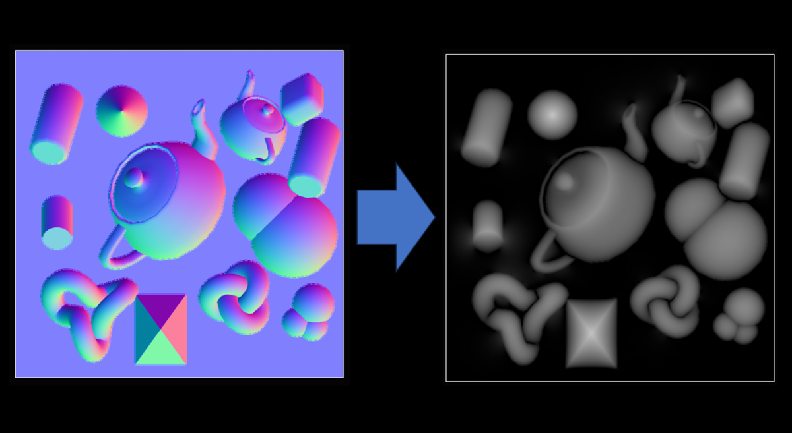

<h3 id="Niagara-SimulationStage"><a class="keyword" href="https://d.hatena.ne.jp/keyword/Niagara">Niagara</a> SimulationStage</h3>

<a class="keyword" href="https://d.hatena.ne.jp/keyword/Niagara">Niagara</a> SimulationStage はComputeShader的な<a class="keyword" href="https://d.hatena.ne.jp/keyword/GPGPU">GPGPU</a>処理を<a class="keyword" href="https://d.hatena.ne.jp/keyword/Niagara">Niagara</a>モジュールとして作成できる仕組みです. 
<a class="keyword" href="https://d.hatena.ne.jp/keyword/Epic%20Games">Epic Games</a>公式の<a class="keyword" href="https://d.hatena.ne.jp/keyword/Niagara">Niagara</a> Fluids等でも多用されています(本当にSimulationStageでほとんどの処理が作られています まじかよ).

SimulationStage は2D/3Dのグリッド構造に対する<a class="keyword" href="https://d.hatena.ne.jp/keyword/GPGPU">GPGPU</a>処理を比較的簡単に作ることができるように設計されています. 
これには数値シミュレーションで必要とされる反復実行なども含まれています. 
目的のタスクを適切な形に変形してSimulationStageで実装することで, <a class="keyword" href="https://d.hatena.ne.jp/keyword/GPU">GPU</a>による高速な実行が可能になります. 
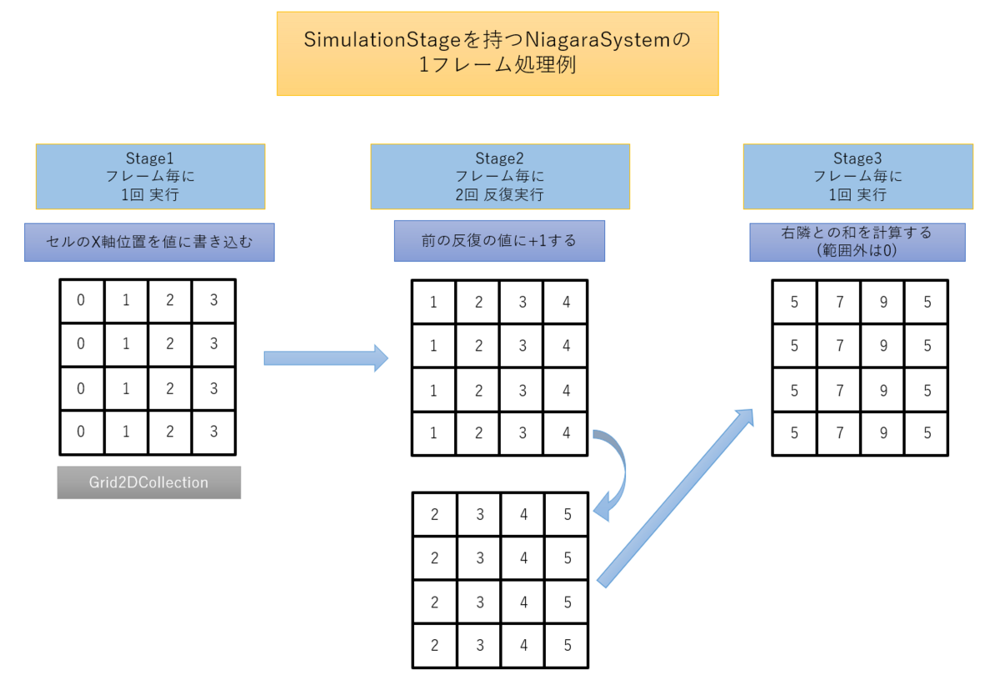

    

<h3 id="NormalMapからHeightMapを復元する問題">NormalMapからHeightMapを復元する問題</h3>

    

    

<h3 id="Poisson方程式">Poisson方程式</h3>

ある関数の二階の空間<a class="keyword" href="https://d.hatena.ne.jp/keyword/%C8%F9%CA%AC">微分</a>と別の関数との関係式をPoisson方程式といいます. 
Poisson方程式は離散化によって連立一次方程式へ変形することができ, 連立一次方程式を解く方法は様々に研究されています. 
対象の問題をPoisson方程式, ひいては連立一次方程式の形にすることができれば, Solverや解法を利用して解くことができます.

\(\Delta \phi =-\dfrac{\rho}{\epsilon_0}\) 

    

<h4 id="Poisson方程式への変形">Poisson方程式への変形</h4>

    

今回は NormalMapとHeightMapの関係をPoisson方程式で表現して離散化, 連立一次方程式として解くことにします.

NormalMapのxy成分はHeightMapの空間<a class="keyword" href="https://d.hatena.ne.jp/keyword/%C8%F9%CA%AC">微分</a>(勾配)から求められます. 
\(N_x(x,y)= -\dfrac { \partial H(x,y)}{\partial x}\) 
\(N_y(x,y)= -\dfrac { \partial H(x,y)}{\partial y}\) 
さらにそれぞれ x, y で<a class="keyword" href="https://d.hatena.ne.jp/keyword/%CA%D0%C8%F9%CA%AC">偏微分</a>します.

\(\dfrac {\partial N_x(x,y)}{\partial x}= -\dfrac { \partial^2 H(x,y)}{\partial x^2}\)

\(\dfrac {\partial N_y(x,y)}{\partial y}= -\dfrac { \partial^2 H(x,y)}{\partial y^2}\) 
ここで上の式はPoisson方程式の形になっています.

    

<h5 id="差分方程式">差分方程式</h5>

このPoisson方程式を離散化すると以下のようになります. 
(<a class="keyword" href="https://d.hatena.ne.jp/keyword/%C5%EC%B3%A4%C2%E7%B3%D8">東海大学</a>理学部遠藤研究室さんのページ等がわかりやすいです. -> <a href="https://teamcoil.sp.u-tokai.ac.jp/lectures/EL1/Poisson/index.html">&#x96FB;&#x78C1;&#x5834;(SP)</a> )

\(\frac {N_x(x+h,y) - N_x(x-h,y)}{2h}= -\frac {H(x+h,y)+H(x-h,y) - 2H(x,y)}{h^2}\) 
\(\frac {N_x(x,y+h) - N_x(x,y-h)}{2h}= -\frac {H(x,y+h)+H(x,y-h) - 2H(x,y)}{h^2}\) 
(左辺は中心差分)

2つの式を足して左辺のNormalMap, 右辺にHeightMapに関わる項をまとめて整理します. 
またテクセルでの<a class="keyword" href="https://d.hatena.ne.jp/keyword/%C8%F9%CA%AC">微分</a>(差分)のため \(h = 1\) とします. 
\(- \frac {N_x(x+1,y) - N_x(x-1,y) + N_x(x,y+1) - N_x(x,y-1)}{2} \\= H(x+1,y)+H(x-1,y) + H(x,y+1)+H(x,y-1) - 4H(x,y)\)

上の式の左辺は入力NormalMapとして与えられる既知の値, 右辺は求めたいHeightMapのいくつかの地点の値に係数をかけたものの和です. 
よってこれは左辺を定数\(b\), 未知のHeightMapを\(x\), 近傍HeightMap値への係数を行列\(A\)とした連立一次方程式ということになります. 
\(b = Ax\)

連立一次方程式を解くために更に変形していきます.

    

<h5 id="Jacobi法">Jacobi法</h5>

見通しをよくするために左辺は記号で置き換えておきます. 
\(-N_{d} = H(x+1,y)+H(x-1,y) + H(x,y+1)+H(x,y-1) - 4H(x,y)\)  
(ここで \(N_{d} =\frac {N_x(x+1,y) - N_x(x-1,y) + N_x(x,y+1) - N_x(x,y-1)}{2}\) )

\(H(x,y)\) に関する形に変形します.

\(H(x,y) = \frac{(H(x+1,y)+H(x-1,y)+H(x,y+1)+H(x,y-1)) + N_{d} }{4}\)

この式を反復的に計算することで \(H(x,y)\) を解に近づけていく方法をJacobi法といいます. 
プログラム的に考えると<strong>HeightMapの各テクセルについて上下左右の近傍値とNormalMapの値を使って更新</strong>しているといえます. 
現在のHeightMapから次のHeightMapの各テクセルを並列に計算できるため<a class="keyword" href="https://d.hatena.ne.jp/keyword/GPGPU">GPGPU</a>とも相性が良いです. 
次はJacobi法によるHeightMapの計算を<a class="keyword" href="https://d.hatena.ne.jp/keyword/Niagara">Niagara</a> SimulationStageで実装します.

<h3 id="Niagara-SimulationStageでの実装"><a class="keyword" href="https://d.hatena.ne.jp/keyword/Niagara">Niagara</a> SimulationStageでの実装</h3>
    

先に必要となるデータや処理を整理しておきます.

    

<h4 id="外部データ一覧">外部データ一覧</h4>

外部から<a class="keyword" href="https://d.hatena.ne.jp/keyword/Niagara">Niagara</a>に設定するデータになります.

<ul>
<li>入力NormalMap Texture
<ul>
<li>HeightMap復元の元になる入力データ</li>
</ul></li>
<li>HeightMap出力用RenderTargetTexture
<ul>
<li>結果のHeightMap出力先として Floatフォーマットの適当なサイズで用意しておきます.</li>
<li>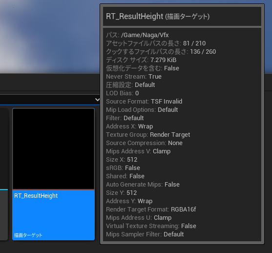</li>
</ul></li>
<li>プレビュー用マテリアル
<ul>
<li>計算結果のプレビューをするためのマテリアル M_PreviewHeight</li>
<li>InTex という名前でテクスチャパラメータを引き取って表示するだけのものです.</li>
<li>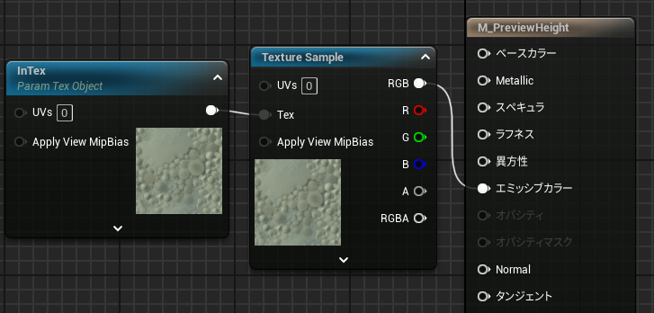</li>
</ul></li>
</ul>

    

<h4 id="処理ステージ一覧">処理ステージ一覧</h4>

    

これらのステージをSimulationStageとして実装します.

<ul>
<li>初期化
<ul>
<li>作業用のGrid2DCollectionのクリアなど, メインの処理の準備をします.</li>
<li>実行タイミングをリセット時の一度のみに設定することで, フレームを跨いでJacobi反復を継続させます.</li>
</ul></li>
<li>Jacobi反復処理
<ul>
<li>HeightMapの反復計算の1回分を計算します.</li>
<li>SimulationStageの反復数指定によって1フレームに複数回実行可能です.</li>
</ul></li>
<li>出力
<ul>
<li>HeightMapを出力先RenderTargetに書き出します.</li>
</ul></li>
</ul>

ここからNiagaraSystemのEmitterを実装していきます.

    

<h4 id="EmptyEmitterを追加">EmptyEmitterを追加</h4>

雛形のEmitterを追加します.  
最低限の設定が含まれたテンプレートの Empty Emitterを使います. 
(<a class="keyword" href="https://d.hatena.ne.jp/keyword/%A5%B3%A5%F3%A5%C6%A5%AD%A5%B9%A5%C8%A5%E1%A5%CB%A5%E5%A1%BC">コンテキストメニュー</a>の「空のエミッタを追加」は本当に無なので面倒です. ) 
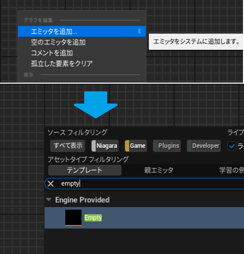 

    

<h4 id="Emitterの設定">Emitterの設定</h4>

SimulationStageを使うためにGPUComputeに変更. 
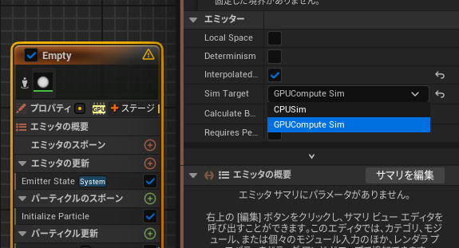 
プレビューを簡単にするためにSpriteRendererのSourceModeをEmitterに変更. 
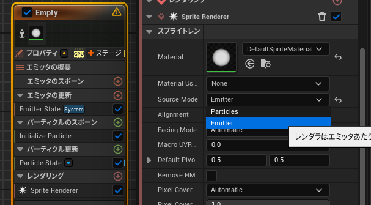 
Spriteを見やすい大きさにするためにEmitterSpawnステージにSpriteSizeの設定を追加. 
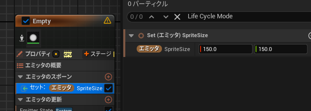 

    

<h4 id="ユーザーパラメータの作成と既定値">ユーザーパラメータの作成と既定値</h4>

外部から入力NormalMapと出力先RenderTargetを受け取るためのユーザーパラメータです. 
Systemユーザーバラメータの + から 新規作成>オブジェクト で 
<strong>Texture</strong> と <strong>Texture Render Target</strong> を一つずつ作成します. 
それぞれ InputNormalTex, OutputHeight と名前をつけておきます. 
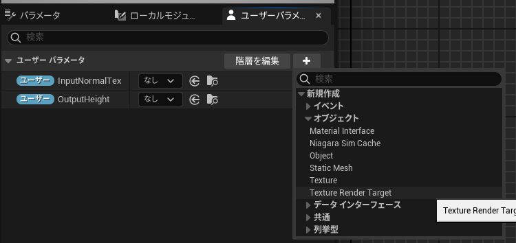

作業中のプレビューをしやすくするためにユーザーパラメータに既定値を設定しておきます. 
InputNormalTex には適当なNormalMapアセット. 
OutputHeight には準備しておいた出力用RenderTargetTexture. 
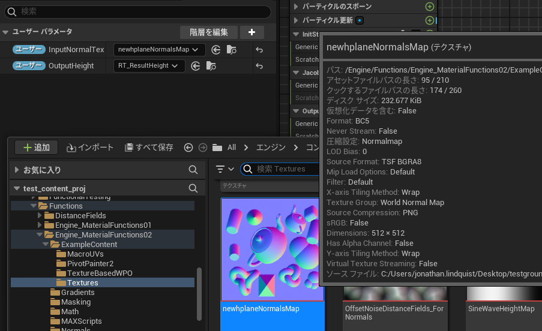

    

<h4 id="ユーザーパラメータとDataInterfaceのバインド">ユーザーパラメータとDataInterfaceのバインド</h4>

    

内部でデータを参照できるように入力NormalMap等をバインドします.

EmitterSpawnステージの + から 「新規または既存のパラメータを直接設定」でSetParameter項目を追加. 
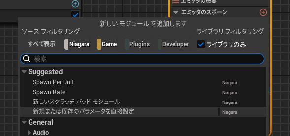 
SetParameterの + から Texture Sample を選択. 
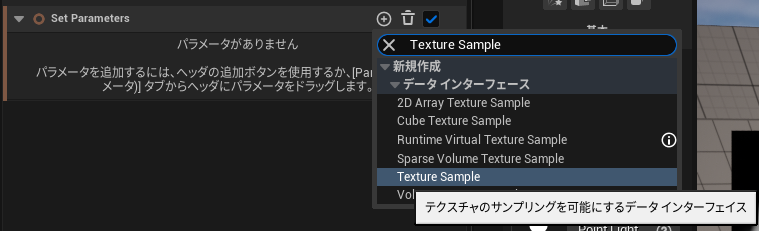 
名前を DI_InputNormalTexに変更. 
Texture User Parameter にユーザーパラメータの InputNormalTex を設定. 
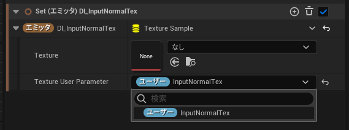

同様に SetParameter を追加して Render Target 2D に設定. 
名前を DI_OutputRenderTarget に変更. 
ユーザーパラメータを利用するために Inherit User Parameter Settings をON. 
Render Target User Parameter に OutputHeight を設定. 
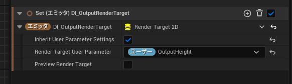 

    

<h4 id="プレビューマテリアルの設定">プレビューマテリアルの設定</h4>

EmitterのSpriteRendererにプレビュー用マテリアル M_PreviewHeight を設定します. 
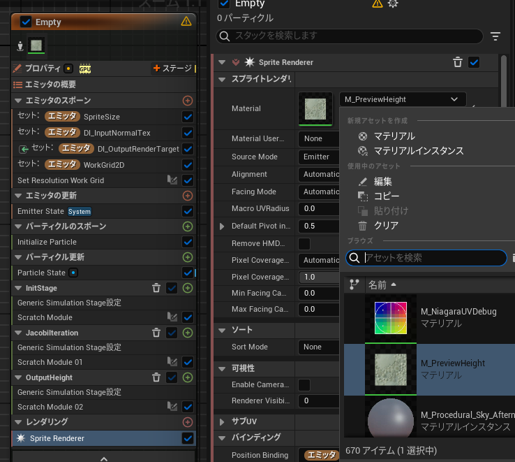 
マテリアルのテクスチャパラメータ InTex にプレビュー対象のテクスチャをバインドします. 
SpriteRendererの<a class="keyword" href="https://d.hatena.ne.jp/keyword/%A5%D0%A5%A4%A5%F3%A5%C7%A5%A3%A5%F3%A5%B0">バインディング</a>>Material Parameters>Attribute Bindings に要素を追加. 
Material Parameter Name からプレビュー用マテリアルのテクスチャパラメータ InTex が選択可能です. 
<a class="keyword" href="https://d.hatena.ne.jp/keyword/Niagara">Niagara</a> Variable に出力先RenderTarget2Dである DI_OutputRenderTarget をバインドします. 
これで計算結果が書き込まれたRenderTargetの内容をスプライトに表示できます. 
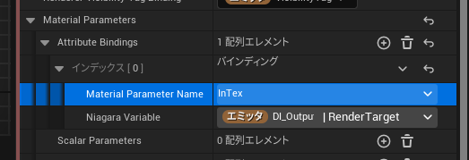

    

<h4 id="Grid2DCollectionの準備">Grid2DCollectionの準備</h4>

Grid2DCollectionは汎用2Dグリッドデータ<a class="keyword" href="https://d.hatena.ne.jp/keyword/%A5%A4%A5%F3%A5%BF%A1%BC%A5%D5%A5%A7%A5%A4%A5%B9">インターフェイス</a>です. 
指定解像度グリッドの集合(Collection)として様々なデータの格納ができます. 
今回は反復更新中のHeightMap値を格納するために使用します.

EmitterSpawnステージの + からSetParameter項目を追加し,  
SetParameterの + からGrid2DCollection を選択する. 
名前を WorkGrid2D に変更. 
パラメータを展開して <strong>Num Attributes を 1 以上に設定</strong>. 
(本来必要ないと思われますが, ここで1以上の値を設定していないとGrid2Dが値を保持してくれない場合があります) 
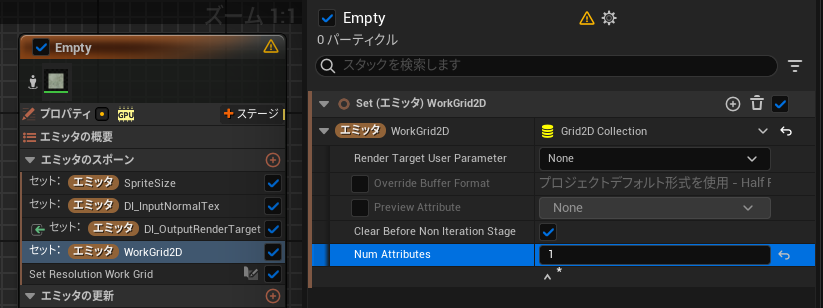

次にグリッド解像度を設定します. 
今回は入力NormalMapと同じ解像度で計算をしたいのでそのための設定もします. 
標準では解像度設定モジュールが無いのでス<a class="keyword" href="https://d.hatena.ne.jp/keyword/%A5%AF%A5%E9%A5%C3%A5%C1">クラッチ</a>パッドモジュールで処理します. 
EmitterSpawnステージの + から「新しいス<a class="keyword" href="https://d.hatena.ne.jp/keyword/%A5%AF%A5%E9%A5%C3%A5%C1">クラッチ</a>パッドモジュール」. 
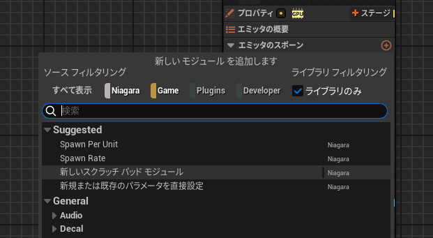 
空のモジュールが生成されるので, モジュール名は SetResolutionWorkGrid にしておきましょう. 
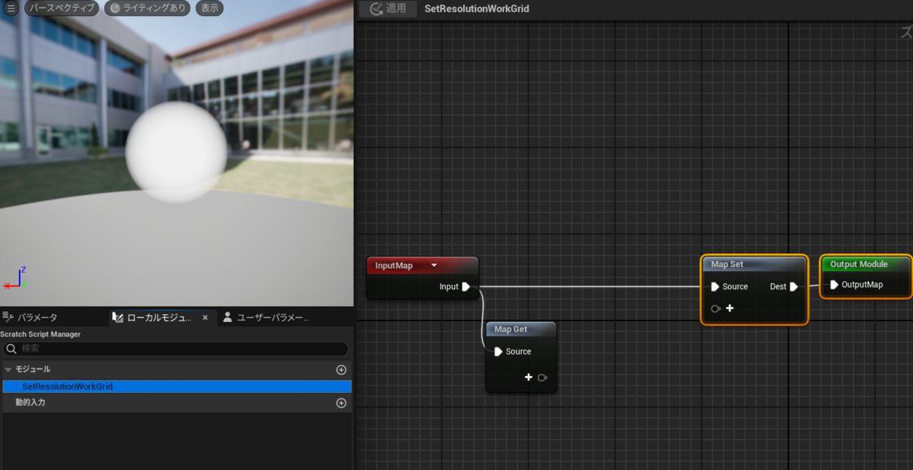 
SetResolutionWorkGridの入力Mapに 
解像度設定対象のGrid2DCollection 
サイズ情報を取得するためのTextureSample 
の枠を追加します. 
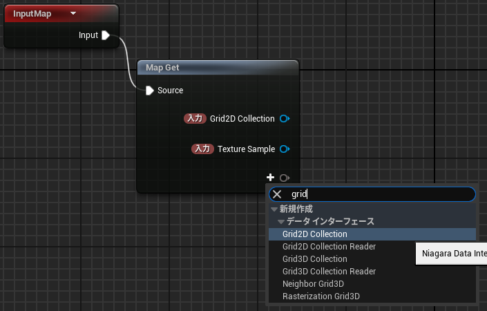 
TextureSampleからGetTextureDimensionsでサイズ情報を取得し, 
Grid2DCollectionのSetNumCellsで解像度を設定するように組んで適用ボタンを押します. 
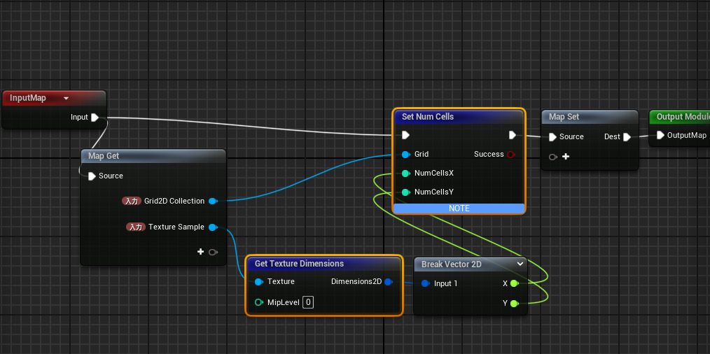

Emitterのモジュール詳細パネルに戻ると, 
入力Mapに追加したGrid2DCollectionとTextureSampleの項目が現れます. 
Grid2DCollectionには Link Inputs/エミッタ/WorkGrid2D 
TextureSampleには Link Inputs/エミッタ/DI_InputNormalTex 
を設定すると, ようやく入力NormalMapと同じ解像度のGridのセットアップが完了です. 
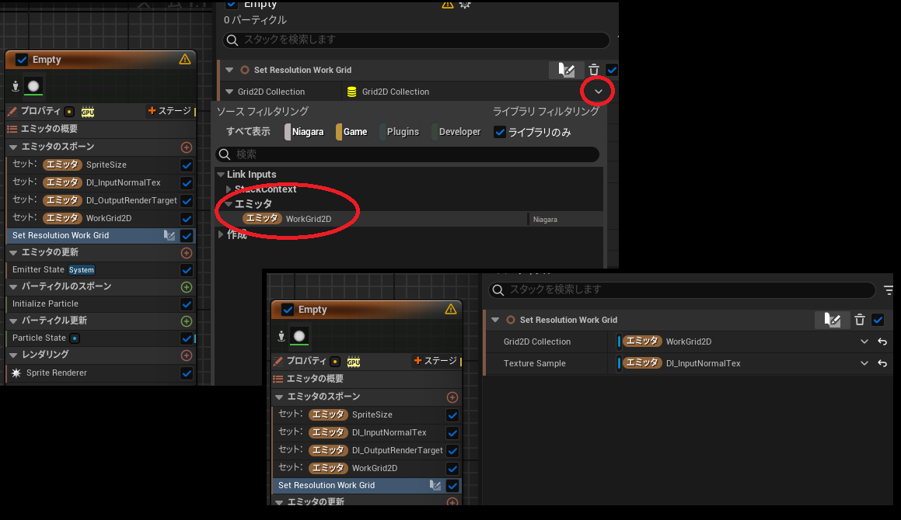 

    

<h4 id="初期化ステージ">初期化ステージ</h4>

Emitterの +ステージ から GenericSimulationStage を追加します. 
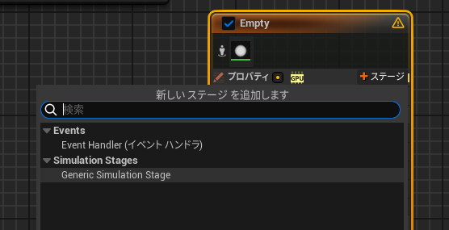 
詳細パネルでこのステージの設定をします. 名前はInitStage等にしておきます.

<ul>
<li>Simulation Stage Name は InitStage
<ul>
<li>わかりやすい名前ならなんでも良い</li>
</ul></li>
<li>Iteration Source は Data Interface
<ul>
<li>Grid2DなどのDataInterfaceの要素を実行単位にするため.</li>
</ul></li>
<li>Execute Behavior は On Simulation Reset
<ul>
<li>このステージはEmitterがSpawnしたタイミングなどの初回一度だけ実行するため.</li>
</ul></li>
<li>Data Interface は WorkGrid2D
<ul>
<li>このGrid2Dの要素毎に処理を実行するため
<ul>
<li>ComputeShaderとして考えると, このGrid2Dの解像度分のThreadが起動する.</li>
</ul></li>
</ul></li>
</ul>
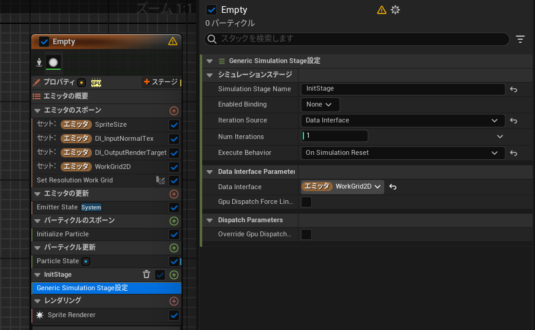 
Stageの + からこのStageの処理を記述するス<a class="keyword" href="https://d.hatena.ne.jp/keyword/%A5%AF%A5%E9%A5%C3%A5%C1">クラッチ</a>パッドモジュールを追加します. 
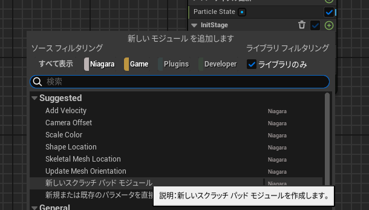

入力Mapに Grid2DCollection と TextureSample を追加します. 
それぞれ作業用GridとNormalMapを取り込むために使います. 
出力Mapに Vector2D と float を追加します. 
それぞれ名前を NormalXY と Height に変更します. 
さらに右クリックから <a class="keyword" href="https://d.hatena.ne.jp/keyword/%CC%BE%C1%B0%B6%F5%B4%D6">名前空間</a>を変更>STACKCONTEXT に設定します. 
STACKCONTEXT はStageやフレームを跨いで読み書きできる<a class="keyword" href="https://d.hatena.ne.jp/keyword/%CC%BE%C1%B0%B6%F5%B4%D6">名前空間</a>(カテゴリ)です. 
使用する場所でもっとも適切な<a class="keyword" href="https://d.hatena.ne.jp/keyword/%CC%BE%C1%B0%B6%F5%B4%D6">名前空間</a>になってくれるようです. 
まとめると以下のようになります.

<ul>
<li>入力Map
<ul>
<li>Grid2DCollection
<ul>
<li>Grid2D上での作業のため</li>
</ul></li>
<li>TextureSample
<ul>
<li>NormalMap取り込みのため</li>
</ul></li>
</ul></li>
<li>出力Map
<ul>
<li>NormalXY (STACKCONTEXT Vector2D
<ul>
<li>NormalMapの値をGrid2D上に保存して読み取るため.</li>
</ul></li>
<li>Height ( STACKCONTEXT float
<ul>
<li>Grid2D上でのHeight更新作業用.</li>
</ul></li>
</ul></li>
</ul>

処理内容としては

<ul>
<li>NormalMapからサンプリングしたベクトルをGrid2DにNormalXYという名前で登録
<ul>
<li>後段のStageではTextureにアクセスせずGrid2Dで完結させるため</li>
</ul></li>
<li>Grid2DにHeightという名前でfloat値を登録.
<ul>
<li>初期値は0. このHeightが反復処理で更新されていく.</li>
</ul></li>
</ul>
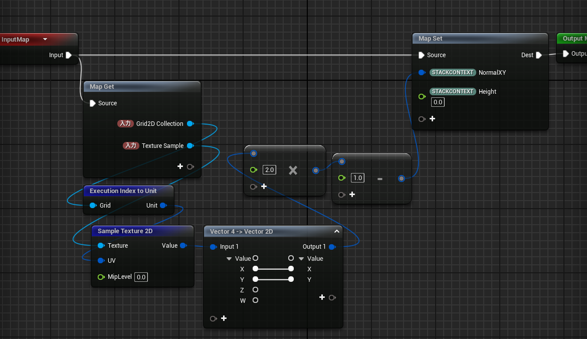 
適用ボタンを押したらEmitterのモジュール詳細から

<ul>
<li>Grid2DCollection にWorkGrid2D を設定</li>
<li>TextureSample にDI_InputNormalTex を設定</li>
</ul>
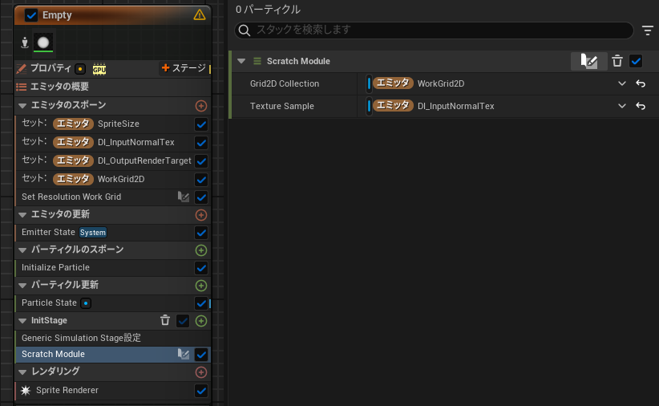

    

<h4 id="Jacobi反復処理ステージ">Jacobi反復処理ステージ</h4>

    

GenericSimulationStageを新規追加して以下のように設定します.

<ul>
<li>Simulation Stage Name は JacobiIteration</li>
<li>Iteration Source は Data Interface</li>
<li>Num Iterations は 1
<ul>
<li>ここが1フレームで実行される反復数になります. 1024とか入れるとUEがハングするので注意.
<ul>
<li>初期化ステージのInitStageを On Simulation Reset にしたことで, フレームを跨いで大量の反復を継続するようにしています.</li>
</ul></li>
</ul></li>
<li>Execute Behavior は Always
<ul>
<li>このステージは毎フレーム実行するため.</li>
</ul></li>
<li>Data Interface は WorkGrid2D</li>
</ul>
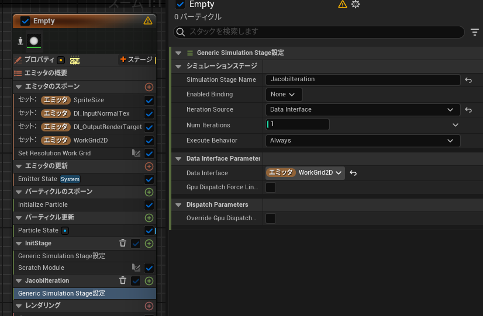

ス<a class="keyword" href="https://d.hatena.ne.jp/keyword/%A5%AF%A5%E9%A5%C3%A5%C1">クラッチ</a>パッドを追加します.

<ul>
<li>入力Map
<ul>
<li>Grid2DCollection
<ul>
<li>Grid2D上での作業のため</li>
</ul></li>
</ul></li>
<li>出力Map
<ul>
<li>Height ( STACKCONTEXT float
<ul>
<li>Grid2D上のHeightを更新するため.</li>
</ul></li>
</ul></li>
</ul>
ス<a class="keyword" href="https://d.hatena.ne.jp/keyword/%A5%AF%A5%E9%A5%C3%A5%C1">クラッチ</a>パッドにはJacobi法によるHeight値更新計算をCustomHLSLで記述します. 
CustomHLSLノードの入出力は以下のように設定します.

<ul>
<li>入力
<ul>
<li>Grid2DCollection</li>
<li>Cell座標X(int)</li>
<li>Cell座標Y(int) </li>
</ul></li>
<li>出力
<ul>
<li>更新後のHeight値(float)</li>
</ul></li>
</ul>
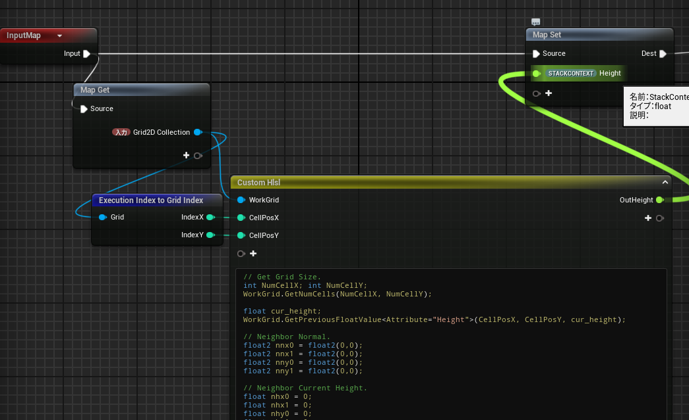

CustomHLSLの中身は先のJacobi法をそのままコードに落とし込み, NormalXYやHeightと名付けしたGrid上の値を読み取って計算しています. 
面白い点としては GetPreviousVector2DValue() などの関数で, <strong>前回反復時のGridの値</strong> を取得できることでしょうか. 
<a class="keyword" href="https://d.hatena.ne.jp/keyword/GPGPU">GPGPU</a>で並列計算を書いたことがある方にはお馴染みですが, 並列計算における近傍値読み取りと書き込みの衝突解決のためにダブルバッファ化して読み取りは前回バッファ, 書き込みは今回バッファとするということを仕組みとしてサポートしてくれているようです. 
また, 最後のほうでHeightのmax(0, )をとって正の値に制約していますが. こちらはProjectionという値の取りうる値にクランプする手法になります. 
(Height値は正の値であるべきなので)

<pre class="code hlsl" data-lang="hlsl" data-unlink>// Get Grid Size.
int NumCellX; int NumCellY;
WorkGrid.GetNumCells(NumCellX, NumCellY);

float cur_height;
WorkGrid.GetPreviousFloatValue&lt;Attribute=&#34;Height&#34;&gt;(CellPosX, CellPosY, cur_height);

// Neighbor Normal.
float2 nnx0 = float2(0,0);
float2 nnx1 = float2(0,0);
float2 nny0 = float2(0,0);
float2 nny1 = float2(0,0);

// Neighbor Current Height.
float nhx0 = 0;
float nhx1 = 0;
float nhy0 = 0;
float nhy1 = 0;

// Get Neighbor Normal and Height.
if(0 &lt; CellPosX)
{
    WorkGrid.GetPreviousVector2DValue&lt;Attribute=&#34;NormalXY&#34;&gt;(CellPosX - 1, CellPosY, nnx1);
    WorkGrid.GetPreviousFloatValue&lt;Attribute=&#34;Height&#34;&gt;(CellPosX - 1, CellPosY, nhx1);
}
if(NumCellX-1 &gt; CellPosX)
{
    WorkGrid.GetPreviousVector2DValue&lt;Attribute=&#34;NormalXY&#34;&gt;(CellPosX + 1, CellPosY, nnx0);
    WorkGrid.GetPreviousFloatValue&lt;Attribute=&#34;Height&#34;&gt;(CellPosX + 1, CellPosY, nhx0);
}
if(0 &lt; CellPosY)
{
    WorkGrid.GetPreviousVector2DValue&lt;Attribute=&#34;NormalXY&#34;&gt;(CellPosX, CellPosY - 1, nny1);
    WorkGrid.GetPreviousFloatValue&lt;Attribute=&#34;Height&#34;&gt;(CellPosX, CellPosY - 1, nhy1);
}
if(NumCellY-1 &gt; CellPosY)
{
    WorkGrid.GetPreviousVector2DValue&lt;Attribute=&#34;NormalXY&#34;&gt;(CellPosX, CellPosY + 1, nny0);
    WorkGrid.GetPreviousFloatValue&lt;Attribute=&#34;Height&#34;&gt;(CellPosX, CellPosY + 1, nhy0);
}

// Calc Jacobi Iteration Step for Height.
const float dn = ((nnx0.x - nnx1.x) + (nny0.y - nny1.y)) / 2.0;
float next_height = (nhx0 + nhx1 + nhy0 + nhy1 + dn) / 4.0;
// Projected. Constrain to a number greater than 0.
OutHeight = max(0.0, next_height);
</pre>
ス<a class="keyword" href="https://d.hatena.ne.jp/keyword/%A5%AF%A5%E9%A5%C3%A5%C1">クラッチ</a>パッドを適用したらInitStageと同様にス<a class="keyword" href="https://d.hatena.ne.jp/keyword/%A5%AF%A5%E9%A5%C3%A5%C1">クラッチ</a>パッド入力のGrid2DCollectionにWorkGrid2Dを設定します. 
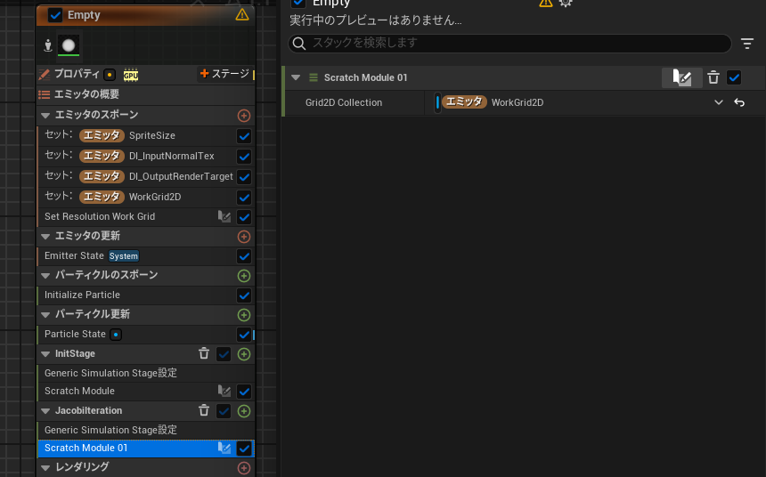 

    

<h4 id="出力ステージ">出力ステージ</h4>

    

GenericSimulationStageを新規追加して以下のように設定します.

<ul>
<li>Simulation Stage Name は JacobiIteration</li>
<li>Iteration Source は Data Interface</li>
<li>Num Iterations は 1</li>
<li>Execute Behavior は Always
<ul>
<li>毎フレーム結果を外部RenderTargetに出力します.</li>
</ul></li>
<li>Data Interface は DI_OutputRenderTarget
<ul>
<li>このステージは結果のHeightMap出力を目的のため, 出力RenderTargetである <strong>DI_OutputRenderTarget</strong> を指定.</li>
</ul></li>
</ul>
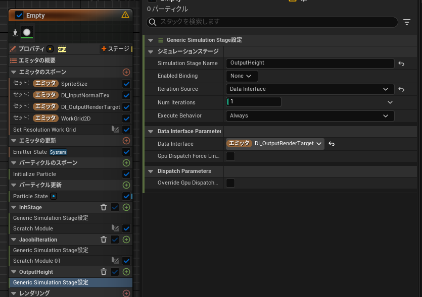

ス<a class="keyword" href="https://d.hatena.ne.jp/keyword/%A5%AF%A5%E9%A5%C3%A5%C1">クラッチ</a>パッドは特に複雑なことはなくGrid2DからHeightを取得してRenderTargetへ出力します.

<ul>
<li>入力Map
<ul>
<li>Grid2DCollection
<ul>
<li>計算結果のHeightの取り出しのため</li>
</ul></li>
<li>RenderTarget2D
<ul>
<li>出力先RenderTargetのData Interfaceとして</li>
</ul></li>
</ul></li>
</ul>
注意点としては, 今回のStageはRenderTarget2DをDataInterfaceとしているため, UV座標やテクセル座標を取得するためにGrid2DではなくRenderTarget2Dを使う点です. 
(Exec to Unit や Exec to Index) 
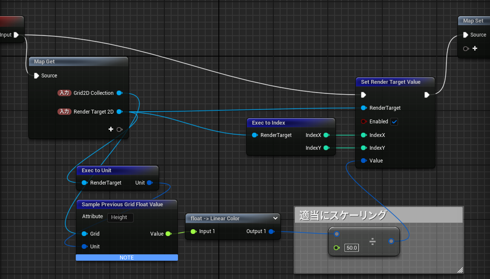

忘れないようにス<a class="keyword" href="https://d.hatena.ne.jp/keyword/%A5%AF%A5%E9%A5%C3%A5%C1">クラッチ</a>パッド入力の設定をします. 
Grid2DCollectionにWorkGrid2D, RenderTarget2DにDI_OutputRenderTarget. 
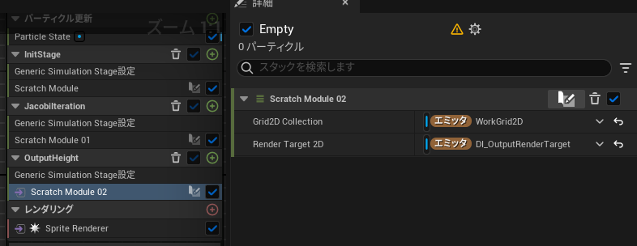 

    

<h4 id="結果">結果</h4>

完成するとプレビューや出力先RenderTarget2Dで計算結果のHeightMapが表示されます. 
Jacobi反復ステージの反復数を 1 にしているため, フレームごとに1回の反復で徐々に計算が収束していきます. 
もっと早く収束させたい場合はJacobi反復ステージの Num Iterations を 16 などに増やしてみてください. 
結果のHeightMapをテクスチャとして保存したい場合は 
「RenderTarget2Dからスタティックテクスチャを作成」 
をしてください. 
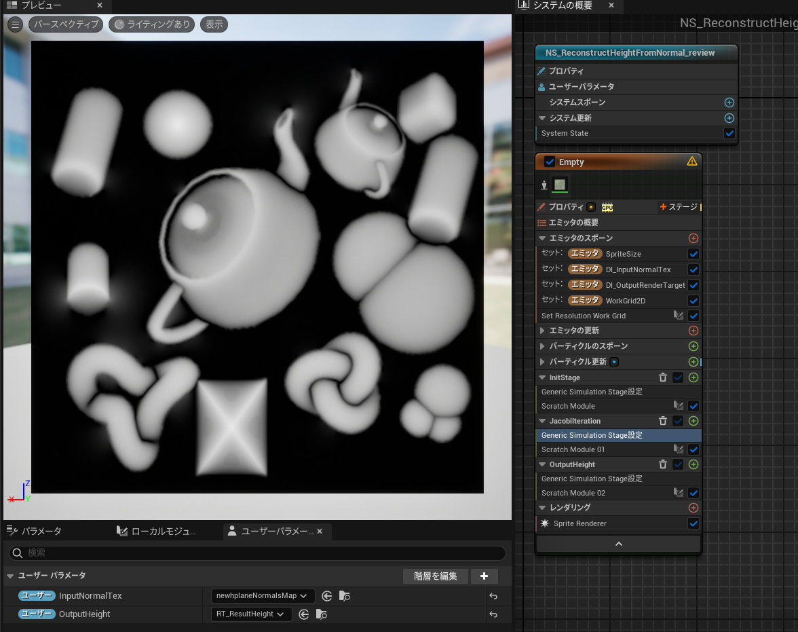 
<blockquote data-conversation="none" class="twitter-tweet" data-lang="ja">
<a class="keyword" href="https://d.hatena.ne.jp/keyword/%A5%A2%A5%C9%A5%D9%A5%F3%A5%C8%A5%AB%A5%EC%A5%F3%A5%C0%A1%BC">アドベントカレンダー</a>用 <a href="https://t.co/rE2PGLBdMG">pic.twitter.com/rE2PGLBdMG</a>
&mdash; なが (@nagakagachi) <a href="https://twitter.com/nagakagachi/status/1735917784335528146?ref_src=twsrc%5Etfw">2023年12月16日</a></blockquote>    
 

    

<h3 id="まとめ">まとめ</h3>

    
<ul>
<li>NormalMapからHeightMapを復元するために</li>
<li>Poisson方程式の反復解法(Jacobi法)を</li>
<li><a class="keyword" href="https://d.hatena.ne.jp/keyword/Niagara">Niagara</a> SimulationStageで実装する</li>
</ul>

ということをしました.

SimulationStageは<a class="keyword" href="https://d.hatena.ne.jp/keyword/Niagara">Niagara</a>モジュールとしてComputeShader的な<a class="keyword" href="https://d.hatena.ne.jp/keyword/GPGPU">GPGPU</a>計算が実装できて面白いですね. 
ランタイム<a class="keyword" href="https://d.hatena.ne.jp/keyword/VFX">VFX</a>用途ではなく今回のようなツール的な使い方も模索のし甲斐があると思いました. 
ただ一部挙動が怪しかったりUIが親切でなかったりドキュメントがなかったりする点でハードルが高いです. 
今後のアップデートでどう変わっていくのか注目したいですね.

\~\~\~

次の17日記事は @razupi さんとのことです!

---

[元のはてなブログ記事](https://nagakagachi.hatenablog.com/entry/2023/12/16/161144)
