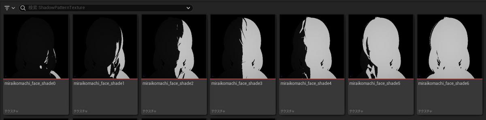
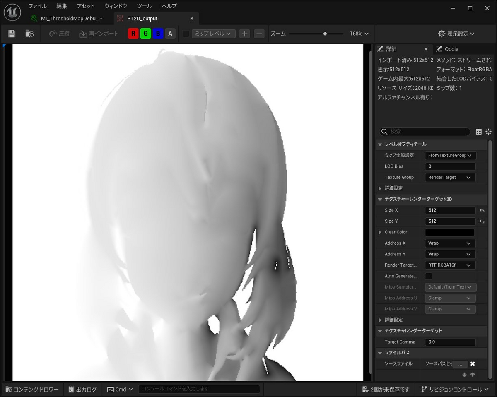
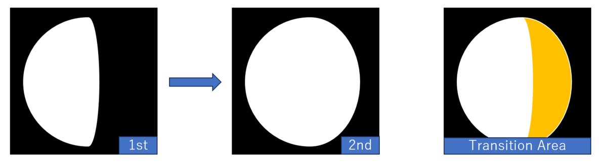
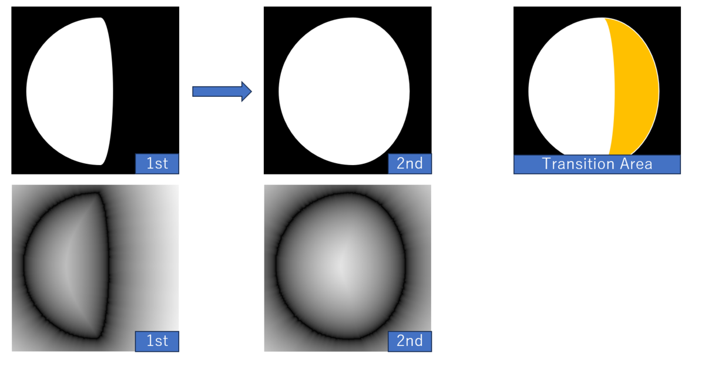
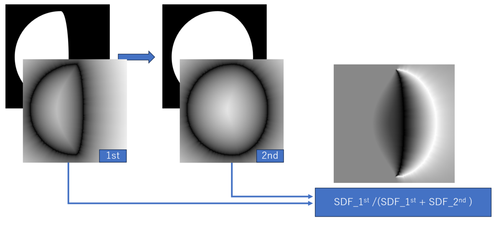
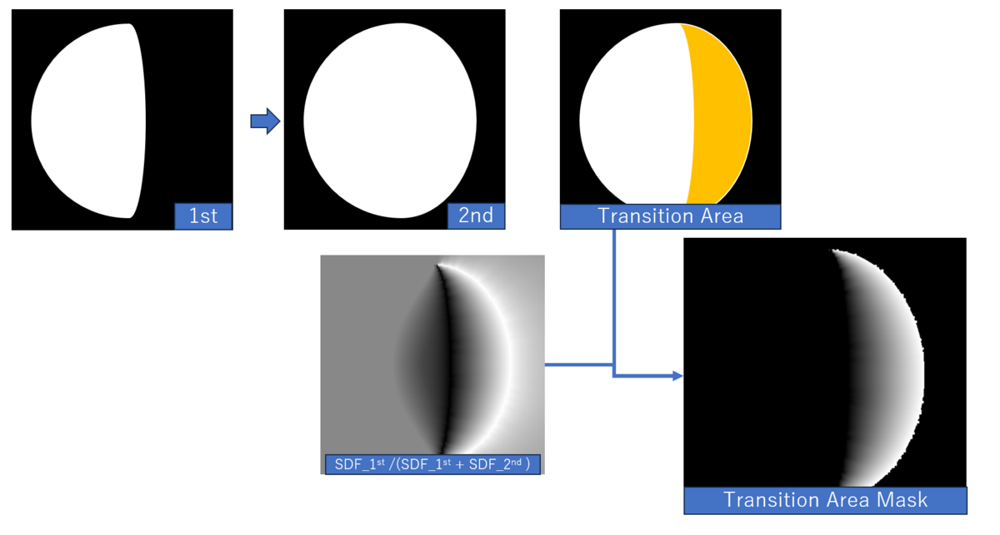
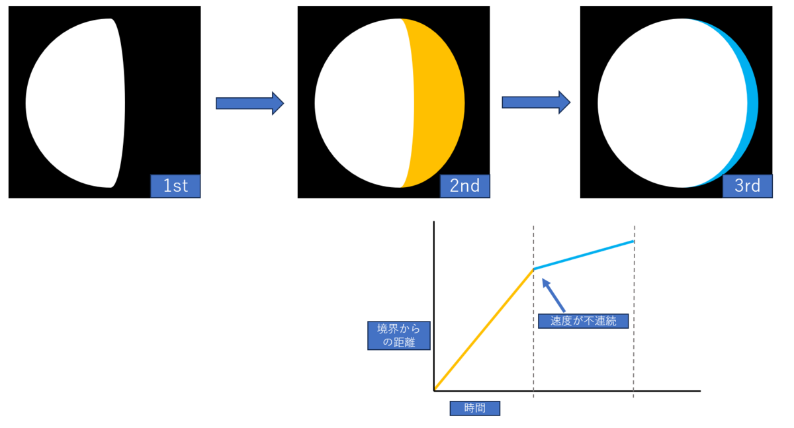
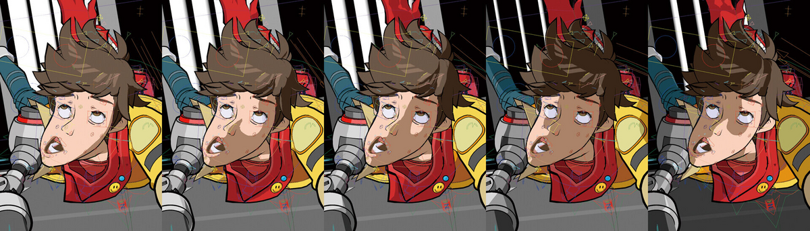

---
title: "セルシェーディング顔陰用SDFテクスチャ合成の仕組み (SDF Based Transition Blending for Shadow Threshold Map)"
date: "2024-03-02T14:07:04+09:00"
draft: false
url: "/entry/2024/03/02/140704/"
categories: ["Shadow Threshold Map", "Face Threshold Map", "Face Shadow Map", "Material", "Shader", "Tech", "UE5", "シェーダ", "マテリアル", "数学", "顔の影マップ", "SDFテクスチャ"]
hatena_author: "nagakagachi"
hatena_original_url: "https://nagakagachi.hatenablog.com/entry/2024/03/02/140704"
hatena_basename: "2024/03/02/140704"
math: false
image: "images/d173374b5fc8b92e86af443abbd7100fae0e0edd36c85121e9c9753620989c20.png"
---

誤ってページ削除してしまいましたが2024年の記事です

セルルックキャ<a class="keyword" href="https://d.hatena.ne.jp/keyword/%A5%E9%A5%AF">ラク</a>ターの顔の陰制御に用いられるShadow Threshold Mapを生成する仕組みについて. 連番二値画像からSDFを利用してテクスチャ合成する基本部分の説明を試みます.

(Face Thresholdテクスチャ, Shadow Thresholdテクスチャ, SDFテクスチャ などとも)

<blockquote class="twitter-tweet" data-conversation="none" data-lang="ja">

SDFによる補間で Shadow Threshold Map を連番画像から自動生成するツール  を<a class="keyword" href="https://d.hatena.ne.jp/keyword/GitHub">GitHub</a>のSDFツールの中にUPしました.  EUW_GenerateShadowThresholdMap がツール自体. 現状は全画像が等間隔な<a class="keyword" href="https://d.hatena.ne.jp/keyword/%EF%E7%C3%CD">閾値</a>になります.  合成方法の説明などドキュメントは後で(∩´∀｀)∩<a href="https://t.co/6GdbEja9o3">https://t.co/6GdbEja9o3</a><a href="https://twitter.com/hashtag/UE5?src=hash&amp;ref_src=twsrc%5Etfw">#UE5</a> <a href="https://t.co/52QUQek23i">pic.twitter.com/52QUQek23i</a>

— なが (@nagakagachi) <a href="https://twitter.com/nagakagachi/status/1732041139325489588?ref_src=twsrc%5Etfw">2023年12月5日</a></blockquote>

  

<h3 id="概要">概要</h3>

 

UE5上のツールとしては以下のSDF関連ツールに含まれています. <a class="keyword" href="https://d.hatena.ne.jp/keyword/%A5%D6%A5%E9%A5%C3%A5%AF%A5%DC%A5%C3%A5%AF%A5%B9">ブラックボックス</a>無しでBPとマテリアルとして実装しているので詳細はそちらをご確認ください. <iframe src="https://hatenablog-parts.com/embed?url=https%3A%2F%2Fgithub.com%2Fnagakagachi%2FNagaSdfTextureToolForUE" title="GitHub - nagakagachi/NagaSdfTextureToolForUE: Tools for generating SDF from textures in Unreal Engine" class="embed-card embed-webcard" scrolling="no" frameborder="0" style="display: block; width: 100%; height: 155px; max-width: 500px; margin: 10px 0px;" loading="lazy"></iframe><cite class="hatena-citation"><a href="https://github.com/nagakagachi/NagaSdfTextureToolForUE">github.com</a></cite>

 

<h3 id="アルゴリズム"><a class="keyword" href="https://d.hatena.ne.jp/keyword/%A5%A2%A5%EB%A5%B4%A5%EA%A5%BA%A5%E0">アルゴリズム</a></h3>

ここでは最もシンプルと思われる<strong>C0連続</strong>な合成を考えます. 連番二値画像間の遷移速度をよりなめらかにしたい場合はC1連続となるように合成するのが良いかもしれません.

連番の連続する2枚ずつを処理していきます.

<h4 id="処理対象の連続するペア">処理対象の連続するペア</h4>

<figure class="figure-image figure-image-fotolife" title="連番のi番目とi+1番目の例">
<figcaption>連番のi番目とi+1番目の例</figcaption>
</figure>

<h4 id="SDF生成">SDF生成</h4>

二値画像のSDFを計算.  
内部側の距離も必要なのでSigned Distance Fieldである必要があります.

<figure class="figure-image figure-image-fotolife" title="SDF生成">
<figcaption>SDF生成</figcaption>
</figure>

<h4 id="SDFを元に遷移率を計算">SDFを元に遷移率を計算</h4>

SDFは境界からの距離を表すため,   
SDF\_1st / (SDF\_1st + SDF\_2nd)  
を計算することで遷移元から遷移先の境界で 0-1 となるようなグラデーションが得られます.

<figure class="figure-image figure-image-fotolife" title="SDFの値から遷移率を計算">
<figcaption>SDFの値から遷移率を計算</figcaption>
</figure>

<h4 id="ペアの遷移領域のみマスクして処理">ペアの遷移領域のみマスクして処理</h4>

処理対象は1st-&gt;2ndで黒-&gt;白に変化した領域だけなのでマスクします. 遷移領域における各<a class="keyword" href="https://d.hatena.ne.jp/keyword/%A5%D4%A5%AF%A5%BB%A5%EB">ピクセル</a>のペア間遷移率(0~1)が得られたので, この値で最終的な陰用<a class="keyword" href="https://d.hatena.ne.jp/keyword/%EF%E7%C3%CD">閾値</a>を決定することができます. これを連番画像のすべてのペアで実行すればShadow Threshold Mapが完成します.

<figure class="figure-image figure-image-fotolife" title="遷移領域のみマスク">
<figcaption>遷移領域のみマスク</figcaption>
</figure>

<h4 id="付録変化の速度の連続性">(付録)変化の速度の連続性</h4>

この方法では2枚のペアずつ処理しているため, 最終的なグラデーションの変化速度が不連続になります(C0連続). 枚数を多く用意して細かい<a class="keyword" href="https://d.hatena.ne.jp/keyword/%B6%E8%B4%D6">区間</a>で分けている場合は気にならないかもしれませんが, 少ない枚数の場合には陰領域の移動速度が<a class="keyword" href="https://d.hatena.ne.jp/keyword/%B6%E8%B4%D6">区間</a>の境目でガタついて見えるかもしれません. これを解決する場合は2枚のペアではなく更にその隣の画像も含めて速度が連続になるように遷移率を計算することになると思われます. (本記事では未対応です)

<figure class="figure-image figure-image-fotolife" title="変化の速度が不連続">
<figcaption>変化の速度が不連続</figcaption>
</figure>

<h3 id="関連情報">関連情報</h3>

実際の運用等については<a class="keyword" href="https://d.hatena.ne.jp/keyword/CEDEC">CEDEC</a>のHi-Fi RUSH講演や, alweiさんの記事が参考になるかと考えます.

<iframe src="https://hatenablog-parts.com/embed?url=https%3A%2F%2Fcgworld.jp%2Farticle%2F202306-hifirush01.html" title="Tango Gameworksのチャレンジが詰まったカートゥーン調リズムアクションゲーム『Hi-Fi RUSH（ハイファイラッシュ）』（1）キャラクター・モーション・エフェクト編" class="embed-card embed-webcard" scrolling="no" frameborder="0" style="display: block; width: 100%; height: 155px; max-width: 500px; margin: 10px 0px;" loading="lazy"></iframe><cite class="hatena-citation"><a href="https://cgworld.jp/article/202306-hifirush01.html">cgworld.jp</a></cite>

<figure class="figure-image figure-image-fotolife" title="https://cgworld.jp/article/202306-hifirush01.html">
<figcaption><a href="https://cgworld.jp/article/202306-hifirush01.html">https://cgworld.jp/article/202306-hifirush01.html</a></figcaption>
</figure>
<blockquote class="twitter-tweet" data-conversation="none" data-lang="ja">

UE5 SDF Face Shadow<a class="keyword" href="https://d.hatena.ne.jp/keyword/%A5%DE%A5%C3%A5%D4%A5%F3%A5%B0">マッピング</a>でアニメ顔用の影を作ろう - Let's Enjoy <a class="keyword" href="https://d.hatena.ne.jp/keyword/Unreal%20Engine">Unreal Engine</a> <a href="https://twitter.com/hashtag/UE5?src=hash&amp;ref_src=twsrc%5Etfw">#UE5</a> <a href="https://twitter.com/hashtag/UE5Study?src=hash&amp;ref_src=twsrc%5Etfw">#UE5Study</a> <a href="https://t.co/7DqBsU1yH1">https://t.co/7DqBsU1yH1</a> <a href="https://t.co/5J5Fgww4LX">pic.twitter.com/5J5Fgww4LX</a>

— alwei (@aizen76) <a href="https://twitter.com/aizen76/status/1762831115340116270?ref_src=twsrc%5Etfw">2024年2月28日</a></blockquote>

 <iframe src="https://hatenablog-parts.com/embed?url=https%3A%2F%2Funrealengine.hatenablog.com%2Fentry%2F2024%2F02%2F28%2F222220" title="UE5 SDF Face Shadowマッピングでアニメ顔用の影を作ろう - Let's Enjoy Unreal Engine" class="embed-card embed-blogcard" scrolling="no" frameborder="0" style="display: block; width: 100%; height: 190px; max-width: 500px; margin: 10px 0px;" loading="lazy"></iframe><cite class="hatena-citation"><a href="https://unrealengine.hatenablog.com/entry/2024/02/28/222220">unrealengine.hatenablog.com</a></cite>

   

名称として  
Shadow Threshold Map  
Face Threshold Map  
Face Shadow Map  
等ばらつきがあるのがつらいところ...

---

[元のはてなブログ記事](https://nagakagachi.hatenablog.com/entry/2024/03/02/140704)
