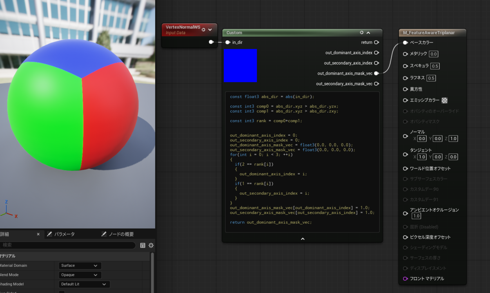

---
title: "UEマテリアルネタ帳"
date: "2026-01-28T23:46:56+09:00"
draft: false
url: "/entry/2026/01/28/234656/"
categories: ["HLSL", "UE5", "シェーダ", "マテリアル", "数学"]
hatena_author: "nagakagachi"
hatena_original_url: "https://nagakagachi.hatenablog.com/entry/2026/01/28/234656"
hatena_basename: "2026/01/28/234656"
math: false
image: "images/2f7988364730b8938c8767f1068a1d61ce37261a3bab66557ad5ed82ea7fbfab.png"
---

雑多なネタを書いてあとで探しやすくするためのページ.  
  
役に立ったらイイネや紹介してね☆（ゝω・）vｷｬﾋﾟ

<ul class="table-of-contents">
<li><a href="#Simplex頂点に任意の乱数を利用できるSimplex-Noise">Simplex頂点に任意の乱数を利用できるSimplex Noise</a></li>
<li><a href="#入力ベクトルの主要軸と第二主要軸を抽出する">入力ベクトルの主要軸と第二主要軸を抽出する</a></li>
</ul>

    

<h3 id="Simplex頂点に任意の乱数を利用できるSimplex-Noise">Simplex頂点に任意の乱数を利用できるSimplex Noise</h3>

<iframe src="https://hatenablog-parts.com/embed?url=https%3A%2F%2Fnagakagachi.hatenablog.com%2Fentry%2F2023%2F07%2F26%2F135233" title="Simplex頂点に任意の乱数を利用できるSimplex Noise Custom Node[UE][UE5] - ながむしメモ" class="embed-card embed-blogcard" scrolling="no" frameborder="0" style="display: block; width: 100%; height: 190px; max-width: 500px; margin: 10px 0px;" loading="lazy"></iframe><cite class="hatena-citation"><a href="https://nagakagachi.hatenablog.com/entry/2023/07/26/135233">nagakagachi.hatenablog.com</a></cite>
 

    

<h3 id="入力ベクトルの主要軸と第二主要軸を抽出する">入力ベクトルの主要軸と第二主要軸を抽出する</h3>

ベクトルの<a class="keyword" href="https://d.hatena.ne.jp/keyword/%A5%B3%A5%F3%A5%DD%A1%BC%A5%CD%A5%F3%A5%C8">コンポーネント</a>について絶対値が大きい順で第一位(Dominant), 第二位(Secondary)の軸の情報を抽出する. 
軸インデックス:x=0, y=1, z=2 
と 
軸マスクベクトル (1, 0, 0), (0, 1, 0), (0, 0, 1) 
を返す. 
もっとシンプルな記述ができそうなので後でアップデートするかも. 

<pre class="code lang-cpp" data-lang="cpp" data-unlink>const float3 abs_dir = abs(in_dir);

const int3 comp0 = abs_dir.xyz &gt; abs_dir.yzx;
const int3 comp1 = abs_dir.xyz &gt; abs_dir.zxy;
const int3 rank = comp0+comp1;

out_dominant_axis_index = 0;
out_secondary_axis_index = 0;
out_dominant_axis_mask_vec = float3(0.0, 0.0, 0.0);
out_secondary_axis_mask_vec = float3(0.0, 0.0, 0.0);
for(int i = 0; i &lt; 3; ++i)
{
  if(2 == rank[i])
  {
    out_dominant_axis_index = i;
  }
  if(1 == rank[i])
  {
    out_secondary_axis_index = i;
  }
}
out_dominant_axis_mask_vec[out_dominant_axis_index] = 1.0;
out_secondary_axis_mask_vec[out_secondary_axis_index] = 1.0;

return out_dominant_axis_mask_vec;
</pre>

---

[元のはてなブログ記事](https://nagakagachi.hatenablog.com/entry/2026/01/28/234656)
