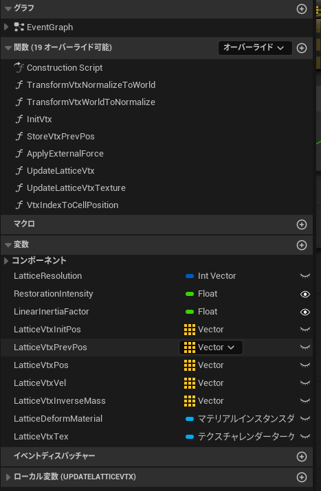
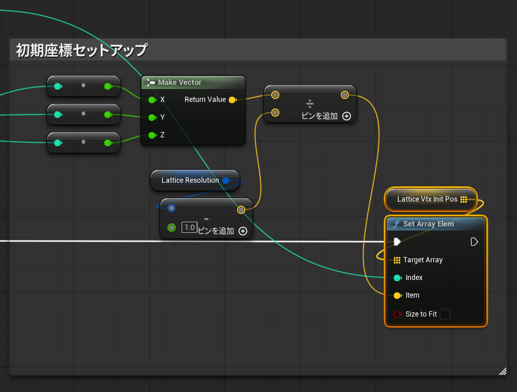
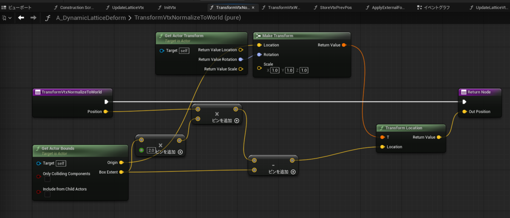
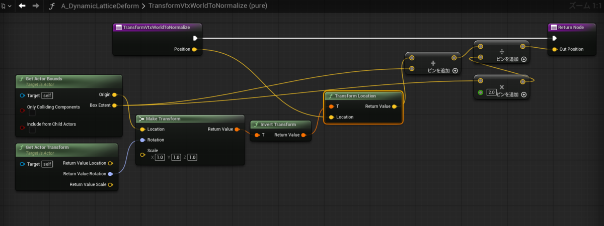
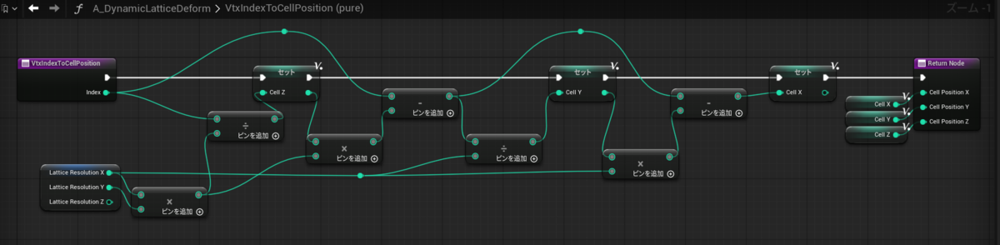
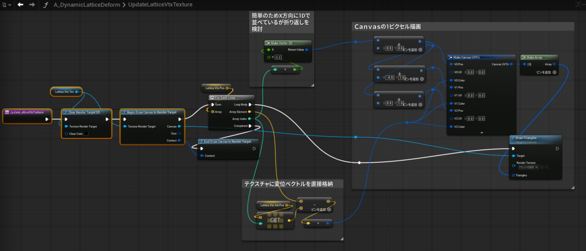

---
title: "UEマテリアルネタ:LatticeBasedDynamicDeform"
date: "2026-02-04T00:22:46+09:00"
draft: false
url: "/entry/2026/02/04/002246/"
categories: []
hatena_author: "nagakagachi"
hatena_original_url: "https://nagakagachi.hatenablog.com/entry/2026/02/04/002246"
hatena_basename: "2026/02/04/002246"
math: false
---

コンセプト実装メモ

material

<pre class="code c++" data-lang="c++" data-unlink>Begin Object Class=/Script/UnrealEd.MaterialGraphNode Name=&#34;MaterialGraphNode_0&#34; ExportPath=&#34;/Script/UnrealEd.MaterialGraphNode&#39;/Engine/Transient.M_DynamicLatticeDeform:MaterialGraph_0.MaterialGraphNode_0&#39;&#34;
   Begin Object Class=/Script/Engine.MaterialExpressionAbs Name=&#34;MaterialExpressionAbs_3&#34; ExportPath=&#34;/Script/Engine.MaterialExpressionAbs&#39;/Engine/Transient.M_DynamicLatticeDeform:MaterialGraph_0.MaterialGraphNode_0.MaterialExpressionAbs_3&#39;&#34;
   End Object
   Begin Object Name=&#34;MaterialExpressionAbs_3&#34; ExportPath=&#34;/Script/Engine.MaterialExpressionAbs&#39;/Engine/Transient.M_DynamicLatticeDeform:MaterialGraph_0.MaterialGraphNode_0.MaterialExpressionAbs_3&#39;&#34;
      Input=(Expression=&#34;/Script/Engine.MaterialExpressionAdd&#39;MaterialGraphNode_42.MaterialExpressionAdd_3&#39;&#34;)
      MaterialExpressionEditorX=1136
      MaterialExpressionEditorY=-544
      MaterialExpressionGuid=618A1FEA4EC7BE62FCDD5E8775143A99
      Material=&#34;/Script/UnrealEd.PreviewMaterial&#39;/Engine/Transient.M_DynamicLatticeDeform&#39;&#34;
   End Object
   MaterialExpression=&#34;/Script/Engine.MaterialExpressionAbs&#39;MaterialExpressionAbs_3&#39;&#34;
   NodePosX=1136
   NodePosY=-544
   NodeGuid=CE61B2744816A6DBBE259A8A85CF33D1
   CustomProperties Pin (PinId=156D96F34497F69979397E8818DDAA80,PinName=&#34;Input&#34;,PinFriendlyName=NSLOCTEXT(&#34;MaterialGraphNode&#34;, &#34;Space&#34;, &#34; &#34;),PinType.PinCategory=&#34;required&#34;,PinType.PinSubCategory=&#34;&#34;,PinType.PinSubCategoryObject=None,PinType.PinSubCategoryMemberReference=(),PinType.PinValueType=(),PinType.ContainerType=None,PinType.bIsReference=False,PinType.bIsConst=False,PinType.bIsWeakPointer=False,PinType.bIsUObjectWrapper=False,PinType.bSerializeAsSinglePrecisionFloat=False,LinkedTo=(MaterialGraphNode_42 638E8D69403BED61E274A8B4B591B5B2,),PersistentGuid=00000000000000000000000000000000,bHidden=False,bNotConnectable=False,bDefaultValueIsReadOnly=False,bDefaultValueIsIgnored=False,bAdvancedView=False,bOrphanedPin=False,)
   CustomProperties Pin (PinId=A188A0A94A3ABCE76D74CBACF77286CB,PinName=&#34;Output&#34;,PinFriendlyName=NSLOCTEXT(&#34;MaterialGraphNode&#34;, &#34;Space&#34;, &#34; &#34;),Direction=&#34;EGPD_Output&#34;,PinType.PinCategory=&#34;&#34;,PinType.PinSubCategory=&#34;&#34;,PinType.PinSubCategoryObject=None,PinType.PinSubCategoryMemberReference=(),PinType.PinValueType=(),PinType.ContainerType=None,PinType.bIsReference=False,PinType.bIsConst=False,PinType.bIsWeakPointer=False,PinType.bIsUObjectWrapper=False,PinType.bSerializeAsSinglePrecisionFloat=False,LinkedTo=(MaterialGraphNode_Root_0 891CD1634EE6E02E4C957587C39198A8,),PersistentGuid=00000000000000000000000000000000,bHidden=False,bNotConnectable=False,bDefaultValueIsReadOnly=False,bDefaultValueIsIgnored=False,bAdvancedView=False,bOrphanedPin=False,)
End Object
Begin Object Class=/Script/UnrealEd.MaterialGraphNode_Knot Name=&#34;MaterialGraphNode_Knot_0&#34; ExportPath=&#34;/Script/UnrealEd.MaterialGraphNode_Knot&#39;/Engine/Transient.M_DynamicLatticeDeform:MaterialGraph_0.MaterialGraphNode_Knot_0&#39;&#34;
   Begin Object Class=/Script/Engine.MaterialExpressionReroute Name=&#34;MaterialExpressionReroute_12&#34; ExportPath=&#34;/Script/Engine.MaterialExpressionReroute&#39;/Engine/Transient.M_DynamicLatticeDeform:MaterialGraph_0.MaterialGraphNode_Knot_0.MaterialExpressionReroute_12&#39;&#34;
   End Object
   Begin Object Name=&#34;MaterialExpressionReroute_12&#34; ExportPath=&#34;/Script/Engine.MaterialExpressionReroute&#39;/Engine/Transient.M_DynamicLatticeDeform:MaterialGraph_0.MaterialGraphNode_Knot_0.MaterialExpressionReroute_12&#39;&#34;
      Input=(Expression=&#34;/Script/Engine.MaterialExpressionMultiply&#39;MaterialGraphNode_2.MaterialExpressionMultiply_2&#39;&#34;)
      MaterialExpressionEditorX=976
      MaterialExpressionEditorY=-208
      MaterialExpressionGuid=D01463B44F12A864E234EC9154BA4F4D
      Material=&#34;/Script/UnrealEd.PreviewMaterial&#39;/Engine/Transient.M_DynamicLatticeDeform&#39;&#34;
   End Object
   MaterialExpression=&#34;/Script/Engine.MaterialExpressionReroute&#39;MaterialExpressionReroute_12&#39;&#34;
   NodePosX=976
   NodePosY=-208
   bCanRenameNode=False
   NodeGuid=07FAF5574724F26F6167ECB9CB797F61
   CustomProperties Pin (PinId=97EDD58C47AE5B073D3CDB8814F46B2F,PinName=&#34;InputPin&#34;,PinType.PinCategory=&#34;wildcard&#34;,PinType.PinSubCategory=&#34;&#34;,PinType.PinSubCategoryObject=None,PinType.PinSubCategoryMemberReference=(),PinType.PinValueType=(),PinType.ContainerType=None,PinType.bIsReference=False,PinType.bIsConst=False,PinType.bIsWeakPointer=False,PinType.bIsUObjectWrapper=False,PinType.bSerializeAsSinglePrecisionFloat=False,LinkedTo=(MaterialGraphNode_2 608B93C641BAB0594CDAE980C0CE0A02,),PersistentGuid=00000000000000000000000000000000,bHidden=False,bNotConnectable=False,bDefaultValueIsReadOnly=False,bDefaultValueIsIgnored=True,bAdvancedView=False,bOrphanedPin=False,)
   CustomProperties Pin (PinId=21AEB43349A80F4819E79EB40151FE29,PinName=&#34;OutputPin&#34;,Direction=&#34;EGPD_Output&#34;,PinType.PinCategory=&#34;wildcard&#34;,PinType.PinSubCategory=&#34;&#34;,PinType.PinSubCategoryObject=None,PinType.PinSubCategoryMemberReference=(),PinType.PinValueType=(),PinType.ContainerType=None,PinType.bIsReference=False,PinType.bIsConst=False,PinType.bIsWeakPointer=False,PinType.bIsUObjectWrapper=False,PinType.bSerializeAsSinglePrecisionFloat=False,LinkedTo=(MaterialGraphNode_Root_0 DD29B3E54B43BBF923E58ABB0F6F9D66,),PersistentGuid=00000000000000000000000000000000,bHidden=False,bNotConnectable=False,bDefaultValueIsReadOnly=False,bDefaultValueIsIgnored=False,bAdvancedView=False,bOrphanedPin=False,)
End Object
Begin Object Class=/Script/UnrealEd.MaterialGraphNode Name=&#34;MaterialGraphNode_1&#34; ExportPath=&#34;/Script/UnrealEd.MaterialGraphNode&#39;/Engine/Transient.M_DynamicLatticeDeform:MaterialGraph_0.MaterialGraphNode_1&#39;&#34;
   Begin Object Class=/Script/Engine.MaterialExpressionConstant3Vector Name=&#34;MaterialExpressionConstant3Vector_0&#34; ExportPath=&#34;/Script/Engine.MaterialExpressionConstant3Vector&#39;/Engine/Transient.M_DynamicLatticeDeform:MaterialGraph_0.MaterialGraphNode_1.MaterialExpressionConstant3Vector_0&#39;&#34;
   End Object
   Begin Object Name=&#34;MaterialExpressionConstant3Vector_0&#34; ExportPath=&#34;/Script/Engine.MaterialExpressionConstant3Vector&#39;/Engine/Transient.M_DynamicLatticeDeform:MaterialGraph_0.MaterialGraphNode_1.MaterialExpressionConstant3Vector_0&#39;&#34;
      Constant=(R=0.459925,G=1.000000,B=0.787798,A=1.000000)
      MaterialExpressionEditorX=672
      MaterialExpressionEditorY=-640
      MaterialExpressionGuid=7758F61D4157B553ADEB50832122AC48
      Material=&#34;/Script/UnrealEd.PreviewMaterial&#39;/Engine/Transient.M_DynamicLatticeDeform&#39;&#34;
   End Object
   MaterialExpression=&#34;/Script/Engine.MaterialExpressionConstant3Vector&#39;MaterialExpressionConstant3Vector_0&#39;&#34;
   NodePosX=672
   NodePosY=-640
   NodeGuid=390B70A44C94166617D31AAE48BE9615
   CustomProperties Pin (PinId=7204CBA74608D483362C0C9202E27153,PinName=&#34;Constant&#34;,PinType.PinCategory=&#34;optional&#34;,PinType.PinSubCategory=&#34;rgb&#34;,PinType.PinSubCategoryObject=None,PinType.PinSubCategoryMemberReference=(),PinType.PinValueType=(),PinType.ContainerType=None,PinType.bIsReference=False,PinType.bIsConst=False,PinType.bIsWeakPointer=False,PinType.bIsUObjectWrapper=False,PinType.bSerializeAsSinglePrecisionFloat=False,DefaultValue=&#34;0.459925,1.0,0.787798&#34;,PersistentGuid=00000000000000000000000000000000,bHidden=False,bNotConnectable=True,bDefaultValueIsReadOnly=False,bDefaultValueIsIgnored=False,bAdvancedView=False,bOrphanedPin=False,)
   CustomProperties Pin (PinId=597429E44A337F8EFF998AA7539751D0,PinName=&#34;Output&#34;,PinFriendlyName=NSLOCTEXT(&#34;MaterialGraphNode&#34;, &#34;Space&#34;, &#34; &#34;),Direction=&#34;EGPD_Output&#34;,PinType.PinCategory=&#34;mask&#34;,PinType.PinSubCategory=&#34;&#34;,PinType.PinSubCategoryObject=None,PinType.PinSubCategoryMemberReference=(),PinType.PinValueType=(),PinType.ContainerType=None,PinType.bIsReference=False,PinType.bIsConst=False,PinType.bIsWeakPointer=False,PinType.bIsUObjectWrapper=False,PinType.bSerializeAsSinglePrecisionFloat=False,LinkedTo=(MaterialGraphNode_42 70AB43564198A863B0FCD4B9F291912C,),PersistentGuid=00000000000000000000000000000000,bHidden=False,bNotConnectable=False,bDefaultValueIsReadOnly=False,bDefaultValueIsIgnored=False,bAdvancedView=False,bOrphanedPin=False,)
   CustomProperties Pin (PinId=71766138468B78919B60418D85F3C377,PinName=&#34;Output2&#34;,PinFriendlyName=NSLOCTEXT(&#34;MaterialGraphNode&#34;, &#34;Space&#34;, &#34; &#34;),Direction=&#34;EGPD_Output&#34;,PinType.PinCategory=&#34;mask&#34;,PinType.PinSubCategory=&#34;red&#34;,PinType.PinSubCategoryObject=None,PinType.PinSubCategoryMemberReference=(),PinType.PinValueType=(),PinType.ContainerType=None,PinType.bIsReference=False,PinType.bIsConst=False,PinType.bIsWeakPointer=False,PinType.bIsUObjectWrapper=False,PinType.bSerializeAsSinglePrecisionFloat=False,PersistentGuid=00000000000000000000000000000000,bHidden=False,bNotConnectable=False,bDefaultValueIsReadOnly=False,bDefaultValueIsIgnored=False,bAdvancedView=False,bOrphanedPin=False,)
   CustomProperties Pin (PinId=6B7C31E142A541962D99C09701901DC5,PinName=&#34;Output3&#34;,PinFriendlyName=NSLOCTEXT(&#34;MaterialGraphNode&#34;, &#34;Space&#34;, &#34; &#34;),Direction=&#34;EGPD_Output&#34;,PinType.PinCategory=&#34;mask&#34;,PinType.PinSubCategory=&#34;green&#34;,PinType.PinSubCategoryObject=None,PinType.PinSubCategoryMemberReference=(),PinType.PinValueType=(),PinType.ContainerType=None,PinType.bIsReference=False,PinType.bIsConst=False,PinType.bIsWeakPointer=False,PinType.bIsUObjectWrapper=False,PinType.bSerializeAsSinglePrecisionFloat=False,PersistentGuid=00000000000000000000000000000000,bHidden=False,bNotConnectable=False,bDefaultValueIsReadOnly=False,bDefaultValueIsIgnored=False,bAdvancedView=False,bOrphanedPin=False,)
   CustomProperties Pin (PinId=01F385CB49E1FF5FE7BC1087DD75BD33,PinName=&#34;Output4&#34;,PinFriendlyName=NSLOCTEXT(&#34;MaterialGraphNode&#34;, &#34;Space&#34;, &#34; &#34;),Direction=&#34;EGPD_Output&#34;,PinType.PinCategory=&#34;mask&#34;,PinType.PinSubCategory=&#34;blue&#34;,PinType.PinSubCategoryObject=None,PinType.PinSubCategoryMemberReference=(),PinType.PinValueType=(),PinType.ContainerType=None,PinType.bIsReference=False,PinType.bIsConst=False,PinType.bIsWeakPointer=False,PinType.bIsUObjectWrapper=False,PinType.bSerializeAsSinglePrecisionFloat=False,PersistentGuid=00000000000000000000000000000000,bHidden=False,bNotConnectable=False,bDefaultValueIsReadOnly=False,bDefaultValueIsIgnored=False,bAdvancedView=False,bOrphanedPin=False,)
End Object
Begin Object Class=/Script/UnrealEd.MaterialGraphNode Name=&#34;MaterialGraphNode_2&#34; ExportPath=&#34;/Script/UnrealEd.MaterialGraphNode&#39;/Engine/Transient.M_DynamicLatticeDeform:MaterialGraph_0.MaterialGraphNode_2&#39;&#34;
   Begin Object Class=/Script/Engine.MaterialExpressionMultiply Name=&#34;MaterialExpressionMultiply_2&#34; ExportPath=&#34;/Script/Engine.MaterialExpressionMultiply&#39;/Engine/Transient.M_DynamicLatticeDeform:MaterialGraph_0.MaterialGraphNode_2.MaterialExpressionMultiply_2&#39;&#34;
   End Object
   Begin Object Name=&#34;MaterialExpressionMultiply_2&#34; ExportPath=&#34;/Script/Engine.MaterialExpressionMultiply&#39;/Engine/Transient.M_DynamicLatticeDeform:MaterialGraph_0.MaterialGraphNode_2.MaterialExpressionMultiply_2&#39;&#34;
      A=(Expression=&#34;/Script/Engine.MaterialExpressionCustom&#39;MaterialGraphNode_Custom_0.MaterialExpressionCustom_2&#39;&#34;)
      B=(Expression=&#34;/Script/Engine.MaterialExpressionMultiply&#39;MaterialGraphNode_12.MaterialExpressionMultiply_5&#39;&#34;)
      ConstB=10.000000
      MaterialExpressionEditorX=592
      MaterialExpressionEditorY=112
      MaterialExpressionGuid=801405D641B41ABE8B4088BC7144E91F
      Material=&#34;/Script/UnrealEd.PreviewMaterial&#39;/Engine/Transient.M_DynamicLatticeDeform&#39;&#34;
   End Object
   MaterialExpression=&#34;/Script/Engine.MaterialExpressionMultiply&#39;MaterialExpressionMultiply_2&#39;&#34;
   NodePosX=592
   NodePosY=112
   NodeGuid=767DE87C464CBBEF8CD726B7B8620BEA
   CustomProperties Pin (PinId=271BA5D84DF16892008A6D9BB82E3788,PinName=&#34;A&#34;,PinType.PinCategory=&#34;optional&#34;,PinType.PinSubCategory=&#34;red&#34;,PinType.PinSubCategoryObject=None,PinType.PinSubCategoryMemberReference=(),PinType.PinValueType=(),PinType.ContainerType=None,PinType.bIsReference=False,PinType.bIsConst=False,PinType.bIsWeakPointer=False,PinType.bIsUObjectWrapper=False,PinType.bSerializeAsSinglePrecisionFloat=False,DefaultValue=&#34;0.0&#34;,LinkedTo=(MaterialGraphNode_Custom_0 AF4C1E69462CCBD59FD6CDAFD9A95BED,),PersistentGuid=00000000000000000000000000000000,bHidden=False,bNotConnectable=False,bDefaultValueIsReadOnly=False,bDefaultValueIsIgnored=False,bAdvancedView=False,bOrphanedPin=False,)
   CustomProperties Pin (PinId=F66B95B44E6BA4EB1ECDB4877EB38891,PinName=&#34;B&#34;,PinType.PinCategory=&#34;optional&#34;,PinType.PinSubCategory=&#34;red&#34;,PinType.PinSubCategoryObject=None,PinType.PinSubCategoryMemberReference=(),PinType.PinValueType=(),PinType.ContainerType=None,PinType.bIsReference=False,PinType.bIsConst=False,PinType.bIsWeakPointer=False,PinType.bIsUObjectWrapper=False,PinType.bSerializeAsSinglePrecisionFloat=False,DefaultValue=&#34;10.0&#34;,LinkedTo=(MaterialGraphNode_12 79FF34B04F50FBE02A39B7A5E1418FD6,),PersistentGuid=00000000000000000000000000000000,bHidden=False,bNotConnectable=False,bDefaultValueIsReadOnly=False,bDefaultValueIsIgnored=False,bAdvancedView=False,bOrphanedPin=False,)
   CustomProperties Pin (PinId=608B93C641BAB0594CDAE980C0CE0A02,PinName=&#34;Output&#34;,PinFriendlyName=NSLOCTEXT(&#34;MaterialGraphNode&#34;, &#34;Space&#34;, &#34; &#34;),Direction=&#34;EGPD_Output&#34;,PinType.PinCategory=&#34;&#34;,PinType.PinSubCategory=&#34;&#34;,PinType.PinSubCategoryObject=None,PinType.PinSubCategoryMemberReference=(),PinType.PinValueType=(),PinType.ContainerType=None,PinType.bIsReference=False,PinType.bIsConst=False,PinType.bIsWeakPointer=False,PinType.bIsUObjectWrapper=False,PinType.bSerializeAsSinglePrecisionFloat=False,LinkedTo=(MaterialGraphNode_Knot_0 97EDD58C47AE5B073D3CDB8814F46B2F,),PersistentGuid=00000000000000000000000000000000,bHidden=False,bNotConnectable=False,bDefaultValueIsReadOnly=False,bDefaultValueIsIgnored=False,bAdvancedView=False,bOrphanedPin=False,)
End Object
Begin Object Class=/Script/UnrealEd.MaterialGraphNode_Custom Name=&#34;MaterialGraphNode_Custom_0&#34; ExportPath=&#34;/Script/UnrealEd.MaterialGraphNode_Custom&#39;/Engine/Transient.M_DynamicLatticeDeform:MaterialGraph_0.MaterialGraphNode_Custom_0&#39;&#34;
   Begin Object Class=/Script/Engine.MaterialExpressionCustom Name=&#34;MaterialExpressionCustom_2&#34; ExportPath=&#34;/Script/Engine.MaterialExpressionCustom&#39;/Engine/Transient.M_DynamicLatticeDeform:MaterialGraph_0.MaterialGraphNode_Custom_0.MaterialExpressionCustom_2&#39;&#34;
   End Object
   Begin Object Name=&#34;MaterialExpressionCustom_2&#34; ExportPath=&#34;/Script/Engine.MaterialExpressionCustom&#39;/Engine/Transient.M_DynamicLatticeDeform:MaterialGraph_0.MaterialGraphNode_Custom_0.MaterialExpressionCustom_2&#39;&#34;
      Code=&#34;const int3 lattice_vtx_count = in_lattice_reso - 1;\r\n\r\nconst bool is_valid_lattice_id = all(0 &lt;= in_lattice_id) &amp;&amp; all(in_lattice_id &lt;= (lattice_vtx_count-1));\r\nconst float3 lattice_cell_size = in_lattice_size / lattice_vtx_count;\r\n\r\n\r\nfloat3 pos_deform = float3(0.0, 0.0, 0.0);\r\n\r\nfloat debug_weight = 0.0;\r\nfloat debug_vtx = 0.0;\r\n\r\nif(is_valid_lattice_id)\r\n{\r\n  const float3 vtx_w0 = 1.0 - in_lattice_uvw;\r\n  const float3 vtx_w1 = in_lattice_uvw;\r\n\r\n  const int ay = in_lattice_reso.x;\r\n  const int az = in_lattice_reso.x*in_lattice_reso.y;\r\n  const int vtx_i0 = (in_lattice_id.x) +   (in_lattice_id.y)*ay +   (in_lattice_id.z)*az;\r\n  const int vtx_i1 = (in_lattice_id.x+1) + (in_lattice_id.y)*ay +   (in_lattice_id.z)*az;\r\n  const int vtx_i2 = (in_lattice_id.x) +   (in_lattice_id.y+1)*ay + (in_lattice_id.z)*az;\r\n  const int vtx_i3 = (in_lattice_id.x+1) + (in_lattice_id.y+1)*ay + (in_lattice_id.z)*az;\r\n  const int vtx_i4 = (in_lattice_id.x) +   (in_lattice_id.y)*ay +   (in_lattice_id.z+1)*az;\r\n  const int vtx_i5 = (in_lattice_id.x+1) + (in_lattice_id.y)*ay +   (in_lattice_id.z+1)*az;\r\n  const int vtx_i6 = (in_lattice_id.x) +   (in_lattice_id.y+1)*ay + (in_lattice_id.z+1)*az;\r\n  const int vtx_i7 = (in_lattice_id.x+1) + (in_lattice_id.y+1)*ay + (in_lattice_id.z+1)*az;\r\n\r\n\r\n  float4 vtx_accum = (float4)0.0;\r\n  vtx_accum += in_lattice_vtx_tex.Load(int3(vtx_i0, 0, 0)) * (vtx_w0.x)*(vtx_w0.y)*(vtx_w0.z);\r\n  vtx_accum += in_lattice_vtx_tex.Load(int3(vtx_i1, 0, 0)) * (vtx_w1.x)*(vtx_w0.y)*(vtx_w0.z);\r\n  vtx_accum += in_lattice_vtx_tex.Load(int3(vtx_i2, 0, 0)) * (vtx_w0.x)*(vtx_w1.y)*(vtx_w0.z);\r\n  vtx_accum += in_lattice_vtx_tex.Load(int3(vtx_i3, 0, 0)) * (vtx_w1.x)*(vtx_w1.y)*(vtx_w0.z);\r\n  vtx_accum += in_lattice_vtx_tex.Load(int3(vtx_i4, 0, 0)) * (vtx_w0.x)*(vtx_w0.y)*(vtx_w1.z);\r\n  vtx_accum += in_lattice_vtx_tex.Load(int3(vtx_i5, 0, 0)) * (vtx_w1.x)*(vtx_w0.y)*(vtx_w1.z);\r\n  vtx_accum += in_lattice_vtx_tex.Load(int3(vtx_i6, 0, 0)) * (vtx_w0.x)*(vtx_w1.y)*(vtx_w1.z);\r\n  vtx_accum += in_lattice_vtx_tex.Load(int3(vtx_i7, 0, 0)) * (vtx_w1.x)*(vtx_w1.y)*(vtx_w1.z);\r\n\r\n  pos_deform = vtx_accum;\r\n}\r\n\r\nreturn pos_deform;\r\n\r\n&#34;
      Inputs(0)=(InputName=&#34;in_lattice_id&#34;,Input=(Expression=&#34;/Script/Engine.MaterialExpressionNamedRerouteDeclaration&#39;MaterialGraphNode_7.MaterialExpressionNamedRerouteDeclaration_0&#39;&#34;))
      Inputs(1)=(InputName=&#34;in_lattice_uvw&#34;,Input=(Expression=&#34;/Script/Engine.MaterialExpressionNamedRerouteDeclaration&#39;MaterialGraphNode_4.MaterialExpressionNamedRerouteDeclaration_1&#39;&#34;))
      Inputs(2)=(InputName=&#34;in_lattice_reso&#34;,Input=(Expression=&#34;/Script/Engine.MaterialExpressionReroute&#39;MaterialGraphNode_Knot_1.MaterialExpressionReroute_1&#39;&#34;))
      Inputs(3)=(InputName=&#34;in_lattice_size&#34;,Input=(Expression=&#34;/Script/Engine.MaterialExpressionReroute&#39;MaterialGraphNode_Knot_2.MaterialExpressionReroute_2&#39;&#34;))
      Inputs(4)=(InputName=&#34;in_lattice_vtx_tex&#34;,Input=(Expression=&#34;/Script/Engine.MaterialExpressionTextureObjectParameter&#39;MaterialGraphNode_10.MaterialExpressionTextureObjectParameter_0&#39;&#34;))
      Inputs(5)=(InputName=&#34;in_lattice_vtx_texel_size&#34;,Input=(Expression=&#34;/Script/Engine.MaterialExpressionTextureProperty&#39;MaterialGraphNode_11.MaterialExpressionTextureProperty_0&#39;&#34;))
      AdditionalOutputs(0)=(OutputName=&#34;out_debug_color&#34;,OutputType=CMOT_Float3)
      ShowCode=True
      MaterialExpressionEditorX=-576
      MaterialExpressionEditorY=64
      MaterialExpressionGuid=EE1A98B74B3D84AC63EF4298EF5F9311
      Material=&#34;/Script/UnrealEd.PreviewMaterial&#39;/Engine/Transient.M_DynamicLatticeDeform&#39;&#34;
      bShowOutputNameOnPin=True
      Outputs(0)=(OutputName=&#34;return&#34;)
      Outputs(1)=(OutputName=&#34;out_debug_color&#34;)
   End Object
   MaterialExpression=&#34;/Script/Engine.MaterialExpressionCustom&#39;MaterialExpressionCustom_2&#39;&#34;
   NodePosX=-576
   NodePosY=64
   NodeGuid=D24EF2AB4923D520C4DB1D80201C0B53
   CustomProperties Pin (PinId=537C0DF74200871F85B7019702200A22,PinName=&#34;in_lattice_id&#34;,PinType.PinCategory=&#34;required&#34;,PinType.PinSubCategory=&#34;&#34;,PinType.PinSubCategoryObject=None,PinType.PinSubCategoryMemberReference=(),PinType.PinValueType=(),PinType.ContainerType=None,PinType.bIsReference=False,PinType.bIsConst=False,PinType.bIsWeakPointer=False,PinType.bIsUObjectWrapper=False,PinType.bSerializeAsSinglePrecisionFloat=False,LinkedTo=(MaterialGraphNode_7 A71B44654C44AB83FC9662A98E4C1D14,),PersistentGuid=00000000000000000000000000000000,bHidden=False,bNotConnectable=False,bDefaultValueIsReadOnly=False,bDefaultValueIsIgnored=False,bAdvancedView=False,bOrphanedPin=False,)
   CustomProperties Pin (PinId=C82084184A1AFFBEACF88CAE3B47CAE8,PinName=&#34;in_lattice_uvw&#34;,PinType.PinCategory=&#34;required&#34;,PinType.PinSubCategory=&#34;&#34;,PinType.PinSubCategoryObject=None,PinType.PinSubCategoryMemberReference=(),PinType.PinValueType=(),PinType.ContainerType=None,PinType.bIsReference=False,PinType.bIsConst=False,PinType.bIsWeakPointer=False,PinType.bIsUObjectWrapper=False,PinType.bSerializeAsSinglePrecisionFloat=False,LinkedTo=(MaterialGraphNode_4 6D1FC9BF4DD7BF70843CF99CD39EEEE4,),PersistentGuid=00000000000000000000000000000000,bHidden=False,bNotConnectable=False,bDefaultValueIsReadOnly=False,bDefaultValueIsIgnored=False,bAdvancedView=False,bOrphanedPin=False,)
   CustomProperties Pin (PinId=06CA3F11492B4F9865F5A2BD2F6D6A10,PinName=&#34;in_lattice_reso&#34;,PinType.PinCategory=&#34;required&#34;,PinType.PinSubCategory=&#34;&#34;,PinType.PinSubCategoryObject=None,PinType.PinSubCategoryMemberReference=(),PinType.PinValueType=(),PinType.ContainerType=None,PinType.bIsReference=False,PinType.bIsConst=False,PinType.bIsWeakPointer=False,PinType.bIsUObjectWrapper=False,PinType.bSerializeAsSinglePrecisionFloat=False,LinkedTo=(MaterialGraphNode_Knot_1 ED297F8A4F01AB7FC8C022A40D66DEB5,),PersistentGuid=00000000000000000000000000000000,bHidden=False,bNotConnectable=False,bDefaultValueIsReadOnly=False,bDefaultValueIsIgnored=False,bAdvancedView=False,bOrphanedPin=False,)
   CustomProperties Pin (PinId=32785A6D43F60D54C376528074DA2F95,PinName=&#34;in_lattice_size&#34;,PinType.PinCategory=&#34;required&#34;,PinType.PinSubCategory=&#34;&#34;,PinType.PinSubCategoryObject=None,PinType.PinSubCategoryMemberReference=(),PinType.PinValueType=(),PinType.ContainerType=None,PinType.bIsReference=False,PinType.bIsConst=False,PinType.bIsWeakPointer=False,PinType.bIsUObjectWrapper=False,PinType.bSerializeAsSinglePrecisionFloat=False,LinkedTo=(MaterialGraphNode_Knot_2 EFD322694656CB36E3202EB49CB50989,),PersistentGuid=00000000000000000000000000000000,bHidden=False,bNotConnectable=False,bDefaultValueIsReadOnly=False,bDefaultValueIsIgnored=False,bAdvancedView=False,bOrphanedPin=False,)
   CustomProperties Pin (PinId=F7F6DD344CEA67647D0E038419330B18,PinName=&#34;in_lattice_vtx_tex&#34;,PinType.PinCategory=&#34;required&#34;,PinType.PinSubCategory=&#34;&#34;,PinType.PinSubCategoryObject=None,PinType.PinSubCategoryMemberReference=(),PinType.PinValueType=(),PinType.ContainerType=None,PinType.bIsReference=False,PinType.bIsConst=False,PinType.bIsWeakPointer=False,PinType.bIsUObjectWrapper=False,PinType.bSerializeAsSinglePrecisionFloat=False,LinkedTo=(MaterialGraphNode_10 C7637FF44BC21CC478CB42828F2D078C,),PersistentGuid=00000000000000000000000000000000,bHidden=False,bNotConnectable=False,bDefaultValueIsReadOnly=False,bDefaultValueIsIgnored=False,bAdvancedView=False,bOrphanedPin=False,)
   CustomProperties Pin (PinId=56BCED2346461B390B07768867598603,PinName=&#34;in_lattice_vtx_texel_size&#34;,PinType.PinCategory=&#34;required&#34;,PinType.PinSubCategory=&#34;&#34;,PinType.PinSubCategoryObject=None,PinType.PinSubCategoryMemberReference=(),PinType.PinValueType=(),PinType.ContainerType=None,PinType.bIsReference=False,PinType.bIsConst=False,PinType.bIsWeakPointer=False,PinType.bIsUObjectWrapper=False,PinType.bSerializeAsSinglePrecisionFloat=False,LinkedTo=(MaterialGraphNode_11 D5CBAE54419805CAFE9F90BB4AAC62C6,),PersistentGuid=00000000000000000000000000000000,bHidden=False,bNotConnectable=False,bDefaultValueIsReadOnly=False,bDefaultValueIsIgnored=False,bAdvancedView=False,bOrphanedPin=False,)
   CustomProperties Pin (PinId=AF4C1E69462CCBD59FD6CDAFD9A95BED,PinName=&#34;return&#34;,Direction=&#34;EGPD_Output&#34;,PinType.PinCategory=&#34;&#34;,PinType.PinSubCategory=&#34;&#34;,PinType.PinSubCategoryObject=None,PinType.PinSubCategoryMemberReference=(),PinType.PinValueType=(),PinType.ContainerType=None,PinType.bIsReference=False,PinType.bIsConst=False,PinType.bIsWeakPointer=False,PinType.bIsUObjectWrapper=False,PinType.bSerializeAsSinglePrecisionFloat=False,LinkedTo=(MaterialGraphNode_2 271BA5D84DF16892008A6D9BB82E3788,MaterialGraphNode_22 164AC73F4B86EEDB7E5ECE93AF2678D5,),PersistentGuid=00000000000000000000000000000000,bHidden=False,bNotConnectable=False,bDefaultValueIsReadOnly=False,bDefaultValueIsIgnored=False,bAdvancedView=False,bOrphanedPin=False,)
   CustomProperties Pin (PinId=E9356CC64FAAA2B61070E49E7C2AEBF7,PinName=&#34;out_debug_color&#34;,Direction=&#34;EGPD_Output&#34;,PinType.PinCategory=&#34;&#34;,PinType.PinSubCategory=&#34;&#34;,PinType.PinSubCategoryObject=None,PinType.PinSubCategoryMemberReference=(),PinType.PinValueType=(),PinType.ContainerType=None,PinType.bIsReference=False,PinType.bIsConst=False,PinType.bIsWeakPointer=False,PinType.bIsUObjectWrapper=False,PinType.bSerializeAsSinglePrecisionFloat=False,PersistentGuid=00000000000000000000000000000000,bHidden=False,bNotConnectable=False,bDefaultValueIsReadOnly=False,bDefaultValueIsIgnored=False,bAdvancedView=False,bOrphanedPin=False,)
End Object
Begin Object Class=/Script/UnrealEd.MaterialGraphNode Name=&#34;MaterialGraphNode_4&#34; ExportPath=&#34;/Script/UnrealEd.MaterialGraphNode&#39;/Engine/Transient.M_DynamicLatticeDeform:MaterialGraph_0.MaterialGraphNode_4&#39;&#34;
   Begin Object Class=/Script/Engine.MaterialExpressionNamedRerouteDeclaration Name=&#34;MaterialExpressionNamedRerouteDeclaration_1&#34; ExportPath=&#34;/Script/Engine.MaterialExpressionNamedRerouteDeclaration&#39;/Engine/Transient.M_DynamicLatticeDeform:MaterialGraph_0.MaterialGraphNode_4.MaterialExpressionNamedRerouteDeclaration_1&#39;&#34;
   End Object
   Begin Object Name=&#34;MaterialExpressionNamedRerouteDeclaration_1&#34; ExportPath=&#34;/Script/Engine.MaterialExpressionNamedRerouteDeclaration&#39;/Engine/Transient.M_DynamicLatticeDeform:MaterialGraph_0.MaterialGraphNode_4.MaterialExpressionNamedRerouteDeclaration_1&#39;&#34;
      Input=(Expression=&#34;/Script/Engine.MaterialExpressionCustom&#39;MaterialGraphNode_Custom_1.MaterialExpressionCustom_3&#39;&#34;,OutputIndex=2)
      Name=&#34;LatticeUvw&#34;
      NodeColor=(R=0.000000,G=0.882812,B=1.000000,A=1.000000)
      VariableGuid=6EBCE4B44E5D1815DB91AEBC9EACA936
      MaterialExpressionEditorX=-800
      MaterialExpressionEditorY=-432
      MaterialExpressionGuid=90CE568544767AB3B6162E81BFAC9497
      Material=&#34;/Script/UnrealEd.PreviewMaterial&#39;/Engine/Transient.M_DynamicLatticeDeform&#39;&#34;
   End Object
   MaterialExpression=&#34;/Script/Engine.MaterialExpressionNamedRerouteDeclaration&#39;MaterialExpressionNamedRerouteDeclaration_1&#39;&#34;
   NodePosX=-800
   NodePosY=-432
   bCanRenameNode=True
   NodeGuid=9B5B82D14363F84DC8267385212DC71F
   CustomProperties Pin (PinId=819FE751436F07FD79BEAB878B731865,PinName=&#34;Input&#34;,PinFriendlyName=NSLOCTEXT(&#34;MaterialGraphNode&#34;, &#34;Space&#34;, &#34; &#34;),PinType.PinCategory=&#34;required&#34;,PinType.PinSubCategory=&#34;&#34;,PinType.PinSubCategoryObject=None,PinType.PinSubCategoryMemberReference=(),PinType.PinValueType=(),PinType.ContainerType=None,PinType.bIsReference=False,PinType.bIsConst=False,PinType.bIsWeakPointer=False,PinType.bIsUObjectWrapper=False,PinType.bSerializeAsSinglePrecisionFloat=False,LinkedTo=(MaterialGraphNode_Custom_1 B3319E1C4F16177D15683DA542AF5B44,),PersistentGuid=00000000000000000000000000000000,bHidden=False,bNotConnectable=False,bDefaultValueIsReadOnly=False,bDefaultValueIsIgnored=False,bAdvancedView=False,bOrphanedPin=False,)
   CustomProperties Pin (PinId=6D1FC9BF4DD7BF70843CF99CD39EEEE4,PinName=&#34;Output&#34;,PinFriendlyName=NSLOCTEXT(&#34;MaterialGraphNode&#34;, &#34;Space&#34;, &#34; &#34;),Direction=&#34;EGPD_Output&#34;,PinType.PinCategory=&#34;&#34;,PinType.PinSubCategory=&#34;&#34;,PinType.PinSubCategoryObject=None,PinType.PinSubCategoryMemberReference=(),PinType.PinValueType=(),PinType.ContainerType=None,PinType.bIsReference=False,PinType.bIsConst=False,PinType.bIsWeakPointer=False,PinType.bIsUObjectWrapper=False,PinType.bSerializeAsSinglePrecisionFloat=False,LinkedTo=(MaterialGraphNode_Custom_0 C82084184A1AFFBEACF88CAE3B47CAE8,),PersistentGuid=00000000000000000000000000000000,bHidden=False,bNotConnectable=False,bDefaultValueIsReadOnly=False,bDefaultValueIsIgnored=False,bAdvancedView=False,bOrphanedPin=False,)
End Object
Begin Object Class=/Script/UnrealEd.MaterialGraphNode Name=&#34;MaterialGraphNode_5&#34; ExportPath=&#34;/Script/UnrealEd.MaterialGraphNode&#39;/Engine/Transient.M_DynamicLatticeDeform:MaterialGraph_0.MaterialGraphNode_5&#39;&#34;
   Begin Object Class=/Script/Engine.MaterialExpressionVectorParameter Name=&#34;MaterialExpressionVectorParameter_0&#34; ExportPath=&#34;/Script/Engine.MaterialExpressionVectorParameter&#39;/Engine/Transient.M_DynamicLatticeDeform:MaterialGraph_0.MaterialGraphNode_5.MaterialExpressionVectorParameter_0&#39;&#34;
   End Object
   Begin Object Name=&#34;MaterialExpressionVectorParameter_0&#34; ExportPath=&#34;/Script/Engine.MaterialExpressionVectorParameter&#39;/Engine/Transient.M_DynamicLatticeDeform:MaterialGraph_0.MaterialGraphNode_5.MaterialExpressionVectorParameter_0&#39;&#34;
      DefaultValue=(R=3.000000,G=3.000000,B=3.000000,A=0.000000)
      ParameterName=&#34;InLatticeReso&#34;
      ExpressionGUID=42684DE94E26A463B24ABA9F80E9A5C1
      MaterialExpressionEditorX=-2080
      MaterialExpressionEditorY=320
      MaterialExpressionGuid=268C06F448E8A9C8220CE8BFFC051F39
      Material=&#34;/Script/UnrealEd.PreviewMaterial&#39;/Engine/Transient.M_DynamicLatticeDeform&#39;&#34;
   End Object
   MaterialExpression=&#34;/Script/Engine.MaterialExpressionVectorParameter&#39;MaterialExpressionVectorParameter_0&#39;&#34;
   NodePosX=-2080
   NodePosY=320
   bCanRenameNode=True
   NodeGuid=D1FA64064D1BB2747410048EF5120504
   CustomProperties Pin (PinId=AFF5CBDA4920A531CD2475B5B4CEEE9A,PinName=&#34;Default Value&#34;,PinType.PinCategory=&#34;optional&#34;,PinType.PinSubCategory=&#34;rgba&#34;,PinType.PinSubCategoryObject=None,PinType.PinSubCategoryMemberReference=(),PinType.PinValueType=(),PinType.ContainerType=None,PinType.bIsReference=False,PinType.bIsConst=False,PinType.bIsWeakPointer=False,PinType.bIsUObjectWrapper=False,PinType.bSerializeAsSinglePrecisionFloat=False,DefaultValue=&#34;(R=3.000000,G=3.000000,B=3.000000,A=0.000000)&#34;,PersistentGuid=00000000000000000000000000000000,bHidden=False,bNotConnectable=True,bDefaultValueIsReadOnly=False,bDefaultValueIsIgnored=False,bAdvancedView=False,bOrphanedPin=False,)
   CustomProperties Pin (PinId=A5D1BA0E4D8E2550F34C8D813BE4FFEE,PinName=&#34;RGB&#34;,Direction=&#34;EGPD_Output&#34;,PinType.PinCategory=&#34;mask&#34;,PinType.PinSubCategory=&#34;&#34;,PinType.PinSubCategoryObject=None,PinType.PinSubCategoryMemberReference=(),PinType.PinValueType=(),PinType.ContainerType=None,PinType.bIsReference=False,PinType.bIsConst=False,PinType.bIsWeakPointer=False,PinType.bIsUObjectWrapper=False,PinType.bSerializeAsSinglePrecisionFloat=False,LinkedTo=(MaterialGraphNode_Knot_1 EA0A48734D9BAD73736AA4B8638586AA,MaterialGraphNode_Custom_1 AE55E6F54091D60C2BB941B9F249EC86,),PersistentGuid=00000000000000000000000000000000,bHidden=False,bNotConnectable=False,bDefaultValueIsReadOnly=False,bDefaultValueIsIgnored=False,bAdvancedView=False,bOrphanedPin=False,)
   CustomProperties Pin (PinId=669F18BA471B5950E44A4789CBD44613,PinName=&#34;R&#34;,Direction=&#34;EGPD_Output&#34;,PinType.PinCategory=&#34;mask&#34;,PinType.PinSubCategory=&#34;red&#34;,PinType.PinSubCategoryObject=None,PinType.PinSubCategoryMemberReference=(),PinType.PinValueType=(),PinType.ContainerType=None,PinType.bIsReference=False,PinType.bIsConst=False,PinType.bIsWeakPointer=False,PinType.bIsUObjectWrapper=False,PinType.bSerializeAsSinglePrecisionFloat=False,PersistentGuid=00000000000000000000000000000000,bHidden=False,bNotConnectable=False,bDefaultValueIsReadOnly=False,bDefaultValueIsIgnored=False,bAdvancedView=False,bOrphanedPin=False,)
   CustomProperties Pin (PinId=C56BFBD646DA50A72447C38B9F3EB1B2,PinName=&#34;G&#34;,Direction=&#34;EGPD_Output&#34;,PinType.PinCategory=&#34;mask&#34;,PinType.PinSubCategory=&#34;green&#34;,PinType.PinSubCategoryObject=None,PinType.PinSubCategoryMemberReference=(),PinType.PinValueType=(),PinType.ContainerType=None,PinType.bIsReference=False,PinType.bIsConst=False,PinType.bIsWeakPointer=False,PinType.bIsUObjectWrapper=False,PinType.bSerializeAsSinglePrecisionFloat=False,PersistentGuid=00000000000000000000000000000000,bHidden=False,bNotConnectable=False,bDefaultValueIsReadOnly=False,bDefaultValueIsIgnored=False,bAdvancedView=False,bOrphanedPin=False,)
   CustomProperties Pin (PinId=C25D92CD48B558820375DC8AD010FE73,PinName=&#34;B&#34;,Direction=&#34;EGPD_Output&#34;,PinType.PinCategory=&#34;mask&#34;,PinType.PinSubCategory=&#34;blue&#34;,PinType.PinSubCategoryObject=None,PinType.PinSubCategoryMemberReference=(),PinType.PinValueType=(),PinType.ContainerType=None,PinType.bIsReference=False,PinType.bIsConst=False,PinType.bIsWeakPointer=False,PinType.bIsUObjectWrapper=False,PinType.bSerializeAsSinglePrecisionFloat=False,PersistentGuid=00000000000000000000000000000000,bHidden=False,bNotConnectable=False,bDefaultValueIsReadOnly=False,bDefaultValueIsIgnored=False,bAdvancedView=False,bOrphanedPin=False,)
   CustomProperties Pin (PinId=CA9EFF21423EC8B508DFD3A931DA97A7,PinName=&#34;A&#34;,Direction=&#34;EGPD_Output&#34;,PinType.PinCategory=&#34;mask&#34;,PinType.PinSubCategory=&#34;alpha&#34;,PinType.PinSubCategoryObject=None,PinType.PinSubCategoryMemberReference=(),PinType.PinValueType=(),PinType.ContainerType=None,PinType.bIsReference=False,PinType.bIsConst=False,PinType.bIsWeakPointer=False,PinType.bIsUObjectWrapper=False,PinType.bSerializeAsSinglePrecisionFloat=False,PersistentGuid=00000000000000000000000000000000,bHidden=False,bNotConnectable=False,bDefaultValueIsReadOnly=False,bDefaultValueIsIgnored=False,bAdvancedView=False,bOrphanedPin=False,)
   CustomProperties Pin (PinId=9D5E092A47F6DF70673E019361A4B5A1,PinName=&#34;RGBA&#34;,Direction=&#34;EGPD_Output&#34;,PinType.PinCategory=&#34;mask&#34;,PinType.PinSubCategory=&#34;rgba&#34;,PinType.PinSubCategoryObject=None,PinType.PinSubCategoryMemberReference=(),PinType.PinValueType=(),PinType.ContainerType=None,PinType.bIsReference=False,PinType.bIsConst=False,PinType.bIsWeakPointer=False,PinType.bIsUObjectWrapper=False,PinType.bSerializeAsSinglePrecisionFloat=False,PersistentGuid=00000000000000000000000000000000,bHidden=False,bNotConnectable=False,bDefaultValueIsReadOnly=False,bDefaultValueIsIgnored=False,bAdvancedView=False,bOrphanedPin=False,)
End Object
Begin Object Class=/Script/UnrealEd.MaterialGraphNode Name=&#34;MaterialGraphNode_6&#34; ExportPath=&#34;/Script/UnrealEd.MaterialGraphNode&#39;/Engine/Transient.M_DynamicLatticeDeform:MaterialGraph_0.MaterialGraphNode_6&#39;&#34;
   Begin Object Class=/Script/Engine.MaterialExpressionLocalPosition Name=&#34;MaterialExpressionLocalPosition_0&#34; ExportPath=&#34;/Script/Engine.MaterialExpressionLocalPosition&#39;/Engine/Transient.M_DynamicLatticeDeform:MaterialGraph_0.MaterialGraphNode_6.MaterialExpressionLocalPosition_0&#39;&#34;
   End Object
   Begin Object Name=&#34;MaterialExpressionLocalPosition_0&#34; ExportPath=&#34;/Script/Engine.MaterialExpressionLocalPosition&#39;/Engine/Transient.M_DynamicLatticeDeform:MaterialGraph_0.MaterialGraphNode_6.MaterialExpressionLocalPosition_0&#39;&#34;
      IncludedOffsets=ExcludeOffsets
      MaterialExpressionEditorX=-2320
      MaterialExpressionEditorY=-752
      MaterialExpressionGuid=B5C2A8374BAA21ED3B77C6BC94596AEB
      Material=&#34;/Script/UnrealEd.PreviewMaterial&#39;/Engine/Transient.M_DynamicLatticeDeform&#39;&#34;
   End Object
   MaterialExpression=&#34;/Script/Engine.MaterialExpressionLocalPosition&#39;MaterialExpressionLocalPosition_0&#39;&#34;
   NodePosX=-2320
   NodePosY=-752
   NodeGuid=7DD97F2D4062339703D63986B8441DEF
   CustomProperties Pin (PinId=C251D6E745A6863BA1DD9E88F4A6D054,PinName=&#34;XYZ&#34;,Direction=&#34;EGPD_Output&#34;,PinType.PinCategory=&#34;mask&#34;,PinType.PinSubCategory=&#34;&#34;,PinType.PinSubCategoryObject=None,PinType.PinSubCategoryMemberReference=(),PinType.PinValueType=(),PinType.ContainerType=None,PinType.bIsReference=False,PinType.bIsConst=False,PinType.bIsWeakPointer=False,PinType.bIsUObjectWrapper=False,PinType.bSerializeAsSinglePrecisionFloat=False,LinkedTo=(MaterialGraphNode_8 865F735D451CD34C1B413192D301F967,),PersistentGuid=00000000000000000000000000000000,bHidden=False,bNotConnectable=False,bDefaultValueIsReadOnly=False,bDefaultValueIsIgnored=False,bAdvancedView=False,bOrphanedPin=False,)
   CustomProperties Pin (PinId=B13A933F432DED087219E7A52D4A9110,PinName=&#34;XY&#34;,Direction=&#34;EGPD_Output&#34;,PinType.PinCategory=&#34;mask&#34;,PinType.PinSubCategory=&#34;&#34;,PinType.PinSubCategoryObject=None,PinType.PinSubCategoryMemberReference=(),PinType.PinValueType=(),PinType.ContainerType=None,PinType.bIsReference=False,PinType.bIsConst=False,PinType.bIsWeakPointer=False,PinType.bIsUObjectWrapper=False,PinType.bSerializeAsSinglePrecisionFloat=False,PersistentGuid=00000000000000000000000000000000,bHidden=False,bNotConnectable=False,bDefaultValueIsReadOnly=False,bDefaultValueIsIgnored=False,bAdvancedView=False,bOrphanedPin=False,)
   CustomProperties Pin (PinId=D77E7AD54927D7B0F36E2C84801DC85E,PinName=&#34;Z&#34;,Direction=&#34;EGPD_Output&#34;,PinType.PinCategory=&#34;mask&#34;,PinType.PinSubCategory=&#34;blue&#34;,PinType.PinSubCategoryObject=None,PinType.PinSubCategoryMemberReference=(),PinType.PinValueType=(),PinType.ContainerType=None,PinType.bIsReference=False,PinType.bIsConst=False,PinType.bIsWeakPointer=False,PinType.bIsUObjectWrapper=False,PinType.bSerializeAsSinglePrecisionFloat=False,PersistentGuid=00000000000000000000000000000000,bHidden=False,bNotConnectable=False,bDefaultValueIsReadOnly=False,bDefaultValueIsIgnored=False,bAdvancedView=False,bOrphanedPin=False,)
End Object
Begin Object Class=/Script/UnrealEd.MaterialGraphNode Name=&#34;MaterialGraphNode_7&#34; ExportPath=&#34;/Script/UnrealEd.MaterialGraphNode&#39;/Engine/Transient.M_DynamicLatticeDeform:MaterialGraph_0.MaterialGraphNode_7&#39;&#34;
   Begin Object Class=/Script/Engine.MaterialExpressionNamedRerouteDeclaration Name=&#34;MaterialExpressionNamedRerouteDeclaration_0&#34; ExportPath=&#34;/Script/Engine.MaterialExpressionNamedRerouteDeclaration&#39;/Engine/Transient.M_DynamicLatticeDeform:MaterialGraph_0.MaterialGraphNode_7.MaterialExpressionNamedRerouteDeclaration_0&#39;&#34;
   End Object
   Begin Object Name=&#34;MaterialExpressionNamedRerouteDeclaration_0&#34; ExportPath=&#34;/Script/Engine.MaterialExpressionNamedRerouteDeclaration&#39;/Engine/Transient.M_DynamicLatticeDeform:MaterialGraph_0.MaterialGraphNode_7.MaterialExpressionNamedRerouteDeclaration_0&#39;&#34;
      Input=(Expression=&#34;/Script/Engine.MaterialExpressionCustom&#39;MaterialGraphNode_Custom_1.MaterialExpressionCustom_3&#39;&#34;,OutputIndex=1)
      Name=&#34;LatticeId&#34;
      NodeColor=(R=1.000000,G=0.000000,B=0.562500,A=1.000000)
      VariableGuid=D0D8F8B74A3BE48A8A101CBDE3248C49
      MaterialExpressionEditorX=-784
      MaterialExpressionEditorY=-512
      MaterialExpressionGuid=BFA4B8FE4A40BEDB515F8EB356CFBE21
      Material=&#34;/Script/UnrealEd.PreviewMaterial&#39;/Engine/Transient.M_DynamicLatticeDeform&#39;&#34;
   End Object
   MaterialExpression=&#34;/Script/Engine.MaterialExpressionNamedRerouteDeclaration&#39;MaterialExpressionNamedRerouteDeclaration_0&#39;&#34;
   NodePosX=-784
   NodePosY=-512
   bCanRenameNode=True
   NodeGuid=94BE1DD2437ABF0FE50C56861156A85E
   CustomProperties Pin (PinId=F74EF4844C75892D4D0451A90D3F522A,PinName=&#34;Input&#34;,PinFriendlyName=NSLOCTEXT(&#34;MaterialGraphNode&#34;, &#34;Space&#34;, &#34; &#34;),PinType.PinCategory=&#34;required&#34;,PinType.PinSubCategory=&#34;&#34;,PinType.PinSubCategoryObject=None,PinType.PinSubCategoryMemberReference=(),PinType.PinValueType=(),PinType.ContainerType=None,PinType.bIsReference=False,PinType.bIsConst=False,PinType.bIsWeakPointer=False,PinType.bIsUObjectWrapper=False,PinType.bSerializeAsSinglePrecisionFloat=False,LinkedTo=(MaterialGraphNode_Custom_1 C9BF4A1D435878D81B60ABA7AEB0AFC3,),PersistentGuid=00000000000000000000000000000000,bHidden=False,bNotConnectable=False,bDefaultValueIsReadOnly=False,bDefaultValueIsIgnored=False,bAdvancedView=False,bOrphanedPin=False,)
   CustomProperties Pin (PinId=A71B44654C44AB83FC9662A98E4C1D14,PinName=&#34;Output&#34;,PinFriendlyName=NSLOCTEXT(&#34;MaterialGraphNode&#34;, &#34;Space&#34;, &#34; &#34;),Direction=&#34;EGPD_Output&#34;,PinType.PinCategory=&#34;&#34;,PinType.PinSubCategory=&#34;&#34;,PinType.PinSubCategoryObject=None,PinType.PinSubCategoryMemberReference=(),PinType.PinValueType=(),PinType.ContainerType=None,PinType.bIsReference=False,PinType.bIsConst=False,PinType.bIsWeakPointer=False,PinType.bIsUObjectWrapper=False,PinType.bSerializeAsSinglePrecisionFloat=False,LinkedTo=(MaterialGraphNode_Custom_0 537C0DF74200871F85B7019702200A22,),PersistentGuid=00000000000000000000000000000000,bHidden=False,bNotConnectable=False,bDefaultValueIsReadOnly=False,bDefaultValueIsIgnored=False,bAdvancedView=False,bOrphanedPin=False,)
End Object
Begin Object Class=/Script/UnrealEd.MaterialGraphNode_Knot Name=&#34;MaterialGraphNode_Knot_1&#34; ExportPath=&#34;/Script/UnrealEd.MaterialGraphNode_Knot&#39;/Engine/Transient.M_DynamicLatticeDeform:MaterialGraph_0.MaterialGraphNode_Knot_1&#39;&#34;
   Begin Object Class=/Script/Engine.MaterialExpressionReroute Name=&#34;MaterialExpressionReroute_1&#34; ExportPath=&#34;/Script/Engine.MaterialExpressionReroute&#39;/Engine/Transient.M_DynamicLatticeDeform:MaterialGraph_0.MaterialGraphNode_Knot_1.MaterialExpressionReroute_1&#39;&#34;
   End Object
   Begin Object Name=&#34;MaterialExpressionReroute_1&#34; ExportPath=&#34;/Script/Engine.MaterialExpressionReroute&#39;/Engine/Transient.M_DynamicLatticeDeform:MaterialGraph_0.MaterialGraphNode_Knot_1.MaterialExpressionReroute_1&#39;&#34;
      Input=(Expression=&#34;/Script/Engine.MaterialExpressionVectorParameter&#39;MaterialGraphNode_5.MaterialExpressionVectorParameter_0&#39;&#34;,Mask=1,MaskR=1,MaskG=1,MaskB=1)
      MaterialExpressionEditorX=-992
      MaterialExpressionEditorY=80
      MaterialExpressionGuid=62492AD243D0282174B4119BB2AD75D0
      Material=&#34;/Script/UnrealEd.PreviewMaterial&#39;/Engine/Transient.M_DynamicLatticeDeform&#39;&#34;
   End Object
   MaterialExpression=&#34;/Script/Engine.MaterialExpressionReroute&#39;MaterialExpressionReroute_1&#39;&#34;
   NodePosX=-992
   NodePosY=80
   bCanRenameNode=False
   NodeGuid=5E1C6CFD45534F192B5A88A4CBF43948
   CustomProperties Pin (PinId=EA0A48734D9BAD73736AA4B8638586AA,PinName=&#34;InputPin&#34;,PinType.PinCategory=&#34;wildcard&#34;,PinType.PinSubCategory=&#34;&#34;,PinType.PinSubCategoryObject=None,PinType.PinSubCategoryMemberReference=(),PinType.PinValueType=(),PinType.ContainerType=None,PinType.bIsReference=False,PinType.bIsConst=False,PinType.bIsWeakPointer=False,PinType.bIsUObjectWrapper=False,PinType.bSerializeAsSinglePrecisionFloat=False,LinkedTo=(MaterialGraphNode_5 A5D1BA0E4D8E2550F34C8D813BE4FFEE,),PersistentGuid=00000000000000000000000000000000,bHidden=False,bNotConnectable=False,bDefaultValueIsReadOnly=False,bDefaultValueIsIgnored=True,bAdvancedView=False,bOrphanedPin=False,)
   CustomProperties Pin (PinId=ED297F8A4F01AB7FC8C022A40D66DEB5,PinName=&#34;OutputPin&#34;,Direction=&#34;EGPD_Output&#34;,PinType.PinCategory=&#34;wildcard&#34;,PinType.PinSubCategory=&#34;&#34;,PinType.PinSubCategoryObject=None,PinType.PinSubCategoryMemberReference=(),PinType.PinValueType=(),PinType.ContainerType=None,PinType.bIsReference=False,PinType.bIsConst=False,PinType.bIsWeakPointer=False,PinType.bIsUObjectWrapper=False,PinType.bSerializeAsSinglePrecisionFloat=False,LinkedTo=(MaterialGraphNode_Custom_0 06CA3F11492B4F9865F5A2BD2F6D6A10,),PersistentGuid=00000000000000000000000000000000,bHidden=False,bNotConnectable=False,bDefaultValueIsReadOnly=False,bDefaultValueIsIgnored=False,bAdvancedView=False,bOrphanedPin=False,)
End Object
Begin Object Class=/Script/UnrealEd.MaterialGraphNode_Knot Name=&#34;MaterialGraphNode_Knot_2&#34; ExportPath=&#34;/Script/UnrealEd.MaterialGraphNode_Knot&#39;/Engine/Transient.M_DynamicLatticeDeform:MaterialGraph_0.MaterialGraphNode_Knot_2&#39;&#34;
   Begin Object Class=/Script/Engine.MaterialExpressionReroute Name=&#34;MaterialExpressionReroute_2&#34; ExportPath=&#34;/Script/Engine.MaterialExpressionReroute&#39;/Engine/Transient.M_DynamicLatticeDeform:MaterialGraph_0.MaterialGraphNode_Knot_2.MaterialExpressionReroute_2&#39;&#34;
   End Object
   Begin Object Name=&#34;MaterialExpressionReroute_2&#34; ExportPath=&#34;/Script/Engine.MaterialExpressionReroute&#39;/Engine/Transient.M_DynamicLatticeDeform:MaterialGraph_0.MaterialGraphNode_Knot_2.MaterialExpressionReroute_2&#39;&#34;
      Input=(Expression=&#34;/Script/Engine.MaterialExpressionReroute&#39;MaterialGraphNode_Knot_6.MaterialExpressionReroute_8&#39;&#34;)
      MaterialExpressionEditorX=-1600
      MaterialExpressionEditorY=32
      MaterialExpressionGuid=725E771D4589BAAFAF4FC89377F12C8A
      Material=&#34;/Script/UnrealEd.PreviewMaterial&#39;/Engine/Transient.M_DynamicLatticeDeform&#39;&#34;
   End Object
   MaterialExpression=&#34;/Script/Engine.MaterialExpressionReroute&#39;MaterialExpressionReroute_2&#39;&#34;
   NodePosX=-1600
   NodePosY=32
   bCanRenameNode=False
   NodeGuid=EA21EA154B18A3A20F2AB48A6F8D6E96
   CustomProperties Pin (PinId=01C914364BC877462FDEA2B8D3472B4D,PinName=&#34;InputPin&#34;,PinType.PinCategory=&#34;wildcard&#34;,PinType.PinSubCategory=&#34;&#34;,PinType.PinSubCategoryObject=None,PinType.PinSubCategoryMemberReference=(),PinType.PinValueType=(),PinType.ContainerType=None,PinType.bIsReference=False,PinType.bIsConst=False,PinType.bIsWeakPointer=False,PinType.bIsUObjectWrapper=False,PinType.bSerializeAsSinglePrecisionFloat=False,LinkedTo=(MaterialGraphNode_Knot_6 7D21ACD04B5BA1EA4EEB2395D46B47B7,),PersistentGuid=00000000000000000000000000000000,bHidden=False,bNotConnectable=False,bDefaultValueIsReadOnly=False,bDefaultValueIsIgnored=True,bAdvancedView=False,bOrphanedPin=False,)
   CustomProperties Pin (PinId=EFD322694656CB36E3202EB49CB50989,PinName=&#34;OutputPin&#34;,Direction=&#34;EGPD_Output&#34;,PinType.PinCategory=&#34;wildcard&#34;,PinType.PinSubCategory=&#34;&#34;,PinType.PinSubCategoryObject=None,PinType.PinSubCategoryMemberReference=(),PinType.PinValueType=(),PinType.ContainerType=None,PinType.bIsReference=False,PinType.bIsConst=False,PinType.bIsWeakPointer=False,PinType.bIsUObjectWrapper=False,PinType.bSerializeAsSinglePrecisionFloat=False,LinkedTo=(MaterialGraphNode_Custom_0 32785A6D43F60D54C376528074DA2F95,),PersistentGuid=00000000000000000000000000000000,bHidden=False,bNotConnectable=False,bDefaultValueIsReadOnly=False,bDefaultValueIsIgnored=False,bAdvancedView=False,bOrphanedPin=False,)
End Object
Begin Object Class=/Script/UnrealEd.MaterialGraphNode_Knot Name=&#34;MaterialGraphNode_Knot_3&#34; ExportPath=&#34;/Script/UnrealEd.MaterialGraphNode_Knot&#39;/Engine/Transient.M_DynamicLatticeDeform:MaterialGraph_0.MaterialGraphNode_Knot_3&#39;&#34;
   Begin Object Class=/Script/Engine.MaterialExpressionReroute Name=&#34;MaterialExpressionReroute_4&#34; ExportPath=&#34;/Script/Engine.MaterialExpressionReroute&#39;/Engine/Transient.M_DynamicLatticeDeform:MaterialGraph_0.MaterialGraphNode_Knot_3.MaterialExpressionReroute_4&#39;&#34;
   End Object
   Begin Object Name=&#34;MaterialExpressionReroute_4&#34; ExportPath=&#34;/Script/Engine.MaterialExpressionReroute&#39;/Engine/Transient.M_DynamicLatticeDeform:MaterialGraph_0.MaterialGraphNode_Knot_3.MaterialExpressionReroute_4&#39;&#34;
      Input=(Expression=&#34;/Script/Engine.MaterialExpressionAdd&#39;MaterialGraphNode_8.MaterialExpressionAdd_2&#39;&#34;)
      MaterialExpressionEditorX=-1728
      MaterialExpressionEditorY=-688
      MaterialExpressionGuid=CECDE35C44567A90E7740EBBE9ADE0C9
      Material=&#34;/Script/UnrealEd.PreviewMaterial&#39;/Engine/Transient.M_DynamicLatticeDeform&#39;&#34;
   End Object
   MaterialExpression=&#34;/Script/Engine.MaterialExpressionReroute&#39;MaterialExpressionReroute_4&#39;&#34;
   NodePosX=-1728
   NodePosY=-688
   bCanRenameNode=False
   NodeGuid=8139022A47A894DF6AB4A1ADBE7B08B0
   CustomProperties Pin (PinId=250241064EEA6A54807975B23A2271DC,PinName=&#34;InputPin&#34;,PinType.PinCategory=&#34;wildcard&#34;,PinType.PinSubCategory=&#34;&#34;,PinType.PinSubCategoryObject=None,PinType.PinSubCategoryMemberReference=(),PinType.PinValueType=(),PinType.ContainerType=None,PinType.bIsReference=False,PinType.bIsConst=False,PinType.bIsWeakPointer=False,PinType.bIsUObjectWrapper=False,PinType.bSerializeAsSinglePrecisionFloat=False,LinkedTo=(MaterialGraphNode_8 979D16514042ED9A73356A9032066F70,),PersistentGuid=00000000000000000000000000000000,bHidden=False,bNotConnectable=False,bDefaultValueIsReadOnly=False,bDefaultValueIsIgnored=True,bAdvancedView=False,bOrphanedPin=False,)
   CustomProperties Pin (PinId=CFEC7B144530E3C765A061BE6625BF30,PinName=&#34;OutputPin&#34;,Direction=&#34;EGPD_Output&#34;,PinType.PinCategory=&#34;wildcard&#34;,PinType.PinSubCategory=&#34;&#34;,PinType.PinSubCategoryObject=None,PinType.PinSubCategoryMemberReference=(),PinType.PinValueType=(),PinType.ContainerType=None,PinType.bIsReference=False,PinType.bIsConst=False,PinType.bIsWeakPointer=False,PinType.bIsUObjectWrapper=False,PinType.bSerializeAsSinglePrecisionFloat=False,LinkedTo=(MaterialGraphNode_Custom_1 00880E43402379D7A7708B90CB6AFDED,),PersistentGuid=00000000000000000000000000000000,bHidden=False,bNotConnectable=False,bDefaultValueIsReadOnly=False,bDefaultValueIsIgnored=False,bAdvancedView=False,bOrphanedPin=False,)
End Object
Begin Object Class=/Script/UnrealEd.MaterialGraphNode Name=&#34;MaterialGraphNode_8&#34; ExportPath=&#34;/Script/UnrealEd.MaterialGraphNode&#39;/Engine/Transient.M_DynamicLatticeDeform:MaterialGraph_0.MaterialGraphNode_8&#39;&#34;
   Begin Object Class=/Script/Engine.MaterialExpressionAdd Name=&#34;MaterialExpressionAdd_2&#34; ExportPath=&#34;/Script/Engine.MaterialExpressionAdd&#39;/Engine/Transient.M_DynamicLatticeDeform:MaterialGraph_0.MaterialGraphNode_8.MaterialExpressionAdd_2&#39;&#34;
   End Object
   Begin Object Name=&#34;MaterialExpressionAdd_2&#34; ExportPath=&#34;/Script/Engine.MaterialExpressionAdd&#39;/Engine/Transient.M_DynamicLatticeDeform:MaterialGraph_0.MaterialGraphNode_8.MaterialExpressionAdd_2&#39;&#34;
      A=(Expression=&#34;/Script/Engine.MaterialExpressionLocalPosition&#39;MaterialGraphNode_6.MaterialExpressionLocalPosition_0&#39;&#34;,Mask=1,MaskR=1,MaskG=1,MaskB=1)
      B=(Expression=&#34;/Script/Engine.MaterialExpressionReroute&#39;MaterialGraphNode_Knot_5.MaterialExpressionReroute_7&#39;&#34;)
      MaterialExpressionEditorX=-1952
      MaterialExpressionEditorY=-736
      MaterialExpressionGuid=D1E9631F4F4977E08A1D24962FCB9E6E
      Material=&#34;/Script/UnrealEd.PreviewMaterial&#39;/Engine/Transient.M_DynamicLatticeDeform&#39;&#34;
   End Object
   MaterialExpression=&#34;/Script/Engine.MaterialExpressionAdd&#39;MaterialExpressionAdd_2&#39;&#34;
   NodePosX=-1952
   NodePosY=-736
   NodeGuid=27D7A4314769680274FE9594C43EDEEA
   CustomProperties Pin (PinId=865F735D451CD34C1B413192D301F967,PinName=&#34;A&#34;,PinType.PinCategory=&#34;optional&#34;,PinType.PinSubCategory=&#34;red&#34;,PinType.PinSubCategoryObject=None,PinType.PinSubCategoryMemberReference=(),PinType.PinValueType=(),PinType.ContainerType=None,PinType.bIsReference=False,PinType.bIsConst=False,PinType.bIsWeakPointer=False,PinType.bIsUObjectWrapper=False,PinType.bSerializeAsSinglePrecisionFloat=False,DefaultValue=&#34;0.0&#34;,LinkedTo=(MaterialGraphNode_6 C251D6E745A6863BA1DD9E88F4A6D054,),PersistentGuid=00000000000000000000000000000000,bHidden=False,bNotConnectable=False,bDefaultValueIsReadOnly=False,bDefaultValueIsIgnored=False,bAdvancedView=False,bOrphanedPin=False,)
   CustomProperties Pin (PinId=407E79E346BF01D91835DD92651128C6,PinName=&#34;B&#34;,PinType.PinCategory=&#34;optional&#34;,PinType.PinSubCategory=&#34;red&#34;,PinType.PinSubCategoryObject=None,PinType.PinSubCategoryMemberReference=(),PinType.PinValueType=(),PinType.ContainerType=None,PinType.bIsReference=False,PinType.bIsConst=False,PinType.bIsWeakPointer=False,PinType.bIsUObjectWrapper=False,PinType.bSerializeAsSinglePrecisionFloat=False,DefaultValue=&#34;1.0&#34;,LinkedTo=(MaterialGraphNode_Knot_5 76630B6449047067CB85C7BA29A4C738,),PersistentGuid=00000000000000000000000000000000,bHidden=False,bNotConnectable=False,bDefaultValueIsReadOnly=False,bDefaultValueIsIgnored=False,bAdvancedView=False,bOrphanedPin=False,)
   CustomProperties Pin (PinId=979D16514042ED9A73356A9032066F70,PinName=&#34;Output&#34;,PinFriendlyName=NSLOCTEXT(&#34;MaterialGraphNode&#34;, &#34;Space&#34;, &#34; &#34;),Direction=&#34;EGPD_Output&#34;,PinType.PinCategory=&#34;&#34;,PinType.PinSubCategory=&#34;&#34;,PinType.PinSubCategoryObject=None,PinType.PinSubCategoryMemberReference=(),PinType.PinValueType=(),PinType.ContainerType=None,PinType.bIsReference=False,PinType.bIsConst=False,PinType.bIsWeakPointer=False,PinType.bIsUObjectWrapper=False,PinType.bSerializeAsSinglePrecisionFloat=False,LinkedTo=(MaterialGraphNode_Knot_3 250241064EEA6A54807975B23A2271DC,),PersistentGuid=00000000000000000000000000000000,bHidden=False,bNotConnectable=False,bDefaultValueIsReadOnly=False,bDefaultValueIsIgnored=False,bAdvancedView=False,bOrphanedPin=False,)
End Object
Begin Object Class=/Script/UnrealEd.MaterialGraphNode_Custom Name=&#34;MaterialGraphNode_Custom_1&#34; ExportPath=&#34;/Script/UnrealEd.MaterialGraphNode_Custom&#39;/Engine/Transient.M_DynamicLatticeDeform:MaterialGraph_0.MaterialGraphNode_Custom_1&#39;&#34;
   Begin Object Class=/Script/Engine.MaterialExpressionCustom Name=&#34;MaterialExpressionCustom_3&#34; ExportPath=&#34;/Script/Engine.MaterialExpressionCustom&#39;/Engine/Transient.M_DynamicLatticeDeform:MaterialGraph_0.MaterialGraphNode_Custom_1.MaterialExpressionCustom_3&#39;&#34;
   End Object
   Begin Object Name=&#34;MaterialExpressionCustom_3&#34; ExportPath=&#34;/Script/Engine.MaterialExpressionCustom&#39;/Engine/Transient.M_DynamicLatticeDeform:MaterialGraph_0.MaterialGraphNode_Custom_1.MaterialExpressionCustom_3&#39;&#34;
      Code=&#34;const int3 lattice_vtx_count = in_lattice_reso - 1;\r\nconst float3 lattice_cell_size = in_lattice_size / lattice_vtx_count;\r\n\r\nconst float3 lattice_cell_pos =  in_local_position / lattice_cell_size;\r\n\r\nconst float3 lattice_cell_id = floor(lattice_cell_pos);\r\nout_lattice_cell_id = clamp(lattice_cell_id, 0, lattice_vtx_count-1);\r\n\r\nout_lattice_cell_uvw = saturate(lattice_cell_pos - out_lattice_cell_id);\r\n\r\nout_is_valid_lattice_cell \r\n= all(0 &lt;= lattice_cell_id) &amp;&amp; all((lattice_vtx_count-1) &gt;= lattice_cell_id);\r\n\r\nreturn 1;&#34;
      Inputs(0)=(InputName=&#34;in_local_position&#34;,Input=(Expression=&#34;/Script/Engine.MaterialExpressionReroute&#39;MaterialGraphNode_Knot_3.MaterialExpressionReroute_4&#39;&#34;))
      Inputs(1)=(InputName=&#34;in_lattice_reso&#34;,Input=(Expression=&#34;/Script/Engine.MaterialExpressionVectorParameter&#39;MaterialGraphNode_5.MaterialExpressionVectorParameter_0&#39;&#34;,Mask=1,MaskR=1,MaskG=1,MaskB=1))
      Inputs(2)=(InputName=&#34;in_lattice_size&#34;,Input=(Expression=&#34;/Script/Engine.MaterialExpressionReroute&#39;MaterialGraphNode_Knot_6.MaterialExpressionReroute_8&#39;&#34;))
      AdditionalOutputs(0)=(OutputName=&#34;out_lattice_cell_id&#34;,OutputType=CMOT_Float3)
      AdditionalOutputs(1)=(OutputName=&#34;out_lattice_cell_uvw&#34;,OutputType=CMOT_Float3)
      AdditionalOutputs(2)=(OutputName=&#34;out_is_valid_lattice_cell&#34;)
      ShowCode=True
      MaterialExpressionEditorX=-1600
      MaterialExpressionEditorY=-496
      MaterialExpressionGuid=2C07B692463739E4F338098F5BBF9D07
      Material=&#34;/Script/UnrealEd.PreviewMaterial&#39;/Engine/Transient.M_DynamicLatticeDeform&#39;&#34;
      bShowOutputNameOnPin=True
      Outputs(0)=(OutputName=&#34;return&#34;)
      Outputs(1)=(OutputName=&#34;out_lattice_cell_id&#34;)
      Outputs(2)=(OutputName=&#34;out_lattice_cell_uvw&#34;)
      Outputs(3)=(OutputName=&#34;out_is_valid_lattice_cell&#34;)
   End Object
   MaterialExpression=&#34;/Script/Engine.MaterialExpressionCustom&#39;MaterialExpressionCustom_3&#39;&#34;
   NodePosX=-1600
   NodePosY=-496
   NodeGuid=B0F607A64466FD0ACBE208895195CEE8
   CustomProperties Pin (PinId=00880E43402379D7A7708B90CB6AFDED,PinName=&#34;in_local_position&#34;,PinType.PinCategory=&#34;required&#34;,PinType.PinSubCategory=&#34;&#34;,PinType.PinSubCategoryObject=None,PinType.PinSubCategoryMemberReference=(),PinType.PinValueType=(),PinType.ContainerType=None,PinType.bIsReference=False,PinType.bIsConst=False,PinType.bIsWeakPointer=False,PinType.bIsUObjectWrapper=False,PinType.bSerializeAsSinglePrecisionFloat=False,LinkedTo=(MaterialGraphNode_Knot_3 CFEC7B144530E3C765A061BE6625BF30,),PersistentGuid=00000000000000000000000000000000,bHidden=False,bNotConnectable=False,bDefaultValueIsReadOnly=False,bDefaultValueIsIgnored=False,bAdvancedView=False,bOrphanedPin=False,)
   CustomProperties Pin (PinId=AE55E6F54091D60C2BB941B9F249EC86,PinName=&#34;in_lattice_reso&#34;,PinType.PinCategory=&#34;required&#34;,PinType.PinSubCategory=&#34;&#34;,PinType.PinSubCategoryObject=None,PinType.PinSubCategoryMemberReference=(),PinType.PinValueType=(),PinType.ContainerType=None,PinType.bIsReference=False,PinType.bIsConst=False,PinType.bIsWeakPointer=False,PinType.bIsUObjectWrapper=False,PinType.bSerializeAsSinglePrecisionFloat=False,LinkedTo=(MaterialGraphNode_5 A5D1BA0E4D8E2550F34C8D813BE4FFEE,),PersistentGuid=00000000000000000000000000000000,bHidden=False,bNotConnectable=False,bDefaultValueIsReadOnly=False,bDefaultValueIsIgnored=False,bAdvancedView=False,bOrphanedPin=False,)
   CustomProperties Pin (PinId=E529628745D778728B006BB8D8B4FAC8,PinName=&#34;in_lattice_size&#34;,PinType.PinCategory=&#34;required&#34;,PinType.PinSubCategory=&#34;&#34;,PinType.PinSubCategoryObject=None,PinType.PinSubCategoryMemberReference=(),PinType.PinValueType=(),PinType.ContainerType=None,PinType.bIsReference=False,PinType.bIsConst=False,PinType.bIsWeakPointer=False,PinType.bIsUObjectWrapper=False,PinType.bSerializeAsSinglePrecisionFloat=False,LinkedTo=(MaterialGraphNode_Knot_6 7D21ACD04B5BA1EA4EEB2395D46B47B7,),PersistentGuid=00000000000000000000000000000000,bHidden=False,bNotConnectable=False,bDefaultValueIsReadOnly=False,bDefaultValueIsIgnored=False,bAdvancedView=False,bOrphanedPin=False,)
   CustomProperties Pin (PinId=82E750F44A4E4E8F42340EB09B25384E,PinName=&#34;return&#34;,Direction=&#34;EGPD_Output&#34;,PinType.PinCategory=&#34;&#34;,PinType.PinSubCategory=&#34;&#34;,PinType.PinSubCategoryObject=None,PinType.PinSubCategoryMemberReference=(),PinType.PinValueType=(),PinType.ContainerType=None,PinType.bIsReference=False,PinType.bIsConst=False,PinType.bIsWeakPointer=False,PinType.bIsUObjectWrapper=False,PinType.bSerializeAsSinglePrecisionFloat=False,PersistentGuid=00000000000000000000000000000000,bHidden=False,bNotConnectable=False,bDefaultValueIsReadOnly=False,bDefaultValueIsIgnored=False,bAdvancedView=False,bOrphanedPin=False,)
   CustomProperties Pin (PinId=C9BF4A1D435878D81B60ABA7AEB0AFC3,PinName=&#34;out_lattice_cell_id&#34;,Direction=&#34;EGPD_Output&#34;,PinType.PinCategory=&#34;&#34;,PinType.PinSubCategory=&#34;&#34;,PinType.PinSubCategoryObject=None,PinType.PinSubCategoryMemberReference=(),PinType.PinValueType=(),PinType.ContainerType=None,PinType.bIsReference=False,PinType.bIsConst=False,PinType.bIsWeakPointer=False,PinType.bIsUObjectWrapper=False,PinType.bSerializeAsSinglePrecisionFloat=False,LinkedTo=(MaterialGraphNode_7 F74EF4844C75892D4D0451A90D3F522A,),PersistentGuid=00000000000000000000000000000000,bHidden=False,bNotConnectable=False,bDefaultValueIsReadOnly=False,bDefaultValueIsIgnored=False,bAdvancedView=False,bOrphanedPin=False,)
   CustomProperties Pin (PinId=B3319E1C4F16177D15683DA542AF5B44,PinName=&#34;out_lattice_cell_uvw&#34;,Direction=&#34;EGPD_Output&#34;,PinType.PinCategory=&#34;&#34;,PinType.PinSubCategory=&#34;&#34;,PinType.PinSubCategoryObject=None,PinType.PinSubCategoryMemberReference=(),PinType.PinValueType=(),PinType.ContainerType=None,PinType.bIsReference=False,PinType.bIsConst=False,PinType.bIsWeakPointer=False,PinType.bIsUObjectWrapper=False,PinType.bSerializeAsSinglePrecisionFloat=False,LinkedTo=(MaterialGraphNode_4 819FE751436F07FD79BEAB878B731865,),PersistentGuid=00000000000000000000000000000000,bHidden=False,bNotConnectable=False,bDefaultValueIsReadOnly=False,bDefaultValueIsIgnored=False,bAdvancedView=False,bOrphanedPin=False,)
   CustomProperties Pin (PinId=0933F9CC4288B34990B4FD856868550E,PinName=&#34;out_is_valid_lattice_cell&#34;,Direction=&#34;EGPD_Output&#34;,PinType.PinCategory=&#34;&#34;,PinType.PinSubCategory=&#34;&#34;,PinType.PinSubCategoryObject=None,PinType.PinSubCategoryMemberReference=(),PinType.PinValueType=(),PinType.ContainerType=None,PinType.bIsReference=False,PinType.bIsConst=False,PinType.bIsWeakPointer=False,PinType.bIsUObjectWrapper=False,PinType.bSerializeAsSinglePrecisionFloat=False,LinkedTo=(MaterialGraphNode_9 F97FA4AB4FE68FDE0C76B79068A959E2,),PersistentGuid=00000000000000000000000000000000,bHidden=False,bNotConnectable=False,bDefaultValueIsReadOnly=False,bDefaultValueIsIgnored=False,bAdvancedView=False,bOrphanedPin=False,)
End Object
Begin Object Class=/Script/UnrealEd.MaterialGraphNode Name=&#34;MaterialGraphNode_9&#34; ExportPath=&#34;/Script/UnrealEd.MaterialGraphNode&#39;/Engine/Transient.M_DynamicLatticeDeform:MaterialGraph_0.MaterialGraphNode_9&#39;&#34;
   Begin Object Class=/Script/Engine.MaterialExpressionNamedRerouteDeclaration Name=&#34;MaterialExpressionNamedRerouteDeclaration_4&#34; ExportPath=&#34;/Script/Engine.MaterialExpressionNamedRerouteDeclaration&#39;/Engine/Transient.M_DynamicLatticeDeform:MaterialGraph_0.MaterialGraphNode_9.MaterialExpressionNamedRerouteDeclaration_4&#39;&#34;
   End Object
   Begin Object Name=&#34;MaterialExpressionNamedRerouteDeclaration_4&#34; ExportPath=&#34;/Script/Engine.MaterialExpressionNamedRerouteDeclaration&#39;/Engine/Transient.M_DynamicLatticeDeform:MaterialGraph_0.MaterialGraphNode_9.MaterialExpressionNamedRerouteDeclaration_4&#39;&#34;
      Input=(Expression=&#34;/Script/Engine.MaterialExpressionCustom&#39;MaterialGraphNode_Custom_1.MaterialExpressionCustom_3&#39;&#34;,OutputIndex=3)
      Name=&#34;LatticeCellValidity&#34;
      NodeColor=(R=1.000000,G=0.000000,B=0.281250,A=1.000000)
      VariableGuid=4160AC3145B0E314BEDF13867F54FAF0
      MaterialExpressionEditorX=-800
      MaterialExpressionEditorY=-352
      MaterialExpressionGuid=DB42E62846B06A341CE3049D71734A0A
      Material=&#34;/Script/UnrealEd.PreviewMaterial&#39;/Engine/Transient.M_DynamicLatticeDeform&#39;&#34;
   End Object
   MaterialExpression=&#34;/Script/Engine.MaterialExpressionNamedRerouteDeclaration&#39;MaterialExpressionNamedRerouteDeclaration_4&#39;&#34;
   NodePosX=-800
   NodePosY=-352
   bCanRenameNode=True
   NodeGuid=0297E90645D5E53F58892986DEEF2170
   CustomProperties Pin (PinId=F97FA4AB4FE68FDE0C76B79068A959E2,PinName=&#34;Input&#34;,PinFriendlyName=NSLOCTEXT(&#34;MaterialGraphNode&#34;, &#34;Space&#34;, &#34; &#34;),PinType.PinCategory=&#34;required&#34;,PinType.PinSubCategory=&#34;&#34;,PinType.PinSubCategoryObject=None,PinType.PinSubCategoryMemberReference=(),PinType.PinValueType=(),PinType.ContainerType=None,PinType.bIsReference=False,PinType.bIsConst=False,PinType.bIsWeakPointer=False,PinType.bIsUObjectWrapper=False,PinType.bSerializeAsSinglePrecisionFloat=False,LinkedTo=(MaterialGraphNode_Custom_1 0933F9CC4288B34990B4FD856868550E,),PersistentGuid=00000000000000000000000000000000,bHidden=False,bNotConnectable=False,bDefaultValueIsReadOnly=False,bDefaultValueIsIgnored=False,bAdvancedView=False,bOrphanedPin=False,)
   CustomProperties Pin (PinId=72C30F454FDD0820FCA300BDE36AD634,PinName=&#34;Output&#34;,PinFriendlyName=NSLOCTEXT(&#34;MaterialGraphNode&#34;, &#34;Space&#34;, &#34; &#34;),Direction=&#34;EGPD_Output&#34;,PinType.PinCategory=&#34;&#34;,PinType.PinSubCategory=&#34;&#34;,PinType.PinSubCategoryObject=None,PinType.PinSubCategoryMemberReference=(),PinType.PinValueType=(),PinType.ContainerType=None,PinType.bIsReference=False,PinType.bIsConst=False,PinType.bIsWeakPointer=False,PinType.bIsUObjectWrapper=False,PinType.bSerializeAsSinglePrecisionFloat=False,PersistentGuid=00000000000000000000000000000000,bHidden=False,bNotConnectable=False,bDefaultValueIsReadOnly=False,bDefaultValueIsIgnored=False,bAdvancedView=False,bOrphanedPin=False,)
End Object
Begin Object Class=/Script/UnrealEd.MaterialGraphNode Name=&#34;MaterialGraphNode_10&#34; ExportPath=&#34;/Script/UnrealEd.MaterialGraphNode&#39;/Engine/Transient.M_DynamicLatticeDeform:MaterialGraph_0.MaterialGraphNode_10&#39;&#34;
   Begin Object Class=/Script/Engine.MaterialExpressionTextureObjectParameter Name=&#34;MaterialExpressionTextureObjectParameter_0&#34; ExportPath=&#34;/Script/Engine.MaterialExpressionTextureObjectParameter&#39;/Engine/Transient.M_DynamicLatticeDeform:MaterialGraph_0.MaterialGraphNode_10.MaterialExpressionTextureObjectParameter_0&#39;&#34;
   End Object
   Begin Object Name=&#34;MaterialExpressionTextureObjectParameter_0&#34; ExportPath=&#34;/Script/Engine.MaterialExpressionTextureObjectParameter&#39;/Engine/Transient.M_DynamicLatticeDeform:MaterialGraph_0.MaterialGraphNode_10.MaterialExpressionTextureObjectParameter_0&#39;&#34;
      ParameterName=&#34;InLatticeVtxDeformTex&#34;
      ExpressionGUID=19AFC82A4D800F52ADC9129F627256F7
      Texture=&#34;/Script/Engine.Texture2D&#39;/BaseMaterial/Textures/Default/T_BlackLinearColor.T_BlackLinearColor&#39;&#34;
      SamplerType=SAMPLERTYPE_LinearColor
      MaterialExpressionEditorX=-2080
      MaterialExpressionEditorY=576
      MaterialExpressionGuid=E7E47E3649051757A462C39D17D9868A
      Material=&#34;/Script/UnrealEd.PreviewMaterial&#39;/Engine/Transient.M_DynamicLatticeDeform&#39;&#34;
   End Object
   MaterialExpression=&#34;/Script/Engine.MaterialExpressionTextureObjectParameter&#39;MaterialExpressionTextureObjectParameter_0&#39;&#34;
   NodePosX=-2080
   NodePosY=576
   AdvancedPinDisplay=Hidden
   bCanRenameNode=True
   NodeGuid=E86CD3F348235DE6CC2252945054150B
   CustomProperties Pin (PinId=B5CCFC4846D86017627DEE9FA796D56B,PinName=&#34;UVs&#34;,PinType.PinCategory=&#34;optional&#34;,PinType.PinSubCategory=&#34;byte&#34;,PinType.PinSubCategoryObject=None,PinType.PinSubCategoryMemberReference=(),PinType.PinValueType=(),PinType.ContainerType=None,PinType.bIsReference=False,PinType.bIsConst=False,PinType.bIsWeakPointer=False,PinType.bIsUObjectWrapper=False,PinType.bSerializeAsSinglePrecisionFloat=False,DefaultValue=&#34;0&#34;,PersistentGuid=00000000000000000000000000000000,bHidden=False,bNotConnectable=False,bDefaultValueIsReadOnly=False,bDefaultValueIsIgnored=False,bAdvancedView=False,bOrphanedPin=False,)
   CustomProperties Pin (PinId=581290474007CFD4BF95BB8E11839CAF,PinName=&#34;Apply View MipBias&#34;,PinType.PinCategory=&#34;optional&#34;,PinType.PinSubCategory=&#34;&#34;,PinType.PinSubCategoryObject=None,PinType.PinSubCategoryMemberReference=(),PinType.PinValueType=(),PinType.ContainerType=None,PinType.bIsReference=False,PinType.bIsConst=False,PinType.bIsWeakPointer=False,PinType.bIsUObjectWrapper=False,PinType.bSerializeAsSinglePrecisionFloat=False,PersistentGuid=00000000000000000000000000000000,bHidden=False,bNotConnectable=False,bDefaultValueIsReadOnly=False,bDefaultValueIsIgnored=False,bAdvancedView=False,bOrphanedPin=False,)
   CustomProperties Pin (PinId=95743ADF4830E3324125DBA4CAD74A5D,PinName=&#34;MipValueMode&#34;,PinType.PinCategory=&#34;optional&#34;,PinType.PinSubCategory=&#34;byte&#34;,PinType.PinSubCategoryObject=&#34;/Script/CoreUObject.Enum&#39;/Script/Engine.ETextureMipValueMode&#39;&#34;,PinType.PinSubCategoryMemberReference=(),PinType.PinValueType=(),PinType.ContainerType=None,PinType.bIsReference=False,PinType.bIsConst=False,PinType.bIsWeakPointer=False,PinType.bIsUObjectWrapper=False,PinType.bSerializeAsSinglePrecisionFloat=False,DefaultValue=&#34;None (use computed mip level)&#34;,PersistentGuid=00000000000000000000000000000000,bHidden=False,bNotConnectable=True,bDefaultValueIsReadOnly=False,bDefaultValueIsIgnored=False,bAdvancedView=True,bOrphanedPin=False,)
   CustomProperties Pin (PinId=D79D5AEF46AC41D467FEF9A3E60936D9,PinName=&#34;Sampler Source&#34;,PinType.PinCategory=&#34;optional&#34;,PinType.PinSubCategory=&#34;byte&#34;,PinType.PinSubCategoryObject=&#34;/Script/CoreUObject.Enum&#39;/Script/Engine.ESamplerSourceMode&#39;&#34;,PinType.PinSubCategoryMemberReference=(),PinType.PinValueType=(),PinType.ContainerType=None,PinType.bIsReference=False,PinType.bIsConst=False,PinType.bIsWeakPointer=False,PinType.bIsUObjectWrapper=False,PinType.bSerializeAsSinglePrecisionFloat=False,DefaultValue=&#34;From texture asset&#34;,PersistentGuid=00000000000000000000000000000000,bHidden=False,bNotConnectable=True,bDefaultValueIsReadOnly=False,bDefaultValueIsIgnored=False,bAdvancedView=True,bOrphanedPin=False,)
   CustomProperties Pin (PinId=7DC20F44499BA2EE6DA5FFA2C2DCD807,PinName=&#34;Sampler Type&#34;,PinType.PinCategory=&#34;optional&#34;,PinType.PinSubCategory=&#34;byte&#34;,PinType.PinSubCategoryObject=&#34;/Script/CoreUObject.Enum&#39;/Script/Engine.EMaterialSamplerType&#39;&#34;,PinType.PinSubCategoryMemberReference=(),PinType.PinValueType=(),PinType.ContainerType=None,PinType.bIsReference=False,PinType.bIsConst=False,PinType.bIsWeakPointer=False,PinType.bIsUObjectWrapper=False,PinType.bSerializeAsSinglePrecisionFloat=False,DefaultValue=&#34;Linear Color&#34;,PersistentGuid=00000000000000000000000000000000,bHidden=False,bNotConnectable=True,bDefaultValueIsReadOnly=False,bDefaultValueIsIgnored=False,bAdvancedView=True,bOrphanedPin=False,)
   CustomProperties Pin (PinId=C7637FF44BC21CC478CB42828F2D078C,PinName=&#34;Output&#34;,PinFriendlyName=NSLOCTEXT(&#34;MaterialGraphNode&#34;, &#34;Space&#34;, &#34; &#34;),Direction=&#34;EGPD_Output&#34;,PinType.PinCategory=&#34;&#34;,PinType.PinSubCategory=&#34;&#34;,PinType.PinSubCategoryObject=None,PinType.PinSubCategoryMemberReference=(),PinType.PinValueType=(),PinType.ContainerType=None,PinType.bIsReference=False,PinType.bIsConst=False,PinType.bIsWeakPointer=False,PinType.bIsUObjectWrapper=False,PinType.bSerializeAsSinglePrecisionFloat=False,LinkedTo=(MaterialGraphNode_Custom_0 F7F6DD344CEA67647D0E038419330B18,MaterialGraphNode_11 7966C3204FC01139EE7059A6B12DC683,),PersistentGuid=00000000000000000000000000000000,bHidden=False,bNotConnectable=False,bDefaultValueIsReadOnly=False,bDefaultValueIsIgnored=False,bAdvancedView=False,bOrphanedPin=False,)
End Object
Begin Object Class=/Script/UnrealEd.MaterialGraphNode Name=&#34;MaterialGraphNode_11&#34; ExportPath=&#34;/Script/UnrealEd.MaterialGraphNode&#39;/Engine/Transient.M_DynamicLatticeDeform:MaterialGraph_0.MaterialGraphNode_11&#39;&#34;
   Begin Object Class=/Script/Engine.MaterialExpressionTextureProperty Name=&#34;MaterialExpressionTextureProperty_0&#34; ExportPath=&#34;/Script/Engine.MaterialExpressionTextureProperty&#39;/Engine/Transient.M_DynamicLatticeDeform:MaterialGraph_0.MaterialGraphNode_11.MaterialExpressionTextureProperty_0&#39;&#34;
   End Object
   Begin Object Name=&#34;MaterialExpressionTextureProperty_0&#34; ExportPath=&#34;/Script/Engine.MaterialExpressionTextureProperty&#39;/Engine/Transient.M_DynamicLatticeDeform:MaterialGraph_0.MaterialGraphNode_11.MaterialExpressionTextureProperty_0&#39;&#34;
      TextureObject=(Expression=&#34;/Script/Engine.MaterialExpressionTextureObjectParameter&#39;MaterialGraphNode_10.MaterialExpressionTextureObjectParameter_0&#39;&#34;)
      Property=TMTM_TexelSize
      MaterialExpressionEditorX=-1808
      MaterialExpressionEditorY=640
      MaterialExpressionGuid=155ABB60499C2795A7CA8EAA0CA254C6
      Material=&#34;/Script/UnrealEd.PreviewMaterial&#39;/Engine/Transient.M_DynamicLatticeDeform&#39;&#34;
   End Object
   MaterialExpression=&#34;/Script/Engine.MaterialExpressionTextureProperty&#39;MaterialExpressionTextureProperty_0&#39;&#34;
   NodePosX=-1808
   NodePosY=640
   AdvancedPinDisplay=Hidden
   NodeGuid=DAB535CE4059097E649D8B8B5EBACEC7
   CustomProperties Pin (PinId=7966C3204FC01139EE7059A6B12DC683,PinName=&#34;Tex&#34;,PinType.PinCategory=&#34;optional&#34;,PinType.PinSubCategory=&#34;&#34;,PinType.PinSubCategoryObject=None,PinType.PinSubCategoryMemberReference=(),PinType.PinValueType=(),PinType.ContainerType=None,PinType.bIsReference=False,PinType.bIsConst=False,PinType.bIsWeakPointer=False,PinType.bIsUObjectWrapper=False,PinType.bSerializeAsSinglePrecisionFloat=False,LinkedTo=(MaterialGraphNode_10 C7637FF44BC21CC478CB42828F2D078C,),PersistentGuid=00000000000000000000000000000000,bHidden=False,bNotConnectable=False,bDefaultValueIsReadOnly=False,bDefaultValueIsIgnored=False,bAdvancedView=False,bOrphanedPin=False,)
   CustomProperties Pin (PinId=3EC87907425E4BA9E7384CA5A8713D55,PinName=&#34;Texture Property&#34;,PinType.PinCategory=&#34;optional&#34;,PinType.PinSubCategory=&#34;byte&#34;,PinType.PinSubCategoryObject=&#34;/Script/CoreUObject.Enum&#39;/Script/Engine.EMaterialExposedTextureProperty&#39;&#34;,PinType.PinSubCategoryMemberReference=(),PinType.PinValueType=(),PinType.ContainerType=None,PinType.bIsReference=False,PinType.bIsConst=False,PinType.bIsWeakPointer=False,PinType.bIsUObjectWrapper=False,PinType.bSerializeAsSinglePrecisionFloat=False,DefaultValue=&#34;Texel Size&#34;,PersistentGuid=00000000000000000000000000000000,bHidden=False,bNotConnectable=True,bDefaultValueIsReadOnly=False,bDefaultValueIsIgnored=False,bAdvancedView=True,bOrphanedPin=False,)
   CustomProperties Pin (PinId=D5CBAE54419805CAFE9F90BB4AAC62C6,PinName=&#34;Output&#34;,PinFriendlyName=NSLOCTEXT(&#34;MaterialGraphNode&#34;, &#34;Space&#34;, &#34; &#34;),Direction=&#34;EGPD_Output&#34;,PinType.PinCategory=&#34;&#34;,PinType.PinSubCategory=&#34;&#34;,PinType.PinSubCategoryObject=None,PinType.PinSubCategoryMemberReference=(),PinType.PinValueType=(),PinType.ContainerType=None,PinType.bIsReference=False,PinType.bIsConst=False,PinType.bIsWeakPointer=False,PinType.bIsUObjectWrapper=False,PinType.bSerializeAsSinglePrecisionFloat=False,LinkedTo=(MaterialGraphNode_Custom_0 56BCED2346461B390B07768867598603,),PersistentGuid=00000000000000000000000000000000,bHidden=False,bNotConnectable=False,bDefaultValueIsReadOnly=False,bDefaultValueIsIgnored=False,bAdvancedView=False,bOrphanedPin=False,)
End Object
Begin Object Class=/Script/UnrealEd.MaterialGraphNode_Knot Name=&#34;MaterialGraphNode_Knot_4&#34; ExportPath=&#34;/Script/UnrealEd.MaterialGraphNode_Knot&#39;/Engine/Transient.M_DynamicLatticeDeform:MaterialGraph_0.MaterialGraphNode_Knot_4&#39;&#34;
   Begin Object Class=/Script/Engine.MaterialExpressionReroute Name=&#34;MaterialExpressionReroute_0&#34; ExportPath=&#34;/Script/Engine.MaterialExpressionReroute&#39;/Engine/Transient.M_DynamicLatticeDeform:MaterialGraph_0.MaterialGraphNode_Knot_4.MaterialExpressionReroute_0&#39;&#34;
   End Object
   Begin Object Name=&#34;MaterialExpressionReroute_0&#34; ExportPath=&#34;/Script/Engine.MaterialExpressionReroute&#39;/Engine/Transient.M_DynamicLatticeDeform:MaterialGraph_0.MaterialGraphNode_Knot_4.MaterialExpressionReroute_0&#39;&#34;
      Input=(Expression=&#34;/Script/Engine.MaterialExpressionReroute&#39;MaterialGraphNode_Knot_6.MaterialExpressionReroute_8&#39;&#34;)
      MaterialExpressionEditorX=400
      MaterialExpressionEditorY=32
      MaterialExpressionGuid=530E690D4723B52C253785AF50725183
      Material=&#34;/Script/UnrealEd.PreviewMaterial&#39;/Engine/Transient.M_DynamicLatticeDeform&#39;&#34;
   End Object
   MaterialExpression=&#34;/Script/Engine.MaterialExpressionReroute&#39;MaterialExpressionReroute_0&#39;&#34;
   NodePosX=400
   NodePosY=32
   bCanRenameNode=False
   NodeGuid=8B14D59D4210496CA49215A7DE06A221
   CustomProperties Pin (PinId=7FF15AC5487DF460523606AC5AFDB3A3,PinName=&#34;InputPin&#34;,PinType.PinCategory=&#34;wildcard&#34;,PinType.PinSubCategory=&#34;&#34;,PinType.PinSubCategoryObject=None,PinType.PinSubCategoryMemberReference=(),PinType.PinValueType=(),PinType.ContainerType=None,PinType.bIsReference=False,PinType.bIsConst=False,PinType.bIsWeakPointer=False,PinType.bIsUObjectWrapper=False,PinType.bSerializeAsSinglePrecisionFloat=False,LinkedTo=(MaterialGraphNode_Knot_6 7D21ACD04B5BA1EA4EEB2395D46B47B7,),PersistentGuid=00000000000000000000000000000000,bHidden=False,bNotConnectable=False,bDefaultValueIsReadOnly=False,bDefaultValueIsIgnored=True,bAdvancedView=False,bOrphanedPin=False,)
   CustomProperties Pin (PinId=B4C786FA423545272EED9F81D9CA4158,PinName=&#34;OutputPin&#34;,Direction=&#34;EGPD_Output&#34;,PinType.PinCategory=&#34;wildcard&#34;,PinType.PinSubCategory=&#34;&#34;,PinType.PinSubCategoryObject=None,PinType.PinSubCategoryMemberReference=(),PinType.PinValueType=(),PinType.ContainerType=None,PinType.bIsReference=False,PinType.bIsConst=False,PinType.bIsWeakPointer=False,PinType.bIsUObjectWrapper=False,PinType.bSerializeAsSinglePrecisionFloat=False,LinkedTo=(MaterialGraphNode_12 F6D0D03348C10280D64782B3B56B869D,),PersistentGuid=00000000000000000000000000000000,bHidden=False,bNotConnectable=False,bDefaultValueIsReadOnly=False,bDefaultValueIsIgnored=False,bAdvancedView=False,bOrphanedPin=False,)
End Object
Begin Object Class=/Script/UnrealEd.MaterialGraphNode Name=&#34;MaterialGraphNode_12&#34; ExportPath=&#34;/Script/UnrealEd.MaterialGraphNode&#39;/Engine/Transient.M_DynamicLatticeDeform:MaterialGraph_0.MaterialGraphNode_12&#39;&#34;
   Begin Object Class=/Script/Engine.MaterialExpressionMultiply Name=&#34;MaterialExpressionMultiply_5&#34; ExportPath=&#34;/Script/Engine.MaterialExpressionMultiply&#39;/Engine/Transient.M_DynamicLatticeDeform:MaterialGraph_0.MaterialGraphNode_12.MaterialExpressionMultiply_5&#39;&#34;
   End Object
   Begin Object Name=&#34;MaterialExpressionMultiply_5&#34; ExportPath=&#34;/Script/Engine.MaterialExpressionMultiply&#39;/Engine/Transient.M_DynamicLatticeDeform:MaterialGraph_0.MaterialGraphNode_12.MaterialExpressionMultiply_5&#39;&#34;
      A=(Expression=&#34;/Script/Engine.MaterialExpressionReroute&#39;MaterialGraphNode_Knot_4.MaterialExpressionReroute_0&#39;&#34;)
      MaterialExpressionEditorX=448
      MaterialExpressionGuid=C1532F524DCEA642A09CE59F8B68FC10
      Material=&#34;/Script/UnrealEd.PreviewMaterial&#39;/Engine/Transient.M_DynamicLatticeDeform&#39;&#34;
   End Object
   MaterialExpression=&#34;/Script/Engine.MaterialExpressionMultiply&#39;MaterialExpressionMultiply_5&#39;&#34;
   NodePosX=448
   NodeGuid=E2AA2EAC4DE80A713F880388EF59E9ED
   CustomProperties Pin (PinId=F6D0D03348C10280D64782B3B56B869D,PinName=&#34;A&#34;,PinType.PinCategory=&#34;optional&#34;,PinType.PinSubCategory=&#34;red&#34;,PinType.PinSubCategoryObject=None,PinType.PinSubCategoryMemberReference=(),PinType.PinValueType=(),PinType.ContainerType=None,PinType.bIsReference=False,PinType.bIsConst=False,PinType.bIsWeakPointer=False,PinType.bIsUObjectWrapper=False,PinType.bSerializeAsSinglePrecisionFloat=False,DefaultValue=&#34;0.0&#34;,LinkedTo=(MaterialGraphNode_Knot_4 B4C786FA423545272EED9F81D9CA4158,),PersistentGuid=00000000000000000000000000000000,bHidden=False,bNotConnectable=False,bDefaultValueIsReadOnly=False,bDefaultValueIsIgnored=False,bAdvancedView=False,bOrphanedPin=False,)
   CustomProperties Pin (PinId=9A76640D4C91345EDDBF269D221991EA,PinName=&#34;B&#34;,PinType.PinCategory=&#34;optional&#34;,PinType.PinSubCategory=&#34;red&#34;,PinType.PinSubCategoryObject=None,PinType.PinSubCategoryMemberReference=(),PinType.PinValueType=(),PinType.ContainerType=None,PinType.bIsReference=False,PinType.bIsConst=False,PinType.bIsWeakPointer=False,PinType.bIsUObjectWrapper=False,PinType.bSerializeAsSinglePrecisionFloat=False,DefaultValue=&#34;1.0&#34;,PersistentGuid=00000000000000000000000000000000,bHidden=False,bNotConnectable=False,bDefaultValueIsReadOnly=False,bDefaultValueIsIgnored=False,bAdvancedView=False,bOrphanedPin=False,)
   CustomProperties Pin (PinId=79FF34B04F50FBE02A39B7A5E1418FD6,PinName=&#34;Output&#34;,PinFriendlyName=NSLOCTEXT(&#34;MaterialGraphNode&#34;, &#34;Space&#34;, &#34; &#34;),Direction=&#34;EGPD_Output&#34;,PinType.PinCategory=&#34;&#34;,PinType.PinSubCategory=&#34;&#34;,PinType.PinSubCategoryObject=None,PinType.PinSubCategoryMemberReference=(),PinType.PinValueType=(),PinType.ContainerType=None,PinType.bIsReference=False,PinType.bIsConst=False,PinType.bIsWeakPointer=False,PinType.bIsUObjectWrapper=False,PinType.bSerializeAsSinglePrecisionFloat=False,LinkedTo=(MaterialGraphNode_2 F66B95B44E6BA4EB1ECDB4877EB38891,),PersistentGuid=00000000000000000000000000000000,bHidden=False,bNotConnectable=False,bDefaultValueIsReadOnly=False,bDefaultValueIsIgnored=False,bAdvancedView=False,bOrphanedPin=False,)
End Object
Begin Object Class=/Script/UnrealEd.MaterialGraphNode Name=&#34;MaterialGraphNode_20&#34; ExportPath=&#34;/Script/UnrealEd.MaterialGraphNode&#39;/Engine/Transient.M_DynamicLatticeDeform:MaterialGraph_0.MaterialGraphNode_20&#39;&#34;
   Begin Object Class=/Script/Engine.MaterialExpressionObjectLocalBounds Name=&#34;MaterialExpressionObjectLocalBounds_1&#34; ExportPath=&#34;/Script/Engine.MaterialExpressionObjectLocalBounds&#39;/Engine/Transient.M_DynamicLatticeDeform:MaterialGraph_0.MaterialGraphNode_20.MaterialExpressionObjectLocalBounds_1&#39;&#34;
   End Object
   Begin Object Name=&#34;MaterialExpressionObjectLocalBounds_1&#34; ExportPath=&#34;/Script/Engine.MaterialExpressionObjectLocalBounds&#39;/Engine/Transient.M_DynamicLatticeDeform:MaterialGraph_0.MaterialGraphNode_20.MaterialExpressionObjectLocalBounds_1&#39;&#34;
      MaterialExpressionEditorX=-2896
      MaterialExpressionEditorY=-400
      MaterialExpressionGuid=16FE6BE64A5907BE128D82927E8C0E26
      Material=&#34;/Script/UnrealEd.PreviewMaterial&#39;/Engine/Transient.M_DynamicLatticeDeform&#39;&#34;
   End Object
   MaterialExpression=&#34;/Script/Engine.MaterialExpressionObjectLocalBounds&#39;MaterialExpressionObjectLocalBounds_1&#39;&#34;
   NodePosX=-2896
   NodePosY=-400
   NodeGuid=A83B96964689869E2F43E6B2E1DDC469
   CustomProperties Pin (PinId=D051141441791C56748386AA51B7DB50,PinName=&#34;Half Extents&#34;,Direction=&#34;EGPD_Output&#34;,PinType.PinCategory=&#34;mask&#34;,PinType.PinSubCategory=&#34;&#34;,PinType.PinSubCategoryObject=None,PinType.PinSubCategoryMemberReference=(),PinType.PinValueType=(),PinType.ContainerType=None,PinType.bIsReference=False,PinType.bIsConst=False,PinType.bIsWeakPointer=False,PinType.bIsUObjectWrapper=False,PinType.bSerializeAsSinglePrecisionFloat=False,PersistentGuid=00000000000000000000000000000000,bHidden=False,bNotConnectable=False,bDefaultValueIsReadOnly=False,bDefaultValueIsIgnored=False,bAdvancedView=False,bOrphanedPin=False,)
   CustomProperties Pin (PinId=1A7158654665DCD66D1E67AA7E6765FD,PinName=&#34;Extents&#34;,Direction=&#34;EGPD_Output&#34;,PinType.PinCategory=&#34;mask&#34;,PinType.PinSubCategory=&#34;&#34;,PinType.PinSubCategoryObject=None,PinType.PinSubCategoryMemberReference=(),PinType.PinValueType=(),PinType.ContainerType=None,PinType.bIsReference=False,PinType.bIsConst=False,PinType.bIsWeakPointer=False,PinType.bIsUObjectWrapper=False,PinType.bSerializeAsSinglePrecisionFloat=False,LinkedTo=(MaterialGraphNode_Knot_6 B5AC9C18412A5B0929AC31915B44FA22,),PersistentGuid=00000000000000000000000000000000,bHidden=False,bNotConnectable=False,bDefaultValueIsReadOnly=False,bDefaultValueIsIgnored=False,bAdvancedView=False,bOrphanedPin=False,)
   CustomProperties Pin (PinId=1FB4774A453A7438DD9370BD2229240A,PinName=&#34;Min&#34;,Direction=&#34;EGPD_Output&#34;,PinType.PinCategory=&#34;mask&#34;,PinType.PinSubCategory=&#34;&#34;,PinType.PinSubCategoryObject=None,PinType.PinSubCategoryMemberReference=(),PinType.PinValueType=(),PinType.ContainerType=None,PinType.bIsReference=False,PinType.bIsConst=False,PinType.bIsWeakPointer=False,PinType.bIsUObjectWrapper=False,PinType.bSerializeAsSinglePrecisionFloat=False,LinkedTo=(MaterialGraphNode_21 92C51A614FF32259F5EE80B5B5135584,),PersistentGuid=00000000000000000000000000000000,bHidden=False,bNotConnectable=False,bDefaultValueIsReadOnly=False,bDefaultValueIsIgnored=False,bAdvancedView=False,bOrphanedPin=False,)
   CustomProperties Pin (PinId=12A107AB42A69EBBB4BEB4BDBEAE6158,PinName=&#34;Max&#34;,Direction=&#34;EGPD_Output&#34;,PinType.PinCategory=&#34;mask&#34;,PinType.PinSubCategory=&#34;&#34;,PinType.PinSubCategoryObject=None,PinType.PinSubCategoryMemberReference=(),PinType.PinValueType=(),PinType.ContainerType=None,PinType.bIsReference=False,PinType.bIsConst=False,PinType.bIsWeakPointer=False,PinType.bIsUObjectWrapper=False,PinType.bSerializeAsSinglePrecisionFloat=False,PersistentGuid=00000000000000000000000000000000,bHidden=False,bNotConnectable=False,bDefaultValueIsReadOnly=False,bDefaultValueIsIgnored=False,bAdvancedView=False,bOrphanedPin=False,)
End Object
Begin Object Class=/Script/UnrealEd.MaterialGraphNode Name=&#34;MaterialGraphNode_21&#34; ExportPath=&#34;/Script/UnrealEd.MaterialGraphNode&#39;/Engine/Transient.M_DynamicLatticeDeform:MaterialGraph_0.MaterialGraphNode_21&#39;&#34;
   Begin Object Class=/Script/Engine.MaterialExpressionMultiply Name=&#34;MaterialExpressionMultiply_1&#34; ExportPath=&#34;/Script/Engine.MaterialExpressionMultiply&#39;/Engine/Transient.M_DynamicLatticeDeform:MaterialGraph_0.MaterialGraphNode_21.MaterialExpressionMultiply_1&#39;&#34;
   End Object
   Begin Object Name=&#34;MaterialExpressionMultiply_1&#34; ExportPath=&#34;/Script/Engine.MaterialExpressionMultiply&#39;/Engine/Transient.M_DynamicLatticeDeform:MaterialGraph_0.MaterialGraphNode_21.MaterialExpressionMultiply_1&#39;&#34;
      A=(Expression=&#34;/Script/Engine.MaterialExpressionObjectLocalBounds&#39;MaterialGraphNode_20.MaterialExpressionObjectLocalBounds_1&#39;&#34;,OutputIndex=2,Mask=1,MaskR=1,MaskG=1,MaskB=1)
      ConstB=-1.000000
      MaterialExpressionEditorX=-2608
      MaterialExpressionEditorY=-400
      MaterialExpressionGuid=7115882C4E167A3B32466692AD5A235C
      Material=&#34;/Script/UnrealEd.PreviewMaterial&#39;/Engine/Transient.M_DynamicLatticeDeform&#39;&#34;
   End Object
   MaterialExpression=&#34;/Script/Engine.MaterialExpressionMultiply&#39;MaterialExpressionMultiply_1&#39;&#34;
   NodePosX=-2608
   NodePosY=-400
   NodeGuid=5EA995794E9F07C0A7B9779094F924CA
   CustomProperties Pin (PinId=92C51A614FF32259F5EE80B5B5135584,PinName=&#34;A&#34;,PinType.PinCategory=&#34;optional&#34;,PinType.PinSubCategory=&#34;red&#34;,PinType.PinSubCategoryObject=None,PinType.PinSubCategoryMemberReference=(),PinType.PinValueType=(),PinType.ContainerType=None,PinType.bIsReference=False,PinType.bIsConst=False,PinType.bIsWeakPointer=False,PinType.bIsUObjectWrapper=False,PinType.bSerializeAsSinglePrecisionFloat=False,DefaultValue=&#34;0.0&#34;,LinkedTo=(MaterialGraphNode_20 1FB4774A453A7438DD9370BD2229240A,),PersistentGuid=00000000000000000000000000000000,bHidden=False,bNotConnectable=False,bDefaultValueIsReadOnly=False,bDefaultValueIsIgnored=False,bAdvancedView=False,bOrphanedPin=False,)
   CustomProperties Pin (PinId=932252A743CDE5AF9EBF81B612255375,PinName=&#34;B&#34;,PinType.PinCategory=&#34;optional&#34;,PinType.PinSubCategory=&#34;red&#34;,PinType.PinSubCategoryObject=None,PinType.PinSubCategoryMemberReference=(),PinType.PinValueType=(),PinType.ContainerType=None,PinType.bIsReference=False,PinType.bIsConst=False,PinType.bIsWeakPointer=False,PinType.bIsUObjectWrapper=False,PinType.bSerializeAsSinglePrecisionFloat=False,DefaultValue=&#34;-1.0&#34;,PersistentGuid=00000000000000000000000000000000,bHidden=False,bNotConnectable=False,bDefaultValueIsReadOnly=False,bDefaultValueIsIgnored=False,bAdvancedView=False,bOrphanedPin=False,)
   CustomProperties Pin (PinId=A5A3459742561109E4DB2A8F5258C81B,PinName=&#34;Output&#34;,PinFriendlyName=NSLOCTEXT(&#34;MaterialGraphNode&#34;, &#34;Space&#34;, &#34; &#34;),Direction=&#34;EGPD_Output&#34;,PinType.PinCategory=&#34;&#34;,PinType.PinSubCategory=&#34;&#34;,PinType.PinSubCategoryObject=None,PinType.PinSubCategoryMemberReference=(),PinType.PinValueType=(),PinType.ContainerType=None,PinType.bIsReference=False,PinType.bIsConst=False,PinType.bIsWeakPointer=False,PinType.bIsUObjectWrapper=False,PinType.bSerializeAsSinglePrecisionFloat=False,LinkedTo=(MaterialGraphNode_Knot_5 628144524721EC4D1D6837934C24D8FE,),PersistentGuid=00000000000000000000000000000000,bHidden=False,bNotConnectable=False,bDefaultValueIsReadOnly=False,bDefaultValueIsIgnored=False,bAdvancedView=False,bOrphanedPin=False,)
End Object
Begin Object Class=/Script/UnrealEd.MaterialGraphNode_Knot Name=&#34;MaterialGraphNode_Knot_5&#34; ExportPath=&#34;/Script/UnrealEd.MaterialGraphNode_Knot&#39;/Engine/Transient.M_DynamicLatticeDeform:MaterialGraph_0.MaterialGraphNode_Knot_5&#39;&#34;
   Begin Object Class=/Script/Engine.MaterialExpressionReroute Name=&#34;MaterialExpressionReroute_7&#34; ExportPath=&#34;/Script/Engine.MaterialExpressionReroute&#39;/Engine/Transient.M_DynamicLatticeDeform:MaterialGraph_0.MaterialGraphNode_Knot_5.MaterialExpressionReroute_7&#39;&#34;
   End Object
   Begin Object Name=&#34;MaterialExpressionReroute_7&#34; ExportPath=&#34;/Script/Engine.MaterialExpressionReroute&#39;/Engine/Transient.M_DynamicLatticeDeform:MaterialGraph_0.MaterialGraphNode_Knot_5.MaterialExpressionReroute_7&#39;&#34;
      Input=(Expression=&#34;/Script/Engine.MaterialExpressionMultiply&#39;MaterialGraphNode_21.MaterialExpressionMultiply_1&#39;&#34;)
      MaterialExpressionEditorX=-2144
      MaterialExpressionEditorY=-432
      MaterialExpressionGuid=74E084E14E298DB72739508020DC0AF8
      Material=&#34;/Script/UnrealEd.PreviewMaterial&#39;/Engine/Transient.M_DynamicLatticeDeform&#39;&#34;
   End Object
   MaterialExpression=&#34;/Script/Engine.MaterialExpressionReroute&#39;MaterialExpressionReroute_7&#39;&#34;
   NodePosX=-2144
   NodePosY=-432
   bCanRenameNode=False
   NodeGuid=33910155476C69547E3B808C02E5EF4B
   CustomProperties Pin (PinId=628144524721EC4D1D6837934C24D8FE,PinName=&#34;InputPin&#34;,PinType.PinCategory=&#34;wildcard&#34;,PinType.PinSubCategory=&#34;&#34;,PinType.PinSubCategoryObject=None,PinType.PinSubCategoryMemberReference=(),PinType.PinValueType=(),PinType.ContainerType=None,PinType.bIsReference=False,PinType.bIsConst=False,PinType.bIsWeakPointer=False,PinType.bIsUObjectWrapper=False,PinType.bSerializeAsSinglePrecisionFloat=False,LinkedTo=(MaterialGraphNode_21 A5A3459742561109E4DB2A8F5258C81B,),PersistentGuid=00000000000000000000000000000000,bHidden=False,bNotConnectable=False,bDefaultValueIsReadOnly=False,bDefaultValueIsIgnored=True,bAdvancedView=False,bOrphanedPin=False,)
   CustomProperties Pin (PinId=76630B6449047067CB85C7BA29A4C738,PinName=&#34;OutputPin&#34;,Direction=&#34;EGPD_Output&#34;,PinType.PinCategory=&#34;wildcard&#34;,PinType.PinSubCategory=&#34;&#34;,PinType.PinSubCategoryObject=None,PinType.PinSubCategoryMemberReference=(),PinType.PinValueType=(),PinType.ContainerType=None,PinType.bIsReference=False,PinType.bIsConst=False,PinType.bIsWeakPointer=False,PinType.bIsUObjectWrapper=False,PinType.bSerializeAsSinglePrecisionFloat=False,LinkedTo=(MaterialGraphNode_8 407E79E346BF01D91835DD92651128C6,),PersistentGuid=00000000000000000000000000000000,bHidden=False,bNotConnectable=False,bDefaultValueIsReadOnly=False,bDefaultValueIsIgnored=False,bAdvancedView=False,bOrphanedPin=False,)
End Object
Begin Object Class=/Script/UnrealEd.MaterialGraphNode_Knot Name=&#34;MaterialGraphNode_Knot_6&#34; ExportPath=&#34;/Script/UnrealEd.MaterialGraphNode_Knot&#39;/Engine/Transient.M_DynamicLatticeDeform:MaterialGraph_0.MaterialGraphNode_Knot_6&#39;&#34;
   Begin Object Class=/Script/Engine.MaterialExpressionReroute Name=&#34;MaterialExpressionReroute_8&#34; ExportPath=&#34;/Script/Engine.MaterialExpressionReroute&#39;/Engine/Transient.M_DynamicLatticeDeform:MaterialGraph_0.MaterialGraphNode_Knot_6.MaterialExpressionReroute_8&#39;&#34;
   End Object
   Begin Object Name=&#34;MaterialExpressionReroute_8&#34; ExportPath=&#34;/Script/Engine.MaterialExpressionReroute&#39;/Engine/Transient.M_DynamicLatticeDeform:MaterialGraph_0.MaterialGraphNode_Knot_6.MaterialExpressionReroute_8&#39;&#34;
      Input=(Expression=&#34;/Script/Engine.MaterialExpressionObjectLocalBounds&#39;MaterialGraphNode_20.MaterialExpressionObjectLocalBounds_1&#39;&#34;,OutputIndex=1,Mask=1,MaskR=1,MaskG=1,MaskB=1)
      MaterialExpressionEditorX=-2080
      MaterialExpressionEditorY=-80
      MaterialExpressionGuid=90AB20E04F19EAD0E0F37FA28D8BA540
      Material=&#34;/Script/UnrealEd.PreviewMaterial&#39;/Engine/Transient.M_DynamicLatticeDeform&#39;&#34;
   End Object
   MaterialExpression=&#34;/Script/Engine.MaterialExpressionReroute&#39;MaterialExpressionReroute_8&#39;&#34;
   NodePosX=-2080
   NodePosY=-80
   bCanRenameNode=False
   NodeGuid=60A4BA424B5FBFCF9A67F8B2F80D525D
   CustomProperties Pin (PinId=B5AC9C18412A5B0929AC31915B44FA22,PinName=&#34;InputPin&#34;,PinType.PinCategory=&#34;wildcard&#34;,PinType.PinSubCategory=&#34;&#34;,PinType.PinSubCategoryObject=None,PinType.PinSubCategoryMemberReference=(),PinType.PinValueType=(),PinType.ContainerType=None,PinType.bIsReference=False,PinType.bIsConst=False,PinType.bIsWeakPointer=False,PinType.bIsUObjectWrapper=False,PinType.bSerializeAsSinglePrecisionFloat=False,LinkedTo=(MaterialGraphNode_20 1A7158654665DCD66D1E67AA7E6765FD,),PersistentGuid=00000000000000000000000000000000,bHidden=False,bNotConnectable=False,bDefaultValueIsReadOnly=False,bDefaultValueIsIgnored=True,bAdvancedView=False,bOrphanedPin=False,)
   CustomProperties Pin (PinId=7D21ACD04B5BA1EA4EEB2395D46B47B7,PinName=&#34;OutputPin&#34;,Direction=&#34;EGPD_Output&#34;,PinType.PinCategory=&#34;wildcard&#34;,PinType.PinSubCategory=&#34;&#34;,PinType.PinSubCategoryObject=None,PinType.PinSubCategoryMemberReference=(),PinType.PinValueType=(),PinType.ContainerType=None,PinType.bIsReference=False,PinType.bIsConst=False,PinType.bIsWeakPointer=False,PinType.bIsUObjectWrapper=False,PinType.bSerializeAsSinglePrecisionFloat=False,LinkedTo=(MaterialGraphNode_Knot_2 01C914364BC877462FDEA2B8D3472B4D,MaterialGraphNode_Custom_1 E529628745D778728B006BB8D8B4FAC8,MaterialGraphNode_Knot_4 7FF15AC5487DF460523606AC5AFDB3A3,),PersistentGuid=00000000000000000000000000000000,bHidden=False,bNotConnectable=False,bDefaultValueIsReadOnly=False,bDefaultValueIsIgnored=False,bAdvancedView=False,bOrphanedPin=False,)
End Object
Begin Object Class=/Script/UnrealEd.MaterialGraphNode Name=&#34;MaterialGraphNode_22&#34; ExportPath=&#34;/Script/UnrealEd.MaterialGraphNode&#39;/Engine/Transient.M_DynamicLatticeDeform:MaterialGraph_0.MaterialGraphNode_22&#39;&#34;
   Begin Object Class=/Script/Engine.MaterialExpressionVertexInterpolator Name=&#34;MaterialExpressionVertexInterpolator_0&#34; ExportPath=&#34;/Script/Engine.MaterialExpressionVertexInterpolator&#39;/Engine/Transient.M_DynamicLatticeDeform:MaterialGraph_0.MaterialGraphNode_22.MaterialExpressionVertexInterpolator_0&#39;&#34;
   End Object
   Begin Object Name=&#34;MaterialExpressionVertexInterpolator_0&#34; ExportPath=&#34;/Script/Engine.MaterialExpressionVertexInterpolator&#39;/Engine/Transient.M_DynamicLatticeDeform:MaterialGraph_0.MaterialGraphNode_22.MaterialExpressionVertexInterpolator_0&#39;&#34;
      Input=(Expression=&#34;/Script/Engine.MaterialExpressionCustom&#39;MaterialGraphNode_Custom_0.MaterialExpressionCustom_2&#39;&#34;)
      MaterialExpressionEditorX=688
      MaterialExpressionEditorY=-432
      MaterialExpressionGuid=C4C86E794A476F30AD62FCAA259179DA
      Material=&#34;/Script/UnrealEd.PreviewMaterial&#39;/Engine/Transient.M_DynamicLatticeDeform&#39;&#34;
   End Object
   MaterialExpression=&#34;/Script/Engine.MaterialExpressionVertexInterpolator&#39;MaterialExpressionVertexInterpolator_0&#39;&#34;
   NodePosX=688
   NodePosY=-432
   NodeGuid=C4C82F85453D44AC837E199BDB3134B8
   CustomProperties Pin (PinId=164AC73F4B86EEDB7E5ECE93AF2678D5,PinName=&#34;VS&#34;,PinType.PinCategory=&#34;required&#34;,PinType.PinSubCategory=&#34;&#34;,PinType.PinSubCategoryObject=None,PinType.PinSubCategoryMemberReference=(),PinType.PinValueType=(),PinType.ContainerType=None,PinType.bIsReference=False,PinType.bIsConst=False,PinType.bIsWeakPointer=False,PinType.bIsUObjectWrapper=False,PinType.bSerializeAsSinglePrecisionFloat=False,LinkedTo=(MaterialGraphNode_Custom_0 AF4C1E69462CCBD59FD6CDAFD9A95BED,),PersistentGuid=00000000000000000000000000000000,bHidden=False,bNotConnectable=False,bDefaultValueIsReadOnly=False,bDefaultValueIsIgnored=False,bAdvancedView=False,bOrphanedPin=False,)
   CustomProperties Pin (PinId=C10995E94398941AA6EAF29648593535,PinName=&#34;PS&#34;,Direction=&#34;EGPD_Output&#34;,PinType.PinCategory=&#34;&#34;,PinType.PinSubCategory=&#34;&#34;,PinType.PinSubCategoryObject=None,PinType.PinSubCategoryMemberReference=(),PinType.PinValueType=(),PinType.ContainerType=None,PinType.bIsReference=False,PinType.bIsConst=False,PinType.bIsWeakPointer=False,PinType.bIsUObjectWrapper=False,PinType.bSerializeAsSinglePrecisionFloat=False,LinkedTo=(MaterialGraphNode_43 42DC685D432EA481873DBBB414F36184,),PersistentGuid=00000000000000000000000000000000,bHidden=False,bNotConnectable=False,bDefaultValueIsReadOnly=False,bDefaultValueIsIgnored=False,bAdvancedView=False,bOrphanedPin=False,)
End Object
Begin Object Class=/Script/UnrealEd.MaterialGraphNode Name=&#34;MaterialGraphNode_42&#34; ExportPath=&#34;/Script/UnrealEd.MaterialGraphNode&#39;/Engine/Transient.M_DynamicLatticeDeform:MaterialGraph_0.MaterialGraphNode_42&#39;&#34;
   Begin Object Class=/Script/Engine.MaterialExpressionAdd Name=&#34;MaterialExpressionAdd_3&#34; ExportPath=&#34;/Script/Engine.MaterialExpressionAdd&#39;/Engine/Transient.M_DynamicLatticeDeform:MaterialGraph_0.MaterialGraphNode_42.MaterialExpressionAdd_3&#39;&#34;
   End Object
   Begin Object Name=&#34;MaterialExpressionAdd_3&#34; ExportPath=&#34;/Script/Engine.MaterialExpressionAdd&#39;/Engine/Transient.M_DynamicLatticeDeform:MaterialGraph_0.MaterialGraphNode_42.MaterialExpressionAdd_3&#39;&#34;
      A=(Expression=&#34;/Script/Engine.MaterialExpressionConstant3Vector&#39;MaterialGraphNode_1.MaterialExpressionConstant3Vector_0&#39;&#34;,Mask=1,MaskR=1,MaskG=1,MaskB=1)
      B=(Expression=&#34;/Script/Engine.MaterialExpressionMultiply&#39;MaterialGraphNode_43.MaterialExpressionMultiply_0&#39;&#34;)
      MaterialExpressionEditorX=1024
      MaterialExpressionEditorY=-544
      MaterialExpressionGuid=72A8C8FE4443A88A72B3579D529AE1B9
      Material=&#34;/Script/UnrealEd.PreviewMaterial&#39;/Engine/Transient.M_DynamicLatticeDeform&#39;&#34;
   End Object
   MaterialExpression=&#34;/Script/Engine.MaterialExpressionAdd&#39;MaterialExpressionAdd_3&#39;&#34;
   NodePosX=1024
   NodePosY=-544
   NodeGuid=72C9F37240956CAD8CE1E4AC5E4465D3
   CustomProperties Pin (PinId=70AB43564198A863B0FCD4B9F291912C,PinName=&#34;A&#34;,PinType.PinCategory=&#34;optional&#34;,PinType.PinSubCategory=&#34;red&#34;,PinType.PinSubCategoryObject=None,PinType.PinSubCategoryMemberReference=(),PinType.PinValueType=(),PinType.ContainerType=None,PinType.bIsReference=False,PinType.bIsConst=False,PinType.bIsWeakPointer=False,PinType.bIsUObjectWrapper=False,PinType.bSerializeAsSinglePrecisionFloat=False,DefaultValue=&#34;0.0&#34;,LinkedTo=(MaterialGraphNode_1 597429E44A337F8EFF998AA7539751D0,),PersistentGuid=00000000000000000000000000000000,bHidden=False,bNotConnectable=False,bDefaultValueIsReadOnly=False,bDefaultValueIsIgnored=False,bAdvancedView=False,bOrphanedPin=False,)
   CustomProperties Pin (PinId=6AE0647042ADD7552D1D6BA4A42B0F76,PinName=&#34;B&#34;,PinType.PinCategory=&#34;optional&#34;,PinType.PinSubCategory=&#34;red&#34;,PinType.PinSubCategoryObject=None,PinType.PinSubCategoryMemberReference=(),PinType.PinValueType=(),PinType.ContainerType=None,PinType.bIsReference=False,PinType.bIsConst=False,PinType.bIsWeakPointer=False,PinType.bIsUObjectWrapper=False,PinType.bSerializeAsSinglePrecisionFloat=False,DefaultValue=&#34;1.0&#34;,LinkedTo=(MaterialGraphNode_43 243E82F74CF983BE8A996299DA54D423,),PersistentGuid=00000000000000000000000000000000,bHidden=False,bNotConnectable=False,bDefaultValueIsReadOnly=False,bDefaultValueIsIgnored=False,bAdvancedView=False,bOrphanedPin=False,)
   CustomProperties Pin (PinId=638E8D69403BED61E274A8B4B591B5B2,PinName=&#34;Output&#34;,PinFriendlyName=NSLOCTEXT(&#34;MaterialGraphNode&#34;, &#34;Space&#34;, &#34; &#34;),Direction=&#34;EGPD_Output&#34;,PinType.PinCategory=&#34;&#34;,PinType.PinSubCategory=&#34;&#34;,PinType.PinSubCategoryObject=None,PinType.PinSubCategoryMemberReference=(),PinType.PinValueType=(),PinType.ContainerType=None,PinType.bIsReference=False,PinType.bIsConst=False,PinType.bIsWeakPointer=False,PinType.bIsUObjectWrapper=False,PinType.bSerializeAsSinglePrecisionFloat=False,LinkedTo=(MaterialGraphNode_0 156D96F34497F69979397E8818DDAA80,),PersistentGuid=00000000000000000000000000000000,bHidden=False,bNotConnectable=False,bDefaultValueIsReadOnly=False,bDefaultValueIsIgnored=False,bAdvancedView=False,bOrphanedPin=False,)
End Object
Begin Object Class=/Script/UnrealEd.MaterialGraphNode Name=&#34;MaterialGraphNode_43&#34; ExportPath=&#34;/Script/UnrealEd.MaterialGraphNode&#39;/Engine/Transient.M_DynamicLatticeDeform:MaterialGraph_0.MaterialGraphNode_43&#39;&#34;
   Begin Object Class=/Script/Engine.MaterialExpressionMultiply Name=&#34;MaterialExpressionMultiply_0&#34; ExportPath=&#34;/Script/Engine.MaterialExpressionMultiply&#39;/Engine/Transient.M_DynamicLatticeDeform:MaterialGraph_0.MaterialGraphNode_43.MaterialExpressionMultiply_0&#39;&#34;
   End Object
   Begin Object Name=&#34;MaterialExpressionMultiply_0&#34; ExportPath=&#34;/Script/Engine.MaterialExpressionMultiply&#39;/Engine/Transient.M_DynamicLatticeDeform:MaterialGraph_0.MaterialGraphNode_43.MaterialExpressionMultiply_0&#39;&#34;
      A=(Expression=&#34;/Script/Engine.MaterialExpressionVertexInterpolator&#39;MaterialGraphNode_22.MaterialExpressionVertexInterpolator_0&#39;&#34;)
      ConstB=4.000000
      MaterialExpressionEditorX=896
      MaterialExpressionEditorY=-448
      MaterialExpressionGuid=91EAE26B4DC685CFE1FCBAAFADA19F37
      Material=&#34;/Script/UnrealEd.PreviewMaterial&#39;/Engine/Transient.M_DynamicLatticeDeform&#39;&#34;
   End Object
   MaterialExpression=&#34;/Script/Engine.MaterialExpressionMultiply&#39;MaterialExpressionMultiply_0&#39;&#34;
   NodePosX=896
   NodePosY=-448
   NodeGuid=24CB389746259EA32100D5BD4251841F
   CustomProperties Pin (PinId=42DC685D432EA481873DBBB414F36184,PinName=&#34;A&#34;,PinType.PinCategory=&#34;optional&#34;,PinType.PinSubCategory=&#34;red&#34;,PinType.PinSubCategoryObject=None,PinType.PinSubCategoryMemberReference=(),PinType.PinValueType=(),PinType.ContainerType=None,PinType.bIsReference=False,PinType.bIsConst=False,PinType.bIsWeakPointer=False,PinType.bIsUObjectWrapper=False,PinType.bSerializeAsSinglePrecisionFloat=False,DefaultValue=&#34;0.0&#34;,LinkedTo=(MaterialGraphNode_22 C10995E94398941AA6EAF29648593535,),PersistentGuid=00000000000000000000000000000000,bHidden=False,bNotConnectable=False,bDefaultValueIsReadOnly=False,bDefaultValueIsIgnored=False,bAdvancedView=False,bOrphanedPin=False,)
   CustomProperties Pin (PinId=F2CEFE6C4E40FDE7C8F68EA69B782BC5,PinName=&#34;B&#34;,PinType.PinCategory=&#34;optional&#34;,PinType.PinSubCategory=&#34;red&#34;,PinType.PinSubCategoryObject=None,PinType.PinSubCategoryMemberReference=(),PinType.PinValueType=(),PinType.ContainerType=None,PinType.bIsReference=False,PinType.bIsConst=False,PinType.bIsWeakPointer=False,PinType.bIsUObjectWrapper=False,PinType.bSerializeAsSinglePrecisionFloat=False,DefaultValue=&#34;4.0&#34;,PersistentGuid=00000000000000000000000000000000,bHidden=False,bNotConnectable=False,bDefaultValueIsReadOnly=False,bDefaultValueIsIgnored=False,bAdvancedView=False,bOrphanedPin=False,)
   CustomProperties Pin (PinId=243E82F74CF983BE8A996299DA54D423,PinName=&#34;Output&#34;,PinFriendlyName=NSLOCTEXT(&#34;MaterialGraphNode&#34;, &#34;Space&#34;, &#34; &#34;),Direction=&#34;EGPD_Output&#34;,PinType.PinCategory=&#34;&#34;,PinType.PinSubCategory=&#34;&#34;,PinType.PinSubCategoryObject=None,PinType.PinSubCategoryMemberReference=(),PinType.PinValueType=(),PinType.ContainerType=None,PinType.bIsReference=False,PinType.bIsConst=False,PinType.bIsWeakPointer=False,PinType.bIsUObjectWrapper=False,PinType.bSerializeAsSinglePrecisionFloat=False,LinkedTo=(MaterialGraphNode_42 6AE0647042ADD7552D1D6BA4A42B0F76,),PersistentGuid=00000000000000000000000000000000,bHidden=False,bNotConnectable=False,bDefaultValueIsReadOnly=False,bDefaultValueIsIgnored=False,bAdvancedView=False,bOrphanedPin=False,)
End Object
Begin Object Class=/Script/UnrealEd.MaterialGraphNode_Comment Name=&#34;MaterialGraphNode_Comment_0&#34; ExportPath=&#34;/Script/UnrealEd.MaterialGraphNode_Comment&#39;/Engine/Transient.M_DynamicLatticeDeform:MaterialGraph_0.MaterialGraphNode_Comment_0&#39;&#34;
   Begin Object Class=/Script/Engine.MaterialExpressionComment Name=&#34;MaterialExpressionComment_0&#34; ExportPath=&#34;/Script/Engine.MaterialExpressionComment&#39;/Engine/Transient.M_DynamicLatticeDeform:MaterialGraph_0.MaterialGraphNode_Comment_0.MaterialExpressionComment_0&#39;&#34;
   End Object
   Begin Object Name=&#34;MaterialExpressionComment_0&#34; ExportPath=&#34;/Script/Engine.MaterialExpressionComment&#39;/Engine/Transient.M_DynamicLatticeDeform:MaterialGraph_0.MaterialGraphNode_Comment_0.MaterialExpressionComment_0&#39;&#34;
      SizeX=752
      SizeY=256
      Text=&#34;バウンディングMin位置基準のローカル頂点座標&#34;
      CommentColor=(R=0.150000,G=0.150000,B=0.150000,A=0.500000)
      MaterialExpressionEditorX=-2432
      MaterialExpressionEditorY=-816
      MaterialExpressionGuid=0EBC033440E9F4ABF76695A0D74D7320
      Material=&#34;/Script/UnrealEd.PreviewMaterial&#39;/Engine/Transient.M_DynamicLatticeDeform&#39;&#34;
   End Object
   MaterialExpressionComment=&#34;/Script/Engine.MaterialExpressionComment&#39;MaterialExpressionComment_0&#39;&#34;
   CommentColor=(R=0.150000,G=0.150000,B=0.150000,A=0.500000)
   bCommentBubbleVisible_InDetailsPanel=False
   NodePosX=-2432
   NodePosY=-816
   NodeWidth=752
   NodeHeight=256
   bCommentBubblePinned=False
   bCommentBubbleVisible=False
   NodeComment=&#34;バウンディングMin位置基準のローカル頂点座標&#34;
   NodeGuid=11F243C04D08D30F3502E382BE3A65CF
End Object
Begin Object Class=/Script/UnrealEd.MaterialGraphNode_Comment Name=&#34;MaterialGraphNode_Comment_1&#34; ExportPath=&#34;/Script/UnrealEd.MaterialGraphNode_Comment&#39;/Engine/Transient.M_DynamicLatticeDeform:MaterialGraph_0.MaterialGraphNode_Comment_1&#39;&#34;
   Begin Object Class=/Script/Engine.MaterialExpressionComment Name=&#34;MaterialExpressionComment_1&#34; ExportPath=&#34;/Script/Engine.MaterialExpressionComment&#39;/Engine/Transient.M_DynamicLatticeDeform:MaterialGraph_0.MaterialGraphNode_Comment_1.MaterialExpressionComment_1&#39;&#34;
   End Object
   Begin Object Name=&#34;MaterialExpressionComment_1&#34; ExportPath=&#34;/Script/Engine.MaterialExpressionComment&#39;/Engine/Transient.M_DynamicLatticeDeform:MaterialGraph_0.MaterialGraphNode_Comment_1.MaterialExpressionComment_1&#39;&#34;
      SizeX=624
      SizeY=432
      Text=&#34;Boundingサイズぴったりの頂点がＬａｔｔｉｃｅに含まれないためBoundingのサイズを若干バイアス&#34;
      CommentColor=(R=0.150000,G=0.150000,B=0.150000,A=0.500000)
      MaterialExpressionEditorX=-2992
      MaterialExpressionEditorY=-528
      MaterialExpressionGuid=0AFC249F4128B6A353DFD98BB97A1C5B
      Material=&#34;/Script/UnrealEd.PreviewMaterial&#39;/Engine/Transient.M_DynamicLatticeDeform&#39;&#34;
   End Object
   MaterialExpressionComment=&#34;/Script/Engine.MaterialExpressionComment&#39;MaterialExpressionComment_1&#39;&#34;
   CommentColor=(R=0.150000,G=0.150000,B=0.150000,A=0.500000)
   bCommentBubbleVisible_InDetailsPanel=False
   NodePosX=-2992
   NodePosY=-528
   NodeWidth=624
   NodeHeight=432
   bCommentBubblePinned=False
   bCommentBubbleVisible=False
   NodeComment=&#34;Boundingサイズぴったりの頂点がＬａｔｔｉｃｅに含まれないためBoundingのサイズを若干バイアス&#34;
   NodeGuid=2384E8E640C68B2C42D1DCB392B8DCB8
End Object
Begin Object Class=/Script/UnrealEd.MaterialGraphNode_Comment Name=&#34;MaterialGraphNode_Comment_2&#34; ExportPath=&#34;/Script/UnrealEd.MaterialGraphNode_Comment&#39;/Engine/Transient.M_DynamicLatticeDeform:MaterialGraph_0.MaterialGraphNode_Comment_2&#39;&#34;
   Begin Object Class=/Script/Engine.MaterialExpressionComment Name=&#34;MaterialExpressionComment_2&#34; ExportPath=&#34;/Script/Engine.MaterialExpressionComment&#39;/Engine/Transient.M_DynamicLatticeDeform:MaterialGraph_0.MaterialGraphNode_Comment_2.MaterialExpressionComment_2&#39;&#34;
   End Object
   Begin Object Name=&#34;MaterialExpressionComment_2&#34; ExportPath=&#34;/Script/Engine.MaterialExpressionComment&#39;/Engine/Transient.M_DynamicLatticeDeform:MaterialGraph_0.MaterialGraphNode_Comment_2.MaterialExpressionComment_2&#39;&#34;
      SizeX=403
      SizeY=300
      Text=&#34;変位を適当にスケール&#34;
      CommentColor=(R=0.150000,G=0.150000,B=0.150000,A=0.500000)
      MaterialExpressionEditorX=336
      MaterialExpressionEditorY=-64
      MaterialExpressionGuid=2C8BE47F4C25F4036AD03E9F262198ED
      Material=&#34;/Script/UnrealEd.PreviewMaterial&#39;/Engine/Transient.M_DynamicLatticeDeform&#39;&#34;
   End Object
   MaterialExpressionComment=&#34;/Script/Engine.MaterialExpressionComment&#39;MaterialExpressionComment_2&#39;&#34;
   CommentColor=(R=0.150000,G=0.150000,B=0.150000,A=0.500000)
   bCommentBubbleVisible_InDetailsPanel=False
   NodePosX=336
   NodePosY=-64
   NodeWidth=403
   NodeHeight=300
   bCommentBubblePinned=False
   bCommentBubbleVisible=False
   NodeComment=&#34;変位を適当にスケール&#34;
   NodeGuid=6C8309484C008F0F7DBFFAA45B57778E
End Object
</pre><figure class="figure-image figure-image-fotolife" title="Member"><figcaption>Member</figcaption></figure><figure class="figure-image figure-image-fotolife" title="Initial Vtx Setup"><figcaption>Initial Vtx Setup</figcaption></figure><figure class="figure-image figure-image-fotolife" title="TransformVtxNormalizeToWorld"><figcaption>TransformVtxNormalizeToWorld</figcaption></figure><figure class="figure-image figure-image-fotolife" title="TransformVtxWorldToNormalize"><figcaption>TransformVtxWorldToNormalize</figcaption></figure><figure class="figure-image figure-image-fotolife" title="VtxIndexToCellPosition"><figcaption>VtxIndexToCellPosition</figcaption></figure><figure class="figure-image figure-image-fotolife" title="UpdateLatticeVtxTexture"><figcaption>UpdateLatticeVtxTexture</figcaption></figure>

BP

<pre class="code c++" data-lang="c++" data-unlink>

</pre>

---

[元のはてなブログ記事](https://nagakagachi.hatenablog.com/entry/2026/02/04/002246)
