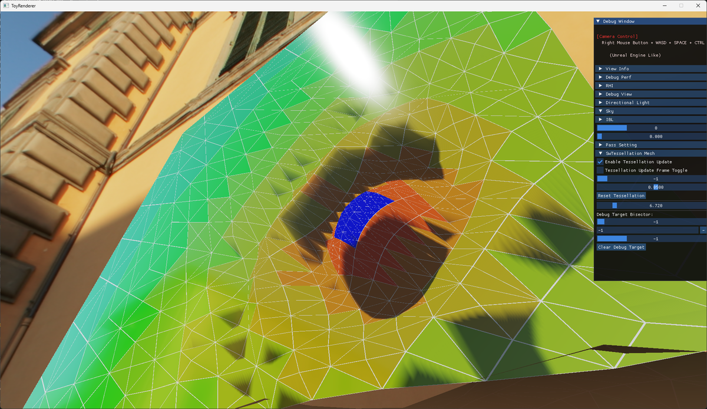
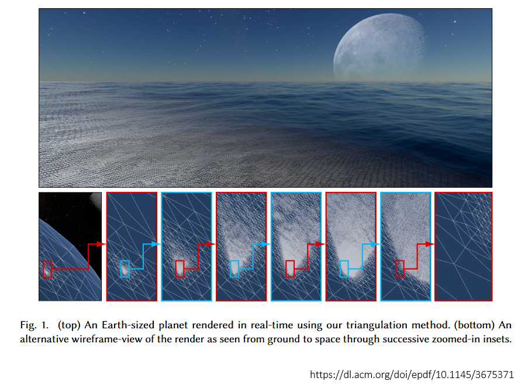
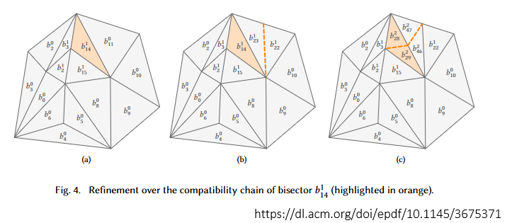

---
title: "Concurrent Binary Trees for Large-Scale Game Components 検証実装"
date: "2026-03-08T14:08:15+09:00"
draft: false
url: "/entry/2026/03/08/140815/"
categories: []
hatena_author: "nagakagachi"
hatena_original_url: "https://nagakagachi.hatenablog.com/entry/2026/03/08/140815"
hatena_basename: "2026/03/08/140815"
math: false
image: "images/a0f4e7a0e07c797977daca11a7bc4822bee579de46c1e9dd0c5bc71f97313358.png"
---

Adaptive Software Tessellation with Concurrent Binary Trees

数年前に実装したものですが検索性が良くないのでこちらにも  
  
一般メッシュに適用可能なGPU駆動ソフトウェアテッセレーションの手法を試してみました。  
  
論文の主要処理はすべてComputeShaderになります。

<a href="https://github.com/nagakagachi/sample_project?tab=readme-ov-file#adaptive-software-tessellation-with-concurrent-binary-trees">GitHub - nagakagachi/sample_project &middot; GitHub</a> 

今回の手法の論文はこちら 
Concurrent Binary Trees for Large-Scale Game Components 
ANIS BENYOUB, Intel Corporation, France 
JONATHAN DUPUY, Intel Corporation, France 
<a href="https://dl.acm.org/doi/10.1145/3675371">https://dl.acm.org/doi/10.1145/3675371</a> 

 

著者の以前のTessellation論文にもConcurrentBinaryTree(CBT)を使ったものがありますが、 
そちらは二等辺直角三角形に限定して、分割三角形の親子構造をCBTにマッピングする手法です。 
Concurrent Binary Trees (with application to longest edge bisection) 
JONATHAN DUPUY, Unity Technologies 
<a href="https://dl.acm.org/doi/10.1145/3406186">https://dl.acm.org/doi/10.1145/3406186</a>
 

一方で今回の論文は任意のメッシュに対して実行可能で、CBTを分割三角形の高速なメモリアロケーションのために利用しています。  
  
CBT(並行二分木)を利用する仕組み上、メモリ確保が二の冪乗に制限されるなど少し取り回しが悪い点などがありますが、  
  
一般メッシュに適用できてリアルタイムに動かせそうなソフトウェアテッセレーション手法としてよい感じかと思います。

コードはディレクトリにまとまっています。  
  
実行はmain.cppの NGL\_TEST\_SWTESSELLATION\_ENABLE を 1 にしてビルドするとシーンにテスト用のオブジェクトが表示されます。

---

[元のはてなブログ記事](https://nagakagachi.hatenablog.com/entry/2026/03/08/140815)
