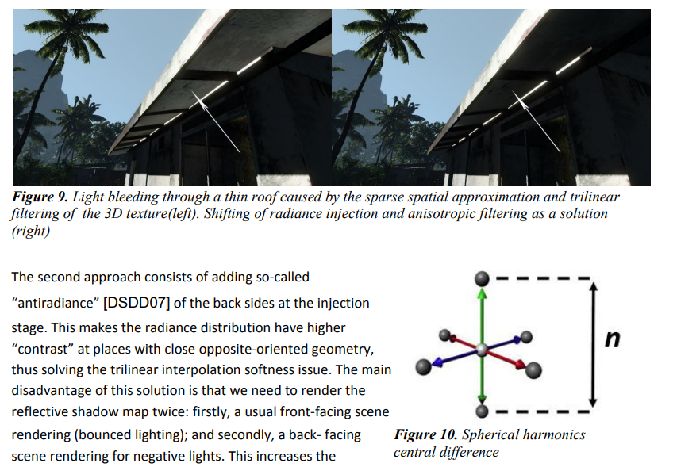

---
title: "Light Propagation Volumes (LPV) の radiance directional derivative によるLight Leak対策"
date: "2026-04-25T13:04:47+09:00"
draft: false
url: "/entry/2026/04/25/130447/"
categories: []
hatena_author: "nagakagachi"
hatena_original_url: "https://nagakagachi.hatenablog.com/entry/2026/04/25/130447"
hatena_basename: "2026/04/25/130447"
math: true
image: "images/851bf9af7fdcec512c704897f77875e2dc97a947496617e6606284c06eea9adb.png"
---

Light Propagation Volumes in CryEngine 3 \[1\] で Radiance Volumeからのサンプリング時Leakを抑える手法として

<blockquote>
        

6.3 Anisotropic upsampling of radiance volume

</blockquote>

で言及されている direction-dependent upsampling of the resulting radiance volume がよくわからなかったので調べた結果です.  
  
コードとしてはGI-LPV\[2\]のリポジトリの indirect\_light.fp \[3\]で実際に記述されていたのが参考になりました.

<figure class="figure-image figure-image-fotolife" title="https://advances.realtimerendering.com/s2009/Light_Propagation_Volumes.pdf"><figcaption><a href="https://advances.realtimerendering.com/s2009/Light_Propagation_Volumes.pdf">https://advances.realtimerendering.com/s2009/Light_Propagation_Volumes.pdf</a></figcaption></figure>

SH VolumeのSH係数を補間する際に裏側から漏れ出ていそうな成分をキャンセルするためのもの.  
  
SH Volume からシェーディング点のSH係数をサンプリングした後, シェーディング法線方向に沿ったSH係数の方向微分も計算します.  
  
(実際に前後の点でサンプリングしています)

\(\nabla_{\mathbf{n}} \mathbf{c}(\mathbf{x})
 =
 \frac{
 \mathbf{c}\!\left(\mathbf{x} + \frac{\mathbf{n}}{2}\right)
 -
 \mathbf{c}\!\left(\mathbf{x} - \frac{\mathbf{n}}{2}\right)
 }{
 \lVert \mathbf{n} \rVert
 }\)
 

SH係数の方向微分のベクトルとシェーディング点のSH係数の内積を類似度をみなして,

<ol>
<li>類似度が高い</li>
<li>裏側→表側へのSH変化量がそのままシェーディング点のSHに影響している</li>
<li>裏側のSHが漏れ出ている疑惑が強い</li>
</ol>

ということで, その場合はシェーディング点のSHによる寄与を減らす(dampening) しています.

この手法はあくまでleakしていそうだったら減衰させているだけで, より良いSHのサンプリングをするというものではなさそうです.  
  
この前段階で法線バイアス等で十分Leakを避けるためのサンプリング点補正をしたうえでの, 最終調整という位置づけが良いのかもしれないです.

LPV

[1] <a href="https://advances.realtimerendering.com/s2009/Light_Propagation_Volumes.pdf">https://advances.realtimerendering.com/s2009/Light_Propagation_Volumes.pdf</a> 
[2] <a href="https://github.com/innovation-cat/GI-LPV/tree/master">GitHub - innovation-cat/GI-LPV: Implement global illumination with OCaml, using light propagation volumes . &middot; GitHub</a> 
[3] <a href="https://github.com/innovation-cat/GI-LPV/blob/master/shader/indirect_light.fp">GI-LPV/shader/indirect_light.fp at master &middot; innovation-cat/GI-LPV &middot; GitHub</a>

---

[元のはてなブログ記事](https://nagakagachi.hatenablog.com/entry/2026/04/25/130447)
