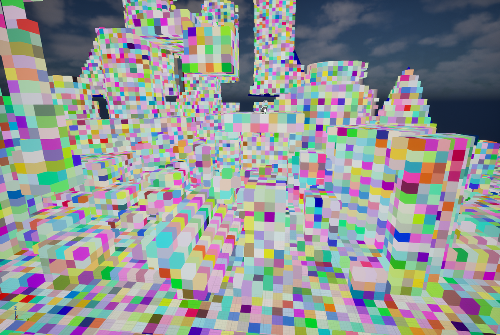
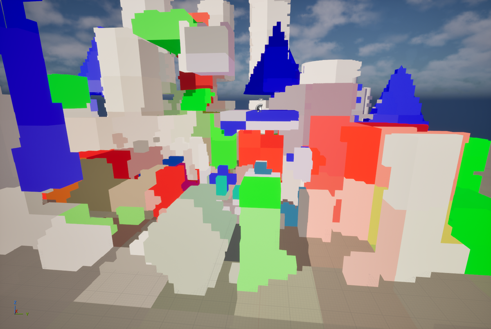

---
title: "InstantRDV UEプラグイン形式のデモ実装"
date: "2026-09-25T19:51:05+09:00"
draft: false
url: "/entry/2026/09/25/195105/"
categories: []
hatena_author: "nagakagachi"
hatena_original_url: "https://nagakagachi.hatenablog.com/entry/2026/09/25/195105"
hatena_basename: "2026/09/25/195105"
math: false
image: "images/7d3c91f4526786a81fbd3e7676fbdfff32462250764c7a0f34b58fe14aa09771.png"
---

D3D12レンダラで実装していた仕組みをUE5.8 CodePlugin としてリポジトリを公開しました ↓. 
<iframe src="https://hatenablog-parts.com/embed?url=https%3A%2F%2Fgithub.com%2Fnagakagachi%2Finstant-rdv-ue" title="GitHub - nagakagachi/instant-rdv-ue: instant raster derived voxel ue plugin" class="embed-card embed-webcard" scrolling="no" frameborder="0" style="display: block; width: 100%; height: 155px; max-width: 500px; margin: 10px 0px;" loading="lazy"></iframe><cite class="hatena-citation"><a href="https://github.com/nagakagachi/instant-rdv-ue">github.com</a></cite>

Instant Raster Derived Voxel (InstantRDV)  
  
ということにしました.

 
   
   

 

既存のラスタライズ描画パイプラインが作り出す情報を流用してVoxelレイトレシーンを構築する仕組みです.  
  
非侵襲的にVoxelを構築できるので色々と面白いことができる土台になると考えています.  
  
利用例としてPluginにはVoxelレイトレースGI, RdvGiを実装しています.  
  
サンプルレベルを開くとRdvGiによる間接光計算のシーンが動きます.

詳しくはリポジトリReadmeやコードをご覧ください.

RDVのVoxelシーン構造はGDCプレゼンテーション Global Illumination in 'Once Human' で紹介されている仕組みに類似しています.  
  
RdvGiはProbeBasedでIrradianceVolumeを更新する方式で, GPCプレゼンテーション Realtime Global Illumination in Enshrouded のFrustum Probeを参考にしています.

<iframe width="560" height="315" src="https://www.youtube.com/embed/Mr9syMFeEFI?feature=oembed" frameborder="0" allow="accelerometer; autoplay; clipboard-write; encrypted-media; gyroscope; picture-in-picture; web-share" referrerpolicy="strict-origin-when-cross-origin" allowfullscreen title="InstantRdv GI Demo UE Plugin"></iframe><cite class="hatena-citation"><a href="https://www.youtube.com/watch?v=Mr9syMFeEFI">www.youtube.com</a></cite>
 

Global Illumination in 'Once Human' はGDC Vaultを参照してください. 
Realtime Global Illumination in Enshrouded はこちら. 
<iframe width="560" height="315" src="https://www.youtube.com/embed/57F1ezwH7Mk?start=302&feature=oembed" frameborder="0" allow="accelerometer; autoplay; clipboard-write; encrypted-media; gyroscope; picture-in-picture; web-share" referrerpolicy="strict-origin-when-cross-origin" allowfullscreen title="Realtime Global Illumination in Enshrouded"></iframe><cite class="hatena-citation"><a href="https://youtu.be/57F1ezwH7Mk?t=302">youtu.be</a></cite>

---

[元のはてなブログ記事](https://nagakagachi.hatenablog.com/entry/2026/09/25/195105)
