---
title: " InstancedStaticMeshとCustomDataとTextureで大量オブジェクト (UE4 Advent Calendar 2020)"
date: "2020-12-15T00:05:00+09:00"
draft: false
url: "/entry/UE4_AdventCalendar2020_a/"
categories: ["UE4", "UE4", "マテリアル", "シェーダ", "Graphics", "GPGPU"]
hatena_author: "nagakagachi"
hatena_original_url: "https://nagakagachi.hatenablog.com/entry/UE4_AdventCalendar2020_a"
hatena_basename: "UE4_AdventCalendar2020_a"
math: true
image: "images/4401bfee4e759fc09d24cd21a2dd0b8cdf2963e461c7c4440ddd204f49232b0a.png"
---

<a class="keyword" href="http://d.hatena.ne.jp/keyword/UE4">UE4</a> AdventCalendar2020 15日目の記事となります 
<a href="https://qiita.com/advent-calendar/2020/ue4">Unreal Engine 4 (UE4) Advent Calendar 2020 - Qiita</a>

サンプルプロジェクトは以下(<a class="keyword" href="http://d.hatena.ne.jp/keyword/UE4">UE4</a>.26) 
<iframe src="https://hatenablog-parts.com/embed?url=https%3A%2F%2Fgithub.com%2Fnagakagachi%2Fue4%2Ftree%2Fmaster%2Fproject%2Fsample%2FStatefulInstancedMesh" title="ue4/project/sample/StatefulInstancedMesh at master · nagakagachi/ue4" class="embed-card embed-webcard" scrolling="no" frameborder="0" style="display: block; width: 100%; height: 155px; max-width: 500px; margin: 10px 0px;"></iframe><cite class="hatena-citation"><a href="https://github.com/nagakagachi/ue4/tree/master/project/sample/StatefulInstancedMesh">github.com</a></cite>

<ul class="table-of-contents">
<li><a href="#やりたいこと">やりたいこと</a></li>
<li><a href="#仕組みの概要">仕組みの概要</a></li>
<li><a href="#事前情報">事前情報</a><ul>
<li><a href="#CustomData">CustomData</a></li>
<li><a href="#CanvasObject">CanvasObject</a></li>
</ul>
</li>
<li><a href="#TextureRenderTarget2Dの準備">TextureRenderTarget2Dの準備</a></li>
<li><a href="#InstancedStaticMeshComponentの設定">InstancedStaticMeshComponentの設定</a></li>
<li><a href="#Instance番号をCustomDataに設定">Instance番号をCustomDataに設定</a></li>
<li><a href="#Instanceの基準位置をテクスチャに書き込み">Instanceの基準位置をテクスチャに書き込み</a></li>
<li><a href="#変位テクスチャによってメッシュを動かすマテリアル">変位テクスチャによってメッシュを動かすマテリアル</a></li>
<li><a href="#変位テクスチャ更新マテリアル">変位テクスチャ更新マテリアル</a></li>
<li><a href="#速度テクスチャ更新マテリアル">速度テクスチャ更新マテリアル</a></li>
<li><a href="#まとめ">まとめ</a></li>
</ul>

    

<h3 id="やりたいこと">やりたいこと</h3>

    
<ul>
<li>大量の<a class="keyword" href="http://d.hatena.ne.jp/keyword/%A5%A4%A5%F3%A5%B9%A5%BF%A5%F3%A5%B9">インスタンス</a>メッシュについて個別のパラメータをBPからマテリアルへ渡す</li>
<li>大量の<a class="keyword" href="http://d.hatena.ne.jp/keyword/%A5%A4%A5%F3%A5%B9%A5%BF%A5%F3%A5%B9">インスタンス</a>メッシュのパラメータ更新を<a class="keyword" href="http://d.hatena.ne.jp/keyword/GPGPU">GPGPU</a>(マテリアル)で高速に実行する</li>
<li>BPのみでつくる (<a class="keyword" href="http://d.hatena.ne.jp/keyword/C%2B%2B">C++</a>つかわない)</li>
</ul>

このような要素を含んだデモとして以下のようなサンプルを作成しました。

<ul>
<li>基準位置とバネで接続された物体のシミュレーション
<ul>
<li>バネによる速度の変化</li>
<li>速度による位置の変化</li>
<li>プレイヤーとのインタ<a class="keyword" href="http://d.hatena.ne.jp/keyword/%A5%E9%A5%AF">ラク</a>ション</li>
</ul></li>
</ul>
<iframe width="560" height="315" src="https://www.youtube.com/embed/2CmtMvd89KA?feature=oembed" frameborder="0" allow="accelerometer; autoplay; clipboard-write; encrypted-media; gyroscope; picture-in-picture" allowfullscreen></iframe><cite class="hatena-citation"><a href="https://youtu.be/2CmtMvd89KA">youtu.be</a></cite>  
<iframe width="560" height="315" src="https://www.youtube.com/embed/2dWGmIMSwSg?feature=oembed" frameborder="0" allow="accelerometer; autoplay; clipboard-write; encrypted-media; gyroscope; picture-in-picture" allowfullscreen></iframe><cite class="hatena-citation"><a href="https://youtu.be/2dWGmIMSwSg">youtu.be</a></cite> 
以降の説明は基本的にこのデモをベースにしていきます。

    

<h3 id="仕組みの概要">仕組みの概要</h3>

    

今回紹介する方法は大まかに以下のような流れになります。

<ul>
<li>InstancedStaticMeshのCustomDataにInstance番号を設定する</li>
<li>テクスチャを配列データに見立ててInstanceパラメータを格納する</li>
<li>Instanceパラメータテクスチャをマテリアルで更新する</li>
<li>マテリアルでInstance番号に対応したパラメータをテクスチャから取得して使う</li>
</ul>

    

<h3 id="事前情報">事前情報</h3>

大量のメッシュを描画する場合にInstancedStaticMeshを使うことが多いと思います。 
ただし、<a class="keyword" href="http://d.hatena.ne.jp/keyword/UE4">UE4</a>のマテリアルではSV_InstanceID的な情報は取れないので、そのままではInstance毎にマテリアルで色を変えるといったことはできません。 
（格子状にInstanceを配置して頂点座標からInstance番号を計算するという技もありますが...）

    

<h4 id="CustomData">CustomData</h4>

InstancedStaticMeshComponentのCustomDataを利用すると、Instance毎の個別情報を設定してマテリアルから参照できます。 
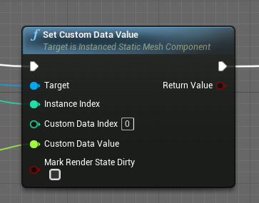 
今回はここにInstanceの番号を設定し、テクスチャに格納したInstanceの速度情報等を取り出す際に利用します。

    

<h4 id="CanvasObject">CanvasObject</h4>

CanvasObjectのDrawLine等によってBPからRenderTargetの任意の場所に色を書き込むことができます。 
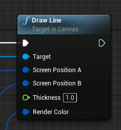 
これを利用して、マテリアルパラメータでは難しい大量の情報をテクスチャ経由でマテリアルに渡します。 
 

    

<h3 id="TextureRenderTarget2Dの準備">TextureRenderTarget2Dの準備</h3>

バネのシミュレーションをするにあたって、Instanceの情報を格納する4つの<b>TextureRenderTarget2D</b>を用意しておきます。

<ul>
<li>基準位置</li>
<li>基準位置からの変位(前フレーム)</li>
<li>基準位置からの変位(今フレーム)</li>
<li>速度</li>
</ul>
今回は位置と速度の情報なのでFormatには <b>RGBA16f</b> を使います。 
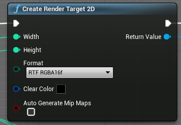

これらのテクスチャは下図のように左から右、上から下へ順番に番号付けをした配列データのように扱います。

<figure class="figure-image figure-image-fotolife" title="データ格納テクスチャ例(幅8高さ8)">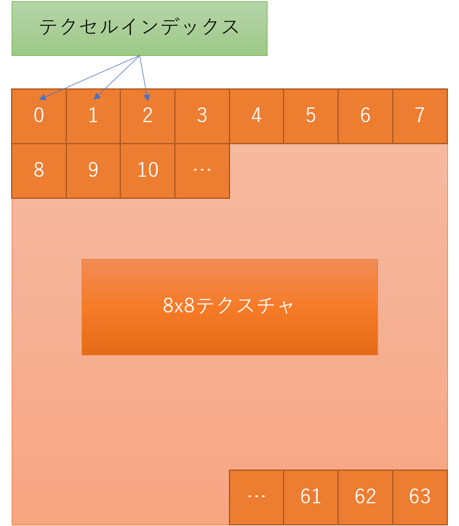<figcaption>データ格納テクスチャ例(幅8高さ8)</figcaption></figure>

ここから分かるとおり、テクスチャの幅高さは表示したいInstanceすべてを格納できる十分なものにしておく必要があります。

    

<h3 id="InstancedStaticMeshComponentの設定">InstancedStaticMeshComponentの設定</h3>

    

InstancedStaticMeshComponentの Num Custom Data Floats に 1 を設定してInstance毎にfloat1つのCustomDataを使えるようにします。

<figure class="figure-image figure-image-fotolife" title="InstancedStaticMeshのNumCustomDataFloats">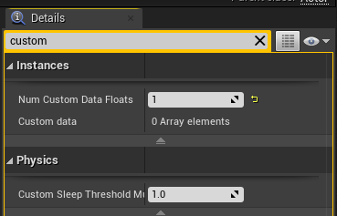<figcaption>InstancedStaticMeshのNumCustomDataFloats</figcaption></figure>

    

<h3 id="Instance番号をCustomDataに設定">Instance番号をCustomDataに設定</h3>

InstancedStaticMeshComponentのSetCustomDataValueで各InstanceのCustomDataにInstance番号を設定します。 
マテリアル側からはこのCustomDataに入ったInstance番号を利用して、対応するテクスチャ位置から情報を読み取ります。 
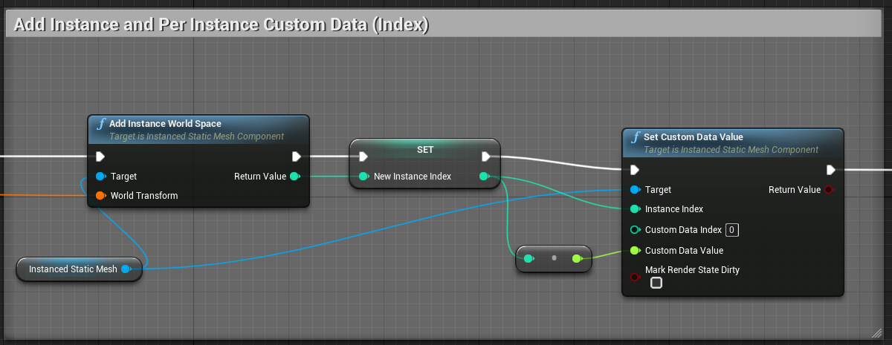

    

<h3 id="Instanceの基準位置をテクスチャに書き込み">Instanceの基準位置をテクスチャに書き込み</h3>

先に用意した4つのテクスチャの内、<b>基準位置テクスチャ</b>についてはBPから書き込みを行います。 
まずInstance番号に対応するテクセル座標を以下のように求めます。 
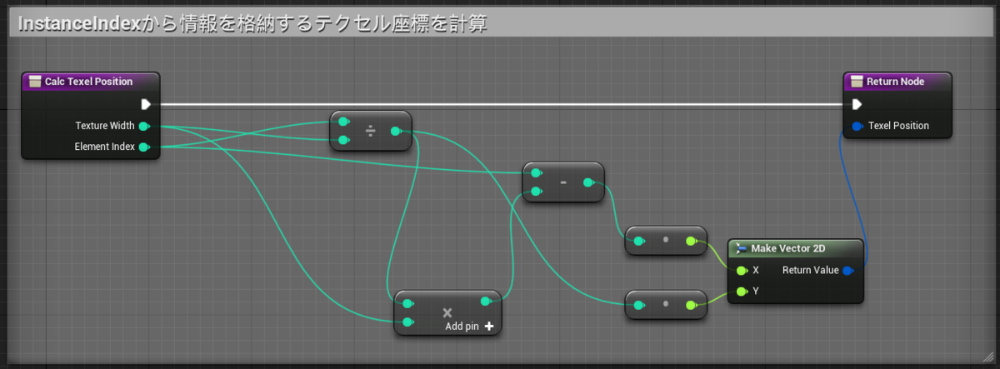 
\(pos.y = int(Index / Width)\) 
\(pos.x = Index - pos.y * Width\)

実際の書き込みではまずBeginDrawCanvastoRenderTargetで開始を宣言し、 
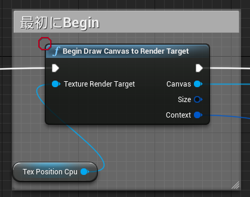 
Instanceの数だけDrawLineで対応する情報を色として書き込んでいきます。 
開始位置は先に説明した計算で求め、終了位置は\(0.5,0.5\) だけオフセットした位置にします。 
(これでうまくいってますがもっと良い方法があるかも) 
今回は基準位置(XYZ座標)を書き込みたいのでColorのRGBに座標をそのまま設定します。 
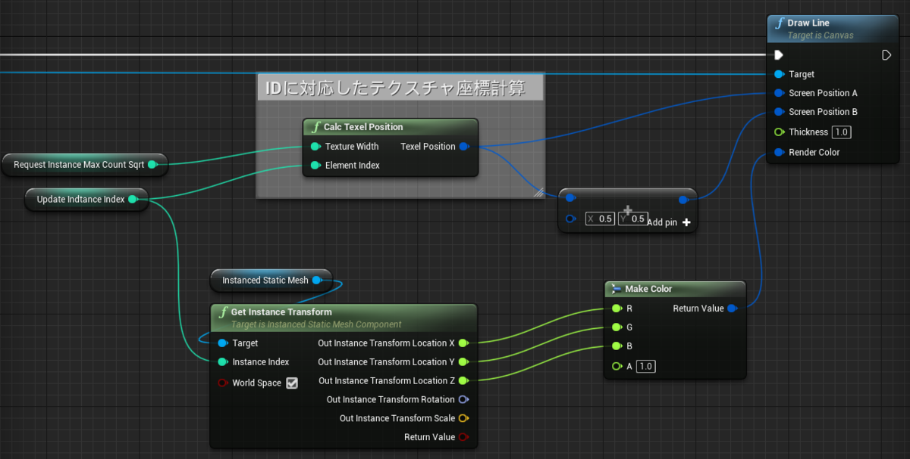 
全部終わったらEndDrawCanvastoRenderTargetで完了します。 
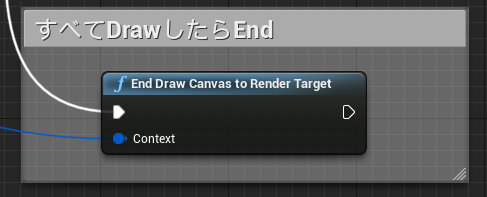

ここまででInstanceの基準位置が左上から右下へ順番に書き込まれたテクスチャが完成します。

<figure class="figure-image figure-image-fotolife" title="100個のInstance位置を書き込んだ16x16基準位置テクスチャ可視化">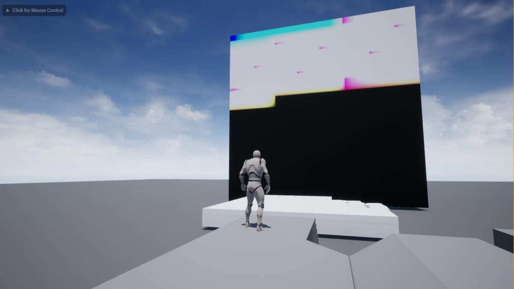<figcaption>100個のInstance位置を書き込んだ16x16基準位置テクスチャ可視化</figcaption></figure>
<a href="#f-38afc54b" name="fn-38afc54b" title="基本的にこの処理はマテリアルへ渡したい情報に変更があったときに実行することになります。
今回はInstanceの位置は生成時点から変化しないので初期化時の一回のみです。">*1</a> 

    

<h3 id="変位テクスチャによってメッシュを動かすマテリアル">変位テクスチャによってメッシュを動かすマテリアル</h3>

InstancedStaticMeshに設定して頂点を動かすマテリアルです。 
TextureParameterとして基準位置からの変位テクスチャを設定しています。 
InstancedStaticMeshのCustomDataに設定したInstance番号を元に、変位テクスチャから対応する変位量を取得してWorldPositionOffsetで頂点を動かします。 
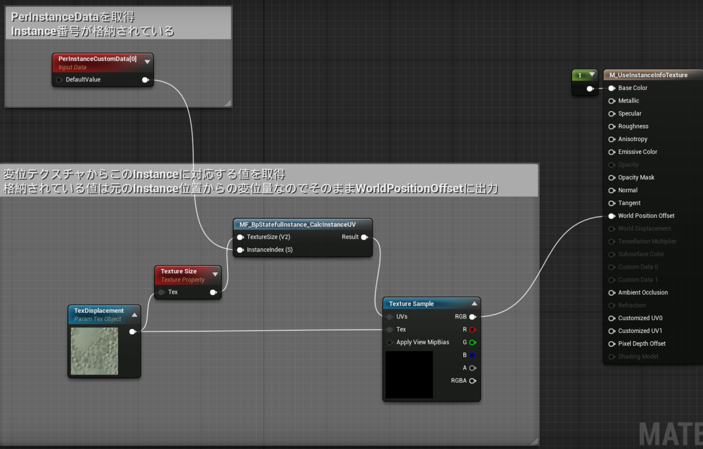

まず PerInstanceCustomDataでInstancedStaticMeshComponentに設定したInstance毎のCustomDataの値を取得できます。 
このCustomDataには先に設定したInstance番号が入っています。 
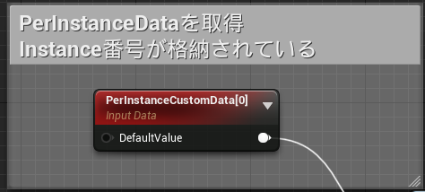

Instance番号とテクスチャサイズから対応するUV座標を計算し、このInstanceに対応する変位情報をテクスチャから取得します。

<figure class="figure-image figure-image-fotolife" title="Instance番号に対応するUVでテクスチャから情報取得">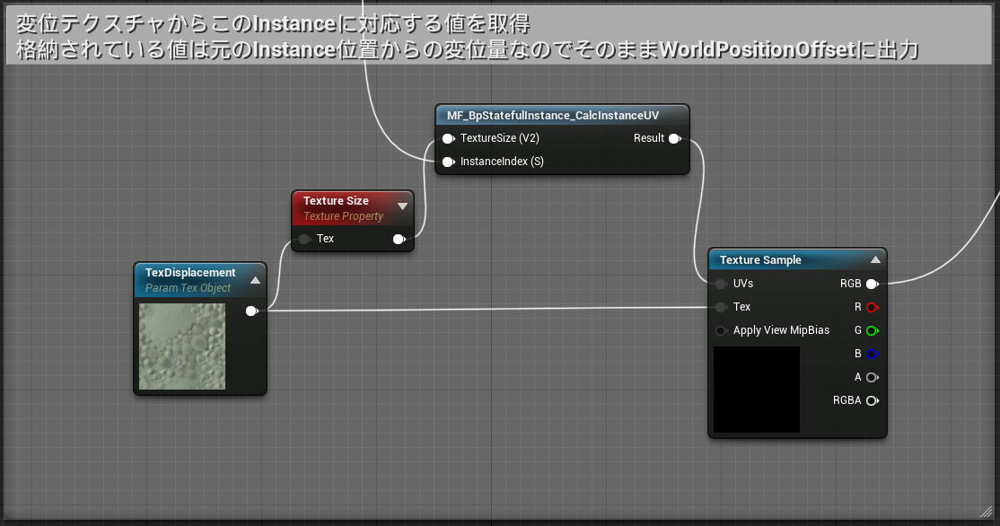<figcaption>Instance番号に対応するUVでテクスチャから情報取得</figcaption></figure>
UV座標の計算は以下のようなネットワークになります。<a class="keyword" href="http://d.hatena.ne.jp/keyword/Canvas">Canvas</a>に書き込むときの座標計算の同じです(こちらはテクセル座標ではなくUVであることにだけ注意)。

<figure class="figure-image figure-image-fotolife" title="Instance番号とテクスチャサイズから対応するUV計算">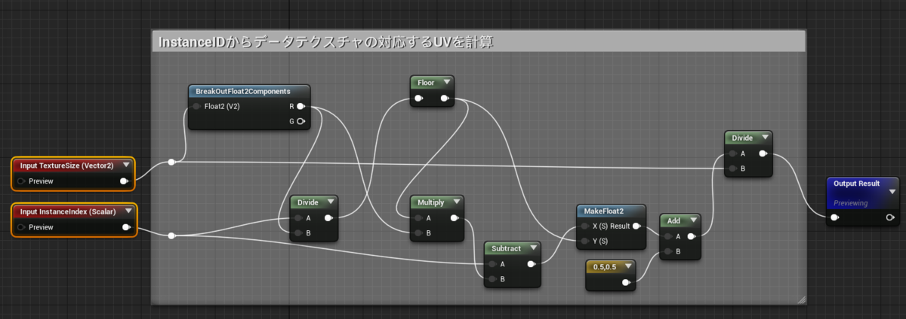<figcaption>Instance番号とテクスチャサイズから対応するUV計算</figcaption></figure>
ここまででメッシュのマテリアルと変位テクスチャをつなぎましたが、まだ変位テクスチャを更新していないのでメッシュは動きません。 
このあとプレイヤーとのインタ<a class="keyword" href="http://d.hatena.ne.jp/keyword/%A5%E9%A5%AF">ラク</a>ションを含めたバネのシミュレーションをマテリアルで計算して変位テクスチャを更新することでメッシュが動くようになります。 
(まだ変位テクスチャの更新処理を作ってないので動きませんが)

    

<h3 id="変位テクスチャ更新マテリアル">変位テクスチャ更新マテリアル</h3>

変位テクスチャを更新するマテリアルを用意します。 
このマテリアルはMeshに設定するのではなく、<a href="https://docs.unrealengine.com/en-US/BlueprintAPI/Rendering/DrawMaterialtoRenderTarget/index.html">Draw Material To RenderTarget</a> でRenderTargetTextureを更新するために使います。 
このマテリアルはInstance番号などを気にする必要はなく、描画UVと同じUVでテクスチャから情報を取り出して計算するだけです。 
(同じテクセル位置には同じInstanceの情報が格納されているので) 
速度テクスチャと前回の変位テクスチャを元にバネ-ダンパモデルの計算をして新しい変位を求めます。

<figure class="figure-image figure-image-fotolife" title="速度と変位からバネ-ダンパモデルで新しい変位を計算">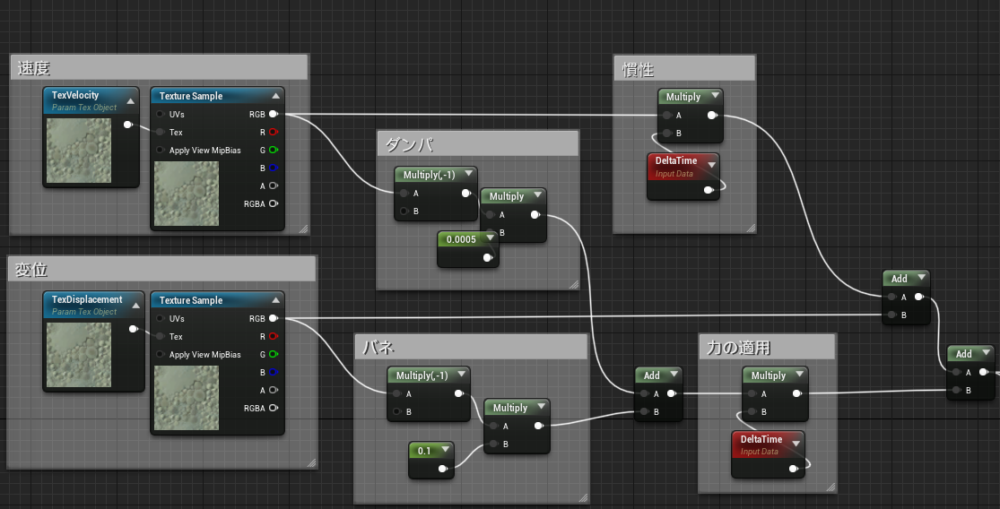<figcaption>速度と変位からバネ-ダンパモデルで新しい変位を計算</figcaption></figure>
プレイヤーとのインタ<a class="keyword" href="http://d.hatena.ne.jp/keyword/%A5%E9%A5%AF">ラク</a>ションは単純な球と点の当たり判定としています。 
注意点として、変位テクスチャは基準位置からの変位量の情報なので、ワールド座標であるプレイヤー位置との比較のためには同じワールド座標に変換する必要があります。 
そのために基準位置テクスチャの値と変位を足し合わせてからプレイヤー位置との比較をしています。

<figure class="figure-image figure-image-fotolife" title="プレイヤー球とのヒット">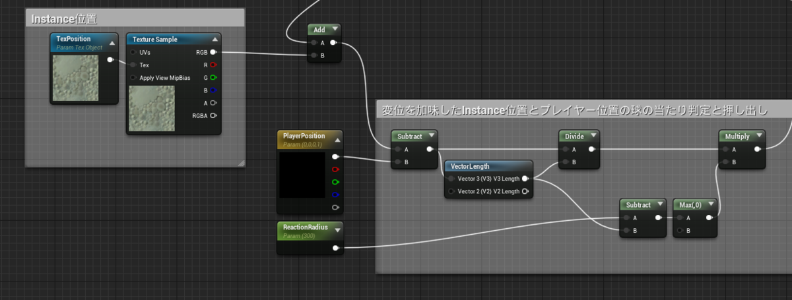<figcaption>プレイヤー球とのヒット</figcaption></figure>

また、変位はマイナスを取る可能性があるのでマテリアルの設定でマイナスのEmissiveを許可するようにしておきます。

<figure class="figure-image figure-image-fotolife" title="Emissive出力の負値を許可">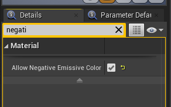<figcaption>Emissive出力の負値を許可</figcaption></figure>

サンプルプロジェクトを見ていただくのが早いと思いますが、このマテリアルにはTextureParameterとして「基準位置からの変位(前フレーム)」や「速度」のテクスチャを設定し、Draw Material to RenderTargetのターゲットとして「基準位置からの変位(今フレーム)」を指定することで変位テクスチャを更新します。

    

<h3 id="速度テクスチャ更新マテリアル">速度テクスチャ更新マテリアル</h3>

変位テクスチャが更新されたので新たに速度テクスチャを計算し直します。 
このマテリアルも変位テクスチャ更新のものと同様に Draw Material to Render Target で利用するため、Instance番号などを気にする必要はありません。 
前回の変位と今回の変位の差分から速度を計算して出力する単純なものになります。 
\(vel_ = \frac {pos_{t} - pos_{t-1}} {\Delta t}\)

<figure class="figure-image figure-image-fotolife" title="速度テクスチャ更新マテリアル">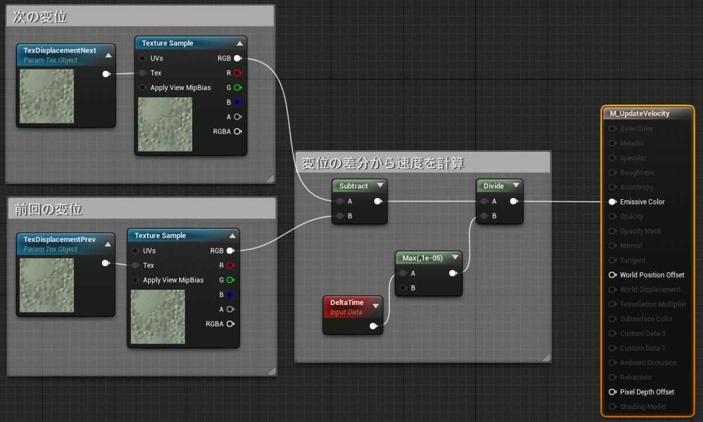<figcaption>速度テクスチャ更新マテリアル</figcaption></figure>

このマテリアルも変位テクスチャ更新と同様にマイナスのEmissiveを許可するようにしておきます。

このマテリアルにはTextureParameterとして「基準位置からの変位(前フレーム)」と「基準位置からの変位(今フレーム)」のテクスチャを設定し、Draw Material to RenderTargetのターゲットとして「速度」のテクスチャを指定することで速度テクスチャを更新します。

 

これでようやくマテリアルによる変位と速度の更新, Instance毎の変位の取得と頂点移動表現がつながって動くようになります。  
  
この記事では省略している部分もありますが、実際の処理の流れはサンプルプロジェクトの方を参考にしていただければ幸いです。

    

<h3 id="まとめ">まとめ</h3>

以上でInstancedStaticMeshのInstance毎にテクスチャにパラメータを格納、更新して個別の振る舞いをさせることができるようになりました。 
今回はInstanceの基準位置を<a class="keyword" href="http://d.hatena.ne.jp/keyword/Canvas">Canvas</a>を利用してテクスチャとしてマテリアルに渡していますが、この方法は色々な使い方ができるのではないかと思います。 
また、ただのCubeではなく植物のメッシュを大量に表示しつつ個別に揺れたりさせたい場合にも使えると思います。 
<iframe width="560" height="315" src="https://www.youtube.com/embed/onYt8dYPGFs?feature=oembed" frameborder="0" allow="accelerometer; autoplay; clipboard-write; encrypted-media; gyroscope; picture-in-picture" allowfullscreen></iframe><cite class="hatena-citation"><a href="https://youtu.be/onYt8dYPGFs">youtu.be</a></cite> 
<blockquote data-conversation="none" class="twitter-tweet" data-lang="ja">
こんなことしてる場合じゃない <a href="https://t.co/eJSdH9bcdd">pic.twitter.com/eJSdH9bcdd</a>
&mdash; なが (@nagakagachi) <a href="https://twitter.com/nagakagachi/status/1330715452452995072?ref_src=twsrc%5Etfw">2020年11月23日</a></blockquote>  

<a class="keyword" href="http://d.hatena.ne.jp/keyword/Twitter">Twitter</a>でこんなことをしていますのでフォローしていただけるとうれしいです 
<a href="https://twitter.com/nagakagachi">&#x306A;&#x304C; (@nagakagachi) | Twitter</a>
 

<b>明日は Dv7Pavilion さんの Influence Map に関する記事とのことです！</b> 
<iframe src="https://hatenablog-parts.com/embed?url=https%3A%2F%2Fqiita.com%2Fadvent-calendar%2F2020%2Fue4" title="Unreal Engine 4 (UE4) Advent Calendar 2020 - Qiita" class="embed-card embed-webcard" scrolling="no" frameborder="0" style="display: block; width: 100%; height: 155px; max-width: 500px; margin: 10px 0px;"></iframe><cite class="hatena-citation"><a href="https://qiita.com/advent-calendar/2020/ue4">qiita.com</a></cite>
 
 
 
 
 

<figure class="figure-image figure-image-fotolife" title="サムネイル用">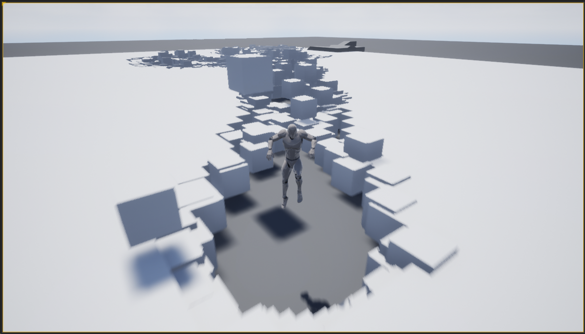<figcaption>サムネイル用</figcaption></figure>

<a href="#fn-38afc54b" name="f-38afc54b" class="footnote-number">*1</a>:基本的にこの処理はマテリアルへ渡したい情報に変更があったときに実行することになります。
今回はInstanceの位置は生成時点から変化しないので初期化時の一回のみです。

---

[元のはてなブログ記事](https://nagakagachi.hatenablog.com/entry/UE4_AdventCalendar2020_a)
